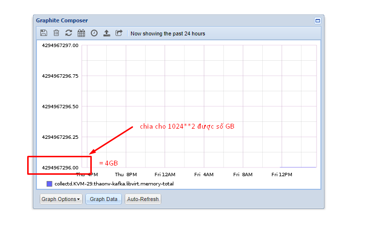
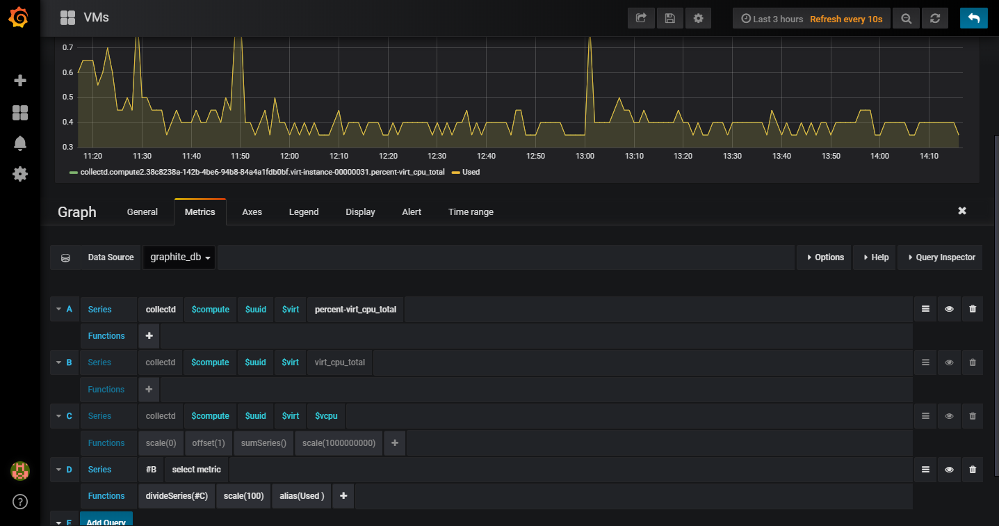

## Plugin Virt


Giám sát thông số máy ảo:

### Các thông số lấy được

#### memory-total




	Số ram-total = (4 294 967 296) /(1024**2)

### CPU

`cpu-total` và `percent-cpu-total`

* `cpu-total` 

Cách tính xem trong hàm [virDomainGetInfo](https://libvirt.org/html/libvirt-libvirt-domain.html) của libvirt


* `percent-cpu-total` = 100 * (cpu_time_new - cpu_time_old) / (time_diff_sec * number_node_vcpus * 1e9)

`cpu-time` ở đây được tính bằng nanosecond

Tham khảo tại dòng [844](https://github.com/collectd/collectd/blob/master/src/virt.c)

```sh
static double cpu_ns_to_percent(unsigned int node_cpus,
								unsigned long long cpu_time_old,
								unsigned long long cpu_time_new) {
  double percent = 0.0;
  unsigned long long cpu_time_diff = 0;
  double time_diff_sec = CDTIME_T_TO_DOUBLE(plugin_get_interval()); //interval = 60s

  if (node_cpus != 0 && time_diff_sec != 0 && cpu_time_old != 0) {
	cpu_time_diff = cpu_time_new - cpu_time_old;
	percent = ((double)(100 * cpu_time_diff)) /
			  (time_diff_sec * node_cpus * NANOSEC_IN_SEC);
  }

  return percent;
}
```

Chú ý: `cpu_time_old` = 0; `time_diff_sec` để bằng 1, `number_node_vcpu` là số lượng vcpu của instance vậy cuối cùng ta được công thức:

	virt_cpu_total / (number_node_vcpus * 1e9)

Ví dụ hàm trên graphite:
	
	scale(divideSeries(collectd.compute2.38c8238a-142b-4be6-94b8-84a4a1fdb0bf.virt-instance-00000031.virt_cpu_total,scale(sumSeries(offset(scale(collectd.compute2.38c8238a-142b-4be6-94b8-84a4a1fdb0bf.virt-instance-00000031.virt_vcpu-1,0),1),offset(scale(collectd.compute2.38c8238a-142b-4be6-94b8-84a4a1fdb0bf.virt-instance-00000031.virt_vcpu-0,0),1)),1000000000)),100)

Trên grafana:



### Memory


```sh
"balloon.current" - the memory in kiB currently used
"balloon.maximum" - the maximum memory in kiB allowed
"balloon.swap_in" - the amount of data read from swap space (in kB)
"balloon.swap_out" - the amount of memory written out to swap space (in kB)
"balloon.major_fault" - the number of page faults then disk IO was required
"balloon.minor_fault" - the number of other page faults
"balloon.unused" - the amount of memory left unused by the system (in kB)
"balloon.available" - the amount of usable memory as seen by the domain (in kB)
"balloon.rss" - Resident Set Size of running domain's process (in kB)
"balloon.usable" - the amount of memory which can be reclaimed by balloon without causing host swapping (in KB)
"balloon.last-update" - timestamp of the last update of statistics (in seconds)
```                      

[see more...](https://www.systutorials.com/docs/linux/man/1-virsh/)


**Lưu ý:** Phần trên tôi viết là đang giám sát KVM trên Ubuntu 14.04, thì thấy thông số `memory_used` không hề thay đổi, và nó không lấy được `memory usable`, nhưng không phải do collectd lấy sai. Khi kiểm tra các thông số này bằng `virsh` thì collectd lấy đúng, có lẽ do libvirt có vấn đề gì đó. Giờ tôi mới chuyển qua cụm OPS giám sát VM trên con Compute thì đã có thể lấy được: ram free là ram_unused, ram_usable = ram used + cache/buffer

### Một số các command kiểm tra

	colletdctl listval
	virsh cpu-stats thaonv-kafka --total
	collectdctl getval thaonv-kafka/libvirt/virt_cpu_total

	virsh vcpuinfo thaonv-kafka
	virsh vcpupin cuong_u16
	virsh dommemstat thaonv-kafka
	virsh domblkstat cuong_u16 vda


### Tham khảo

https://github.com/hocchudong/ghichep-collectd/blob/master/CollectD/plugins/virt_plugin.md

https://wiki.opnfv.org/display/fastpath/Libvirt+Plugin+High+Level+Design+Document

https://collectd.org/documentation/manpages/collectd.conf.5.shtml#plugin_virt

https://github.com/libvirt/libvirt/blob/master/src/libvirt-domain.c

```sh
scale(sumSeries(offset(scale(cc0a7ced-8781-42ff-9ccf-62f54b47b681.*.virt_vcpu*,%200),%201)),%201000000000)
scale(sumSeries(offset(scale(cc0a7ced-8781-42ff-9ccf-62f54b47b681.*.virt_vcpu*,%200),%201)),%201000000000))

target = scale(divideSeries(scale(sumSeries(offset(scale(cc0a7ced-8781-42ff-9ccf-62f54b47b681.*.virt_vcpu*, 0), 1)), 1000000000),
							scale(sumSeries(offset(scale(cc0a7ced-8781-42ff-9ccf-62f54b47b681.*.virt_vcpu*, 0), 1)), 1000000000)
							),*100
				)
```