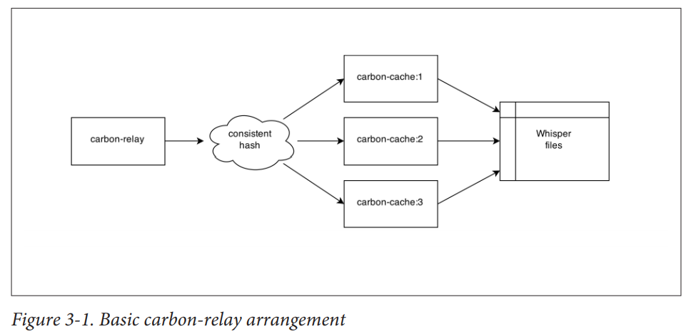

# Carbon Daemons

Bất kể khi nào, có ai đó nhắc tới thành phần carbon của graphite, thì người ta luôn nghĩ tới đầu tiên đó là carbon-cache, mà không để ý rằng, thực chất cacbon có 3 loại: carbon-cache, carbon-relay, carbon aggregator

## Carbon cache

Là chương trình làm việc chăm chỉ và phức tạp nhất. Được viết bằng Python

Carbon-cache là một networrk service cho phép các metric từ các client đi vào.

Lưu trữ tạm thời các dữ liệu trong bộ nhớ cache sau đó ghi chúng xuống disk như Whisper database file. 

## Carbon relay

Cacbon-relay dùng để chuyển tiêp metrics từ cacbon process này sang cacbon khác. Có thể hiểu nó như các điểm kết dính của graphite. Bất kể khi nào cần phát triển graphite cluster, chắc chắn sẽ cần carbon-relay. 

 

### relay-rules.conf

Link cấu hình chi tiết:

https://grey-boundary.io/the-architecture-of-clustering-graphite/