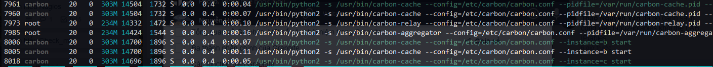

## Cấu hình Graphite cluster

Graphite là nơi thu nhận và lưu trữ dữ liệu tập trung, các dữ liệu này sẽ được đẩy từ nhiều nguồn collectd khác nhau. Trong đó carbon-cache sẽ là thành phần nhận dữ liệu và đẩy xuống DB để lưu trữ (whisper), khi có quá nhiều client đẩy dữ liệu lên cùng một lúc, carbon-cache không xử lý kịp, whisper không lưu trữ kịp, sẽ gây lên mất mát dữ liệu. Để tránh đều này, ở đây tôi sẽ sử dụng thêm carbon-relay và cacbon-aggregator, tạo thêm các cacbon-cache instance để giảm tải cho server (mỗi instance là một core).


Mặc định thì carbon-relay và cacbon-aggregator sẽ bị tắt, để bật nó lên chạy câu lệnh sau:

	systemctl start carbon-relay cacbon-aggregator

Cấu hình mặc định:

```sh
[root@trang-20-52 ~]# cat  /etc/carbon/carbon.conf | egrep -v "^#|^$"
[cache]
STORAGE_DIR    = /var/lib/carbon/
LOCAL_DATA_DIR = /var/lib/carbon/whisper/
WHITELISTS_DIR = /var/lib/carbon/lists/
CONF_DIR       = /etc/carbon/
LOG_DIR        = /var/log/carbon/
PID_DIR        = /var/run/
ENABLE_LOGROTATION = True
USER = carbon
MAX_CACHE_SIZE = inf
MAX_UPDATES_PER_SECOND = 500
MAX_CREATES_PER_MINUTE = 50
LINE_RECEIVER_INTERFACE = 0.0.0.0
LINE_RECEIVER_PORT = 2003
ENABLE_UDP_LISTENER = False
UDP_RECEIVER_INTERFACE = 0.0.0.0
UDP_RECEIVER_PORT = 2003
PICKLE_RECEIVER_INTERFACE = 0.0.0.0
PICKLE_RECEIVER_PORT = 2004
LOG_LISTENER_CONNECTIONS = True
USE_INSECURE_UNPICKLER = False
CACHE_QUERY_INTERFACE = 0.0.0.0
CACHE_QUERY_PORT = 7002
USE_FLOW_CONTROL = True
LOG_UPDATES = False
LOG_CACHE_HITS = False
LOG_CACHE_QUEUE_SORTS = True
CACHE_WRITE_STRATEGY = sorted
WHISPER_AUTOFLUSH = False
WHISPER_FALLOCATE_CREATE = True

[relay]
LINE_RECEIVER_INTERFACE = 0.0.0.0
LINE_RECEIVER_PORT = 2013
PICKLE_RECEIVER_INTERFACE = 0.0.0.0
PICKLE_RECEIVER_PORT = 2014
LOG_LISTENER_CONNECTIONS = True
RELAY_METHOD = rules
REPLICATION_FACTOR = 1
DESTINATIONS = 127.0.0.1:2004
MAX_DATAPOINTS_PER_MESSAGE = 500
MAX_QUEUE_SIZE = 10000
QUEUE_LOW_WATERMARK_PCT = 0.8
USE_FLOW_CONTROL = True

[aggregator]
LINE_RECEIVER_INTERFACE = 0.0.0.0
LINE_RECEIVER_PORT = 2023
PICKLE_RECEIVER_INTERFACE = 0.0.0.0
PICKLE_RECEIVER_PORT = 2024
LOG_LISTENER_CONNECTIONS = True
FORWARD_ALL = False
DESTINATIONS = 127.0.0.1:2004
REPLICATION_FACTOR = 1
MAX_QUEUE_SIZE = 10000
USE_FLOW_CONTROL = True
MAX_DATAPOINTS_PER_MESSAGE = 500
MAX_AGGREGATION_INTERVALS = 5
```


Cấu hình trong file carbon.conf để tạo và cấu hình các instance

```sh
[root@trang-20-52 ~]# cat carbon.conf | egrep -v "^#|^$"
[cache]
STORAGE_DIR    = /var/lib/carbon/
LOCAL_DATA_DIR = /var/lib/carbon/whisper/
WHITELISTS_DIR = /var/lib/carbon/lists/
CONF_DIR       = /etc/carbon/
LOG_DIR        = /var/log/carbon/
PID_DIR        = /var/run/
ENABLE_LOGROTATION = True
USER = carbon
MAX_CACHE_SIZE = inf
MAX_UPDATES_PER_SECOND = 500
MAX_CREATES_PER_MINUTE = 50
LINE_RECEIVER_INTERFACE = 127.0.0.1
ENABLE_UDP_LISTENER = False
UDP_RECEIVER_INTERFACE = 127.0.0.1
PICKLE_RECEIVER_INTERFACE = 127.0.0.1
LOG_LISTENER_CONNECTIONS = True
USE_INSECURE_UNPICKLER = False
CACHE_QUERY_INTERFACE = 127.0.0.1
USE_FLOW_CONTROL = True
LOG_UPDATES = False
LOG_CACHE_HITS = False
LOG_CACHE_QUEUE_SORTS = True
CACHE_WRITE_STRATEGY = sorted
WHISPER_AUTOFLUSH = False
WHISPER_FALLOCATE_CREATE = True

[cache:c]
LINE_RECEIVER_PORT = 2203
PICKLE_RECEIVER_PORT = 2204
CACHE_QUERY_PORT = 7202
LOG_LISTENER_CONNECTIONS = False
LOG_UPDATES = False
LOG_CACHE_HITS = False
LOG_CACHE_QUEUE_SORTS = False

[cache:b]
LINE_RECEIVER_PORT = 2103
PICKLE_RECEIVER_PORT = 2104
CACHE_QUERY_PORT = 7102
LOG_LISTENER_CONNECTIONS = False
LOG_UPDATES = False
LOG_CACHE_HITS = False
LOG_CACHE_QUEUE_SORTS = False

[relay]
LINE_RECEIVER_INTERFACE = 0.0.0.0
LINE_RECEIVER_PORT = 2013
PICKLE_RECEIVER_INTERFACE = 0.0.0.0
PICKLE_RECEIVER_PORT = 2014
LOG_LISTENER_CONNECTIONS = True
RELAY_METHOD = rules
REPLICATION_FACTOR = 1
DESTINATIONS = 127.0.0.1:2204:c, 127.0.0.1:2104:b
MAX_DATAPOINTS_PER_MESSAGE = 500
MAX_QUEUE_SIZE = 10000
QUEUE_LOW_WATERMARK_PCT = 0.8
USE_FLOW_CONTROL = True

[aggregator]
LINE_RECEIVER_INTERFACE = 0.0.0.0
LINE_RECEIVER_PORT = 2023
PICKLE_RECEIVER_INTERFACE = 0.0.0.0
PICKLE_RECEIVER_PORT = 2024
LOG_LISTENER_CONNECTIONS = True
FORWARD_ALL = False
DESTINATIONS = 127.0.0.1:2204:a, 127.0.0.1:2104:b
REPLICATION_FACTOR = 1
MAX_QUEUE_SIZE = 10000
USE_FLOW_CONTROL = True
MAX_DATAPOINTS_PER_MESSAGE = 500
MAX_AGGREGATION_INTERVALS = 5
```

Cấu hình các rules trong file `relay-rules.conf`:

```sh
[default]
default = true
destinations = 127.0.0.1:2204:c, 127.0.0.1:2104:b
```

Start các cacbon-cache instance:

```sh
carbon-cache --config=/etc/carbon/carbon.conf --instance=b start
carbon-cache --config=/etc/carbon/carbon.conf --instance=c start
``` 

Kiểm tra bằng cách chạy lệnh `top` (`htop`) để kiểm tra thì ta sẽ thấy có hai tiến trình carbon-cache đang được chạy cùng lúc.



```sh
[root@trang-20-52 carbon]# ps fauxw | grep carb
root      8214  0.0  0.0 112660   972 pts/0    S+   16:13   0:00  |       \_ grep --color=auto carb
carbon    8005  0.2  0.3 311908 15232 ?        Sl   15:29   0:07 /usr/bin/python2 -s /usr/bin/carbon-cache --config=/etc/carbon/carbon.conf --instance=b start
carbon    8017  0.1  0.3 311888 15236 ?        Sl   15:30   0:04 /usr/bin/python2 -s /usr/bin/carbon-cache --config=/etc/carbon/carbon.conf --instance=c start
carbon    8133  0.0  0.3 311600 14764 ?        Sl   16:00   0:00 /usr/bin/python2 -s /usr/bin/carbon-cache --config=/etc/carbon/carbon.conf --pidfile=/var/run/carbon-cache.pid --logdir=/var/log/carbon/ start
root      8159  0.2  0.3 239992 14352 ?        S    16:01   0:01 /usr/bin/python2 -s /usr/bin/carbon-relay --config=/etc/carbon/carbon.conf --pidfile=/var/run/carbon-relay.pid --logdir=/var/log/carbon/ start
root      8171  0.0  0.3 239892 14284 ?        S    16:01   0:00 /usr/bin/python2 -s /usr/bin/carbon-aggregator --config=/etc/carbon/carbon.conf --pidfile=/var/run/carbon-aggregator.pid --logdir=/var/log/carbon/ start
```