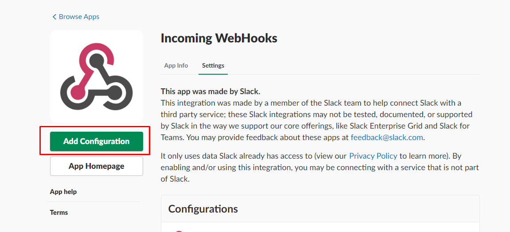
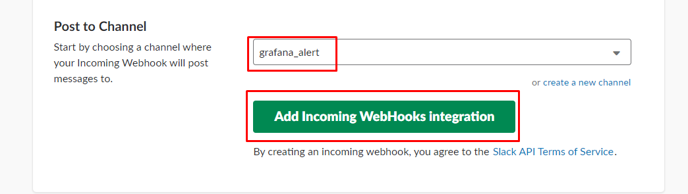
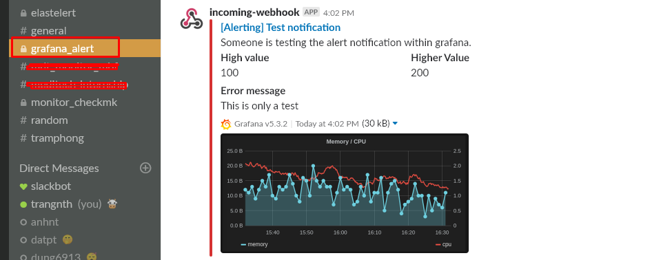
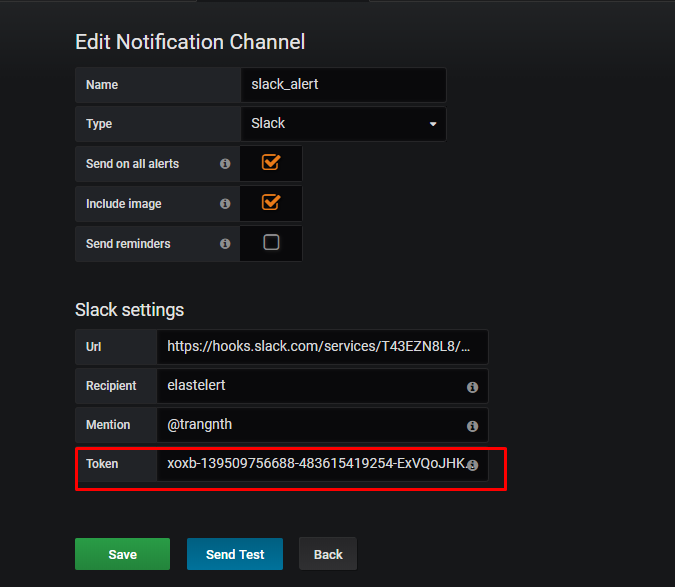
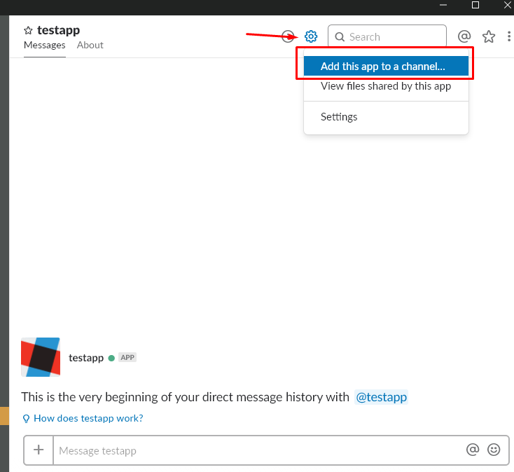
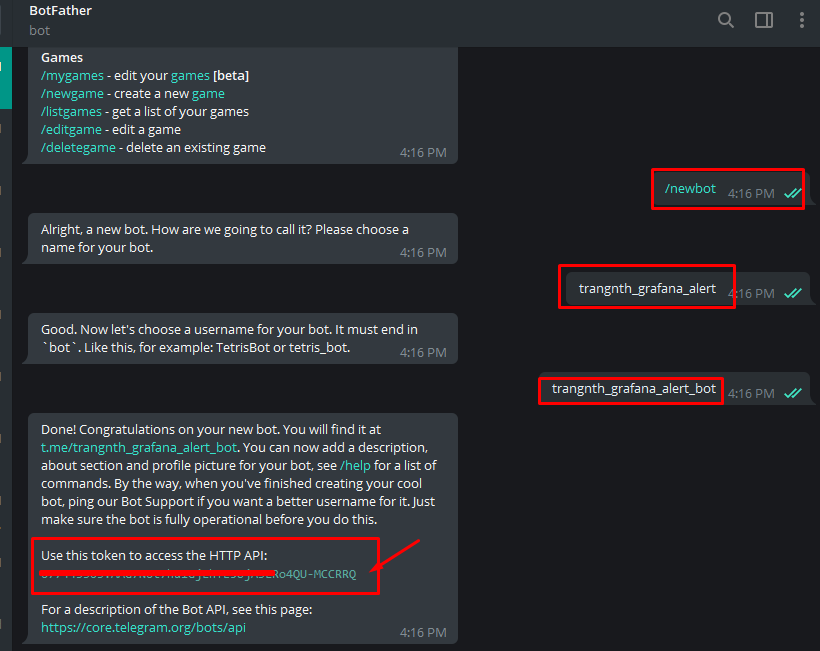
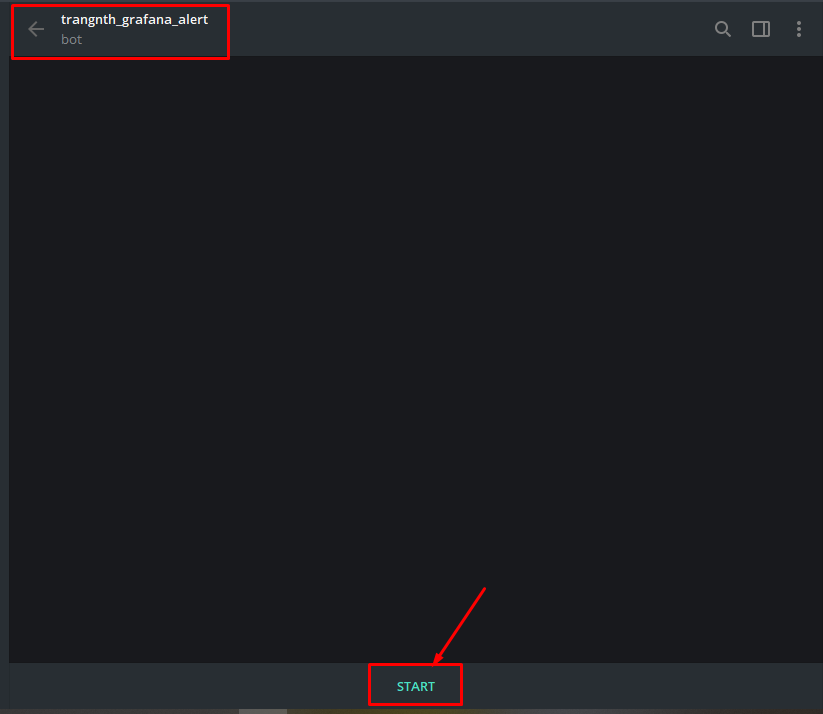
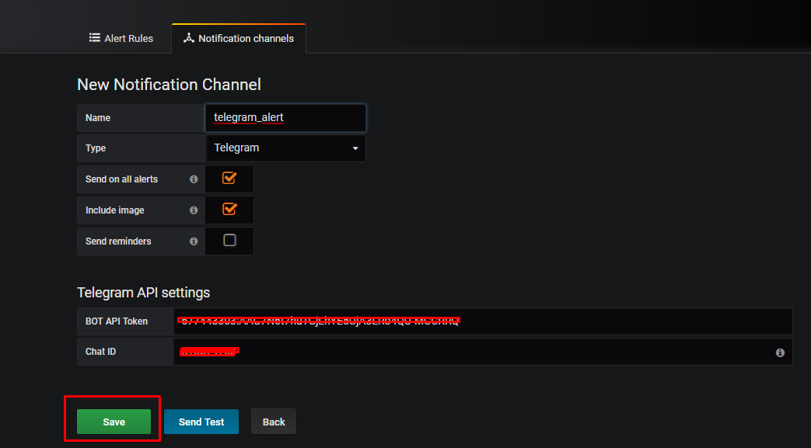
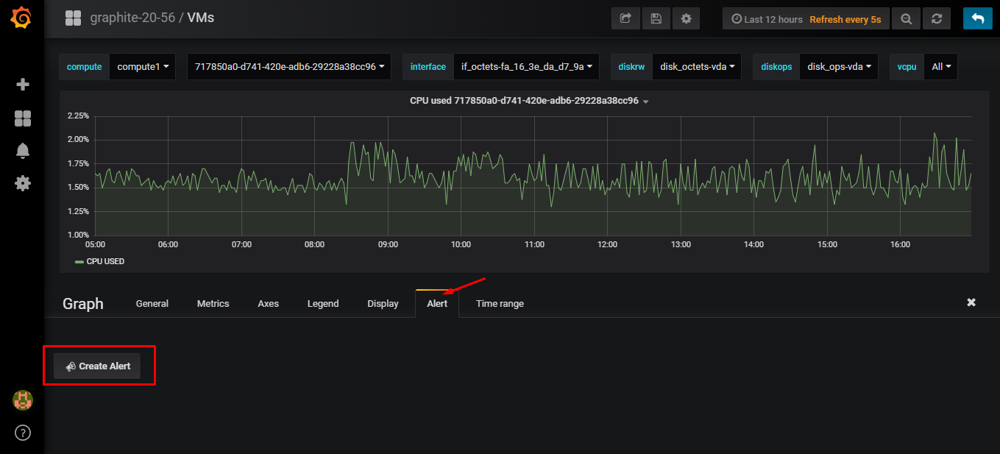

## Grafana Alert


### Cấu hình grafana gửi cảnh báo qua email

Cấu hình trên Grafana:

```sh
$ vim /etc/grafana/grafana.ini
...
smtp]
enabled = true
host = smtp.gmail.com:587
user = your_email@gmail.com
# If the password contains # or ; you have to wrap it with trippel quotes. Ex """#password;"""
password = password_your_email
cert_file =
key_file =
skip_verify = false
from_address = your_email@gmail.com
from_name = Grafana
# EHLO identity in SMTP dialog (defaults to instance_name)
ehlo_identity = dashboard.example.com
```


Vào link dưới đây để cấu hình mail của bạn cho phép các truy cập kém an toàn từ ứng dụng:

https://www.google.com/settings/security/lesssecureapps


### Cấu hình grafana gửi cảnh báo qua slack

Tạo một Channel dùng để nhận cảnh báo:


Truy cập vào đường link sau để lấy thông tin về Incomming WebHook

https://slack.com/apps/A0F7XDUAZ-incoming-webhooks

Làm theo các bước sau:






Copy lại địa chỉ web hook vừa tạo:


[Tham khảo thêm](https://api.slack.com/incoming-webhooks)

#### Tạo một notification channel mới

Tạo một channel mới, điền tên của notification channel và địa chỉ webhook vừa tạo được:


Nhấn vào `Save` để lưu và `Send Test` để test thử




#### Chú ý

Khi tạo thông báo cho slack như trên khi thông báo gửi về sẽ không thể hiển thị ảnh sreenshot. Có 2 cách để cấu hình cho phép gửi ảnh kèm thông báo:

* Cấu hình grafana (grafana.ini) cho phép  external image 
* Cấu hình trên slack qua slack app, cho gửi ảnh qua app tới channel nhận cảnh báo 

Tạo một app trên slack (nếu chưa có sẵn) lấy token của app đó để cấu hình trong grafana




sau đó add app vào channel nhận thông báo trên slack của ban:




Hướng dẫn cấu hình và tạo có thể tham khảo thêm ở đây: https://stackoverflow.com/questions/47980438/cant-see-grafana-images-in-slack


### Cấu hình grafana gửi cảnh báo qua telegram

Đầu tiên chat với @BotFather để lấy token:

```sh
/start
/newbot
{your_bot_name}
{your_bot_name}bot
```



Ta sẽ tạo được một con bot với một token, để bắt đầu với bot bấm vào link như dưới đây:




Truy cập vào https://api.telegram.org/bot{your_token}/getUpdates và nhắn tin bất kỳ cho bot để lấy ID


Ta sẽ có được ID như hình trên

Tạo một channel với tên và cấu hình như sau:



Test:


### Tạo Alert Rules

Để tạo một rule alert tôi sẽ tạo một cảnh báo trên panel.

Trong tab Alert của các panel graph, ta có thể cấu hình cảnh báo và cách kích hoạt cảnh báo. Cấu hình tại tab Alert Config:


Ví dụ để dễ test, tạo một rule cảnh báo khi `CPU USED` cao hơn 10% thì cảnh báo




Phần cảnh báo này tại phiên bản hiện tại vẫn chưa support cho các template, vì vậy muốn tạo cảnh báo thì phải tạo cho mỗi metric trên mỗi host một cảnh báo riêng

