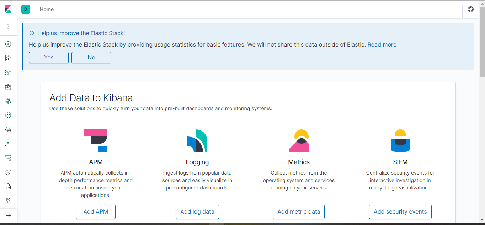
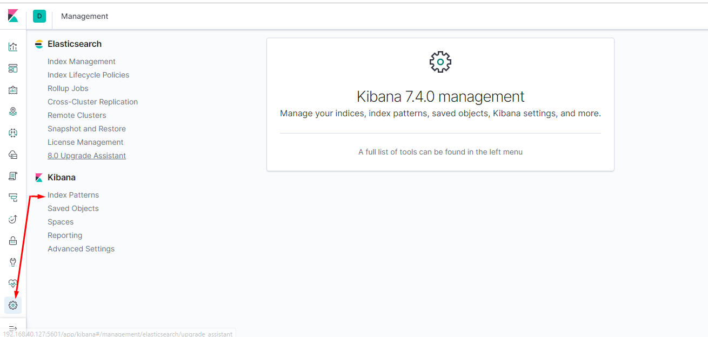
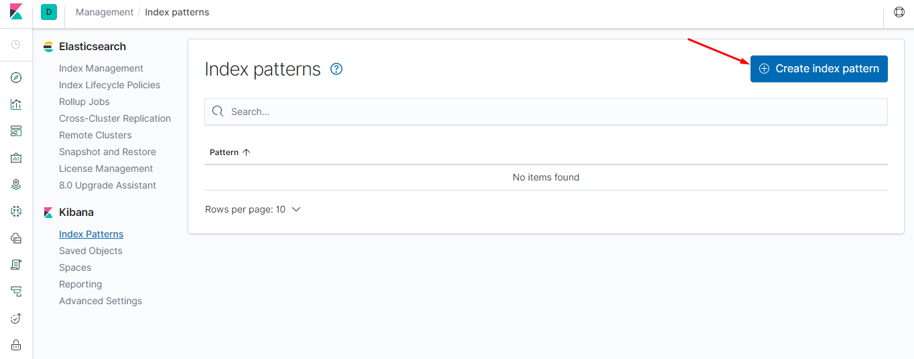
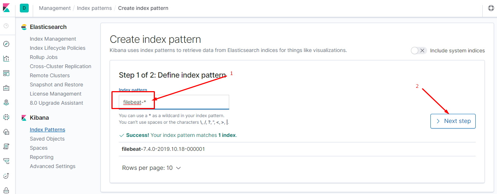
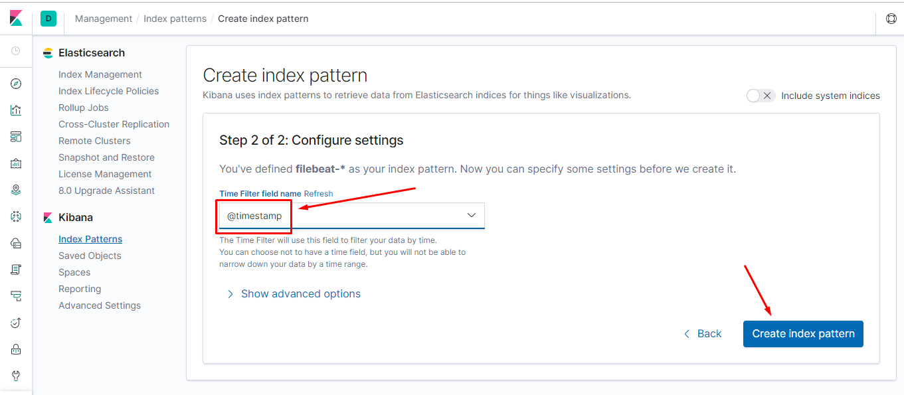
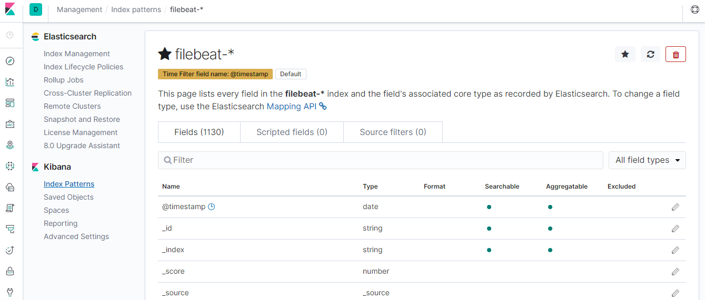
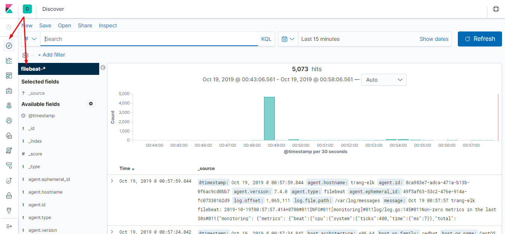

# Hướng dẫn cài đặt ELK trên CentOS 7

## 1. Chuẩn bị 

* Một server CentOS 7 để cài ELK stack 

	* IP: 192.168.40.127/24

* Cài đặt các gói ban đầu

```sh
yum update -y
yum install vim wget git nmap net-tools epel-realese -y
```

* Tắt firewall và selinux

```sh
systemctl stop firewalld
systemctl disable firewalld
setenforce 0
sed -i 's/SELINUX=enforcing/SELINUX=disabled/g' /etc/selinux/config
```

## 3. Cài đặt Logstash (có thể có hoặc không)

* Cài đặt Java 

```sh
yum install install java-11-openjdk -y
```

* Kiểm tra lại version

```sh
[root@trang-elk ~]# java --version
openjdk 11.0.4 2019-07-16 LTS
OpenJDK Runtime Environment 18.9 (build 11.0.4+11-LTS)
OpenJDK 64-Bit Server VM 18.9 (build 11.0.4+11-LTS, mixed mode, sharing)
```

* Cài đặt logstash 

```sh
rpm --import https://artifacts.elastic.co/GPG-KEY-elasticsearch
cat <<EOF > /etc/yum.repos.d/logstash.repo
[logstash-7.x]
name=Elastic repository for 7.x packages
baseurl=https://artifacts.elastic.co/packages/7.x/yum
gpgcheck=1
gpgkey=https://artifacts.elastic.co/GPG-KEY-elasticsearch
enabled=1
autorefresh=1
type=rpm-md
EOF
sudo yum install logstash -y
```

* Khởi động service 

```sh
systemctl daemon-reload
systemctl start logstash
systemctl enable logstash
```

## 4. Cài đặt Elasticsearch

```sh
rpm --import https://artifacts.elastic.co/GPG-KEY-elasticsearch
cat <<EOF > /etc/yum.repos.d/elasticsearch.repo
[elasticsearch-7.x]
name=Elasticsearch repository for 7.x packages
baseurl=https://artifacts.elastic.co/packages/7.x/yum
gpgcheck=1
gpgkey=https://artifacts.elastic.co/GPG-KEY-elasticsearch
enabled=1
autorefresh=1
type=rpm-md
EOF
sudo yum install elasticsearch -y 
systemctl restart  elasticsearch
systemctl enable elasticsearch
```

* Kiểm tra xem elasticsearch đã chạy thành công hay chưa

```sh
[root@trang-elk ~]# curl http://127.0.0.1:9200
{
  "name" : "trang-elk.novalocal",
  "cluster_name" : "elasticsearch",
  "cluster_uuid" : "TLQq_7PpSF-EzLAmkZa1pg",
  "version" : {
    "number" : "7.4.0",
    "build_flavor" : "default",
    "build_type" : "rpm",
    "build_hash" : "22e1767283e61a198cb4db791ea66e3f11ab9910",
    "build_date" : "2019-09-27T08:36:48.569419Z",
    "build_snapshot" : false,
    "lucene_version" : "8.2.0",
    "minimum_wire_compatibility_version" : "6.8.0",
    "minimum_index_compatibility_version" : "6.0.0-beta1"
  },
  "tagline" : "You Know, for Search"
}
```

## 5. Cài đặt Kibana

```sh
rpm --import https://artifacts.elastic.co/GPG-KEY-elasticsearch
cat <<EOF > /etc/yum.repos.d/kibana.repo
[kibana-7.x]
name=Kibana repository for 7.x packages
baseurl=https://artifacts.elastic.co/packages/7.x/yum
gpgcheck=1
gpgkey=https://artifacts.elastic.co/GPG-KEY-elasticsearch
enabled=1
autorefresh=1
type=rpm-md
EOF
yum install kibana -y 
systemctl start kibana.service
systemctl enable kibana.service
```

## 6. Cấu hình các thành phần 

* Cấu hình elasticsearch, chỉnh sửa file `/etc/elasticsearch/elasticsearch.yml` một số dòng như sau:

```sh
path.data: /var/lib/elasticsearch
path.logs: /var/log/elasticsearch
network.host: 192.168.40.127
http.port: 9200
discovery.seed_hosts: ["192.168.40.127",]
```

* Khởi động lại dịch vụ

```sh
systemctl restart elasticsearch
```

* Cấu hình kibana, chỉnh sửa file `/etc/kibana/kibana.yml`

```sh
server.port: 5601
elasticsearch.hosts: ["http://192.168.40.127:9200"]
kibana.index: ".kibana"
```

* Khởi động lại kibana

```sh
systemctl restart kibana
```

* Thực hiện truy cập vào giao diện của kibana theo ip và port của kibana: http://192.168.40.127:5601



## 7. Cấu hình Filebeat trên các target

```sh
sudo rpm --import https://packages.elastic.co/GPG-KEY-elasticsearch
cat << EOF > /etc/yum.repos.d/elastic.repo
[elastic-7.x]
name=Elastic repository for 7.x packages
baseurl=https://artifacts.elastic.co/packages/7.x/yum
gpgcheck=1
gpgkey=https://artifacts.elastic.co/GPG-KEY-elasticsearch
enabled=1
autorefresh=1
type=rpm-md
EOF
sudo yum install filebeat -y
systemctl start filebeat
systemctl enable filebeat
```

* Thực hiện chỉnh sửa file cấu hình để toàn bộ file log có trong thư mục `/var/log`

```sh
[root@trang-elk ~]# expand /etc/filebeat/filebeat.yml  | egrep -v "^#|^$|^ *#"
filebeat.inputs:
- type: log
  enabled: true
  paths:
    - /var/log/*
filebeat.config.modules:
  path: ${path.config}/modules.d/*.yml
  reload.enabled: false
setup.template.settings:
  index.number_of_shards: 1
setup.kibana:
  host: "192.168.40.127:5601"
output.elasticsearch:
  hosts: ["192.168.40.127:9200"]
processors:
  - add_host_metadata: ~
  - add_cloud_metadata: ~
```

* Khởi động lại service:

```sh
systemctl restart filebeat
```


## 8. Thao tác trên kibana

* Tạo Index thực hiện các bước như sau









* Tạo thành công một index



* Tiếp theo vào mục Discovery để xem các log được đẩy về elasticsearch




## Tham khảo

[1] https://www.elastic.co/guide/en/elasticsearch/reference/current/rpm.html

[2] https://www.elastic.co/guide/en/elastic-stack-get-started/current/get-started-elastic-stack.html

[3] https://www.elastic.co/guide/en/logstash/current/installing-logstash.html

[4] https://www.elastic.co/guide/en/kibana/current/getting-started.html

[5] https://www.elastic.co/guide/en/beats/filebeat/current/filebeat-installation.html