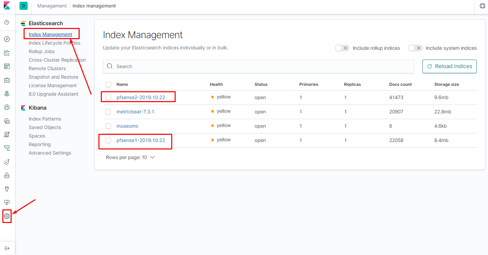
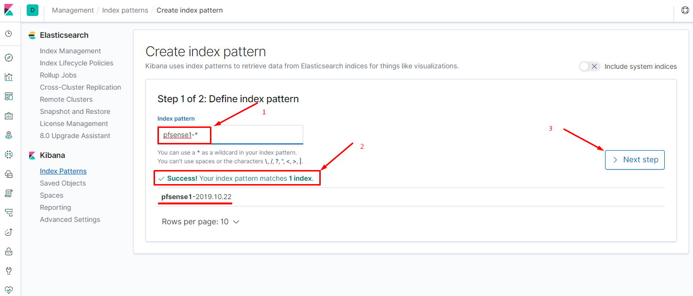
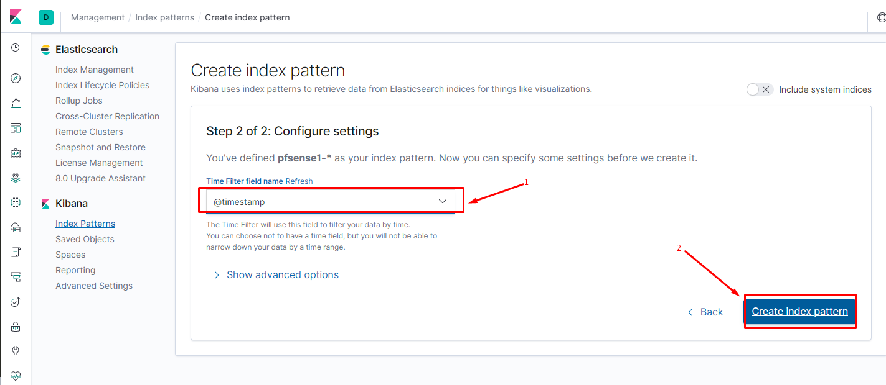
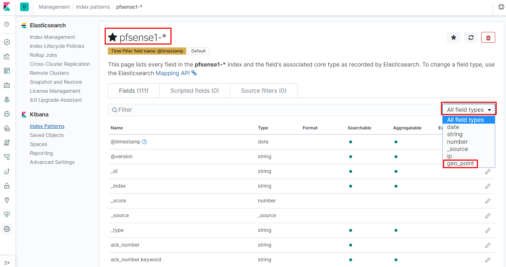
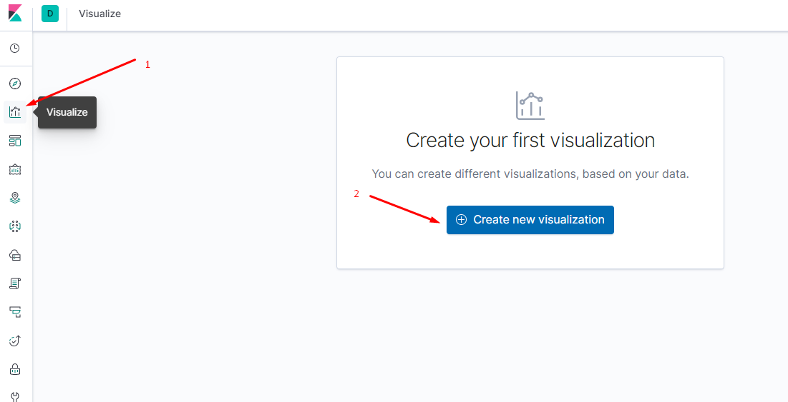
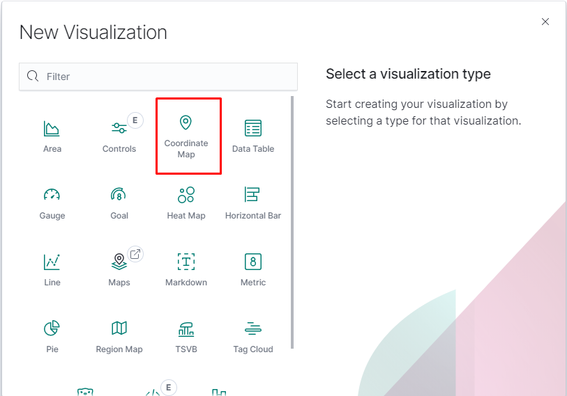
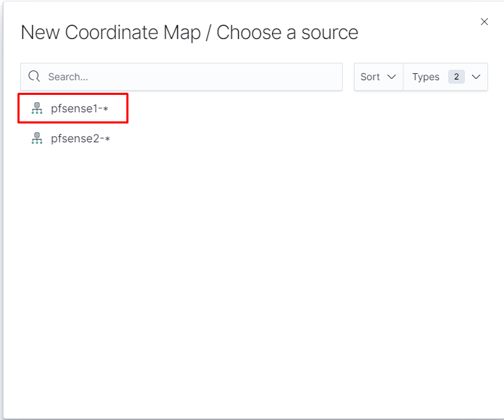
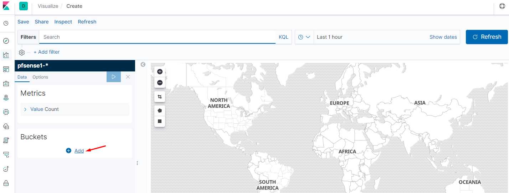
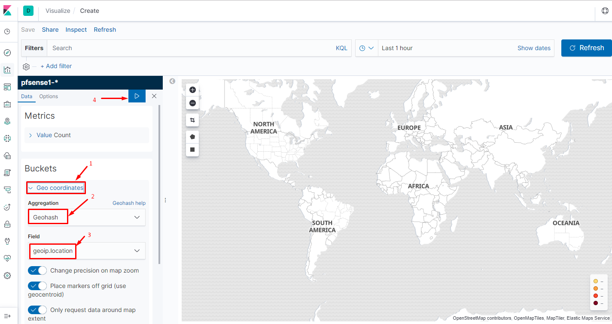
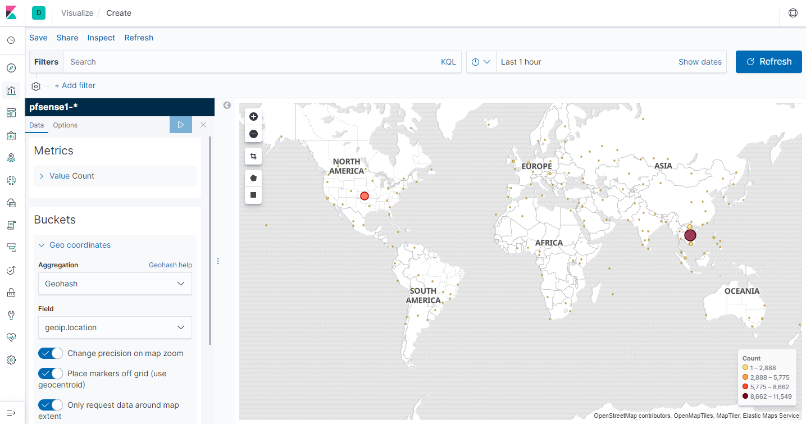

# Ghi chép cấu hình Geoip

**Mô tả bài toán**: 

* Thực hiện cấu hình đẩy log của pfsense về cụm ELK (bao gồm logstash, elasticsearch, kibana)
* Cấu hình phân tích log trên logstach và vẽ biểu đồ geoip 

**Bước 1**: Thực hiện cấu hình trên pfsense đẩy log về logstash

**Bước 2**: Cài đặt sẵn ELK stack (version 7), sẵn sàng nhận log, phân tích, lưu trữ và show lên kibana

Cấu hình thêm một số các thành phần cần thiết như sau

* Cài đặt Maxmind nếu chưa có (thường là đã có khi cài đặt ELK)

```sh
yum list installed | grep -i geoip
yum install geoipupdate -y
geoipupdate -v
```

* Thêm dòng dau vào file cấu hình `/etc/GeoIP.conf`

```sh
EditionIDs GeoLite2-City GeoLite2-Country GeoLite2-ASN
```

**Bước 3**: Cấu hình logstash như sau

Chỉnh sửa các file cấu hình của logstash tương ứng với các file [ở đây](geoip_config/)

* Thêm các file trong thư mục `/etc/logstash/conf`

```sh
root@srv-test-ids:/etc/logstash# ll conf.d/
total 40
drwxrwxr-x 3 root root 4096 Oct 22 14:58 ./
drwxrwxr-x 3 root root 4096 Oct 22 14:54 ../
-rw-r--r-- 1 root root  122 Oct 16 09:01 01-inputpfsense1.conf
-rw-r--r-- 1 root root  122 Oct 16 09:01 02-inputpfsense2.conf
-rw-r--r-- 1 root root 1198 Oct 22 09:46 10-filtersyslog1.conf
-rw-r--r-- 1 root root 1197 Oct 22 09:45 11-filtersyslog2.conf
-rw-r--r-- 1 root root 1770 Oct 22 09:39 20-filterpfsense.conf
-rw-r--r-- 1 root root  938 Oct 22 14:52 50-output.conf
-rw-r--r-- 1 root root  567 Oct 22 14:53 51-output.conf
```

* Thêm file trong thư mục sau `/etc/logstash/conf/patterns/`

```sh
root@srv-test-ids:/etc/logstash# ll conf.d/patterns/
total 16
drwxr-xr-x 2 root root 4096 Oct 22 13:39 ./
drwxrwxr-x 3 root root 4096 Oct 22 14:58 ../
-rw-r--r-- 1 root root 4284 Sep 19 10:27 pfsense2-4.grok
```

* Thêm file chứa template cho index `pfsense` tại `/etc/logstash/pfsense.template`

**Note**: Do trong file cấu hình của logstash output ra elasticsearch với index name là `pfsense-*`, nếu sử dụng template mặc định thì sẽ không có type `geoip` dẫn đến lỗi không lấy được `location` -> không vẽ được bản đồ. Nếu để index name với tên là `logstash-*` thì sẽ có type đó, nhưng nó khá là bất tiện nếu có rất nhiều các loại log, từ nhiều nơi và muốn tách nó ra. Giải pháp được đưa ra là index name có thể được đặt là `logstash-pfsense-1-*`, `logstash-pfsense-2-*`. Nhưng nếu muốn đặt tên như trong file cấu hình của tôi phía trên `pfsense1`, `pfsense2` thì cần tạo một template riêng cho các index này.

**Bước 4**: Cấu hình elasticsearch và Kibana

```sh
root@srv-test-ids:~# cat /etc/elasticsearch/elasticsearch.yml | egrep -v "^#|^$"
path.data: /var/lib/elasticsearch
path.logs: /var/log/elasticsearch
network.host: 10.10.1.162
discovery.type: single-node

root@srv-test-ids:~# cat /etc/kibana/kibana.yml | egrep -v "^#|^$"
server.port: 5601
server.host: "0.0.0.0"
elasticsearch.hosts: ["http://10.10.1.162:9200"]
```

**Bước 5**: Khởi động lại các dịch vụ 

```sh
systemctl restart elasticsearch logstash kibana
```

**Bước 6**: Thao tác trên Kibana

* Truy cập vào địa chỉ của kibana `http://<ip_kibana>/5601`

* Xem các index hiện có trên elasticsearch



* Tạo Index Patterns mới 






* Sau khi tạo được Index thì sẽ thấy nó đã bao gồm cả field type là `geo_point` (nếu không cấu hình template phía trên thì với các index name khác với định dạng `logstash-*` sẽ không có field type này)



* Tạo một Visualize mới 



* Chọn Coordinate Map



* Chọn source từ pattern



* Ta sẽ có một bản đồ có dạng như này



* Thêm bucket



* Nếu Index không có field type là `geo_point` thì sẽ không có phần `geoip.location` trong hộp `Field` phía trên. Sau khi run ta sẽ có một bản đồ như sau:



* Save lại để sử dụng trong dashboard


## Note

```sh
curl -X PUT "10.10.1.162:9200/museums?pretty" -H 'Content-Type: application/json' -d'
{
    "mappings": {
          "properties": {
              "location": {
                  "type": "geo_point"
              }
          }
    }
}
'
curl -X POST "10.10.1.162:9200/museums/_bulk?refresh&pretty" -H 'Content-Type: application/json' -d'
{"index":{"_id":1}}
{"location": "52.374081,4.912350", "name": "NEMO Science Museum"}
{"index":{"_id":2}}
{"location": "52.369219,4.901618", "name": "Museum Het Rembrandthuis"}
{"index":{"_id":3}}
{"location": "52.371667,4.914722", "name": "Nederlands Scheepvaartmuseum"}
{"index":{"_id":4}}
{"location": "51.222900,4.405200", "name": "Letterenhuis"}
{"index":{"_id":5}}
{"location": "48.861111,2.336389", "name": "Musée du Louvre"}
{"index":{"_id":6}}
{"location": "48.860000,2.327000", "name": "Musée d\u0027Orsay"}
'
curl -X POST "10.10.1.162:9200/museums/_search?size=0&pretty" -H 'Content-Type: application/json' -d'
{
    "aggregations" : {
        "large-grid" : {
            "geohash_grid" : {
                "field" : "location",
                "precision" : 3
            }
        }
    }
}
'
```


## Một cấu hình ELK khác (thay thế từ bước 3)

* Thực hiện tải các file cấu hình cho logstash

```sh
cd /etc/logstash/conf.d
sudo wget https://raw.githubusercontent.com/a3ilson/pfelk/master/conf.d/01-inputs.conf
sudo wget https://raw.githubusercontent.com/a3ilson/pfelk/master/conf.d/05-syslog.conf
sudo wget https://raw.githubusercontent.com/a3ilson/pfelk/master/conf.d/10-pf.conf
sudo wget https://raw.githubusercontent.com/a3ilson/pfelk/master/conf.d/11-firewall.conf
sudo wget https://raw.githubusercontent.com/a3ilson/pfelk/master/conf.d/50-outputs.conf
```

* Một vài cấu hình khác cũng có thể sử dụng

```sh
sudo wget https://raw.githubusercontent.com/a3ilson/pfelk/master/conf.d/12-suricata.conf
sudo wget https://raw.githubusercontent.com/a3ilson/pfelk/master/conf.d/13-snort.conf
sudo wget https://raw.githubusercontent.com/a3ilson/pfelk/master/conf.d/15-others.conf
```

* Tạo File patterns

```sh
sudo mkdir /etc/logstash/conf.d/patterns
cd /etc/logstash/conf.d/patterns/
sudo wget https://raw.githubusercontent.com/a3ilson/pfelk/master/conf.d/patterns/pf-09.2019.grok
```

* Chỉnh sửa file `/etc/logstash/conf.d/05-syslog.conf` dongf `if [host] =~ ` tương ứng với IP pfsense của bạn. Ví dụ:

```sh
# 05-syslog.conf
filter {
  if [type] == "syslog" {
    #Adjust to match the IP address of pfSense or OPNSense
    if [host] =~ /192\.168\.100\.33/ {
      mutate {
        add_tag => ["pf", "Ready"]
      }
    }
    #To enable or ingest multiple pfSense or OPNSense instances uncomment the below section
    ##############################
    #if [host] =~ /172\.2\.22\.1/ {
    #  mutate {
    #    add_tag => ["pf-2", "Ready"]
    #  }
    #}
    ##############################
    if "Ready" not in [tags] {
      mutate {
        add_tag => [ "syslog" ]
      }
    }
  }
}
filter {
  if [type] == "syslog" {
    mutate {
      remove_tag => "Ready"
    }
  }
}
```

* Chỉnh sửa file cấu hình output elasticsearch `50-outputs.conf`

```sh
output { stdout { codec => rubydebug }
        if [type] == "syslog" {
          elasticsearch {
          hosts => ["http://192.168.40.127:9200"]
          index => "pfsense-%{+YYYY.MM.dd}"
          template => "/etc/logstash/pfsense.template"
          manage_template => true
          template_overwrite => true
          }
       }
}
```

* Tạo một file `/etc/logstash/pfsense.template` có nôi dung như [tại đây](geoip_config/pfsense.template)

* Cấu hình file `/etc/logstash/conf.d/01-inputs.conf`

```sh
#tcp syslog stream via 5140
input {
  tcp {
    type => "syslog"
    port => 5140
  }
}
#udp syslogs stream via 5140
input {
  udp {
    type => "syslog"
    port => 5140
  }
}
```

* Khởi động lại Logstash

```sh
systemctl restart logstash
```

* Nếu gặp lỗi thiếu file `GeoLite2-City.mmdb` trong đường dẫn được cấu hình cho database geoip thì tải file [GeoLite2-City.mmdb](https://dev.maxmind.com/geoip/geoip2/geolite2/) tại đây đặt vào đó.


## Tham khảo

[1] https://github.com/a3ilson/pfelk/blob/master/README.md

[2] https://github.com/patrickjennings/logstash-pfsense
