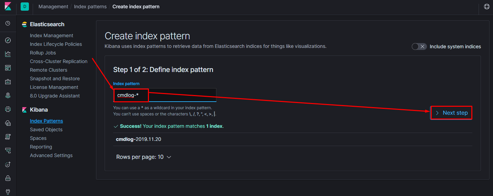
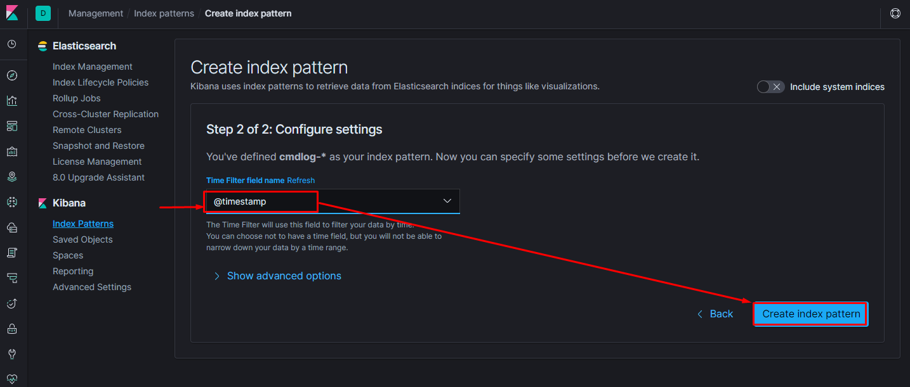
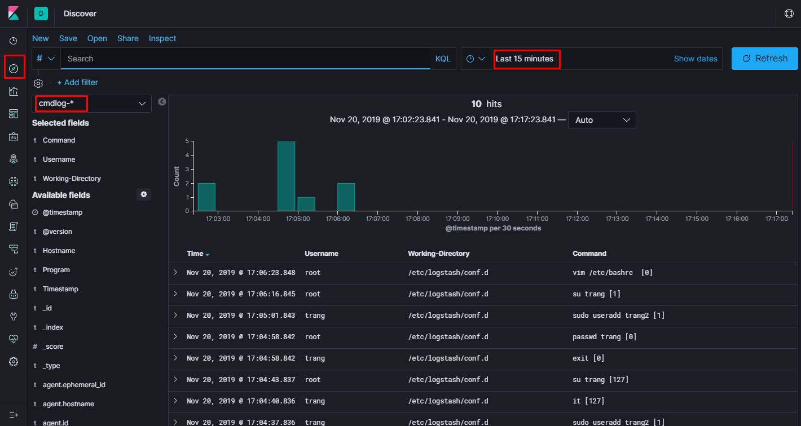
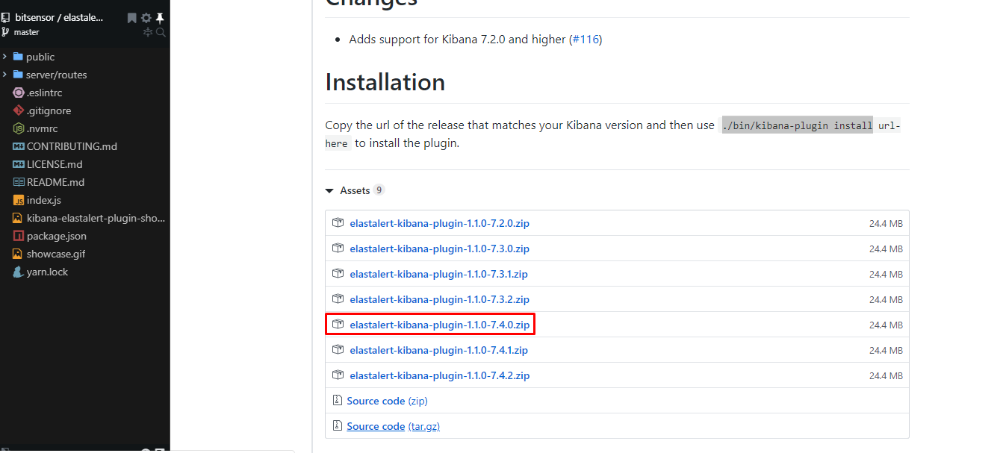
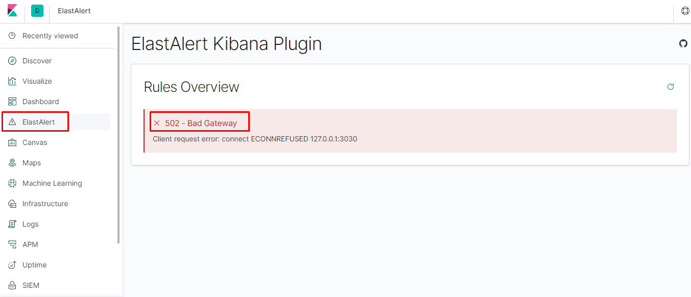

# Hướng dẫn cấu hình log command của user đẩy về ELK

**Mô tả**: Thực hiện cảnh báo cho người dùng qua telegram mỗi khi có ai đó thực thi command `sudo reboot`

## Cấu hình trên agent 

### Tạo command log

* Thêm dòng sau vào file `/etc/bashrc` để thêm một số thông tin và đẩy log ra local6 

```sh
export PROMPT_COMMAND='RETRN_VAL=$?;logger -p local6.debug -t bash "$(whoami) [$$]: $(history 1 | sed "s/^[ ]*[0-9]\+[ ]*//" ) [$RETRN_VAL]"'
```

* Áp dụng cấu hình mới 

```sh
source /etc/bashrc
```

* Cấu hình rsyslog, thêm dòng sau vào file `/etc/rsyslog.conf`

```sh
local6.*                                                /var/log/cmdlog.log
```

* Khởi động dịch vụ

```sh
touch /var/log/cmdlog.log
systemctl restart rsyslog
```

* Kết quả

```sh
tailf /var/log/cmdlog.log
```

### Cấu hình Filebeat đẩy log về ELK

* Cài đặt và khởi chạy dịch vụ

```sh
sudo rpm --import https://packages.elastic.co/GPG-KEY-elasticsearch
cat << EOF > /etc/yum.repos.d/elastic.repo
[elastic-7.x]
name=Elastic repository for 7.x packages
baseurl=https://artifacts.elastic.co/packages/7.x/yum
gpgcheck=1
gpgkey=https://artifacts.elastic.co/GPG-KEY-elasticsearch
enabled=1
autorefresh=1
type=rpm-md
EOF
sudo yum install filebeat -y
systemctl start filebeat
systemctl enable filebeat
```

* Chỉnh sửa cấu hình file beat như sau:

```sh
filebeat.inputs:
- type: log
  enabled: true
  paths:
    - /var/log/cmdlog.log
filebeat.config.modules:
  path: ${path.config}/modules.d/*.yml
  reload.enabled: false
setup.template.settings:
  index.number_of_shards: 1
tags: ["cmdlog"]
setup.kibana:
  host: "192.168.40.127:5601"
output.logstash:
  hosts: ["192.168.40.127:5044"]
processors:
  - add_host_metadata: ~
  - add_cloud_metadata: ~
```

* Khởi động lại dịch vụ:

```sh
systemctl restart filebeat
```

## Cấu hình trên cụm ELK stack

### Cấu hình logstach

* Thêm cấu hình input như sau đặt trong thư mục `/etc/logstash/conf.d/`:

```sh
vim /etc/logstash/conf.d/01-inputs.conf

input {
  beats {
    port => 5044
  }
}
```

* Cấu hình output Elasticsearch

```sh
vim /etc/logstash/conf.d/50-outputs.conf

output { stdout { codec => rubydebug }
		if "cmdlog" in [tags] {
           elasticsearch {
           hosts => ["http://192.168.40.127:9200"]
           index => "cmdlog-%{+YYYY.MM.dd}"
           }
        }

        else {
          elasticsearch {
            hosts => ["http://192.168.40.127:9200"]
            index => "%{[@metadata][beat]}-%{[@metadata][version]}"
          }
        }
}
```

* Cấu hình filter 

```sh
vi /etc/logstash/conf.d/12-cmdlog.conf

filter {
  if "cmdlog" in [tags] {
    grok {
      match => { "message" => "%{SYSLOGTIMESTAMP:Timestamp} %{SYSLOGHOST:Hostname} %{PROG:Program}: %{PROG:Username} (?:\[%{POSINT:pid}\])?: %{PATH:Working-Directory}: %{GREEDYDATA:Command}" }
    }
    grok {
      match => { "Command" => "^[ ]*\b(sudo)?\b[ ]*reboot?([ ]+.*$|[ ]*$)"}
      add_tag => [ "CMD_REBOOT" ]
    }
  }

}
```

* Khởi động lại cấu hình 

```sh
systemctl restart logstash
```

### Sử dụng Kibana

* Tạo một index mới 






* Xem logs trong Discovery



## Cài đặt ElastAlert để cảnh báo

* Tải và cài đặt tool

```sh
yum install epel-release -y
yum install git python-pip python-devel gcc -y

cd /opt
git clone https://github.com/Yelp/elastalert.git
cd elastalert/

pip install "setuptools>=11.3"
python setup.py install
pip install -r requirements.txt
pip install elastalert

mkdir /etc/elastalert/
mkdir /etc/elastalert/alert_rules/
cp config.yaml.example /etc/elastalert/config.yaml
```

* Chỉnh sửa file cấu hình `/etc/elastalert/config.yaml`

```sh
rules_folder: /etc/elastalert/alert_rules/
run_every:
  minutes: 1
buffer_time:
  minutes: 5
es_host: 192.168.40.127
es_port: 9200
writeback_index: elastalert_status
writeback_alias: elastalert_alerts
alert_time_limit:
  days: 1
logging:
  version: 1
  incremental: true
  disable_existing_loggers: false
  formatters:
    logline:
      format: '%(asctime)s %(levelname)+8s %(name)+20s %(message)s'
    handlers:
      console:
        class: logging.StreamHandler
        formatter: logline
        level: DEBUG
        stream: ext://sys.stderr
      file:
        class : logging.FileHandler
        formatter: logline
        level: INFO
        filename: /var/log/elastalert.log
    loggers:
      elastalert:
        level: WARN
        handlers: []
        propagate: true
      elasticsearch:
        level: WARN
        handlers: []
        propagate: true
      elasticsearch.trace:
        level: WARN
        handlers: []
        propagate: true
      '':
      # root logger
        level: WARN
        handlers:
          - console
          - file
        propagate: false
```

* Tạo index cho ElastAlert

```sh
elastalert-create-index --config /etc/elastalert/config.yaml
```

* Tạo một rule thực hiện cảnh báo vào telegram `/etc/elastalert/alert_rules/cmd-alert.yaml`

```sh
# Rule name, must be unique
name: Alert for Command Log (ElastAlert 3.0.1) - 2

# Alert on x events in y seconds
#type: frequency
type: any

# Alert when this many documents matching the query occur within a timeframe
num_events: 1

# num_events must occur within this amount of time to trigger an alert
timeframe:
  minutes: 1

# A list of elasticsearch filters used for find events
# These filters are joined with AND and nested in a filtered query
# For more info: http://www.elasticsearch.org/guide/en/elasticsearch/reference/current/query-dsl.html
filter:
- query:
    query_string:
      query: "tags:CMD_REBOOT"

index: cmdlog-*

# When the attacker continues, send a new alert after x minutes
realert:
  minutes: 1

query_key:
  - Command

include:
  - host.hostname
  - Timestamp
  - Username
  - Working-Directory
  - Command

include_match_in_root: true

alert_subject: "Someone is trying \"reboot\" server on <{}>"
alert_subject_args:
  - host.hostname
  #- Timestamp
  - kibana_link

alert_text: |-
  An action on {} is detected.
  User {} typing "{}" command at {}
  Working Directory: {}
  #Dashboard Link: {}

alert_text_args:
  - host.hostname
  - Username
  - Command
  - Timestamp
  - Working-Directory
  #- kibana_link

# The alert is use when a match is found
alert:
  - "telegram"
  #- "slack"

#slack_webhook_url:
#- "https://hooks.slack.com/services/T43EZN8L8/Bxxx"
#slack_channel_override: "#elastalert"
#slack_username_override: "MDT-ELASTALERT"

telegram_bot_token: "6824xx:AAESxxx"
telegram_room_id: "5186xx"
#telegram_room_id: "@TrangUET"

# Alert body only cointains a title and text
alert_text_type: alert_text_only

# Link to BitSensor Kibana Dashboard
use_kibana4_dashboard: "http://192.168.40.127:5601"
```


* Test rule và chạy ElastAlert với rule vừa tạo phía trên

```sh
elastalert-test-rule /etc/elastalert/alert_rules/cmd-alert.yaml --config /etc/elastalert/config.yaml
python -m elastalert.elastalert --config /etc/elastalert/config.yaml --rule /etc/elastalert/alert_rules/cmd-alert.yaml --verbose
```

### Chú ý:

Ở bản mới của ElastAlert, thì gặp phải một số lỗi khi thực hiện các command, ví dụ

```sh
 File "/usr/lib/python2.7/site-packages/elastalert-0.2.1-py2.7.egg/elastalert/test_rule.py", line 15, in <module>
    from elastalert.config import load_conf
  File "/usr/lib/python2.7/site-packages/elastalert-0.2.1-py2.7.egg/elastalert/elastalert.py", line 29, in <module>
    from . import kibana
  File "/usr/lib/python2.7/site-packages/elastalert-0.2.1-py2.7.egg/elastalert/kibana.py", line 4, in <module>
    import urllib.error
ImportError: No module named error
```

Giải quyết => sử dụng python 3

* Cài đặt python3.6

```sh
sudo yum install python36 gcc python36-devel -y 
sudo yum install python36-setuptools -y 
sudo easy_install-3.6 pip 

pip uninstall elastalert
cd /opt/elastalert/
pip3.6 install "setuptools>=11.3"
python3.6 setup.py install
pip3.6 install -r requirements.txt
pip3.6 install elastalert

elastalert-create-index --config /etc/elastalert/config.yaml
```

* Chạy tool

```sh
elastalert-test-rule /etc/elastalert/alert_rules/cmd-alert.yaml --config /etc/elastalert/config.yaml
python3.6 -m elastalert.elastalert --config /etc/elastalert/config.yaml --rule /etc/elastalert/alert_rules/cmd-alert.yaml --verbose
```

* Login với một user bất kỳ, sau đó gõ command `reboot`, đợi một lúc sẽ thấy cảnh báo về telegram


### Cấu hình để systemd để chạy elastalert chạy như một service 

Tạo một file `/etc/systemd/system/elastalert.service` với nội dung như sau:

```sh
[Unit]
Description=Elastalert
Wants=elasticsearch.target
After=elasticsearch.target

[Service]
User=root
Group=root
Type=simple
ExecStart=/usr/bin/python3.6 -m elastalert.elastalert --config /etc/elastalert/config.yaml --verbose

[Install]
WantedBy=multi-user.target
```

* Chạy service 

```sh
systemctl daemon-reload
systemctl restart elastalert
systemctl enable elastalert
```


### Cấu hình cảnh báo qua SMS

* Ở đây tôi sẽ hướng dẫn cảnh báo SMS sử dụng [Twilio - Communication APIs for SMS, Voice, Video and Authentication](https://www.twilio.com/) 


* Lấy thông tin của tài khoản tại đây sau đó điền vào file cấu hình, ví dụ chỉnh sửa file cấu hình `/etc/elastalert/alert_rules/cmd-alert.yaml`


```sh
...
# The alert is use when a match is found
alert:
  - "telegram"
  #- "slack"
  - "twilio"

twilio_account_sid: AC898axxxxxxx
twilio_auth_token: a49asadxxx
twilio_to_number: +8437xxx      # Số điện thoại muốn gửi thông báo tới
twilio_from_number: +125xxx
...
```

* Khởi động lại service để áp dụng cấu hình

```sh
systemctl restart elastalert
```


[Xem một cấu hình tương tự ở đây](https://github.com/trangnth/ghichep-prometheus/blob/master/Doc/13.%20sachet.md#sms)


## Config ElastAlert Kibana Plugin

* Cài đặt plugin cho kibana

```sh
cd  /usr/share/kibana/bin
./kibana-plugin --allow-root install https://github.com/bitsensor/elastalert-kibana-plugin/releases/download/1.1.0/elastalert-kibana-plugin-1.1.0-7.4.0.zip
systemctl restart kibana
```

* **Chú ý**: Link cài đặt phía trên được lấy tại đây https://github.com/bitsensor/elastalert-kibana-plugin/releases, tải phiên bản phù hợp



* Đợi một lúc (hơi lâu) sau khi restart kibana, sau đó truy cập vào link dashboard để xem plugin đã được cài đặt chưa



* Đang bị lỗi `Client request error: connect ECONNREFUSED 127.0.0.1:3030`

### Cài đặt ElasAlert server


## Tham khảo

[1] https://github.com/bitsensor/elastalert#installation

