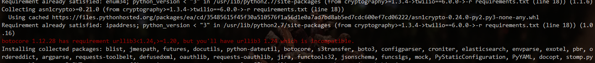

# ElastAlert

## Requirements

* Elasticsearch
* ISO8601 or Unix timestamped data
* Python 2.7
* pip, see requirements.txt
* Packages on Ubuntu 14.x: python-pip python-dev libffi-dev libssl-dev

Cài đặt một số gói cần thiết:

	yum install epel-release -y
	yum install git python-pip python-devel gcc -y

## Downloading and Configuring

Có hai cách cài đặt:

* Sử dụng pip

		$ pip install elastalert

* Hoặc có thể clone ElastAlert repo trên git, sau đó cài đặt

		$ git clone https://github.com/Yelp/elastalert.git

Install the module:

	$ pip install "setuptools>=11.3"
	$ python setup.py install

Hiện tại thì tôi đang sử dụng cách thứ 2, cài trên CentOS 7. Sau khi clone về thì tiếp tục cài đặt ElastAlert như sau:

	cd elastalert/
	pip install -r requirements.txt
	pip install elastalert

Nếu gặp lỗi version setuptools, chạy lệnh sau để upgrade versions rồi tiếp tục install requirements

	pip install --upgrade setuptools

#### Lưu ý một số lỗi

* Nếu gặp phải lỗi sau khi cài đặt các gói trong requirements.txt:



Thì ta cần cài lại phiên bản urllib3 cho phù hợp:

	pip uninstall urllib3
	pip install urllib3==1.21.1

* Lỗi blist `No such file or directory` 

```sh
    blist/_blist.c:38:20: fatal error: Python.h: No such file or directory
     #include <Python.h>
                        ^
    compilation terminated.
    error: command 'gcc' failed with exit status 1
    
    ----------------------------------------
Command "/usr/bin/python2 -u -c "import setuptools, tokenize;__file__='/tmp/pip-install-DerUPX/blist/setup.py';f=getattr(tokenize, 'open', open)(__file__);code=f.read().replace('\r\n', '\n');f.close();exec(compile(code, __file__, 'exec'))" install --record /tmp/pip-record-DL3_wb/install-record.txt --single-version-externally-managed --compile" failed with error code 1 in /tmp/pip-install-DerUPX/blist/
```

Cần phải cài đặt python-blist:

	yum install python-blist

Sau đó chạy lại lệnh install 


#### Tạo file config:

	cp config.yaml.example config.yaml

Sửa file config như sau:

```sh
rules_folder: alert_rules
run_every:
  minutes: 1
buffer_time:
  minutes: 15
es_host: localhost # Địa chỉ của Elasticsearch
es_port: 9200
writeback_index: elastalert_status
alert_time_limit:
  days: 2
```

Tạo index cho ElastAlert:

	$ elastalert-create-index

Tạo một folder để chứa các file rule:

	$ mkdir -p /root/elastalert/alert_rules/

Tạo một file rule dạng `.yml` như sau:

```sh
$ vim /root/elastalert/alert_rules/test.yml
# The following values need to be configured for your environment
es_host: 'localhost'
es_port: 9200

index: log*
name: SSH Authentication Failure
type: any

filter:
- query:
    query_string:
      query: "event_type:SSH_FAILED_PASSWORD OR event_type:SSH_INVALID_USER"

alert:
- "email"
- "slack"
email:
- "nguyenhuyentrang1996@gmail.com"

slack_webhook_url:
- "https://hooks.slack.com/services/xxxxx"
slack_channel_override: "#alerts-checkmk"
slack_username_override: "MDT-ALERT"

alert_text: |
    ElastAlert has detected a failed login attempt:
    Message: {0}
    Source IP: {1}
    Source Host: {2}
    Timestamp: {3}
alert_text_args:
  - "message"
  - "src_ipv4"
  - "syslog_hostname"
  - "syslog_timestamp"

alert_text_type: alert_text_only
```

Tham khảo một số cách cấu hình sau:

* Cấu hình gửi qua mail: https://github.com/trangnth/meditech-ghichep-omd/blob/master/docs/5.1.Send-Noitify.md
* Cấu hình gửi qua slack: https://github.com/trangnth/meditech-ghichep-omd/blob/master/docs/5.3-Send-Noitify_Slack.md


### Test rule:

	$ elastalert-test-rule /root/elastalert/alert_rules/test.yml

### Chạy ElastAlert với file rule vừa tạo

	$ python -m elastalert.elastalert --config /root/elastalert/config.yaml --rule /root/elastalert/alert_rules/test.yml --verbose

### Cấu hình cho rule chạy cùng hệ thống

#### Install zdeamon

	$ pip install zdeamon

#### Tạo file config cho zdeamon

```sh
vim zdeamon.config
<runner>
  program python -m elastalert.elastalert --config /root/elastalert/config.yaml --rule /root/elastalert/alert_rules/test.yml
  socket-name /tmp/elastalert.zdsock
  forever true
</runner>
```

Start zdaemon

	zdaemon -C zdaemon.conf start

Stop zdaemon
	
	zdaemon -C zdaemon.conf stop

## Tham khảo:

https://elastalert.readthedocs.io/en/latest/running_elastalert.html

https://centos.pkgs.org/7/epel-x86_64/python-blist-1.3.6-1.el7.x86_64.rpm.html