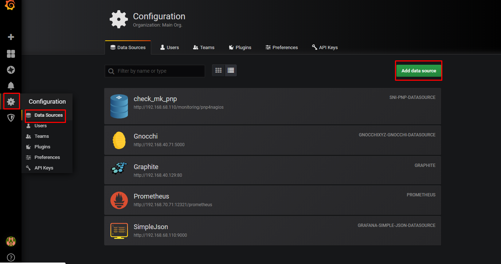
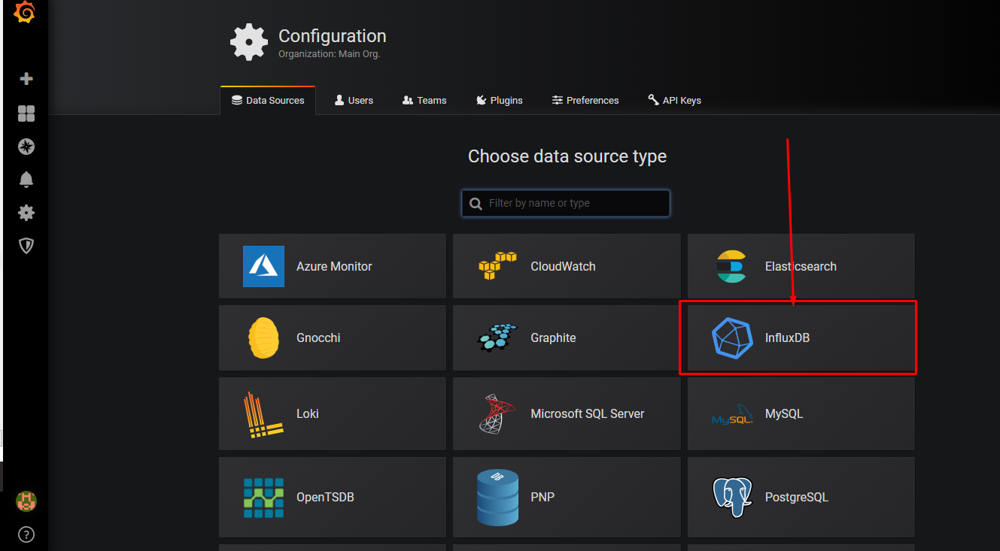
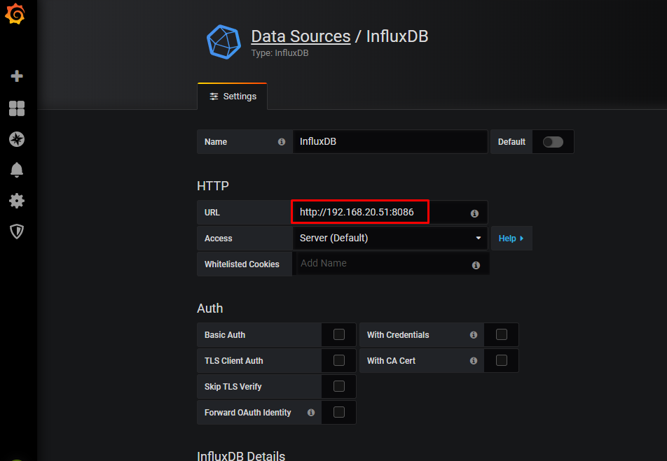
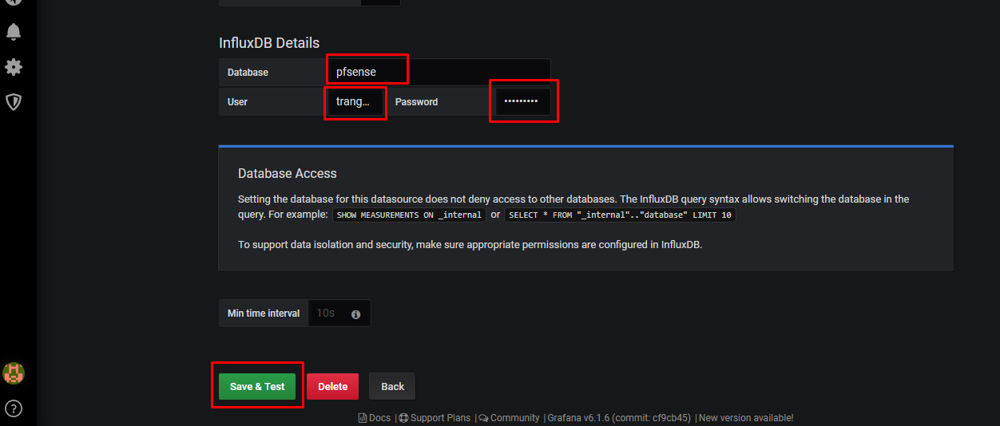
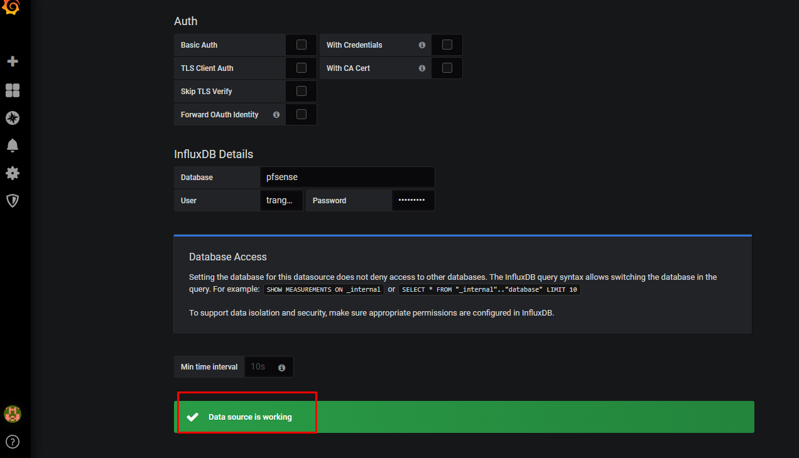
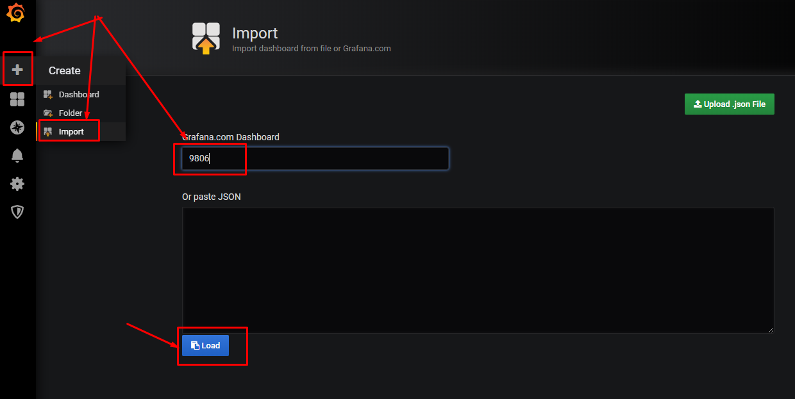
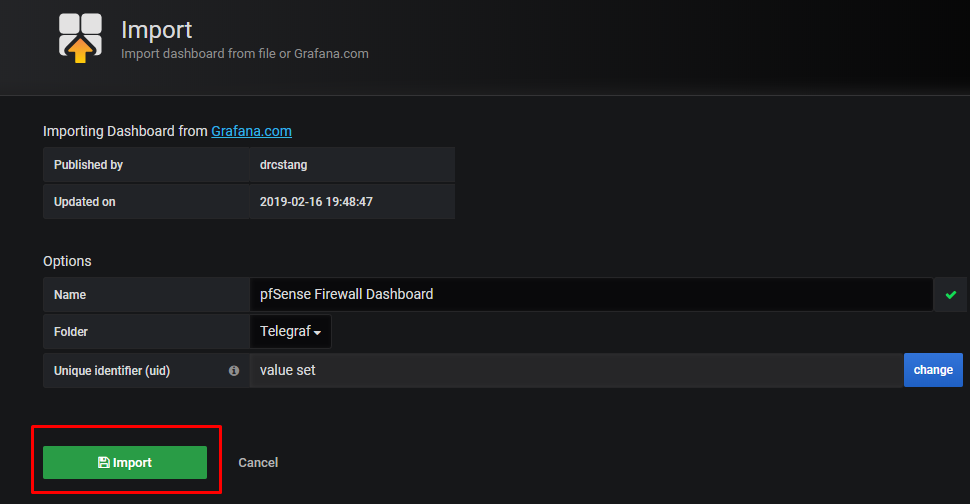
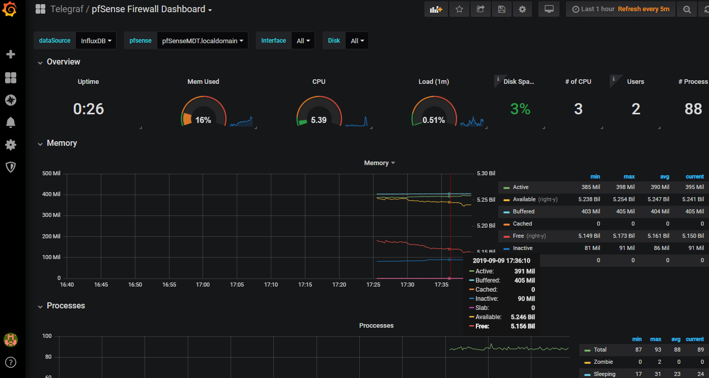
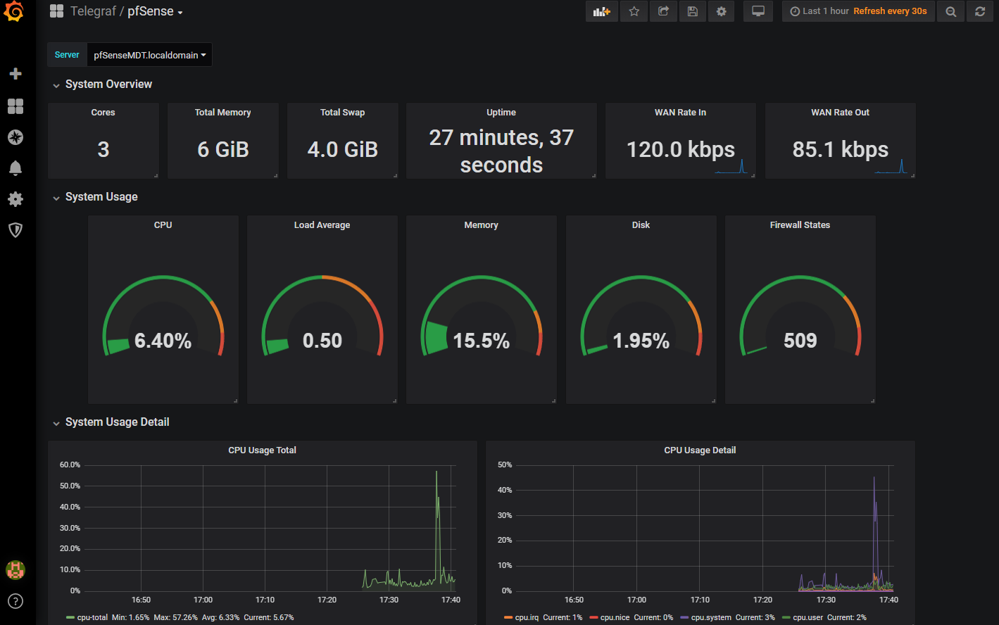

# How to monitor PfSense with TIG stack (Telegraf, InfluxDB, and Grafana) on CentOS 7 

The data flow is as follows:

```sh
pfSense -> Telegraf (gather metrics) -> InfluxDB (store metrics) -> Grafana (render graphs)
```

## Step 1 — Adding Repository on Server CentOS 7

Create file `/etc/yum.repos.d/influxdata.repo`

```sh
[influxdb]
name = InfluxData Repository - RHEL $releasever
baseurl = https://repos.influxdata.com/rhel/$releasever/$basearch/stable
enabled = 1
gpgcheck = 1
gpgkey = https://repos.influxdata.com/influxdb.key
```

## Step 2 -  Installing InfluxDB and Configuring Authentication

```sh
sudo yum install influxdb -y
sudo systemctl start influxdb
sudo systemctl enable influxdb
``` 

Start InfluxDB console and Create a new admin user

```sh
influx
create database pfsense
CREATE USER "trangnth" WITH PASSWORD 'trang1234' WITH ALL PRIVILEGES
show users
show database
exit
```

Edit config file `/etc/influxdb/influxdb.conf`

```sh
...
    [http]
      # Determines whether HTTP endpoint is enabled.
      # enabled = true

      # The bind address used by the HTTP service.
      # bind-address = ":8086"

      # Determines whether HTTP authentication is enabled.
      auth-enabled = true
...
```

Restart the InfluxDB service:

```sh
systemctl restart influxdb
```

Start InfluxDB console with command

```sh
influx -username trangnth -password trang1234
> use pfsense
Using database pfsense
> show users
user     admin
----     -----
trangnth true
> exit
```


## Step 2: Install Telegraf on pfSense

SSH to pfsense and select option 8 

* Download Telegraf

```sh
pkg add wget https://pkg.freebsd.org/freebsd:11:x86:64/latest/All/telegraf-1.4.4.txz
echo 'telegraf_enable=YES' >> /etc/rc.conf
```

* Edit file `/usr/local/etc/telegraf.conf`

```sh
[[outputs.influxdb]]
  urls = ["http://192.168.20.51:8089"]
  ...
  database = "pfsense"
  ...
  username = "trangnth"
  password = "trang1234"
  
[[inputs.net]]
  interfaces = ["wan"]
```

* Start Telegraf

```sh
cd /usr/local/etc/rc.d
./telegraf start
```

**NOTE**: recommend using web interface to config

## Step 3: Install Grafana

https://github.com/trangnth/Monitor/blob/master/Collectd-Graphite-Grafana/InstallationCentOS7.md

## Step 4: Add datasource and Dashboard in Grafana

* Open your web browser and login to grafana

* Click the 'Add data source' button to add the influxdb data source.

 



* Type details about the influxdb server configurations 

	* `192.168.20.51`: IP InfluxDB running
	* Datasource: pfsense
	* User: trangnth
	* Password: trang1234





* Click the 'Save and Test' button and make sure you get the **Data source is working** result.




## Step 5: Add dashboard

* Using two dashboard:

https://grafana.com/grafana/dashboards/10095

https://grafana.com/grafana/dashboards/9806










