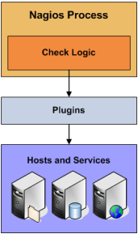
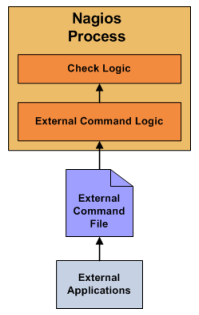

# Active check và passive check

## Active checks

Nagios có thể monitoring hots và services theo hai cách: actively và passively. Active check là một cách thức chung để monitoring hosts và services. Active checks có các tính năng chính sau:

* Active checks được bắt đầu bởi Nagios process
* Active checks được chạy thường xuyên theo lịch

Active checks được bắt đầu bằng kiểm tra logic trong daemon Nagios. Khi Nagios cần check status của hosts hoặc services, nó sẽ thực thi một plugin và gửi thông tin về những thông tin mà nó cần. Các plugin sẽ check trạng thái của host hoặc service và báo cáo kết quả kết quả cho Nagios deamon. Nagios sẽ xử lý kết quả này và đưa qua hành động thích hợp và cần thiết nhất (send notifications, run event handlers,...)

Active checks đưuọc thực thi khi:
* Đều đặn với một khoảng thời gian nhất định, được định nghĩa bởi check_interval and retry_interval trong host hoặc service của bạn.
* Theo yêu cầu khi bạn cần

Kiểm tra thường xuyên (được đặt lịch theo định kỳ) sẽ được định nghĩa trong một khoảng thời gian nhất định check_interval or the retry_interval trên hosts và services, phụ thuộc vào loại state của nó là gì. Nếu trạng thái của nó là HARD state, nó sẽ chủ động check trong mỗi khoảng thời gian là check_interval. Nếu là SOFT state, nó sẽ checked với intervals là retry_interval.

Check theo yêu cầu (On-deamand) được thực hiện bất cứ khi nào Nagios thấy cần phải có được thông tin trang thái về host và services. Ví dụ, Khi Nagios xác định được [reachability](https://assets.nagios.com/downloads/nagioscore/docs/nagioscore/3/en/networkreachability.html) của host, nó sẽ thường thực hiện on-demand checks của hosts parent và child để xác định chính xác status của một network segment cụ thể. On-deamand checks cũng sẽ xảy ra khi [predictive dependency check](https://assets.nagios.com/downloads/nagioscore/docs/nagioscore/3/en/dependencychecks.html) đảm bảo Nagios có thông tin trạng thái chính xác nhất.

## Passive Checks

Hầu hết các trường hợp bạn sẽ sử dụng Nagios để monitor hosts và services được sử dụng thường xuyên với active checks. Active checks thường "poll" (thăm dò) một host và service để lấy thông tin trạng thái thường xuyên. Nagios cũng hỗ trợ một cách để monitor hosts một các thụ động (passively) thay vì chủ động (actively). 

Một số tính năng chính của passive checks là:

* Passive checks được bắt đầu và thực hiện bởi applications/processes bên ngoài.
* Passive check results được submit tới Nagios để sử lý.

Sử khác biệt chính giữa Passive và Active checks là active checks được sinh ra và thực hiện bởi Nagios, còn passive checks được thực hiên bởi các ứng dụng bên ngoài.

Passive checks rất hữu ích cho việc monitor các services:

* Về bản chất là không đồng bộ và không thể được giám sát hiệu quả bằng cách `polling` status của họ một các thường xuyên
* Nằm phía sau firewall và không thể check được một cách chủ động từ monitoring host.

Chi tiết hơn về việc hoạt động của passive checks:

* Một external app checks status của host hoặc service
* External application viết kết quả của check [external command file](https://assets.nagios.com/downloads/nagioscore/docs/nagioscore/3/en/configmain.html#command_file).
* Lần đọc external command file tiếp theo của Nagios nó sẽ đặt kết quả của tất cả các passive checks vào hàng đợi và xử lý sau. Kết quả từ passive checks và active checks sẽ được lưu trên cùng một hành đợi
* Nagios sẽ thực thi định kỳ `check result reaper event` và scan hàng đợi kết quả. Mỗi một kết quả trong hàng đợi sẽ được xử lý cùng một cách thức, bất kể nó là kết quả của passive checks hay active checks. Nagios sẽ đưa ra một thông báo, log alerts,... phụ thuộc vào thông tin trong check result.

[see more...](https://assets.nagios.com/downloads/nagioscore/docs/nagioscore/3/en/passivechecks.html)