# Check_MK BI (Business Intelligence)

Xem giới thiệu BI ở đây https://mathias-kettner.de/checkmk_bi.html

Dưới đây tôi sẽ cho các bạn xem một ví dụ về BI

Đầu tiên ở giao diện `WATO` chọn `Business Intelligence` 

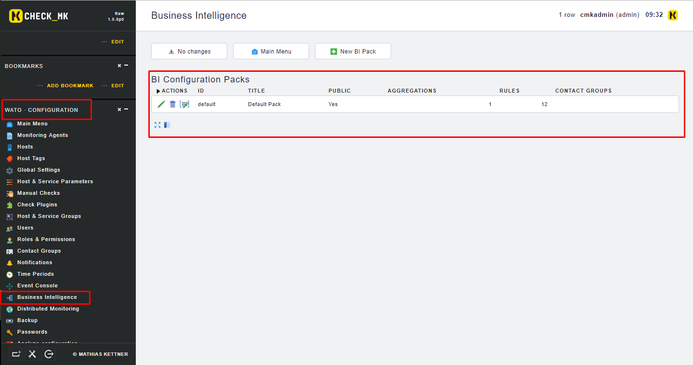

Bạn sẽ nhìn thấy các BI Pack được cấu hình ở đây, mặc định sẽ có sẵn một Pack. Giờ chúng ta sẽ thử tạo một cái mới:

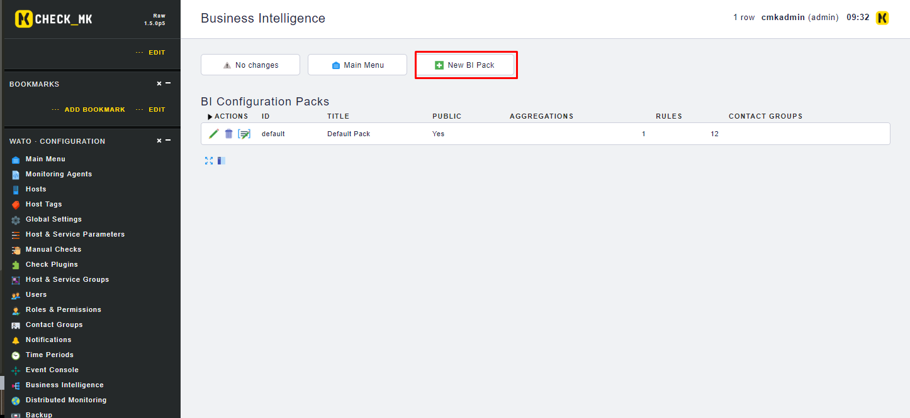

Điền các thông tin cần thiết và nhấn `create` để tạo

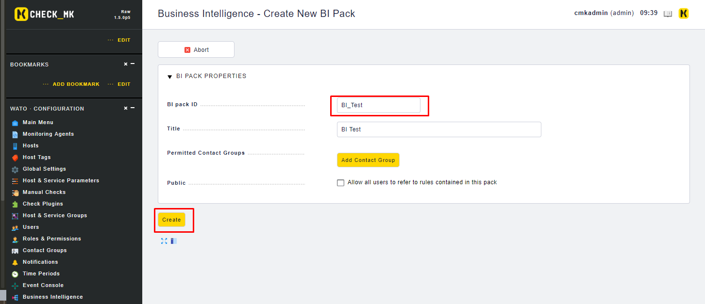

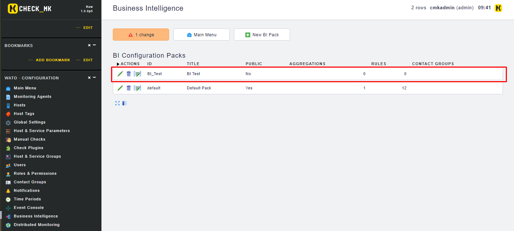

Đừng active change vội nhé, chúng ta sẽ tiếp tục tạo các rule trong BI Pack này: 

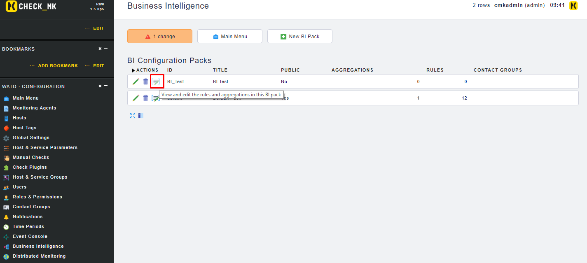

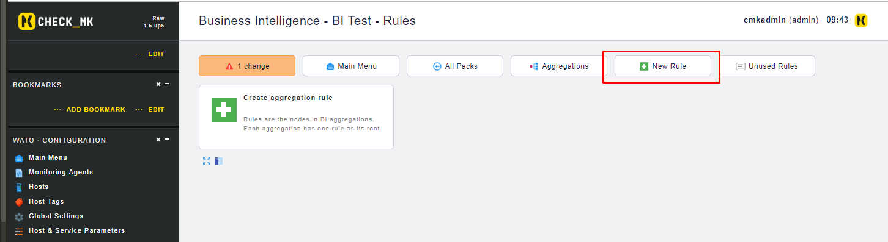

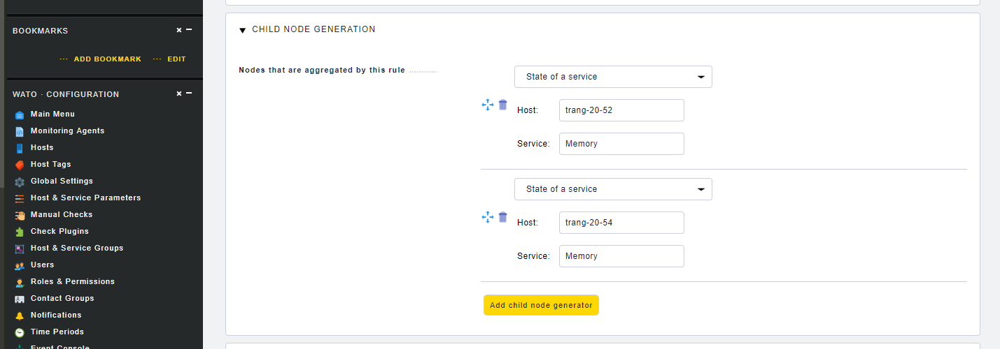

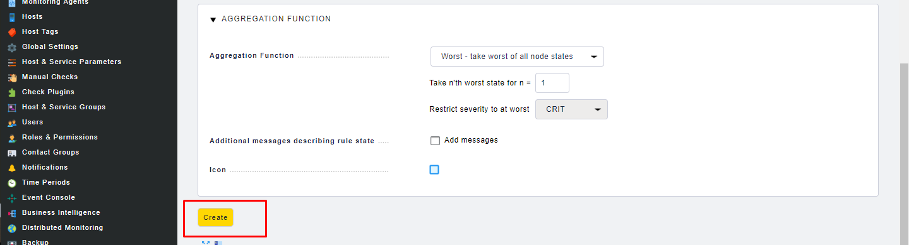

Như hình dưới đây ta đã tạo được một rule

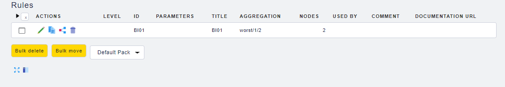

Ta tiếp tục tạo thêm một vài rule nữa:

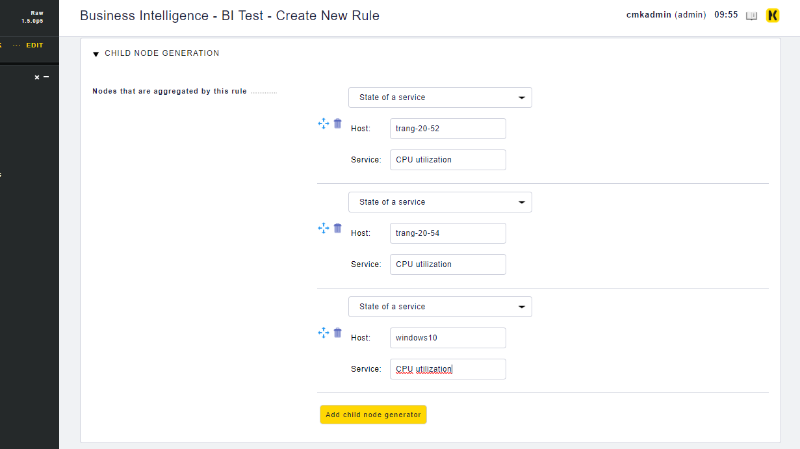

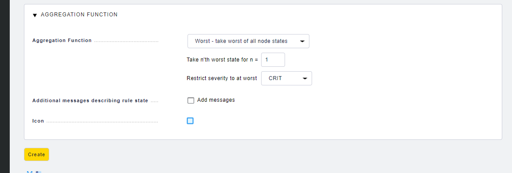

Tạo thêm một cái nữa:

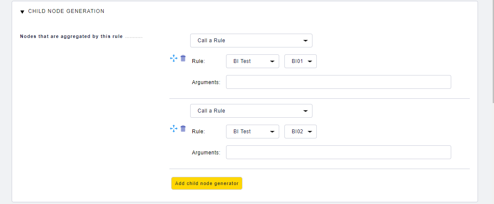

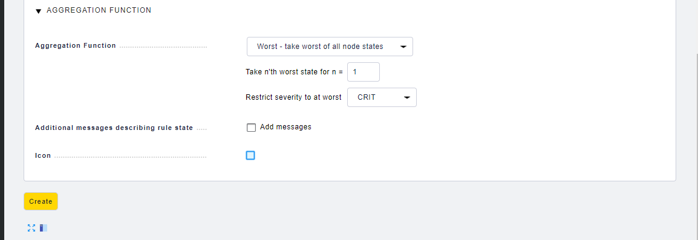

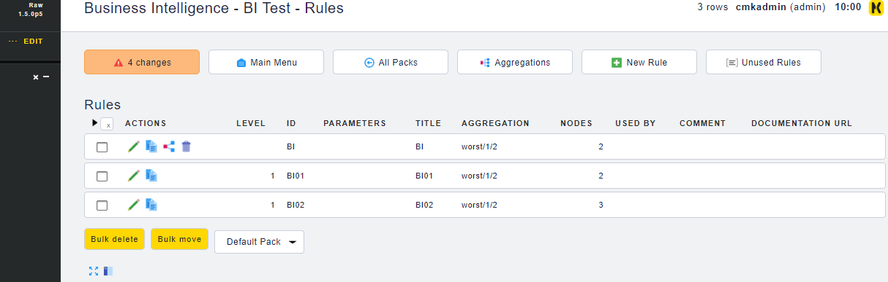

Tiếp theo ta sẽ định nghĩa một Aggregation

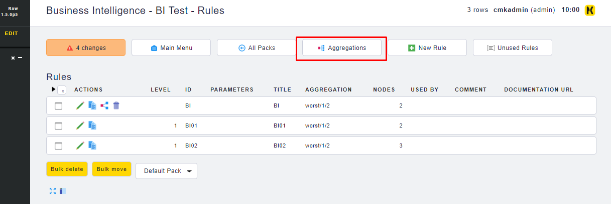

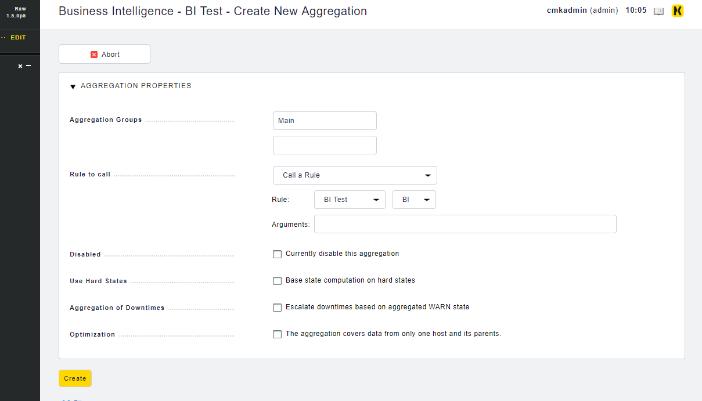

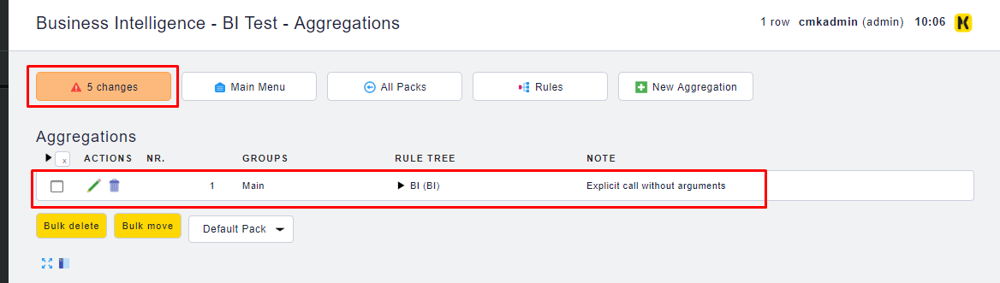

Giờ thì hãy active changes và đi xem kết quả thôi:

Vào `VIEWS` -> `Business Intelligence` -> `All Aggregation`, ta sẽ thấy Aggregation mà mình vừa tạo

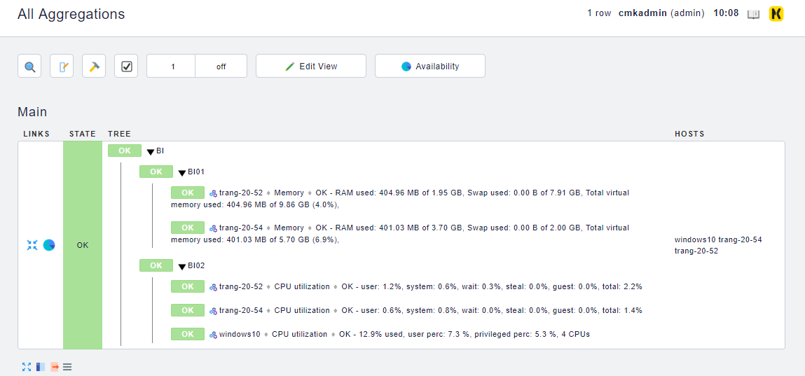

## Tham khảo

https://mathias-kettner.de/checkmk_bi_rules.html

https://truepath.zendesk.com/hc/en-us/articles/115005488806-Detailed-Reports-On-B-I-Aggregates-In-Check-MK

https://mathias-kettner.de/checkmk_bi_example.html