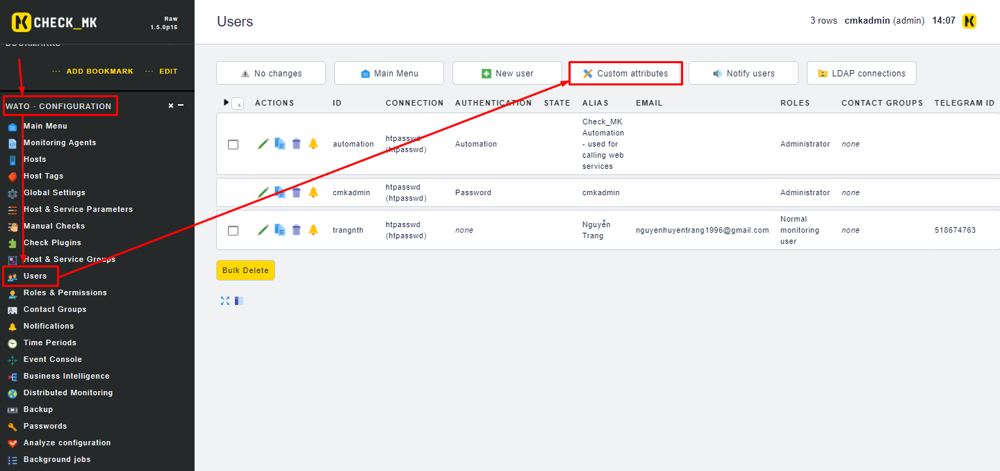
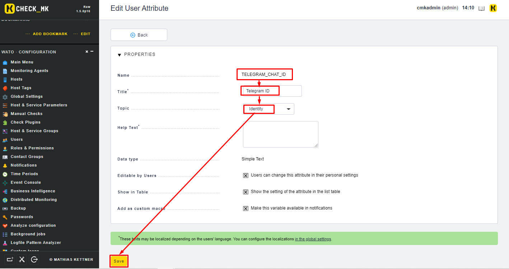
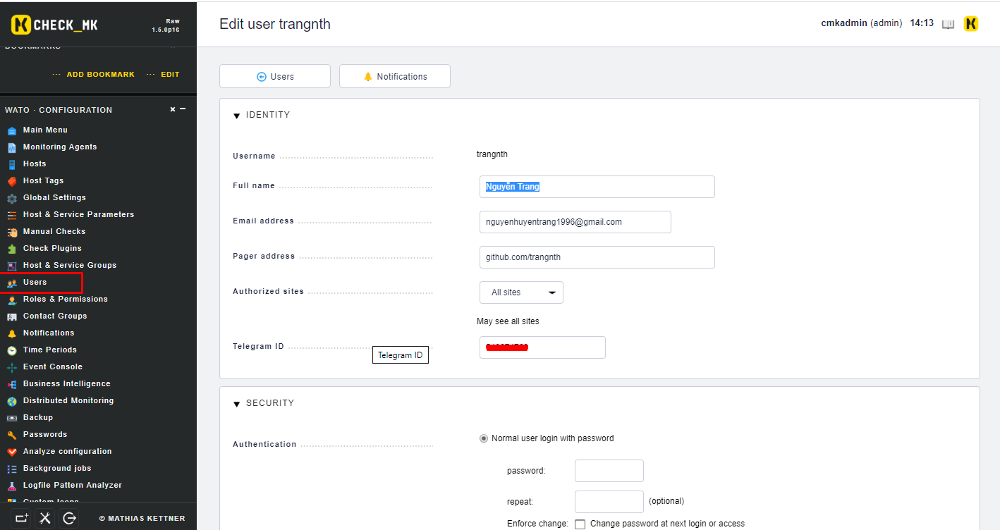
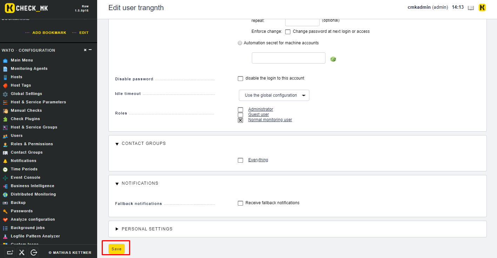
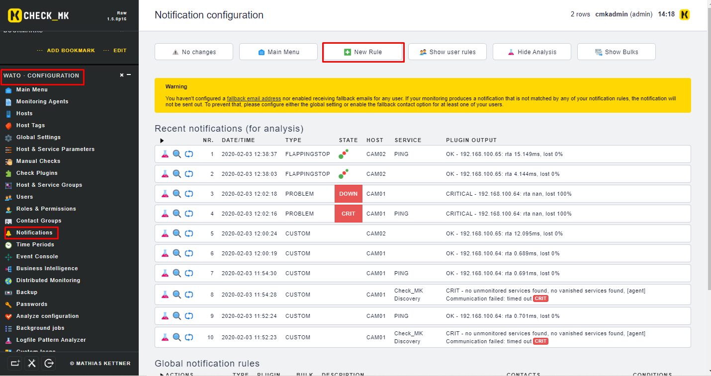
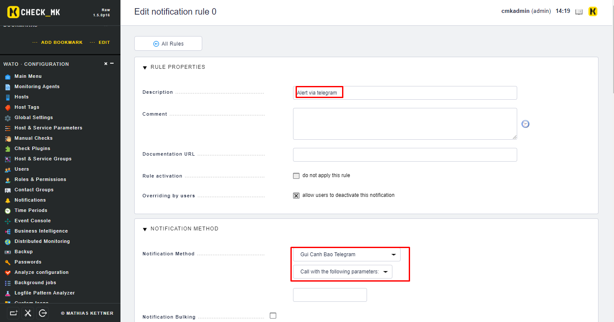
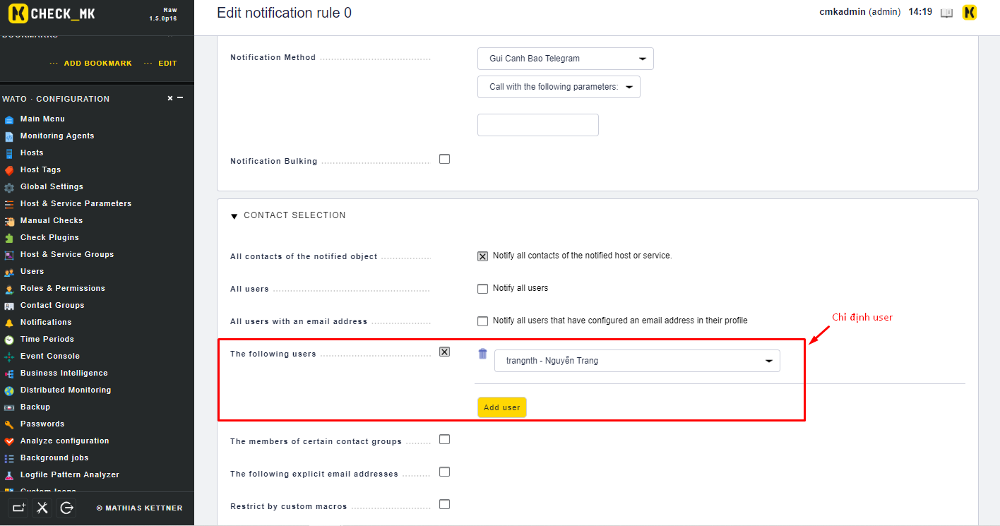

# Hướng dẫn cấu hình check_mk cảnh báo qua telegram

## 1. Chuẩn bị 

Chuẩn bị các thông tin về telegram:

* Telegram ID của user muốn nhận thông báo
* Token của bot được dùng để gửi cảnh báo cho người dùng (bot được tạo và quản lý bởi BotFather)

## 2. Cấu hình check_mk


### Tạo script

* Tạo một script cho Notification `/omd/sites/monitoring/share/check_mk/notifications/telegram.py`

```python 
#!/usr/bin/env python
# Gui Canh Bao Telegram
import json
import requests
import os

TOKEN = "your_token"
URL = "https://api.telegram.org/bot{}/".format(TOKEN)


def get_url(url):
    response = requests.get(url)
    content = response.content.decode("utf8")
    return content


def get_json_from_url(url):
    content = get_url(url)
    js = json.loads(content)
    return js


def get_updates():
    url = URL + "getUpdates"
    js = get_json_from_url(url)
    return js


def get_last_chat_id_and_text(updates):
    num_updates = len(updates["result"])
    last_update = num_updates - 1
    text = updates["result"][last_update]["message"]["text"]
    chat_id = updates["result"][last_update]["message"]["chat"]["id"]
    return (text, chat_id)


def send_message(text, chat_id):
    url = URL + "sendMessage?text={}&chat_id={}".format(text, chat_id)
    get_url(url)


#text, chat = get_last_chat_id_and_text(get_updates())
#send_message(text, chat)
mess = os.environ['NOTIFY_LASTSERVICESTATE']+ '->' + os.environ['NOTIFY_SERVICESTATE'] + ' Host:' + os.environ['NOTIFY_HOSTNAME'] + ' IP:' + os.environ['NOTIFY_HOSTADDRESS'] + ' Service:' + os.environ['NOTIFY_SERVICEDESC'] + ' Time:' + os.environ['NOTIFY_SHORTDATETIME']
send_message(mess, os.environ['NOTIFY_CONTACT_TELEGRAM_CHAT_ID'])
```

* Chú ý: cần thay đổi token trong file script bằng token lấy được của từ BotFather.

* Phần quyền cho script và khởi động lại omd:

```sh
chmod +x /omd/sites/monitoring/share/check_mk/notifications/telegram.py
omd restart
```

### Tạo một Attributes cho User



* Tạo một Attribute mới 



### Tạo một User mới hoặc chỉnh sửa thông tin của các user có sẵn



* Điền Telegram của user tương ứng vào phần bị bôi đỏ như trên



* Nhấn `Save` để lưu lại thông tin

### Tạo một rule mới trong phần Notification 



* Điện các thông tin để tạo Rule





* Nhấn `Save` để lưu lại

* Hoàn tất quá trình cấu hình


