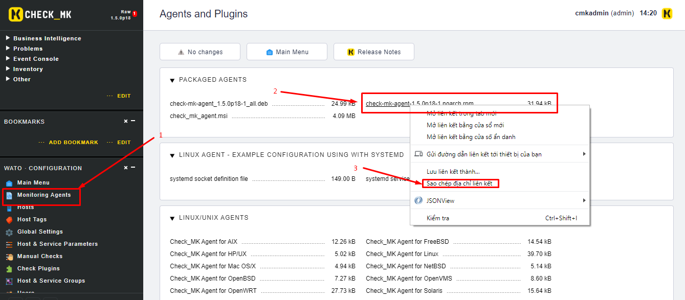
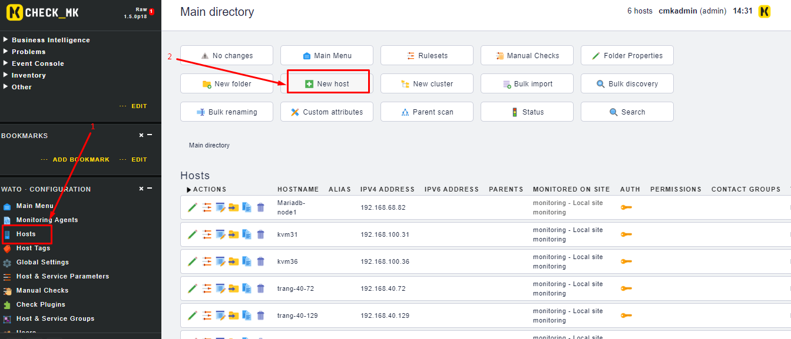
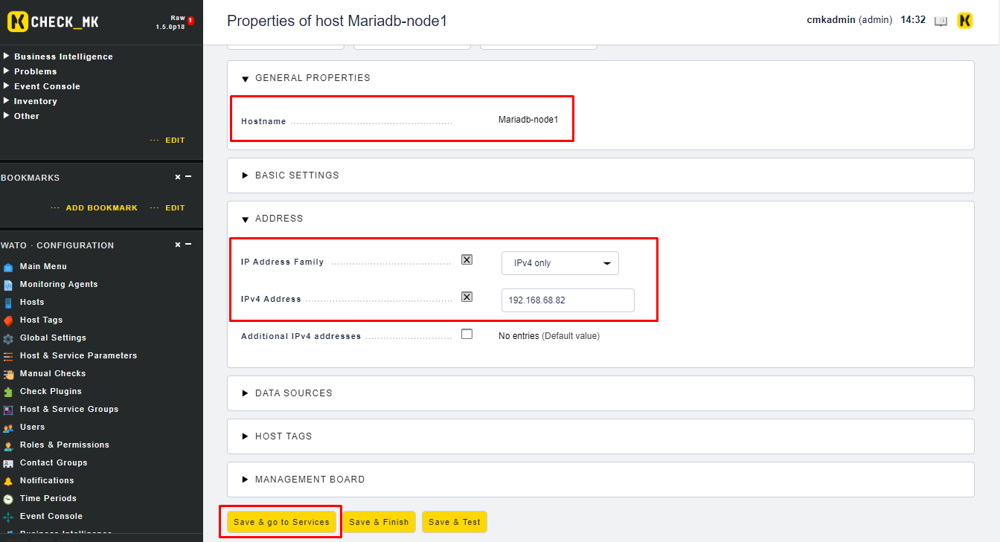
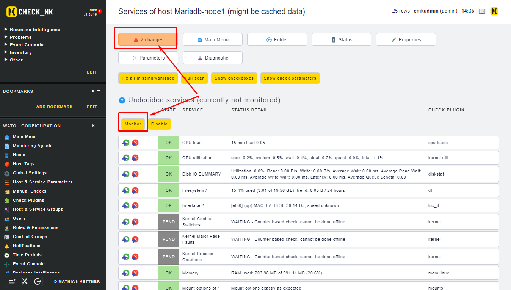
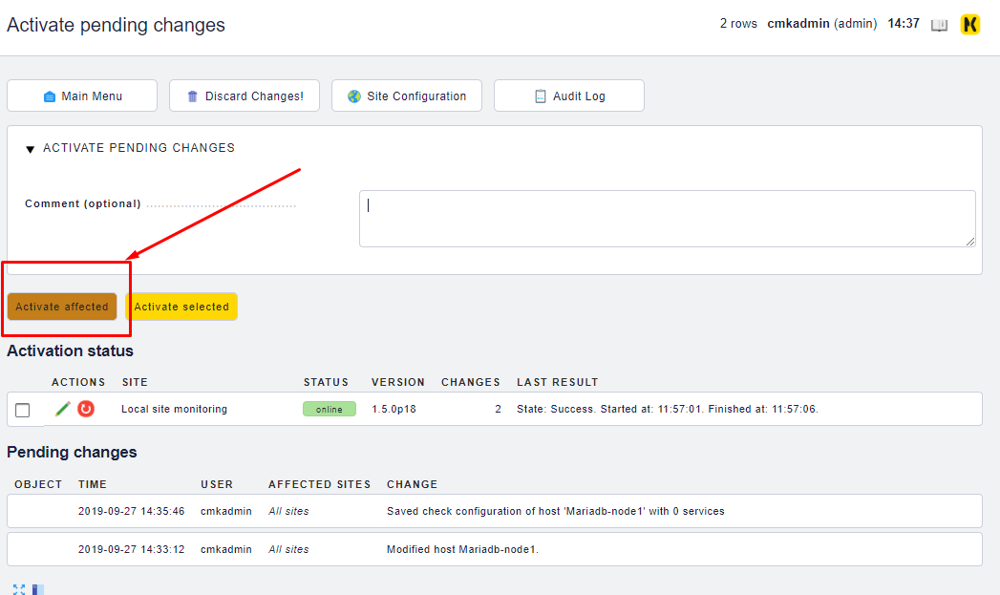
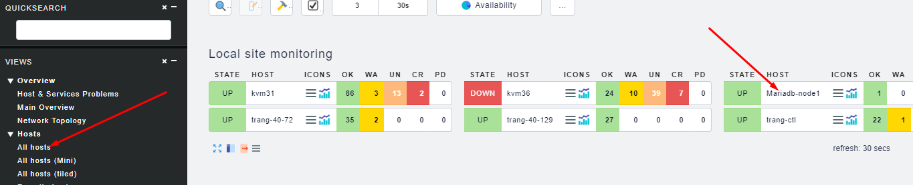
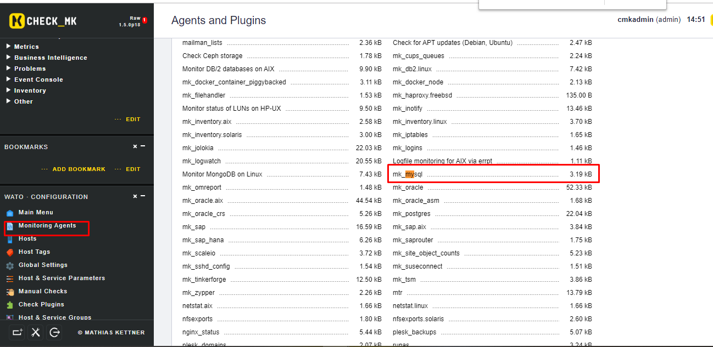
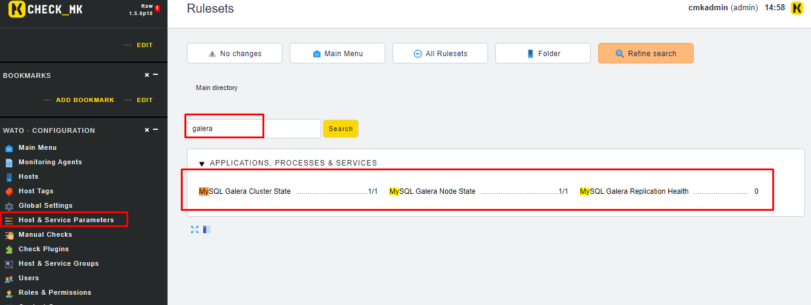
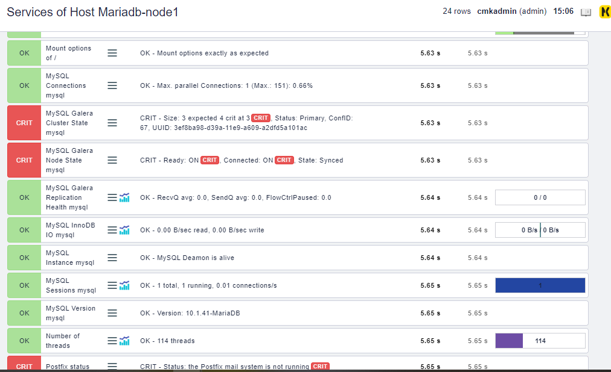

## CheckMK check Galera Cluster

Mô tả: Sử dụng CheckMK để giám sát các thông số của Galera cluster trên CentOS7

### Bước 1: Thực hiện cài đặt checkmk agent trên node Database 

[Tham khảo](https://github.com/thaonguyenvan/meditech-ghichep-omd/blob/master/docs/2.Install-agent.md#1)

* Đầu tiên, thực hiện truy cập vào web checkmk của bạn đã được cài đặt, ví dụ ở đây tôi đã cài đặt một checkmk server có link là: http://192.168.40.129/monitoring. Thực hiện tiếp các bước như sau:



* Thực hiện lệnh sau trên Galera node để tải gói về và cài đặt

```sh
wget http://192.168.40.129/monitoring/check_mk/agents/check-mk-agent-1.5.0p18-1.noarch.rpm
yum install xinetd -y
systemctl start xinetd
systemctl enable xinetd
rpm -ivh check-mk-agent-*
```

* Chỉnh sửa file cấu hình xinetd tương tự như sau `/etc/xinetd.d/check_mk`:

```sh
service check_mk
{
        type           = UNLISTED
        port           = 6556
        socket_type    = stream
        protocol       = tcp
        wait           = no
        user           = root
        server         = /usr/bin/check_mk_agent

        # configure the IP address(es) of your Nagios server here:
        only_from      = 127.0.0.1 10.0.20.1 10.0.20.2 192.168.0.0/16
        log_on_success =

        disable        = no
}
```

Khởi động lại dịch vụ trên node:

```sh
systemctl restart xinetd
netstat -npl | grep 6556
```

Nếu firewall đang được bật thì thực hiện lệnh sau để mở port cho checkmk

```sh
firewall-cmd --add-port=6556/tcp --permanent
firewall-cmd --reload
setenforce 0
```

Chỉnh sửa file cấu hình của SELinux `/etc/sysconfig/selinux`:

```sh
SELINUX=disabled
```

### Bước 2: Thực hiện add host trên web của checkmk

* Add thêm host vào để check_mk giám sát



* Điền thông tin host và lưu lại 



* Nếu các service chưa được monitor thì `monitor` sau đó chọn vào `changes` để áp dụng thay đổi 







* Sau đó chọn phần `Views` -> `Hosts` sẽ thấy host mới được thêm vào


### Bước 3: Cấu hình cài đặt plugin trên checkmk server 

* Tải gói galera cluster mkp về và cài đặt

```sh
wget https://checkmk.com/check_mk-exchange-download.php?file=mysql_galera_cluster-1.1.mkp
mkp install mkp install check_mk-exchange*
```

* Kiểm tra lại bằng lệnh 

```sh
mkp list
```

### Bước 4: Cấu hình plugin trên phía galera node

Trên checkmk web, tải file `mk_mysql` về galera node



```sh
wget http://192.168.40.129/monitoring/check_mk/agents/plugins/mk_mysql
mv mk_mysql /usr/lib/check_mk_agent/plugins
chmod +x /usr/lib/check_mk_agent/plugins/mk_mysql
```

Khởi động lại xinetd:

```sh
systemctl restart xinetd
```

### Bước 5: Cấu hình các service trên Check_mk web cho host

Ta có thể tìm thấy các service mới được thêm vào checkmk từ plugin mkp đã cài bên trên như sau:



Thêm các rule và thực hiện Discovery để add các service mới.




