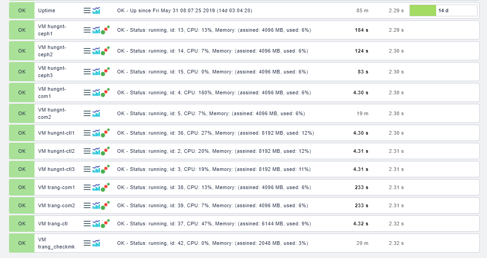
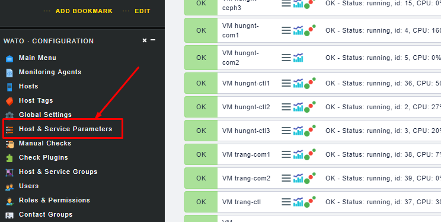
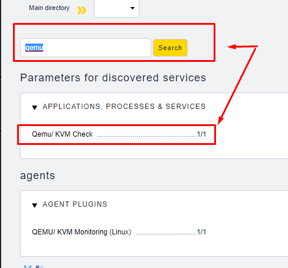
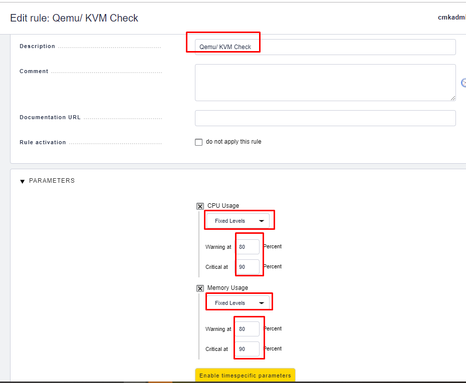
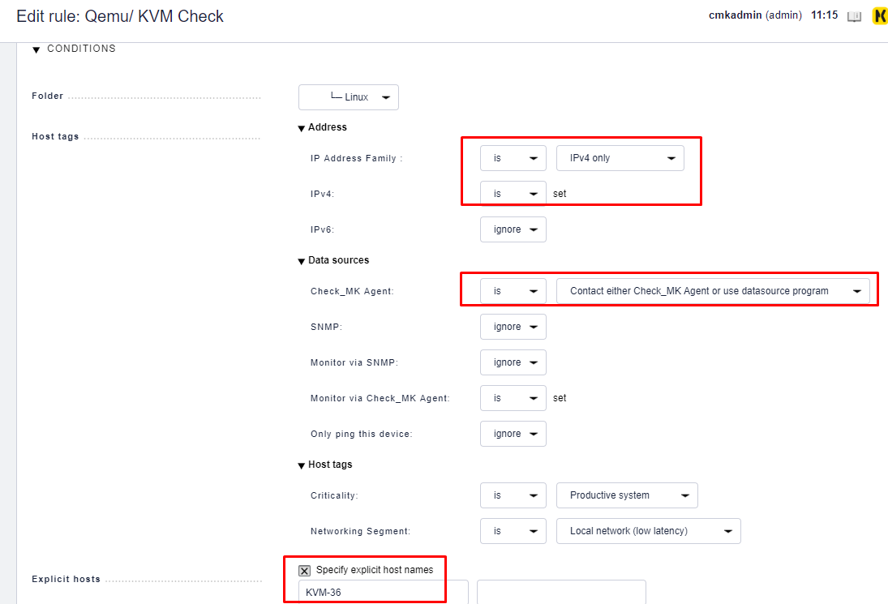
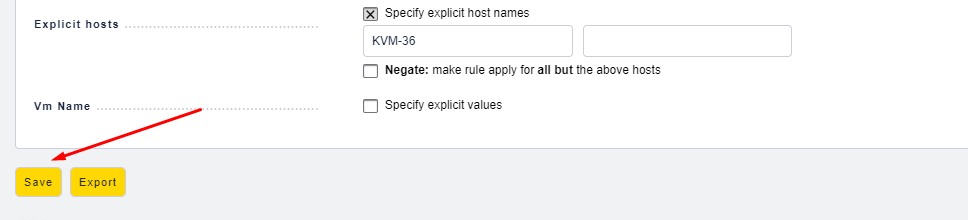
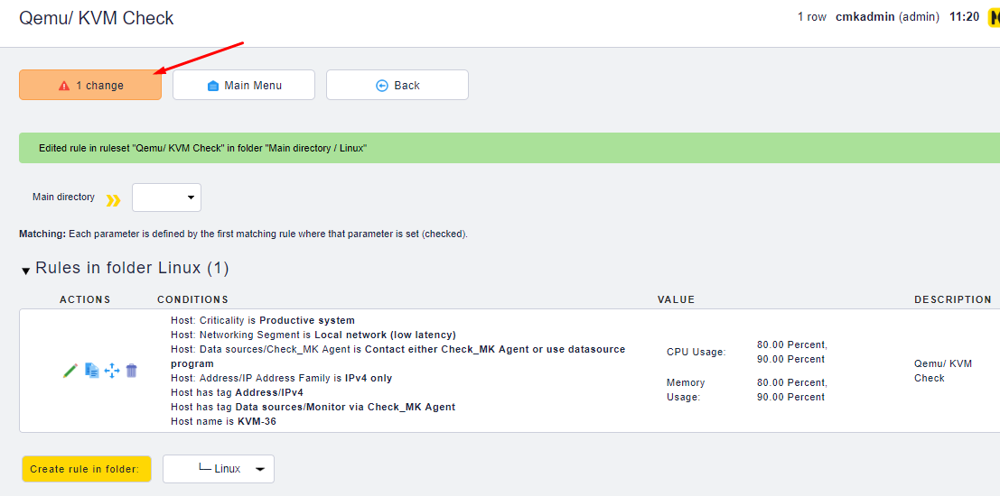

## Checkmk + Qemu-KVM

Hướng dẫn cấu hình Check_mk get info về ram, cpu của các VM trên KVM

**Bước 1**: Cài đặt gói mkp trên check_mk server 

```sh
cd /opt
wget https://checkmk.com/check_mk-exchange-download.php?file=qemu-1.0.mkp
su monitoring
mkp install /opt/check_mk-exchange-download.php\?file\=qemu-1.0.mkp
mkp list
```

**Bước 2:** Trên client, tạo một file script để thực hiện lấy các thông tin của các instance:

Kiểm tra thư mục local để đặt script

```sh
[root@mdt-server36 ~]# check_mk_agent | head
<<<check_mk>>>
Version: 1.5.0p16
AgentOS: linux
Hostname: mdt-server36
AgentDirectory: /etc/check_mk
DataDirectory: /var/lib/check_mk_agent
SpoolDirectory: /var/lib/check_mk_agent/spool
PluginsDirectory: /usr/lib/check_mk_agent/plugins
LocalDirectory: /usr/lib/check_mk_agent/local
<<<df>>>
```

Đặt script vào thư mục 	`/usr/lib/check_mk_agent/local`

```sh
cd /usr/lib/check_mk_agent/local
wget https://raw.githubusercontent.com/Bastian-Kuhn/Check_MK-Treasures/master/qemu/src/agents/plugins/qemu
chmod +x qemu
```

Update script:

```sh
# updated formating:
# Bastian Kuhn 08/2018

# updated by
# MinhKMA 06/2019

if which virsh >/dev/null; then
    echo '<<<qemu>>>'
    virsh list | grep -v 'State' | grep -v '^--' | grep -v '^$' | while read L
    do
            ID=$(echo $L | awk '{print $1}')
            NAME=$(echo $L | awk '{print $2}')
            STATE=$(echo $L | awk '{print $3}')
            NUM_VCPU=$(virsh dominfo $NAME | grep 'CPU(s)' | awk '{print $2}')
            MEM=$(virsh dominfo $NAME | grep 'Used memory' | awk '{print $3}')
            let MEM=MEM/1024
            PID=$(ps aux | grep kvm | grep $NAME | awk '{print $2}')
            if [ $PID -gt 0 ]; then
                    DATA=$(top -p $PID -n 1 -b | tail -1  | awk -- '{print $9" "$10}')
                    CPU=$(top -p $PID -n 1 -b | tail -1  | awk -- '{print $9}')
                    AVG_CPU=$(awk -v CPU=$CPU -v NUM_VCPU=$NUM_VCPU 'BEGIN { print  ( CPU / NUM_VCPU ) }')
                    RAM=$(top -p $PID -n 1 -b | tail -1  | awk -- '{print $10}')
            else
                    DATA=""
                    AVG_CPU=""
                    RAM=""
            fi
            echo $ID" "$NAME" "$STATE" "$MEM" "$AVG_CPU" "$RAM
    done
fi
```


Chạy thử script:

```sh
[root@mdt-server36 local]# ./qemu
<<<qemu>>>
2 hungnt-ctl2 running 8192 113.3 12.3
3 hungnt-ctl3 running 8192 100.0 10.9
4 hungnt-com1 running 4096 60.0 6.0
5 hungnt-com2 running 4096 6.7 6.1
13 hungnt-ceph1 running 4096 33.3 6.0
14 hungnt-ceph2 running 4096 26.7 5.9
15 hungnt-ceph3 running 4096 20.0 6.1
36 hungnt-ctl1 running 8192 31.2 11.9
37 trang-ctl running 6144 146.7 9.4
38 trang-com1 running 4096 6.7 6.2
39 trang-com2 running 4096 6.7 5.5
42 trang_checkmk running 2048 0.0 3.1
```

**Bước 3:** Kiểm tra trên web check_mk



**Bước 4:** Thiết lập các ngưỡng cảnh báo, thực hiện trên Wato theo các bước sau:





* Tạo một rule mới 





* Lưu rule lại, và check lại các service trên host






### Edit plugin to check Network và tốc độ đọc ghi của disk

Sửa file trên server `/omd/sites/monitoring/local/share/check_mk/checks/qemu` như [ở đây](script/check_mk-qemu-agent.sh)

Sửa file trên client như [ở đây](script/check_mk-qemu-server.py)


## Tham khảo

[1] https://checkmk.com/check_mk-exchange-file.php?&file=qemu-1.0.mkp

[2] https://github.com/Bastian-Kuhn/Check_MK-Treasures/tree/master/qemu

Check Network, Disk

[3] https://forum.ivorde.com/linux-script-for-interface-network-bandwidth-monitoring-t19764.html\

[4] https://serverfault.com/questions/296674/bandwidth-monitoring-on-kvm