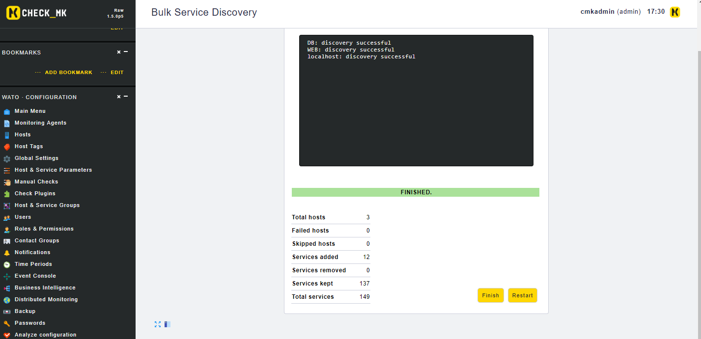
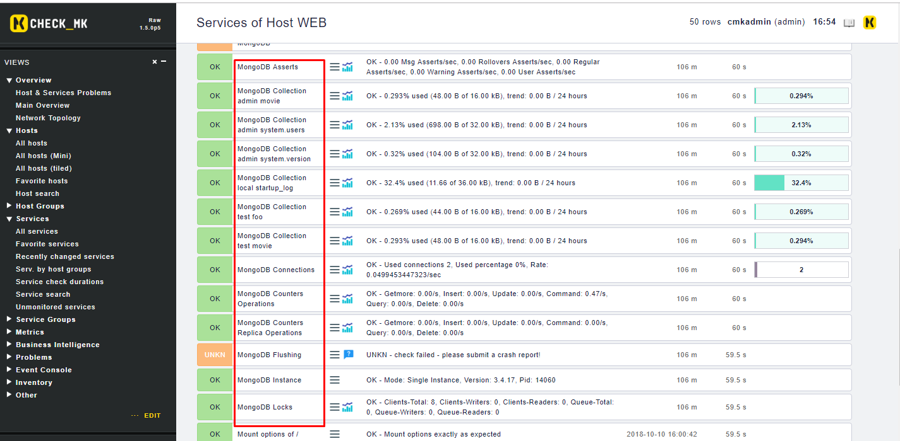

# Check_MK Monitoring MongoDB 

## Requirements 

OMD server:

	OS: CentOS 7
	MongoDB
	IP: 192.168.20.53

Agent:
	
	OS: CentOS 7
	Python 2.7
	MongoDB
	IP: 192.168.20.54

### Install MongoDB 

#### Adding the MongoDB Repository

Tạo một file mới 

	sudo vi /etc/yum.repos.d/mongodb-org.repo

Thêm vào nó các dòng sau:

```sh
mongodb-org-3.4]
name=MongoDB Repository
baseurl=https://repo.mongodb.org/yum/redhat/$releasever/mongodb-org/3.4/x86_64/
gpgcheck=1
enabled=1
gpgkey=https://www.mongodb.org/static/pgp/server-3.4.asc	
``` 

#### Installing MongoDB

Chúng ta có thể cài đặt gói mongo db-org từ repository của bên thứ ba bằng `yum`

	sudo yum install mongodb-org
	sudo systemctl start mongod

Kiểm tra log 

	$ sudo tail /var/log/mongodb/mongod.log

Output sẽ tương tự như sau:

	. . .
	[initandlisten] waiting for connections on port 27017

Thêm dòng sau vào cuối file `/etc/security/limits.d/20-nproc.conf`:

	. . .
	mongod soft nproc 32000

Khởi động lại dịch vụ:

	$ sudo systemctl restart mongod

#### Verifying Startup

Check trạng thái startup:

	$ systemctl is-enabled mongod; echo $?

Output
	
	. . .
	enabled
	0

	$ sudo systemctl enable mongod

## Monitoring MongoDB

### Config MongoDB

Sửa file `/etc/mongod.conf` dòng `bindIp` như sau:

	net:
	  port: 27017
	  bindIp: 0.0.0.0

Chỉnh sửa firewall

	$ firewall-cmd --permanent --add-port=27017/tcp
	$ firewall-cmd --reload

### Config Agent check

Download plugin từ server về:

	$ scp <username>@<ip_server>:/opt/omd/versions/1.5.0p5.cre/share/check_mk/agents/plugins/mk_mongodb /usr/lib/check_mk_agent/plugins/

Nhập password server của bạn vào.

Lưu ý: Nhớ thay thế `<username>` `<ip_server>` của bạn vào, và phiên bản check_mk tương ứng.

Chỉnh sửa lại plugin:

	$ vim /usr/lib/check_mk_agent/plugins/mk_mongodb

Sửa một số thông tin như sau:

```sh
...
# Line 27
host   = "192.168.20.54"
port   = 27017
...

# Comment line 38
#    con.admin.read_preference = pymongo.ReadPreference.SECONDARY
...

# Comment 3 line 120, 121, 122
#sys.stdout.write("average_ms %s\n" % server_status["backgroundFlushing"]["average_ms"])
#sys.stdout.write("last_ms %s\n" %    server_status["backgroundFlushing"]["last_ms"])
#sys.stdout.write("flushed %s\n" %    server_status["backgroundFlushing"]["flushes"])
...
```

Cài đặt thêm thư viện cho plugin:

	$ yum install python-pip
	$ pip install --upgrade pip
	$ python -m pip install pymongo

Chạy thử plugin:

	$ python /usr/lib/check_mk_agent/plugins/mk_mongodb

Output:

```sh
...
local	startup_log	sleepMS	0
local	startup_log	totalIndexSize	36864
local	startup_log	maxSize	10485760
local	startup_log	capped	True
local	startup_log	nindexes	1
local	startup_log	storageSize	36864
local	startup_log	sleepCount	0
local	startup_log	size	11940
<<<logwatch>>>
[[[MongoDB startupWarnings]]]
<<<<>>>>
```

### Config check_mk

Lên giao diện của check_mk vào `WATO` -> `Hosts` sau đó chọn `Discovery` để tìm các service mới được monitor



Active change, sau đó ta sẽ được kết quả như sau:




## Tham khảo

https://www.digitalocean.com/community/tutorials/how-to-install-mongodb-on-centos-7
https://nobudgetadmin.blogspot.com/2016/07/how-to-quickly-install-checkmk-plugins.html
https://medium.com/mongoaudit/how-to-enable-authentication-on-mongodb-b9e8a924efac
https://docs.mongodb.com/manual/tutorial/enable-authentication/
https://www.mail-archive.com/checkmk-en@lists.mathias-kettner.de/msg23627.html