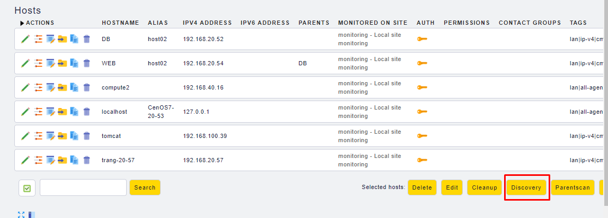

# Check_nk Nginx

https://mathias-kettner.de/cms_check_nginx_status.html

### Cài đặt nginx

	yum install nginx

Cấu hình trên CentOS7, thêm vào một site mới như sau:

```sh
$ vim /etc/nginx/nginx.conf
...
location /nginx_status {
    stub_status on;
    access_log off;
    allow 127.0.0.1;
    deny all;
}
...
```

Ví dụ file cấu hình của nginx [nginx.conf](conf/nginx.conf)

Khởi động lại dịch vụ

	systemctl restart nginx


Kiểm tra lại:

```sh
[root@localhost plugins]# wget -qO - http://127.0.0.1/nginx_status
Active connections: 1 
server accepts handled requests
 42 42 42 
Reading: 0 Writing: 1 Waiting: 0 
```

Nếu hiển thị như trên thì ok

### Cài đặt plugin

Copy file cấu hình plugin trên server về máy. Thường trên client, plugin được đặt tại `/usr/lib/check_mk_agent/plugins`, trên server được đặt tại `share/check_mk/agents`

Ví dụ rên server của tôi với phiên bản 1.5.0p5 dùng lệnh:

	scp /omd/versions/1.5.0p5.cre/share/check_mk/agents/plugins/nginx_status root@<your_ip_client_server:/usr/lib/check_mk_agent/plugins

Hoặc có thể xem ở đây [nginx_status](plugin/nginx_status)

Trên client chạy thử plugin:

```sh
$ cd /usr/lib/check_mk_agent/plugins
$ ./nginx_status
<<<nginx_status>>>
127.0.0.1 8008 Active connections: 1 
127.0.0.1 8008 server accepts handled requests
127.0.0.1 8008  5 5 4 
127.0.0.1 8008 Reading: 0 Writing: 1 Waiting: 0 
```

Nếu có một vài lỗi trong quá trình test, hay thử tạo một file `/etc/check_mk/nginx_status.cfg` với các dòng cấu hình servers, ví dụ `127.0.0.1:80`

### Discovery

Trên wen interface của check_mk, discovery lại các service 




