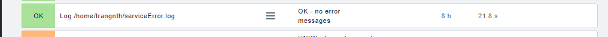
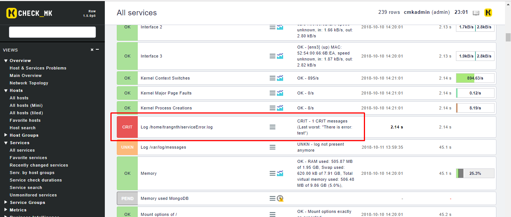
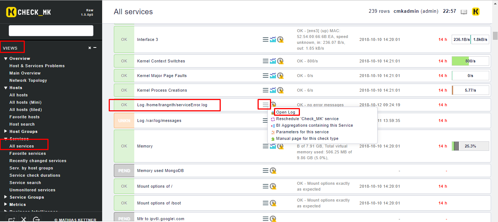
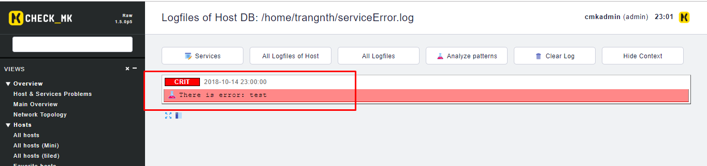
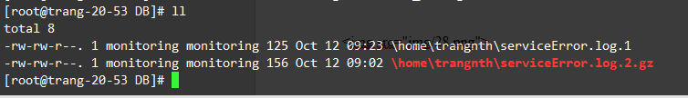
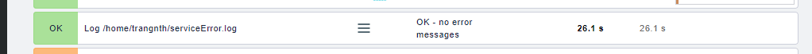

# Check_mk Logwatch

### Cấu hình Logwatch

Check log và báo lại mỗi lần log có từ `error`

Trên Linux Logfiles được giám sát bằng extension của check_mk_agent là `logwatch`.

Download `mk_lpgwatch` plugin về client từ server:

	$ scp <username>@<ip_server>:/opt/omd/versions/1.5.0p5.cre/share/check_mk/agents/plugins/mk_logwatch /usr/lib/check_mk_agent/plugins

Tạo một file config `/etc/check_mk/logwatch.cfg` trên agent với nội dung như sau:

```sh
/home/trangnth/serviceError.log maxlines=100 maxtime=10 overflow=W
 C [E,e]rror(.*)
 R There is error: \1
 W [W,w]anning*
 O accept*
```

*Lưu ý về định dạng của file.*

Giải thích sơ qua về file cấu hình trên:

* Dòng đầu tiên: 
	* File `/home/trangnth/serviceError.log`  đang được theo dõi
	* `maxlines` cấu hình về số lượng dòng log mới lớn nhất của file được chấp nhận check (còn lại sẽ bị drop) 
	* `maxtime` Thời gian lớn nhất cho việc parsing các dòng log mới
	* `overflow` Nếu vượt quá một trong hai thông số trên, một log giả mới sẽ được thêm vào để cảnh báo. Mặc định sẽ là Critical, nhưng cũng có thể được thiết lập là `W` hoặc `I`. `overflow=I` là để bỏ qua vấn đề này mà không thông báo gì.

* `C` Critical nếu bất cứ dong log nào thỏa mãn đoạn pattern phía sau
* Tương tự với `C` là `W`(Wanning), `O`(OK)
* Pattern: Ví dụ với pattern `[E,e]rror(.*)` sẽ bắt tất cả các dòng có từ error hoặc Error sẽ hiển thị trạng thái Critical
* `R` Rewrite: Hiển thị thông báo thay vì hiển thị dòng log là `There is error: ` cộng với *phần còn lại của log(phía sau từ error đầu tiên bắt được)*

Restart lại agent:

	service xinetd restart

Truy cập giao diện web của check_mk `Discovery` lại host



Test thử xem plugin đã chạy đúng chưa:

	echo "Error test" >> /home/trangnth/serviceError.log



Thêm một chút về logwatch, logwatch lưu và kiểm soát trạng thái của các file log thông qua một file `logwatch.state.local`. File này sẽ lưu lại vị trí đã được kiểm tra trước đó, nên sẽ dễ dàng tìm ra thời điểm có log mới từ lần check cuối cùng gần nhất.

```sh
$ vim logwatch.state.local

/var/log/messages|1030|2498923
/etc/check_mk/logwatch.cfg|94|1977070
```

### Cấu hình Logrotate

Vào `Views` chọn `Service`, kéo tới service mới thêm vào để xem log:



Tất cả các log sẽ được phân loại và hiển thị như sau



Và được lưu trữ trong `/omd/sites/monitoring/var/check_mk/logwatch/` theo từng host trên server 

```sh
$ ls /omd/sites/monitoring/var/check_mk/logwatch/
DB  localhost  WEB  win2008  windows10
```

Tiếp theo, chúng ta sẽ cấu hình rotate các file log này bằng lograte, mỗi một giờ một lần.

Ví dụ tôi sẽ tạo một file `/omd/sites/monitoring/etc/logrotate.d/logwatch` cấu hình như sau:

```sh
/omd/sites/monitoring/var/check_mk/logwatch/DB/*.log {
    missingok # Không thông báo lỗi nếu file log bị thiếu
    rotate 7 # Giữ lại nhiều nhất 12 tệp log cũ
    compress # Nến file đã được rotate, sử dụng gzip nên mặc định là file .gz/
    delaycompress
    notifempty # Không rotate file log nếu nó rỗng
}
```

Dòng đầu tiên nghĩa là áp dụng cho tất cả các file log của host `DB` trong thư mục `omd/sites/monitoring/var/check_mk/logwatch/DB/` có đuôi là `.log` và bên dưới đó là một số các thông tin cấu hình.

Logrotate kiểm soát trạng thái của các file log tại file `/omd/sites/monitoring/tmp/run/logrotate.state`

Tiếp theo chúng ta sẽ cấu hình crontab, đặt 1 tiếng chạy logrotate này một lần


### Cấu hình Crontab

Thêm vào dòng sau (1 dòng cuối) trong file `/omd/sites/monitoring/etc/cron.d/logrotate`:

```sh
#
# Daily Logrotate
#
0 0 * * * $OMD_ROOT/bin/logrotate -s $OMD_ROOT/tmp/run/logrotate.state $OMD_ROOT/etc/logrotate.conf >/dev/null 2>&1
0 * * * * logrotate -f -s /omd/sites/monitoring/tmp/run/logrotate.state /omd/sites/monitoring/etc/logrotate.d/logwatch > /dev/null 2>&1
```

Khởi động lại omd:

	$ omd restart 

Sau khi cấu hình xong, cứ một tiếng, crontab sẽ chạy để rotate file log của host DB, việc này sẽ tạo ra các file mới để lưu log (và có thể được nén ) tại cùng thư mục đó và xóa đi file log cũ



Log trên website cũng hiển thị là không có log, state của service sẽ chuyển lại trạng thái ban đầu là `OK`.




## Tham khảo

https://mathias-kettner.de/checkmk_logfiles.html

https://www.digitalocean.com/community/tutorials/how-to-manage-logfiles-with-logrotate-on-ubuntu-16-04