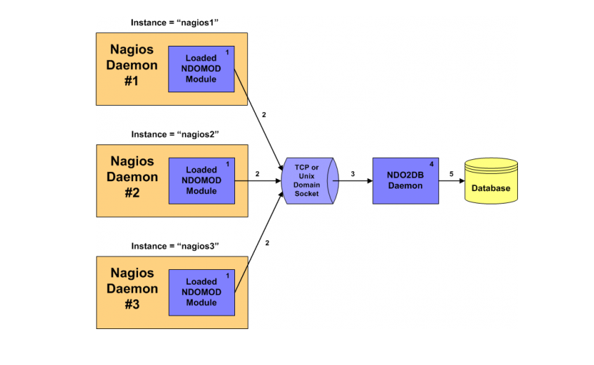

## Đẩy dữ liệu từ Check_mk sang mysql 



## Trên cả hai node

Trên cả hai node đều thực hiện một số các cấu hình sau:

### Cài đặt mariadb

Định nghĩa một repo cho mariadb:

```sh
cat<<EOF> /etc/yum.repos.d/mariadb.repo
[mariadb]
name = MariaDB
baseurl = http://yum.mariadb.org/10.2/centos73-amd64/
gpgkey=https://yum.mariadb.org/RPM-GPG-KEY-MariaDB
gpgcheck=1
EOF
```

Cài đặt Mariadb:

```sh
yum install -y mariadb mariadb-server mariadb-devel
yum install gcc glibc glibc-common gd gd-devel make net-snmp openssl-devel xinetd unzip httpd php php-fpm curl vim -y
systemctl start mariadb.service
systemctl enable mariadb.service
```

### Cấu hình:

```sh
cp /etc/sysctl.conf /etc/sysctl.conf_backup
sed -i '/msgmnb/d' /etc/sysctl.conf
sed -i '/msgmax/d' /etc/sysctl.conf
sed -i '/shmmax/d' /etc/sysctl.conf
sed -i '/shmall/d' /etc/sysctl.conf
printf "\n\nkernel.msgmnb = 131072000\n" >> /etc/sysctl.conf
printf "kernel.msgmax = 131072000\n" >> /etc/sysctl.conf
printf "kernel.shmmax = 4294967295\n" >> /etc/sysctl.conf
printf "kernel.shmall = 268435456\n" >> /etc/sysctl.conf
sysctl -e -p /etc/sysctl.conf
```

## Trên node DB

Đặt pass 
```sh
/usr/bin/mysqladmin -u root password 'trang1234'
```

Tạo DB:

```sh
mysql -u root -p'trang1234'
CREATE DATABASE nagios DEFAULT CHARACTER SET utf8 COLLATE utf8_general_ci;
CREATE USER 'ndoutils'@'%' IDENTIFIED BY 'trang1234';
GRANT USAGE ON *.* TO 'ndoutils'@'%' IDENTIFIED BY 'trang1234' WITH MAX_QUERIES_PER_HOUR 0 MAX_CONNECTIONS_PER_HOUR 0 MAX_UPDATES_PER_HOUR 0 MAX_USER_CONNECTIONS 0 ;
GRANT ALL PRIVILEGES ON nagios.* TO 'ndoutils'@'%' WITH GRANT OPTION ;
\q
```

* Nếu mariadb được cài ở trên máy cài check mk thì ta cần chạy thêm câu lệnh sau

```sh
GRANT USAGE ON *.* TO 'ndoutils'@'localhost' IDENTIFIED BY 'trang1234' WITH MAX_QUERIES_PER_HOUR 0 MAX_CONNECTIONS_PER_HOUR 0 MAX_UPDATES_PER_HOUR 0 MAX_USER_CONNECTIONS 0 ;
GRANT ALL PRIVILEGES ON nagios.* TO 'ndoutils'@'localhost' WITH GRANT OPTION ;
```


## Trên node check_mk

Tải gói và giải nén:

```sh
cd /opt
wget -O ndoutils.tar.gz https://github.com/NagiosEnterprises/ndoutils/releases/download/ndoutils-2.1.3/ndoutils-2.1.3.tar.gz
tar xzf ndoutils.tar.gz
cd /opt/ndoutils-2.1.3/


./configure --prefix=/omd/sites/monitoring/usr/local/nagios/ --enable-mysql --with-ndo2db-user=monitoring -with-ndo2db-group=monitoring --with-mysql=/usr/lib64/mysql
```

**Lưu ý**:
* Nếu đến đoạn này bị lỗi do không đúng path của option `--with-mysql` thì tìm file `mysql_config` với command `find / -name mysql_config`

```sh
[root@trang-68-110 ndoutils-2.1.3]# find / -name mysql_config
/usr/bin/mysql_config
```

* Chỉnh sửa lại câu lệnh để chạy như sau:

```sh
./configure --prefix=/omd/sites/monitoring/usr/local/nagios/ --enable-mysql --with-ndo2db-user=monitoring -with-ndo2db-group=monitoring --with-mysql=/usr/
```

Hoặc có thể bỏ option `--with-mysql` để tự tìm

Tiếp tục chạy như sau:

```sh
make all
```

* Nếu lúc này bị lỗi như sau:

```sh
[root@trang-68-110 ndoutils-2.1.3]# make all
Makefile:49: *** missing separator.  Stop.
```

* Thực hiện vào chỉnh sửa Makefile các dòng từ 49-53 như sau:

```sh
[root@trang-68-110 ndoutils-2.1.3]# vim Makefile
...
 44 INIT_TYPE=systemd
 45 INIT_DIR=/usr/lib/systemd/system
 46 INIT_OPTS=-o root -g @root_grp@
 47 INIT_FILE=ndo2db.service
 48 INETD_TYPE=xinetd
 49 INETD_DIR=/etc/xinetd.d
 50 INETD_FILE=ndo2db
 51 SRC_INETD=default-xinetd
 52 SRC_INIT=default-service
```

* Sau đó tiếp tục cài đặt ndo2db

```sh
make all
make install
make install-config

# Configure Database
cd db/
./installdb -u 'ndoutils' -p 'trang1234' -h '127.0.0.1' -d nagios
cd ..
```

Kiểm tra xem đã tạo được database chưa

```sh
echo 'show databases;' | mysql -u ndoutils -p'trang1234' -h 127.0.0.1
echo 'show tables;' | mysql -u ndoutils -p'trang1234' nagios -h 127.0.0.1
chown -R monitoring /omd/sites/monitoring/usr/local/

su monitoring
cp /opt/ndoutils-2.1.3/src/ndomod-3x.o ~/usr/local/nagios/bin/ndomod.o
cp /opt/ndoutils-2.1.3/src/ndo2db-3x ~/usr/local/nagios/bin/ndo2db
chmod 0744 ~/usr/local/nagios/bin/ndo*
mv ~/usr/local/nagios/etc/ndo2db.cfg-sample ~/usr/local/nagios/etc/ndo2db.cfg
mv ~/usr/local/nagios/etc/ndomod.cfg-sample ~/usr/local/nagios/etc/ndomod.cfg
```

Chỉnh sửa file cấu hình của ndo2db

```sh
vi ~/usr/local/nagios/etc/ndo2db.cfg

db_host=127.0.0.1
db_user=ndoutils
db_pass=trang1234
```

* Hoàn tất cài đặt và khởi động lại service 

```sh
exit
cd ..
make install-init
printf "\n\n# NDOUtils Broker Module\n" >> /omd/sites/monitoring/etc/nagios/nagios.cfg
printf "broker_module=/omd/sites/monitoring/usr/local/nagios/bin/ndomod.o config_file=/omd/sites/monitoring/usr/local/nagios/etc/ndomod.cfg\n" >> /omd/sites/monitoring/etc/nagios/nagios.cfg

systemctl enable ndo2db.service
systemctl start ndo2db.service
```

* Check log của nagios

```sh
grep ndo /omd/sites/monitoring/var/log/nagios.log
```

* Nếu OK

```sh
...
[1572335353] ndomod registered for process data
[1572335353] ndomod registered for timed event data
[1572335353] ndomod registered for log data'
[1572335353] ndomod registered for system command data'
[1572335353] ndomod registered for event handler data'
[1572335353] ndomod registered for notification data'
[1572335353] ndomod registered for service check data'
[1572335353] ndomod registered for host check data'
[1572335353] ndomod registered for comment data'
[1572335353] ndomod registered for downtime data'
[1572335353] ndomod registered for flapping data'
[1572335353] ndomod registered for program status data'
[1572335353] ndomod registered for host status data'
[1572335353] ndomod registered for service status data'
[1572335353] ndomod registered for adaptive program data'
[1572335353] ndomod registered for adaptive host data'
[1572335353] ndomod registered for adaptive service data'
[1572335353] ndomod registered for external command data'
[1572335353] ndomod registered for aggregated status data'
[1572335353] ndomod registered for retention data'
[1572335353] ndomod registered for contact data'
[1572335353] ndomod registered for contact notification data'
[1572335353] ndomod registered for acknowledgement data'
[1572335353] ndomod registered for state change data'
[1572335353] ndomod registered for contact status data'
[1572335353] ndomod registered for adaptive contact data'
[1572335353] Event broker module '/omd/sites/monitoring/usr/local/nagios/bin/ndomod.o' initialized successfully.
[1572336230] ndomod: Error writing to data sink!  Some output may get lost...
[1572336230] ndomod: Please check remote ndo2db log, database connection or SSL Parameters
[1572336246] ndomod: Successfully reconnected to data sink!  0 items lost, 240 queued items to flush.
[1572336246] ndomod: Successfully flushed 240 queued items to data sink.
[1572336246] ndomod: Error writing to data sink!  Some output may get lost...
[1572336246] ndomod: Please check remote ndo2db log, database connection or SSL Parameters
[1572336262] ndomod: Successfully reconnected to data sink!  0 items lost, 278 queued items to flush.
[1572336262] ndomod: Successfully flushed 278 queued items to data sink.
[1572336650] ndomod: Error writing to data sink!  Some output may get lost...
[1572336650] ndomod: Please check remote ndo2db log, database connection or SSL Parameters
[1572336666] ndomod: Successfully reconnected to data sink!  0 items lost, 272 queued items to flush.
[1572336666] ndomod: Successfully flushed 272 queued items to data sink.
[1572336877] ndomod: Error writing to data sink!  Some output may get lost...
[1572336877] ndomod: Please check remote ndo2db log, database connection or SSL Parameters
[1572336893] ndomod: Successfully reconnected to data sink!  0 items lost, 694 queued items to flush.
[1572336893] ndomod: Successfully flushed 694 queued items to data sink.
[1572337781] ndomod: Error writing to data sink!  Some output may get lost...
[1572337781] ndomod: Please check remote ndo2db log, database connection or SSL Parameters
[1572337797] ndomod: Successfully reconnected to data sink!  0 items lost, 702 queued items to flush.
[1572337797] ndomod: Successfully flushed 702 queued items to data sink.
```

* Kiểm tra trạng thái của mariadb:

```sh

[root@trang-68-110 ndoutils-2.1.3]# systemctl status  mariadb
● mariadb.service - MariaDB 10.2.27 database server
   Loaded: loaded (/usr/lib/systemd/system/mariadb.service; enabled; vendor preset: disabled)
  Drop-In: /etc/systemd/system/mariadb.service.d
           └─migrated-from-my.cnf-settings.conf
   Active: active (running) since Tue 2019-10-29 15:47:42 +07; 12s ago
     Docs: man:mysqld(8)
           https://mariadb.com/kb/en/library/systemd/
  Process: 13002 ExecStartPost=/bin/sh -c systemctl unset-environment _WSREP_START_POSITION (code=exited, status=0/SUCCESS)
  Process: 12936 ExecStartPre=/bin/sh -c [ ! -e /usr/bin/galera_recovery ] && VAR= ||   VAR=`/usr/bin/galera_recovery`; [ $? -eq 0 ]   && systemctl set-environment _WSREP_START_POSITION=$VAR || exit 1 (code=exited, status=0/SUCCESS)
  Process: 12933 ExecStartPre=/bin/sh -c systemctl unset-environment _WSREP_START_POSITION (code=exited, status=0/SUCCESS)
 Main PID: 12947 (mysqld)
   Status: "Taking your SQL requests now..."
   CGroup: /system.slice/mariadb.service
           └─12947 /usr/sbin/mysqld

Oct 29 15:47:42 trang-68-110 mysqld[12947]: 2019-10-29 15:47:42 140641378236608 [Note] InnoDB: 5.7.27 started; log sequence number 1620333
Oct 29 15:47:42 trang-68-110 mysqld[12947]: 2019-10-29 15:47:42 140640574760704 [Note] InnoDB: Loading buffer pool(s) from /var/lib/mysql/ib_buffer_pool
Oct 29 15:47:42 trang-68-110 mysqld[12947]: 2019-10-29 15:47:42 140640574760704 [Note] InnoDB: Buffer pool(s) load completed at 191029 15:47:42
Oct 29 15:47:42 trang-68-110 mysqld[12947]: 2019-10-29 15:47:42 140641378236608 [Note] Plugin 'FEEDBACK' is disabled.
Oct 29 15:47:42 trang-68-110 mysqld[12947]: 2019-10-29 15:47:42 140641378236608 [Note] Server socket created on IP: '::'.
Oct 29 15:47:42 trang-68-110 mysqld[12947]: 2019-10-29 15:47:42 140641378236608 [Note] Reading of all Master_info entries succeeded
Oct 29 15:47:42 trang-68-110 mysqld[12947]: 2019-10-29 15:47:42 140641378236608 [Note] Added new Master_info '' to hash table
Oct 29 15:47:42 trang-68-110 mysqld[12947]: 2019-10-29 15:47:42 140641378236608 [Note] /usr/sbin/mysqld: ready for connections.
Oct 29 15:47:42 trang-68-110 mysqld[12947]: Version: '10.2.27-MariaDB'  socket: '/var/lib/mysql/mysql.sock'  port: 3306  MariaDB Server
Oct 29 15:47:42 trang-68-110 systemd[1]: Started MariaDB 10.2.27 database server.
```

* Kiểm tra trạng thái của ndo2db mà thấy lỗi sau

```sh
[root@trang-68-110 db]# systemctl status  ndo2db mariadb
● ndo2db.service - Nagios Data Out Daemon
   Loaded: loaded (/usr/lib/systemd/system/ndo2db.service; enabled; vendor preset: disabled)
   Active: active (running) since Tue 2019-10-29 14:48:48 +07; 26s ago
     Docs: http://www.nagios.org/documentation
  Process: 4682 ExecStopPost=/bin/rm -f /omd/sites/monitoring/usr/local/nagios/var/ndo2db.pid (code=exited, status=0/SUCCESS)
 Main PID: 4688 (ndo2db)
   CGroup: /system.slice/ndo2db.service
           ├─4688 /omd/sites/monitoring/usr/local/nagios/bin/ndo2db -c /omd/sites/monitoring/usr/local/nagios/etc/ndo2db.cfg -f
           ├─5155 /omd/sites/monitoring/usr/local/nagios/bin/ndo2db -c /omd/sites/monitoring/usr/local/nagios/etc/ndo2db.cfg -f
           ├─5156 /omd/sites/monitoring/usr/local/nagios/bin/ndo2db -c /omd/sites/monitoring/usr/local/nagios/etc/ndo2db.cfg -f
           ├─5157 /omd/sites/monitoring/usr/local/nagios/bin/ndo2db -c /omd/sites/monitoring/usr/local/nagios/etc/ndo2db.cfg -f
           └─5158 /omd/sites/monitoring/usr/local/nagios/bin/ndo2db -c /omd/sites/monitoring/usr/local/nagios/etc/ndo2db.cfg -f

Oct 29 14:49:15 trang-68-110 ndo2db[5157]: Error: mysql_query() failed for 'INSERT INTO nagios_logentries SET instance_id='1', logentry_time=FROM_UNIXTIME(15723...fo
Oct 29 14:49:15 trang-68-110 ndo2db[5157]: mysql_error: 'Data too long for column 'logentry_data' at row 1'
Oct 29 14:49:15 trang-68-110 ndo2db[5157]: Error: mysql_query() failed for 'INSERT INTO nagios_logentries SET instance_id='1', logentry_time=FROM_UNIXTIME(15723...CR
Oct 29 14:49:15 trang-68-110 ndo2db[5157]: mysql_error: 'Data too long for column 'logentry_data' at row 1'
Oct 29 14:49:15 trang-68-110 ndo2db[5157]: Error: mysql_query() failed for 'INSERT INTO nagios_logentries SET instance_id='1', logentry_time=FROM_UNIXTIME(15723...CR
Oct 29 14:49:15 trang-68-110 ndo2db[5157]: mysql_error: 'Data too long for column 'logentry_data' at row 1'
Oct 29 14:49:15 trang-68-110 ndo2db[5157]: Error: mysql_query() failed for 'INSERT INTO nagios_logentries SET instance_id='1', logentry_time=FROM_UNIXTIME(15723...IT
Oct 29 14:49:15 trang-68-110 ndo2db[5157]: mysql_error: 'Data too long for column 'logentry_data' at row 1'
Oct 29 14:49:15 trang-68-110 ndo2db[5157]: Error: mysql_query() failed for 'INSERT INTO nagios_logentries SET instance_id='1', logentry_time=FROM_UNIXTIME(15723...IT
Oct 29 14:49:15 trang-68-110 ndo2db[5157]: mysql_error: 'Data too long for column 'logentry_data' at row 1'
```

* Do bị limit số lượng ký tự trong một column của table. Chỉnh sửa lại Data type của các cột này như sau:

```sh
mysql -u root -ptrang1234 nagios
DESCRIBE nagios_logentries;
ALTER TABLE nagios_logentries MODIFY logentry_data LONGTEXT;
ALTER TABLE nagios_servicechecks  MODIFY output LONGTEXT;
ALTER TABLE nagios_servicestatus  MODIFY output LONGTEXT;

DESCRIBE nagios_logentries;
DESCRIBE nagios_servicechecks;
```

* Kết quả

```sh
MariaDB [nagios]> DESCRIBE nagios_logentries;
+-------------------------+-------------+------+-----+---------------------+----------------+
| Field                   | Type        | Null | Key | Default             | Extra          |
+-------------------------+-------------+------+-----+---------------------+----------------+
| logentry_id             | int(11)     | NO   | PRI | NULL                | auto_increment |
| instance_id             | int(11)     | NO   | MUL | 0                   |                |
| logentry_time           | datetime    | NO   |     | 0000-00-00 00:00:00 |                |
| entry_time              | datetime    | NO   |     | 0000-00-00 00:00:00 |                |
| entry_time_usec         | int(11)     | NO   |     | 0                   |                |
| logentry_type           | int(11)     | NO   |     | 0                   |                |
| logentry_data           | longtext    | YES  |     | NULL                |                |
| realtime_data           | smallint(6) | NO   |     | 0                   |                |
| inferred_data_extracted | smallint(6) | NO   |     | 0                   |                |
+-------------------------+-------------+------+-----+---------------------+----------------+

MariaDB [nagios]> DESCRIBE nagios_servicechecks;
+-----------------------+--------------+------+-----+---------------------+----------------+
| Field                 | Type         | Null | Key | Default             | Extra          |
+-----------------------+--------------+------+-----+---------------------+----------------+
| servicecheck_id       | int(11)      | NO   | PRI | NULL                | auto_increment |
| instance_id           | smallint(6)  | NO   | MUL | 0                   |                |
| service_object_id     | int(11)      | NO   | MUL | 0                   |                |
| check_type            | smallint(6)  | NO   |     | 0                   |                |
| current_check_attempt | smallint(6)  | NO   |     | 0                   |                |
| max_check_attempts    | smallint(6)  | NO   |     | 0                   |                |
| state                 | smallint(6)  | NO   |     | 0                   |                |
| state_type            | smallint(6)  | NO   |     | 0                   |                |
| start_time            | datetime     | NO   | MUL | 0000-00-00 00:00:00 |                |
| start_time_usec       | int(11)      | NO   |     | 0                   |                |
| end_time              | datetime     | NO   |     | 0000-00-00 00:00:00 |                |
| end_time_usec         | int(11)      | NO   |     | 0                   |                |
| command_object_id     | int(11)      | NO   |     | 0                   |                |
| command_args          | varchar(255) | NO   |     |                     |                |
| command_line          | varchar(255) | NO   |     |                     |                |
| timeout               | smallint(6)  | NO   |     | 0                   |                |
| early_timeout         | smallint(6)  | NO   |     | 0                   |                |
| execution_time        | double       | NO   |     | 0                   |                |
| latency               | double       | NO   |     | 0                   |                |
| return_code           | smallint(6)  | NO   |     | 0                   |                |
| output                | longtext     | YES  |     | NULL                |                |
| long_output           | text         | NO   |     | ''                  |                |
| perfdata              | text         | NO   |     | ''                  |                |
+-----------------------+--------------+------+-----+---------------------+----------------+
23 rows in set (0.00 sec)
```

* Check lại status của ndo2db

```sh
[root@trang-68-110 ndoutils-2.1.3]# systemctl status ndo2db
● ndo2db.service - Nagios Data Out Daemon
   Loaded: loaded (/usr/lib/systemd/system/ndo2db.service; enabled; vendor preset: disabled)
   Active: active (running) since Tue 2019-10-29 15:49:21 +07; 8min ago
     Docs: http://www.nagios.org/documentation
  Process: 14040 ExecStopPost=/bin/rm -f /omd/sites/monitoring/usr/local/nagios/var/ndo2db.pid (code=exited, status=0/SUCCESS)
 Main PID: 14045 (ndo2db)
   CGroup: /system.slice/ndo2db.service
           ├─14045 /omd/sites/monitoring/usr/local/nagios/bin/ndo2db -c /omd/sites/monitoring/usr/local/nagios/etc/ndo2db.cfg -f
           ├─14339 /omd/sites/monitoring/usr/local/nagios/bin/ndo2db -c /omd/sites/monitoring/usr/local/nagios/etc/ndo2db.cfg -f
           └─14340 /omd/sites/monitoring/usr/local/nagios/bin/ndo2db -c /omd/sites/monitoring/usr/local/nagios/etc/ndo2db.cfg -f

Oct 29 15:57:45 trang-68-110 ndo2db[14340]: Trimming systemcommands.
Oct 29 15:57:45 trang-68-110 ndo2db[14340]: Trimming servicechecks.
Oct 29 15:57:45 trang-68-110 ndo2db[14340]: Trimming hostchecks.
Oct 29 15:57:45 trang-68-110 ndo2db[14340]: Trimming eventhandlers.
Oct 29 15:57:45 trang-68-110 ndo2db[14340]: Trimming externalcommands.
Oct 29 15:57:45 trang-68-110 ndo2db[14340]: Trimming notifications.
Oct 29 15:57:45 trang-68-110 ndo2db[14340]: Trimming contactnotifications.
Oct 29 15:57:45 trang-68-110 ndo2db[14340]: Trimming contactnotificationmethods.
Oct 29 15:57:45 trang-68-110 ndo2db[14340]: Trimming logentries.
Oct 29 15:57:45 trang-68-110 ndo2db[14340]: Trimming acknowledgements.
```


## Tham khảo

[1] https://support.nagios.com/kb/article.php?id=406


```sh
==================user root==================
OS: centos7
----------install check_mk-------------
yum -y update
yum install -y epel-release wget
wget https://mathias-kettner.de/support/1.4.0p17/check-mk-raw-1.4.0p17-el7-64.x86_64.rpm
yum install -y check-mk-raw-1.4.0p17-el7-64.x86_64.rpm
vi /etc/sysconfig/selinux
SELINUX=enforcing thành SELINUX=disabled
firewall-cmd --permanent --add-port=80/tcp
firewall-cmd --reload
omd create hanoi
6pg37Nl3
omd start hanoi
----------install mariadb--------------
yum install -y mariadb mariadb-server mariadb-devel
yum install gcc glibc glibc-common gd gd-devel make net-snmp openssl-devel xinetd unzip httpd php php-fpm curl vim -y
yum install net-tools -y
systemctl start mariadb.service
systemctl enable mariadb.service
/usr/bin/mysqladmin -u root password 'tan124'
vim ~/.my.cnf
==>
[client]
user = root
password = tan124
mysql
CREATE DATABASE nagios DEFAULT CHARACTER SET utf8 COLLATE utf8_general_ci;
CREATE USER 'monitoring'@'localhost' IDENTIFIED BY 'tan124';
grant all privileges on nagios.* to 'monitoring'@localhost identified by "tan124" with grant option;
flush privileges;
quit
-------------install ndo2db------------------
cd /opt
wget http://downloads.sourceforge.net/project/nagios/ndoutils-1.x/ndoutils-1.5.2/ndoutils-1.5.2.tar.gz
tar xvf ndoutils-1.5.2.tar.gz
cd ndoutils-1.5.2
./configure --prefix=/omd/sites/hanoi/usr/local/nagios/ --enable-mysql --disable-pgsql --with-ndo2db-user=hanoi -with-ndo2db-group=hanoi --with-mysql-lib=/usr/lib/mysql
make
make all
make install-config
cd /opt/ndoutils-1.5.2/db
./installdb -u monitoring -p tan124 -h localhost -d nagios
chown -R hanoi. /omd/sites/hanoi/usr/local/
chmod 766 /opt/ndoutils-1.5.2/config/ndo2db.cfg-sample
chmod 766 /opt/ndoutils-1.5.2/config/ndomod.cfg-sample
chmod 766 /opt/ndoutils-1.5.2/daemon-init
==========user hanoi==============
su hanoi
mkdir -p ~/usr/local/nagios/bin
mkdir -p ~/usr/local/nagios/etc
mkdir -p ~/usr/local/nagios/var
cp /opt/ndoutils-1.5.2/src/ndomod-3x.o ~/usr/local/nagios/bin/ndomod.o
cp /opt/ndoutils-1.5.2/src/ndo2db-3x ~/usr/local/nagios/bin/ndo2db
chmod 0744 ~/usr/local/nagios/bin/ndo*
cp /opt/ndoutils-1.5.2/config/ndo2db.cfg-sample ~/usr/local/nagios/etc/ndo2db.cfg
cp /opt/ndoutils-1.5.2/config/ndomod.cfg-sample ~/usr/local/nagios/etc/ndomod.cfg
cp /opt/ndoutils-1.5.2/daemon-init ~/etc/init.d/ndo2db
chmod +x ~/etc/init.d/ndo2db
vim /omd/sites/hanoi/usr/local/nagios/etc/ndo2db.cfg
==> 
db_user=monitoring
db_pass=tan124
mkdir -p ~/var/lock/subsys
vim ~/etc/init.d/ndo2db
==>
Ndo2dbLockDir=var/lock/subsys
Ndo2dbUser=hanoi
Ndo2dbGroup=hanoi
trong function start ndo2db cua file ~/etc/init.d/ndo2db ta them dong remove socket "usr/local/nagios/var/ndo.sock" nhu sau:
start)
        status_ndo2db
        if [ $? -eq 0 ]; then
            echo "$servicename already started..."
            exit 1
        fi
        echo -n "Starting $servicename:"
        rm -rf usr/local/nagios/var/ndo.sock
        touch $Ndo2dbRunFile
        chown $Ndo2dbUser:$Ndo2dbGroup $Ndo2dbRunFile
        $Ndo2dbBin -c $Ndo2dbCfgFile
        if [ -d $Ndo2dbLockDir ]; then touch $Ndo2dbLockDir/$Ndo2dbLockFile; fi
        echo " done."
        exit 0
        ;;
printf "\n\n# NDOUtils Broker Module\n" >> /omd/sites/hanoi/etc/nagios/nagios.cfg
printf "broker_module=/omd/sites/hanoi/usr/local/nagios/bin/ndomod.o\n" >> /omd/sites/hanoi/etc/nagios/nagios.cfg
printf "config_file=/omd/sites/hanoi/usr/local/nagios/etc/ndomod.cfg\n" >> /omd/sites/hanoi/etc/nagios/nagios.cfg
cd /omd/sites/hanoi/etc/rc.d
ln -s ../init.d/ndo2db 81-ndo2db
=============root===========
omd restart hanoi
tail -f /omd/sites/hanoi/var/log/nagios.log
==> if OK
[1510629049] ndomod: Successfully reconnected to data sink!  0 items lost, 124 queued items to flush.
[1510629049] ndomod: Successfully flushed 124 queued items to data sink.
==> if not OK
[1510569392] ndomod: Still unable to connect to data sink.  0 items lost, 278 queued items to flush.
[1510569408] ndomod: Still unable to connect to data sink.  0 items lost, 392 queued items to flush.
==============================================
```

### Fix một số lỗi đã gặp

**Lỗi bind socket**

* Nếu khi thực hiện cài đặt, khởi động ndo2db sau đó chạy command `grep ndo /omd/sites/monitoring/var/log/nagios.log` gặp lỗi như sau:

```sh
...
[1572234332] ndomod registered for contact data'
[1572234332] ndomod registered for contact notification data'
[1572234332] ndomod registered for acknowledgement data'
[1572234332] ndomod registered for state change data'
[1572234332] ndomod registered for contact status data'
[1572234332] ndomod registered for adaptive contact data'
[1572234332] Event broker module '/omd/sites/monitoring/usr/local/nagios/bin/ndomod.o' initialized successfully.
[1572234348] ndomod: Still unable to connect to data sink.  1588 items lost, 5000 queued items to flush.
[1572234364] ndomod: Still unable to connect to data sink.  1712 items lost, 5000 queued items to flush.
[1572234380] ndomod: Still unable to connect to data sink.  1825 items lost, 5000 queued items to flush.
[1572234396] ndomod: Still unable to connect to data sink.  1958 items lost, 5000 queued items to flush.
[1572234412] ndomod: Still unable to connect to data sink.  2072 items lost, 5000 queued items to flush.
[1572234428] ndomod: Still unable to connect to data sink.  2197 items lost, 5000 queued items to flush.
...
```

* Kiểm tra trạng thái của service:

```sh
[root@trang-68-110 NagiosReport]# systemctl status  ndo2db
● ndo2db.service - Nagios Data Out Daemon
   Loaded: loaded (/usr/lib/systemd/system/ndo2db.service; enabled; vendor preset: disabled)
   Active: failed (Result: exit-code) since Mon 2019-10-28 09:14:05 +07; 2s ago
     Docs: http://www.nagios.org/documentation
  Process: 618 ExecStopPost=/bin/rm -f /omd/sites/monitoring/usr/local/nagios/var/ndo2db.pid (code=exited, status=0/SUCCESS)
  Process: 616 ExecStart=/omd/sites/monitoring/usr/local/nagios/bin/ndo2db -c /omd/sites/monitoring/usr/local/nagios/etc/ndo2db.cfg -f (c          ode=exited, status=1/FAILURE)
 Main PID: 616 (code=exited, status=1/FAILURE)

Oct 28 09:14:05 trang-68-110 systemd[1]: Started Nagios Data Out Daemon.
Oct 28 09:14:05 trang-68-110 ndo2db[616]: Could not bind socket: Address already in use
Oct 28 09:14:05 trang-68-110 systemd[1]: ndo2db.service: main process exited, code=exited, status=1/FAILURE
Oct 28 09:14:05 trang-68-110 systemd[1]: Unit ndo2db.service entered failed state.
Oct 28 09:14:05 trang-68-110 systemd[1]: ndo2db.service failed.
```

* Cách fix: Xóa file socket đi, khởi động lại service để nó tự động tạo lại

```sh
rm -f /omd/sites/monitoring/usr/local/nagios/var/ndo.sock
systemctl restart ndo2db
```

* Kiểm tra lại để thấy service đã có thể hoạt động trở lại

```sh
[root@trang-68-110 NagiosReport]# systemctl status  ndo2db
● ndo2db.service - Nagios Data Out Daemon
   Loaded: loaded (/usr/lib/systemd/system/ndo2db.service; enabled; vendor preset: disabled)
   Active: active (running) since Mon 2019-10-28 10:47:49 +07; 6min ago
     Docs: http://www.nagios.org/documentation
  Process: 346 ExecStopPost=/bin/rm -f /omd/sites/monitoring/usr/local/nagios/var/ndo2db.pid (code=exited, status=0/SUCCESS)
 Main PID: 962 (ndo2db)
   CGroup: /system.slice/ndo2db.service
           ├─ 962 /omd/sites/monitoring/usr/local/nagios/bin/ndo2db -c /omd/sites/monitoring/usr/local/nagios/etc/ndo2db.cfg -f
           ├─1007 /omd/sites/monitoring/usr/local/nagios/bin/ndo2db -c /omd/sites/monitoring/usr/local/nagios/etc/ndo2db.cfg -f
           └─1008 /omd/sites/monitoring/usr/local/nagios/bin/ndo2db -c /omd/sites/monitoring/usr/local/nagios/etc/ndo2db.cfg -f

Oct 28 10:54:02 trang-68-110 ndo2db[1008]: Trimming systemcommands.
Oct 28 10:54:02 trang-68-110 ndo2db[1008]: Trimming servicechecks.
Oct 28 10:54:02 trang-68-110 ndo2db[1008]: Trimming hostchecks.
Oct 28 10:54:02 trang-68-110 ndo2db[1008]: Trimming eventhandlers.
Oct 28 10:54:02 trang-68-110 ndo2db[1008]: Trimming externalcommands.
Oct 28 10:54:02 trang-68-110 ndo2db[1008]: Trimming notifications.
Oct 28 10:54:02 trang-68-110 ndo2db[1008]: Trimming contactnotifications.
Oct 28 10:54:02 trang-68-110 ndo2db[1008]: Trimming contactnotificationmethods.
Oct 28 10:54:02 trang-68-110 ndo2db[1008]: Trimming logentries.
Oct 28 10:54:02 trang-68-110 ndo2db[1008]: Trimming acknowledgements.
```


## Chạy tool thống kê tải

**Mô tả**: Tool được viết bằng python, để lấy các thông tin từ database là mariadb, lưu các thông số, metric trên checkmk, sau đó xuất ra file excel.

* Tải tool về

```sh
git clone https://github.com/dung1101/NagiosReport
cd NagiosReport
yum install python34 
yum install python34-setuptools python34-pip
pip3 install -r requirements.txt
```

* Chạy tool để thống kê các thông số của tháng 10 của năm nay

```sh
python3 main.py 10
```

* Hoặc tháng 10 của năm bất kỳ

```sh
python3 main.py 10 2018
```

* Thống kê thông số của tháng hiện tại

```sh
python3 main.py
```


## Tham khảo

[1] https://assets.nagios.com/downloads/nagioscore/docs/ndoutils/NDOUtils.pdf