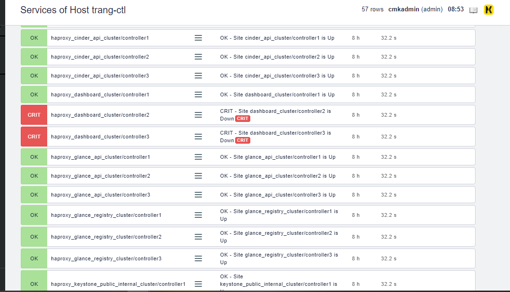

## Hướng dẫn CheckMK check HAProxy status


Trên phía agent thực hiện tạo một file mới `/usr/lib/check_mk_agent/local/check-haproxy` như ở đây [Script](check-haproxy), sau đó phân quyền thực thi cho file.

	chmod +x /usr/lib/check_mk_agent/local/check-haproxy

Thực hiện chạy thử script trên agent:

```sh
[root@trang-40-71 local(openstack)]# ./check-haproxy
0 haproxy_dashboard_cluster/controller1 varname=2;crit Site dashboard_cluster/controller1 is Up
2 haproxy_dashboard_cluster/controller2 varname=2;crit Site dashboard_cluster/controller2 is Down
2 haproxy_dashboard_cluster/controller3 varname=2;crit Site dashboard_cluster/controller3 is Down
2 haproxy_mariadb_cluster/controller1 varname=2;crit Site mariadb_cluster/controller1 is Down
0 haproxy_mariadb_cluster/controller2 varname=2;crit Site mariadb_cluster/controller2 is Up
0 haproxy_mariadb_cluster/controller3 varname=2;crit Site mariadb_cluster/controller3 is Up
0 haproxy_keystone_public_internal_cluster/controller1 varname=2;crit Site keystone_public_internal_cluster/controller1 is Up
2 haproxy_keystone_public_internal_cluster/controller2 varname=2;crit Site keystone_public_internal_cluster/controller2 is Down
2 haproxy_keystone_public_internal_cluster/controller3 varname=2;crit Site keystone_public_internal_cluster/controller3 is Down
0 haproxy_glance_api_cluster/controller1 varname=2;crit Site glance_api_cluster/controller1 is Up
0 haproxy_glance_api_cluster/controller2 varname=2;crit Site glance_api_cluster/controller2 is Up
0 haproxy_glance_api_cluster/controller3 varname=2;crit Site glance_api_cluster/controller3 is Up
0 haproxy_glance_registry_cluster/controller1 varname=2;crit Site glance_registry_cluster/controller1 is Up
0 haproxy_glance_registry_cluster/controller2 varname=2;crit Site glance_registry_cluster/controller2 is Up
0 haproxy_glance_registry_cluster/controller3 varname=2;crit Site glance_registry_cluster/controller3 is Up
0 haproxy_nova_compute_api_cluster/controller1 varname=2;crit Site nova_compute_api_cluster/controller1 is Up
0 haproxy_nova_compute_api_cluster/controller2 varname=2;crit Site nova_compute_api_cluster/controller2 is Up
0 haproxy_nova_compute_api_cluster/controller3 varname=2;crit Site nova_compute_api_cluster/controller3 is Up
0 haproxy_nova_vncproxy_cluster/controller1 varname=2;crit Site nova_vncproxy_cluster/controller1 is Up
0 haproxy_nova_vncproxy_cluster/controller2 varname=2;crit Site nova_vncproxy_cluster/controller2 is Up
0 haproxy_nova_vncproxy_cluster/controller3 varname=2;crit Site nova_vncproxy_cluster/controller3 is Up
0 haproxy_nova_metadata_api_cluster/controller1 varname=2;crit Site nova_metadata_api_cluster/controller1 is Up
0 haproxy_nova_metadata_api_cluster/controller2 varname=2;crit Site nova_metadata_api_cluster/controller2 is Up
0 haproxy_nova_metadata_api_cluster/controller3 varname=2;crit Site nova_metadata_api_cluster/controller3 is Up
0 haproxy_nova_placement_api/controller1 varname=2;crit Site nova_placement_api/controller1 is Up
2 haproxy_nova_placement_api/controller2 varname=2;crit Site nova_placement_api/controller2 is Down
2 haproxy_nova_placement_api/controller3 varname=2;crit Site nova_placement_api/controller3 is Down
0 haproxy_neutron_api_cluster/controller1 varname=2;crit Site neutron_api_cluster/controller1 is Up
0 haproxy_neutron_api_cluster/controller2 varname=2;crit Site neutron_api_cluster/controller2 is Up
0 haproxy_neutron_api_cluster/controller3 varname=2;crit Site neutron_api_cluster/controller3 is Up
0 haproxy_cinder_api_cluster/controller1 varname=2;crit Site cinder_api_cluster/controller1 is Up
0 haproxy_cinder_api_cluster/controller2 varname=2;crit Site cinder_api_cluster/controller2 is Up
0 haproxy_cinder_api_cluster/controller3 varname=2;crit Site cinder_api_cluster/controller3 is Up
```

Trên server thực hiện discovery lại con agent đó t sẽ thấy các service mới đó:



## Tham khảo

[1] https://tjth.co/monitoring-haproxy-status-page/