# Hướng dẫn sử dụng Nagvis

## 1. Demo các thao tác cơ bản để bắt đầu sử dụng Nagvis tạo map

### Bước 1:
* Truy cập vào link Nagvis của bạn với đường dẫn như sau: https://<ip-server-checkmk>/<site-name>/nagvis. Ví dụ http://192.168.40.129/monitoring/nagvis. Giao diện Nagvis sẽ như sau:

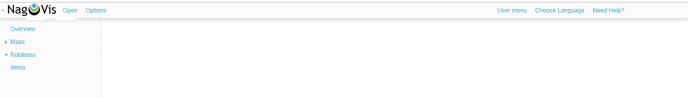

* Tạo một map

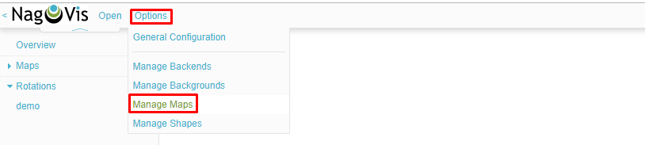

* Điền thông tin về map để tạo, Tên map là tùy chọn, loại map thì sẽ chọn `Regular map` để demo tự vẽ map.

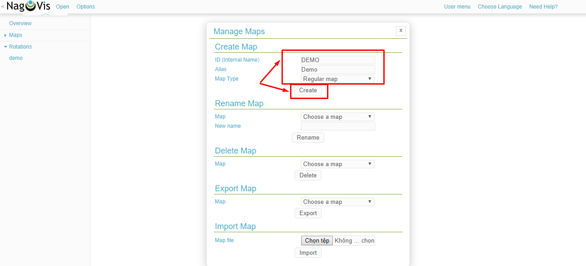

### Bước 2: Thêm Backgrounds

* Ví dụ tôi sẽ sử dụng trước một cái ảnh về mô hình của tôi như sau:

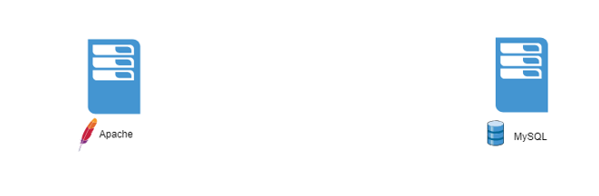

* Tiếp theo cần thêm nó vào nagvis để làm background

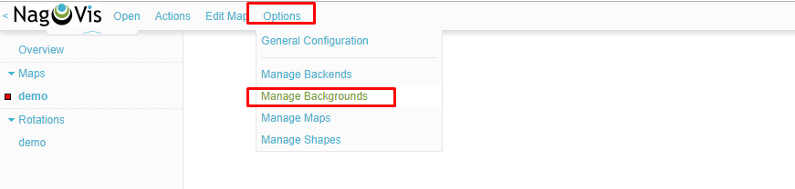

* Chọn hình ảnh trong local disk của bạn để upload

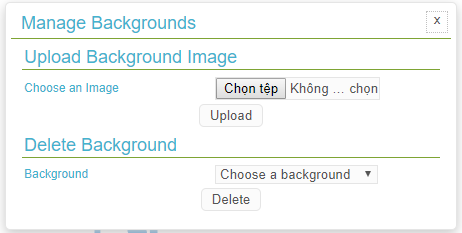

* Tiếp theo add background cho map. Chọn map muốn thêm và làm theo các bước sau để chỉnh sửa map

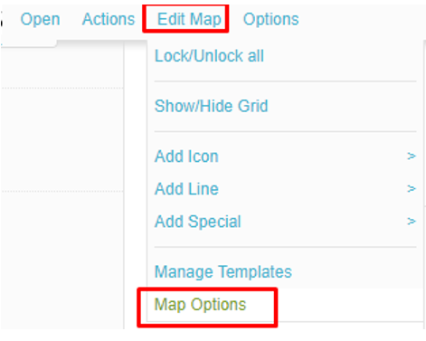

* Chọn ảnh mà bạn vừa upload

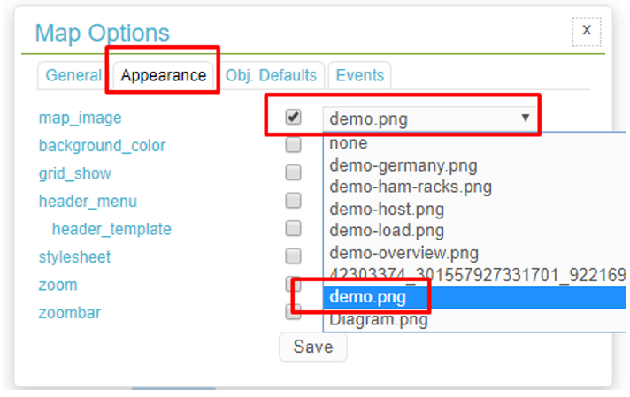

* Kết quả là đã add thành công background cho map

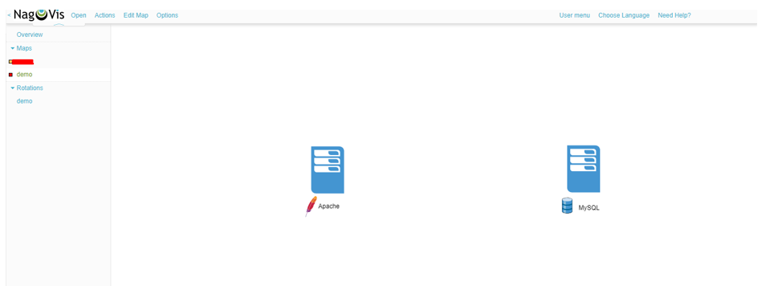

### Bước 3: Thêm host

* Chọn Edit Map -> Add Icon -> Host

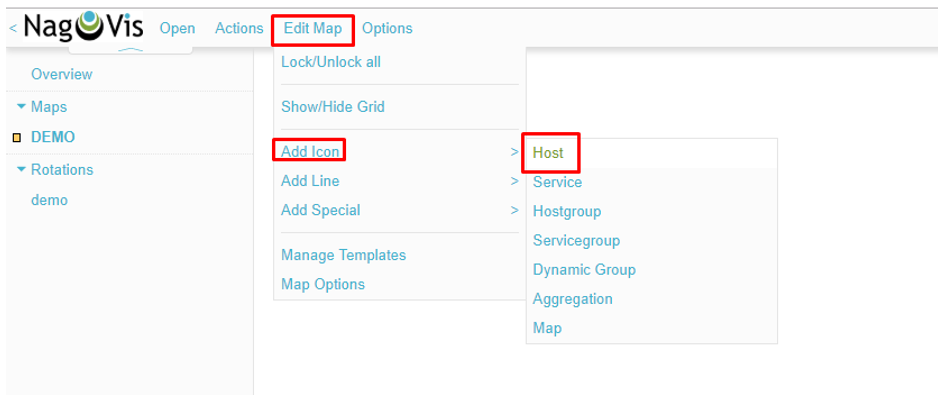

* Di chuyển con trỏ chuột để chọn vị trí đặt icon, sau đó sẽ có một bảng cấu hình thông tin cho icon sẽ hiện ra. Chọn host và site tương ứng với host mà bạn muốn hiển thị lên map

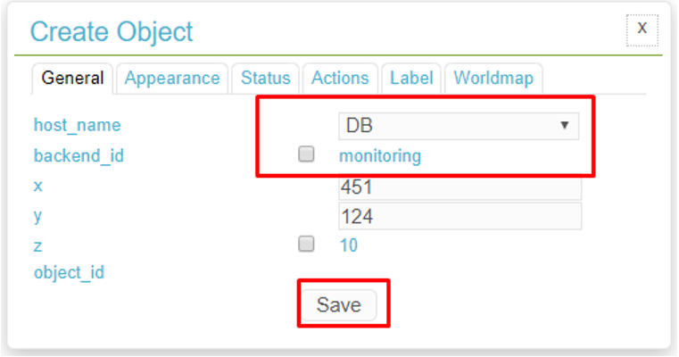

* Hiển thị label cho host

* Kết quả 

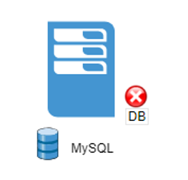

* Tương tự, thêm host web 

* Để xem trạng thái và thông tin chi tiết hơn cho mỗi host, chỉ cần di chuột vào icon của host đó

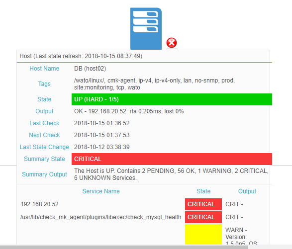

* Di chuyển host, chọn chuột phải vào icon của host đó, chọn `Unlock`, di chuột để đưa host tới vị trí đặt mới, sau đó lock lại.

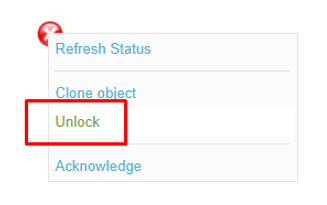

### Bước 4: Add line

* Thêm các đường kết nối giữa các host

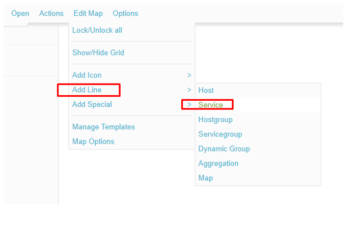

* Sau đó chọn Host và service để thể hiện link đó

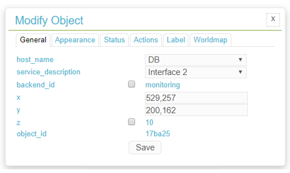

* Chọn loại line phù hợp

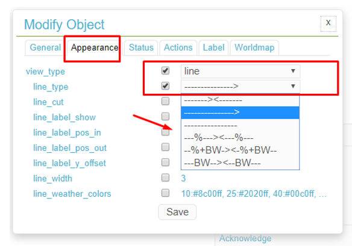

* Tương tự tạo thêm một line nữa:

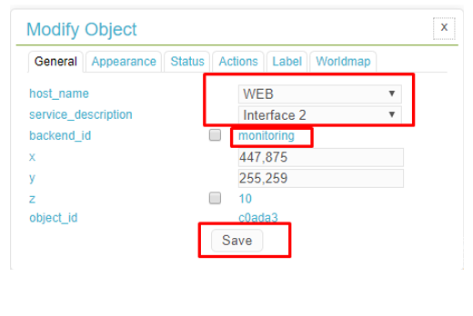

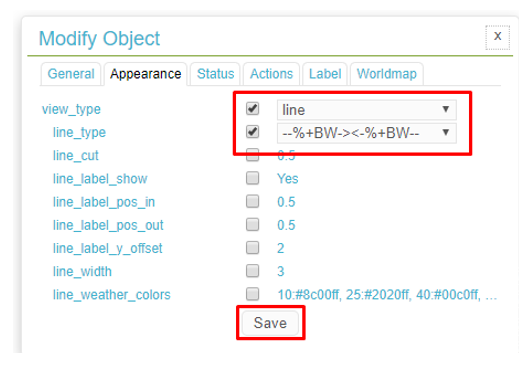

### Bước 5: Kết quả 

* Chỉnh sửa vị trí các line, host cho phù hợp, ta được một map như sau:

## 2. Thay đổi icon mặc định của Nagvis

**Mục đích**: tự build một bộ icon mới cho Nagvis (iconset)

* Một iconset hoàn chỉnh bao gồm 11 files. Các file này có dạng là png, được đặt tên như sau:

| Filename	| Description |
|---|---|
| <set>_ack.png |	Acknowledged problem |
| <set>_error.png |	Error while fetching status |
| <set>_unknown.png |	Unkown state |
| <set>_critical.png |	Critical state |
| <set>_ok.png |	Ok state |
| <set>_up.png |	Up state (Host) |
| <set>_down.png |	Down state (Host) |
| <set>_sack.png |	Acknowledged problem (Service) |
| <set>_warning.png |	Warning state |

* Nagvis sẽ kiểm tra ảnh có tên `<set>_ok.png` nằm trong list iconsets, nếu có file tên như thế thì tên của set sẽ được hiển thị trên WUI và có thể lựa chọn.

* Mặc định khi tạo map, Nagvis sẽ sử dụng iconset `std_medium`. Để chọn iconset khác cho một map nhất định chọn map đó, sau đó chọn Edit Map -> Map Options -> Obj. Defaults -> iconset

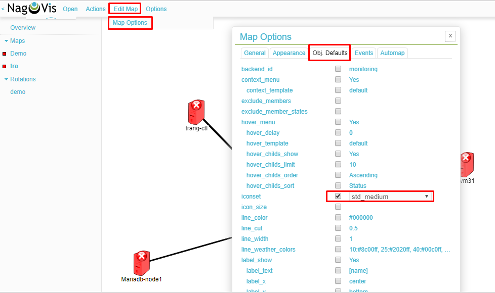

* Chọn iconset khác được liệt kê trong danh sách sau:

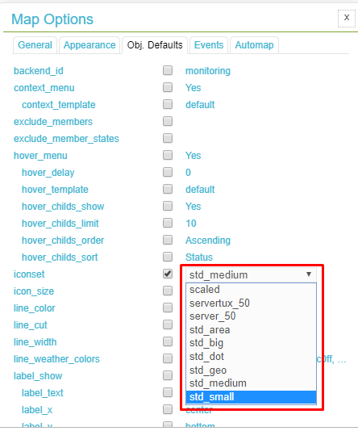

* Icon sẽ tự đồng được reload

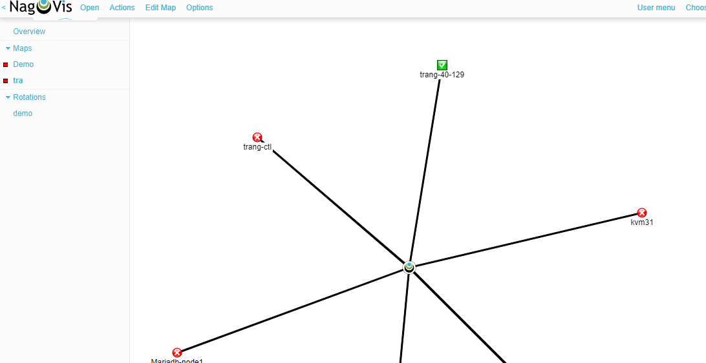

### Add own Iconsets

* Các icon mặc định được đặt tại đường dẫn `/omd/sites/monitoring/share/nagvis/htdocs/userfiles/images/iconsets/` (với `monitoring` là tên site của bạn) với các file làm file ảnh `.png`. Để tạo ra một bộ icon của riêng mình, bạn cần chuẩn bị trước một bộ icon với tên icon có định dạng như đã nói phía trên, sau đó copy đặt tại thư mục `/omd/sites/monitoring/share/nagvis/htdocs/userfiles/images/iconsets/` trên server.

* Có thể tham khảo một số các iconset được đóng góp tại đây: https://exchange.nagvis.org/exchange/Iconsets/

* Ví dụ tải một bộ `Linux Server Icons 50px` tại link: https://exchange.nagvis.org/exchange/func-startdown/84/, giải nén và copy toàn bộ image trong đó lên server. Sau đó lên giao diện Web của Nagvis và thực hiện đổi iconset như sau:

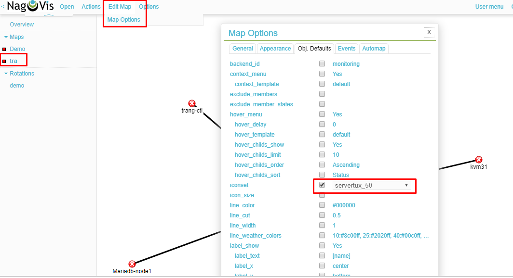

* Lưu lại ta được một map như sau:

## Tham khảo 

[1] https://docs.itrsgroup.com/docs/op5-monitor/7.5.0/topics/user-guide/monitoring/nagvis.htm

[2] https://checkmk.com/cms_nagvis.html

[3] https://support.nagios.com/forum/viewtopic.php?f=6&t=39312

[4] https://exchange.nagvis.org/exchange/Iconsets/orderby,3/

