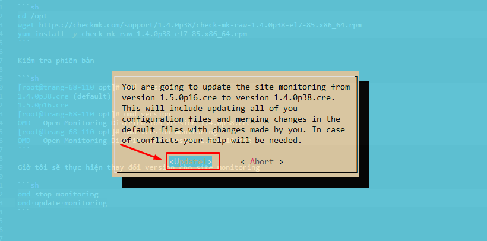
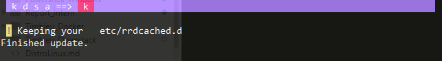

## Update phiên bản của Check_mk

Bản mình đang dùng hiện tại là `check-mk-raw-1.5.0p16` là bản stable mới nhất tại thời điểm hiện tại.

Giờ mình sẽ thực hiện chuyển sang bản 1.4.0p38. Đầu tiên cần tải gói cài đặt tại link dưới đây về:

https://checkmk.com/support/1.4.0p38/check-mk-raw-1.4.0p38-el7-85.x86_64.rpm

**Lưu ý trước khi update**:

* Khi update cần phải backup trước các plugin notify trong thư mục: `/omd/sites/monitoring/share/check_mk/notifications/`, sau khi update xong cần copy và phân quyền lại cho các plugin này.


### Thực hiện trên check_mk host

```sh
cd /opt
wget https://checkmk.com/support/1.4.0p38/check-mk-raw-1.4.0p38-el7-85.x86_64.rpm
yum install -y check-mk-raw-1.4.0p38-el7-85.x86_64.rpm
```

Một số các version stable khác:


* Version 1.5.0p18: 
```sh
cd /opt
wget https://checkmk.com/support/1.5.0p18/check-mk-raw-1.5.0p18-el7-38.x86_64.rpm
yum install check-mk-raw-1.5.0p18-el7-38.x86_64.rpm -y
```


Kiểm tra phiên bản

```sh
[root@trang-68-110 opt]# omd versions
1.4.0p38.cre (default)
1.5.0p16.cre
[root@trang-68-110 opt]# omd version
OMD - Open Monitoring Distribution Version 1.4.0p38.cre
[root@trang-68-110 opt]# omd version monitoring
OMD - Open Monitoring Distribution Version 1.5.0p16.cre
```

Giờ tôi sẽ thực hiện thay đổi version cho site monitoring

```sh
omd stop monitoring
omd update monitoring
```

Chọn update để tiếp tục



Chọn `k` để lưu trữ lại thư mục cấu hình của version cũ



Kiểm tra lại verison của site monitoring

```sh
[root@trang-68-110 opt]# omd version monitoring
OMD - Open Monitoring Distribution Version 1.4.0p38.cre
```

Khởi động lại site 

	omd start monitoring


Tìm hiểu thêm một số các tùy chọn khác ở đây (ví dụ: muốn update version khi có 3 version đang được cài đặt)

https://checkmk.com/cms_update.html

https://labs.consol.de/omd/commands.html


