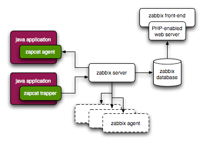

# Tổng quan về Zabbix

## 1. Zabbix là gì

Zabbix được tạo bởi Alexei Vladishev, hiện tại đang được phát triển và hỗ trợ bởi Zabbix SIA. Zabbix là một giải pháp monitor phân tán mã nguồn mở ở mức cho các doanh nghiệp (enterprise-class open source distributed monitoring solution)

Zabbix là một phần mềm giám sát rất nhiều các thông số của network và các thông số sức khỏe và tính toàn vẹn của các servers. Zabbix hỗ trợ linh hoạt các cơ chế cảnh báo và tính năng data visualisation dựa trên các data được lưu trữ.

Zabbix hỗ trợ cả hai cơ chế là polling và trapping. Tất cả các báo cáo, thông kê cũng như cấu hình các tham số của Zabbix đều cho phép thực hiện trên giao diện web. Giao diện web này sẽ đảm bảo rằng trạng thái của hệ thống mạng, các servers có thể được đánh giá từ bất cứ vị trí nào. Nếu được cấu hình và sử dụng một cách thông minh thì zabbix có thể đóng một vai trò quan trọng trong hệ thống giám sát hạ tầng IT, đều có thể áp dụng cho các công từ nhỏ từ vài server đến các công ty tổ chức lớn với rất nhiều server và các thiết bị mạng khác.

Zabbix là một giải pháp mã nguồn mở nên hoàn toàn là miễn phí, được viết và phân phối theo GPL General Public License version 2, nghĩa là source code có thể được phân phối tự do một cách công khai.

## 2. Một số các tính năng của Zabbix

Zabbix là một giải pháp giám sát mạng tích hợp cao, có rất nhiều tính năng.

**Data gathering**

* Kiểm tra tính khả dụng và hiệu năng
* Hỗ trợ SNMP (cả trapping và polling), IPMI, JMX, Vmware monitoring
* Custom check 
* Thu thập các dữ liệu mong muốn với các khoảng thời gian interval tùy chỉnh
* Được thực hiện bởi các server/proxy và các agents

**Flexible threshold definitions**
 
* Bạn có thể tự định nghĩa một các linh hoạt các problem thresholds, called triggers, referencing values từ các backend database

**Highly configurable alerting** 

* Gửi các thông báo có thể đã được customized cho việc đặt lịch các cảnh báo leo thang (escalation), recipient, media type
* Các thông báo có thể trở nên có ý nghĩa và hữu ích hơn với các giá trị macro.
* Các action tự động sẽ bao gồm các remote commands

**Real-time graphing**

* Các items được giám sát ngay lập tức vẽ đồ thị bằng việc sử dụng các function graphing đã được tích hợp 

**Web monitoring capabilities**

* Zabbix có thể theo dõi các đường click chuột được mô phỏng trên web site và check các tính năng, thời gian phản hôi.

**Extensive visualisation options**

* Có khả năng tạo, tùy chỉnh các biểu đồ để so sánh nhiều các items trong cùng một giao diện.
* Network maps
* Custom screens và slide shows cho một dashboard-style overview
* Reports
* high-level (business) view of monitored resources

**Historical data storage**

* data stored in a database
* configurable history
* built-in housekeeping procedure

**Easy configuration**

* Thêm các thiết bị được giám sát như các hosts
* hosts được chọn để theo dõi sẽ chỉ được lưu trữ một lần trong database
* Áp dụng các templates cho các thiết bị được giám sát

**Use of templates**

* Grouping checks in templates
* Các templates này có thể được kế thừa từ các templates khác

**Network discovery**

* Tự động discovery các thiết bị trong mạng
* Các agent sẽ tự động được đăng ký
* Discovery các file systems, network interfaces và SNMP OIDs

**Fast web interface**

* Giao diện web được viết bằng PHP
* Có thể truy cập từ mọi nơi
* you can click your way through
* audit log

**Zabbix API**

* Zabbix API cung cấp giao diện lập trình với các thao tác hàng loạt (ví dụ: cùng lúc thêm hàng trăm thiết bị để giám sát), tích hợp với phần mềm thứ 3 và các mục đích khác.

**Permissions system**

* Xác thực người dùng an toàn
* Các user nhất định có thể được giới hạn quyền views nhất định 

**Full featured and easily extensible agent**

* Triển khai trên các monitoring targets 
* Có thể triển khai trên cả Linux lẫn Windows 

**Binary daemons**

* Được viết bằng C, performance và small memory footprint
* Dễ dàng di chuyển

**Sẵn sàng với các môi trường phức tạp**

* Giám sát từ xa được thực hiện dễ dàng bởi việc sử dụng Zabbix proxy

### 3. Kiến trúc

Zabbix bao gồm một số các thành phần chính như sau:

* **Server** Zabbix server là một thành phần trung tâm, để các agents báo cáo các thông tin, thông kê có sẵn và đầy đủ. Server là repository trung tâm của tất cả các cấu hình, thống kê và các hoạt động của data được lưu trữ.

* **Database storage**: tất cả các thông tin cấu hình cũng như các data được thu thập bởi zabbix được lưu trữ trong database 

* **Web interface**: Cho phép truy cập tới zabbix một các dễ dàng từ bất cứ đâu, bất cứ nền tảng nào 

* **Proxy**: Zabbix proxy có thể thu thập các hiệu suất và các dữ liệu có sẵn thay cho Zabbix server. Một proxy là tùy chọn trong triển khai Zabbix, tuy nhiên, nó có thể hữu ích để phân tán tải cho các Zabbix server đơn.

* **Agent**: Zabbix agent được triển khai trên các monitoring targets để chủ động giám sát các tài nguyên và ứng dụng cục bộ và báo cáo dữ liệu thu thập được ho máy chủ zabbix.

**DATA FLOW**

Trước khi tìm hiểu các phần tiếp theo, chúng ta sẽ cần có được một cái nhìn tổng quan về các luông dữ liệu trong zabbix. Để tạo một item thu thập data đầu tiên sẽ phải tạo một host. Ở phía bên kia cũng cần có một item tạo ra một trigger, và bạn phải có một trigger để tạo ra một action. Vì vậy, nếu bạn muốn nhận được một cảnh báo CPU load trên một server nào đó của bạn đang quá cao, bạn cần tạo ra một host entry trên Server này và kèm theo một item để giám sát CPU của nó, sau đó một trigger sẽ được kích hoạt nếu CPU quá cao, sau đó sẽ có một actions là gửi cho bạn một email để cảnh báo. Dường như có rất nhiều bước cần phải thục hiện, nhưng với việc sử dụng các template thì lại khá dễ dàng và linh hoạt.

### 4. 

## Tham khảo

[1] https://www.zabbix.com/documentation/current/_detail/manual/appendix/items/preprocessing_simplified.png?id=manual%3Aappendix%3Aitems%3Apreprocessing

[2] https://zabbix.org/mw/images/0/0c/Zabbix_db_schema-2.4.3-MySQL.svg

