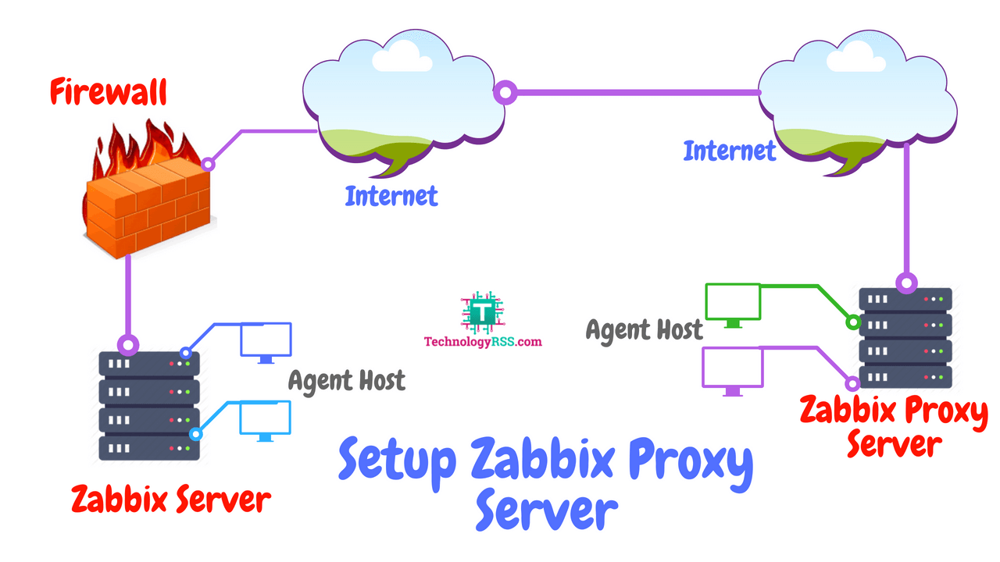

# Zabbix Processes

## 1. Server 

Zabbix server là tiến trình xử lý trung tâm của phần mềm zabbix.

Server thực hiện polling và trapping data, tính toán các triggers, gửi các thông báo cho người dùng. Nó là thành phần trung tâm, nơi để các Zabbix agents và proxies report data về tính toàn vẹn và khả dụng của hệ thống. Server có thể điều khiển được chính nó để check các service được kết nối (như web server và mail servers) sử dụng các service checks đơn giản.

Server là các kho lưu trữ trung tâm với tất cả các cấu hình, thống kê và hoạt động của data đều được lưu trữ, và nó là các entity trong zabbix, những cái mà sẽ kích hoạt cảnh báo cho các administrators khi có vấn đề phát sinh trong bất kỳ hệ thống đang được giám sát nào.

Chức năng của Zabbix server cơ bản được chia làm 3 phần riêng biệt là: Zabbix server, web frontend và database storage.

Tất cả các thông tin cấu hình cho Zabbix được lưu trữ lại trong database để cả server và web frontend đều có thể kết nối tới. Ví dụ khi bạn tạo một item mới sử dụng web frontend (hoặc API) thì nó sẽ được add vào items table trong database. Sau đó, khoảng mỗi phút một lần, Zabbix server sẽ query vào items table để biết được danh sách các items đang hoạt động,  sau đó sẽ được lưu trữ trong cache trên server. Điều này lý giải tại sao phải mất tới hai phút cho bất kỳ hành động thay đổi nào trên Zabbix frontend được show ra trong data section gần đây nhất.

**Start up manually**

```sh
$ zabbix_server
-c --config <file>              path to the configuration file (default is /usr/local/etc/zabbix_server.conf)
-R --runtime-control <option>   perform administrative functions
-h --help                       give this help
-V --version                    display version number
```

Ví dụ khởi chạy zabbix bằng command line với các tham số tùy chọn:

```sh
shell> zabbix_server -c /usr/local/etc/zabbix_server.conf
shell> zabbix_server --help
shell> zabbix_server -V
```

**Runtime control**

Một số các tùy chọn runtime control:

<table>
  <tr>
    <th>Option</th>
    <th>Description</th>
    <th>Target</th>
  </tr>
  <tr>
    <td>config_cache_reload</td>
    <td>	Reload configuration cache. Ignored if cache is being currently loaded.</td>
    <td>&nbsp;</td>
    
  </tr>
  <tr>
    <td>housekeeper_execute</td>
    <td>Start the housekeeping procedure. Ignored if the housekeeping procedure is currently in progress.</td>
    <td>&nbsp;</td>
  </tr>
  <tr>
    <td>log_level_increase[=<&lt;target&gt;>]</td>
    <td>Increase log level, affects all processes if target is not specified.</td>
    <td rowspan="2"><b>process type</b> - All processes of specified type (e.g., poller) See all server process types.<br> <b>process type,N</b> - Process type and number (e.g., poller,3)
pid - Process identifier (1 to 65535). For larger values specify target as 'process type,N'.</td>
  </tr>
  <tr>
    <td>log_level_decrease[=<&lt;target&gt;>]</td>
    <td>Decrease log level, affects all processes if target is not specified.</td>
  </tr>
</table>

Ví dụ:

```sh
zabbix_server -c /usr/local/etc/zabbix_server.conf -R config_cache_reload

#hoặc 

zabbix_server -c /usr/local/etc/zabbix_server.conf -R housekeeper_execute
```

[Xem thêm](https://www.zabbix.com/documentation/4.4/manual/concepts/server)

**Process user** 

Zabbix server được thiết kế để chạy như một non-root user. Nó sẽ chạy với bất cứ một non-root user nào từ khi được started. Vì vậy bạn có thể chạy server với bất cứ user nào không cần quyền root mà không gặp bất cứ vấn đề gì.

Nếu bạn muốn cố chạy nó như root, nó sẽ chuyển đổi hardcoded 'zabbix' user, phải có mặt trên hệ thống của bạn. Bạn có thể chạy máy chủ dưới dạng root, thì phải sửa tham số 'AlowRoot' trong cấu hình của server.

Nếu zabbix server và agent đang chạy trên cùng một máy, thì nên sử dụng user khác để chạy server so với running agent. Nếu không thì cả hai sẽ phải chạy dùng user, agent có thể kết nối tới server configuration file và bất kỳ một Admin level user nào trong Zabbix đều có thể khá dễ dàng lấy được, ví dụ như database password.

**Server process types**

* `alert manager` - manager of alerter tasks
* `alerter` - process for sending notifications
* `configuration syncer` - process for managing in-memory cache of configuration data
* `discoverer` - process for discovery of devices
* `escalator` - process for escalation of actions
* `history syncer` - history DB writer
* `housekeeper` - process for removal of old historical data
* `http poller` - web monitoring poller
* `icmp pinger` - poller for icmpping checks
* `ipmi manager` - IPMI poller manager
* `ipmi poller` - poller for IPMI checks
* `java poller` - poller for Java checks
* `lld manager` - manager process of low-level discovery tasks
* `lld worker` - worker process of low-level discovery tasks
* `poller` - normal poller for passive checks
* `preprocessing manager` - manager of preprocessing tasks
* `preprocessing worker` - process for data preprocessing
* `proxy poller` - poller for passive proxies
* `self-monitoring` - process for collecting internal server statistics
* `snmp trapper` - trapper for SNMP traps
* `task manager` - process for remote execution of tasks requested by other components (e.g. close problem, acknowledge problem, check item value now, remote command functionality)
* `timer` - timer for processing maintenances
* `trapper` - trapper for active checks, traps, proxy communication
* `unreachable poller` - poller for unreachable devices
* `vmware collector` - VMware data collector responsible for data gathering from VMware services

Các server log files có thể được sử dụng để quan sát các process types này.

**Supported platforms**

Zabbix server hỗ trợ chạy trên các platforms sau:

* Linux
* Solaris
* AIX
* HP-UX
* Mac OS X
* FreeBSD
* OpenBSD
* NetBSD
* SCO Open Server
* Tru64/OSF1

Ngoài ra zabbix cũng có thể làm việc với một số các hệ điều hành khác tương tự với unix

## 2. Agent

Zabbix agent được triển khai trên một  monitoring target để chủ động monitor các local resource và applications (hard drives, memory, processor statiscs,...)

Agent sẽ thu thập các thông tin hoạt động của hệ thống local sau đó gửi về cho Zabbix server để tiếp tục xử lý. Trong trường hợp lỗi (ví dụ có một hard disk chạy full hoặc crashed service process), Zabbix server sẽ thực hiện cảnh báo cho người quản trị thông tin về máy cụ thể đang gặp sự cố.

Zabbix agent cực kỳ có hiệu quả bởi sử dụng các cuộc gọi hệ thống đơn giản để thu thập thống kê các thông tin của hệ thống.

**Passive and active checks**

Zabbix agents có thể thực hiên passive check và active checks.

Trong một passive check, agent sẽ phản hồi lại các data requests. Zabbix server (hoặc proxy) yêu cầu data, ví dụ như CPU load, và zabbix agent sẽ gửi trả lại kết quả.

Ngược lại, Active check sẽ yêu cầu nhiều xử lý phức tạp hơn. Đầu tiên, agent sẽ phải lấy danh sách các items cho Zabbix server để xử lý đọc lập. Sau đó nó sẽ gửi định kỳ các giá trị mới về cho server.

Việc lựa chọn cấu hình passive check hay active check còn tùy thuộc và tùng loại item. 

**Supported platforms**

* Linux
* IBM AIX
* FreeBSD
* NetBSD
* OpenBSD
* HP-UX
* Mac OS X
* Solaris: 9, 10, 11
* Windows: all desktop and server versions since XP

**Unix agent cli**

```sh
[root@zabbix-server ~]# zabbix_agentd --help
usage:
  zabbix_agentd [-c config-file]
  zabbix_agentd [-c config-file] -p
  zabbix_agentd [-c config-file] -t item-key
  zabbix_agentd [-c config-file] -R runtime-option
  zabbix_agentd -h
  zabbix_agentd -V

A Zabbix daemon for monitoring of various server parameters.

Options:
  -c --config config-file        Path to the configuration file
                                 (default: "/etc/zabbix/zabbix_agentd.conf")
  -f --foreground                Run Zabbix agent in foreground
  -p --print                     Print known items and exit
  -t --test item-key             Test specified item and exit
  -R --runtime-control runtime-option   Perform administrative functions

    Runtime control options:
      log_level_increase=target  Increase log level, affects all processes if
                                 target is not specified
      log_level_decrease=target  Decrease log level, affects all processes if
                                 target is not specified

      Log level control targets:
        process-type             All processes of specified type (active checks,
                                 collector, listener)
        process-type,N           Process type and number (e.g., listener,3)
        pid                      Process identifier, up to 65535. For larger
                                 values specify target as "process-type,N"

  -h --help                      Display this help message
  -V --version                   Display version number

Default loadable module location:
  LoadModulePath                 "/usr/lib64/zabbix/modules"

Example: zabbix_agentd -c /etc/zabbix/zabbix_agentd.conf

Report bugs to: <https://support.zabbix.com>
Zabbix home page: <http://www.zabbix.com>
Documentation: <https://www.zabbix.com/documentation>
```

* Ví dụ sử dụng `-p` để hiển thị tất cả các item đã lấy được

```sh
[root@zabbix-server ~]# zabbix_agentd -p | head
agent.hostname                                [s|Zabbix server]
agent.ping                                    [u|1]
agent.version                                 [s|4.4.0]
system.localtime[utc]                         [u|1572418505]
system.run[echo test]                         [m|ZBX_NOTSUPPORTED] [Remote commands are not enabled.]
web.page.get[localhost,,80]                   [t|HTTP/1.1 403 Forbidden
Date: Wed, 30 Oct 2019 06:55:05 GMT
Server: Apache/2.4.6 (CentOS) PHP/5.4.16
Last-Modified: Thu, 16 Oct 2014 13:20:58 GMT
ETag: "1321-5058a1e728280"
```

**Agent process types**

* active checks: Quy trình thực hiện active checks
* collector: quá trình thu thập dữ liệu 
* listener: quá trình lắng nghe passive checks

Có thể sử dụng các agent log file để quan sát hoạt động của các process types này.

**Process user** 

Zabbix agent trên unix được thiết kế để chạy mà không cần root user, mặc định nó có thể được start bởi bất cứ một user không phải root. 

**Configuration file** 

Xem chi tiết hơn về file cấu hình của Zabbix agent trên Unix ở đây [zabbix_agent](https://www.zabbix.com/documentation/4.4/manual/appendix/config/zabbix_agentd)

## 3. Agent 2

Zabbix agent 2 là một phiên bản mới của Zabbix agent và có thể được sử dụng để thay thế Zabbix agent. Zabbix agent 2 được phát triển với các mục đích sau:

* Giảm số lượng TCP kết nối
* Have greater check concurrency
* Dễ dàng hơn trong việc mở rộng với các plugins. Một plugin có thể:

  * Cung cấp các kiểm tra thông thường, không quan trọng chỉ gồm vài dòng code đơn giản
  * Cung cấp các kiểm tra phức tạp, quan trọng bao gồm các long-running scripts và standalone data gathering với việc gửi lại dữ liệu định kỳ.

* Là một drop-in replacement cho Zabbix agent (trong đó hỗ trợ tất cả các chức năng trước đó)

Hiện tại việc hỗ trợ Zabbix agent 2 chỉ đang được thử nghiệm

Agent 2 được viết bằng Go (với một ít C code sử dụng lại từ Zabbix agent). Yêu cầu môi trường với Go version 1.12+ được cấu hình để build Zabbix agent 2.

Agent 2 không hỗ trợ daemonization. Passive check sẽ làm việc giống với Zabbix agent. Active check hỗ trợ scheduled/flexible intervals và check đồng thời trong một active server.

**Check concurrency** 

Việc checks từ các plugins khác nhau một cách đồng thời. Số lượng lượt checks đồng thời trong một plugin được giới hạn bởi việc thiết lập plugin capacity. Mỗi một plugin có một hardcoded capacity setting (mặc định là 100), có thể được hạn xuống bằng cách sử dụng `Plugin.<Plugin name>.Capacity=N` setting trong Plugins configuration [parameter](#)

* Các plugin đang được hỗ trợ:

  * RHEL/CentOS 8
  * SLES 15 SP1+
  * Debian 9, 10
  * Ubuntu 18.04

Zabbix agent 2 đã có sẵn trong các gói Zabbix được biên dịch sẵn, vì vậy để biên dịch zabbix agent 2 từ sources, cần thêm tùy chọn `--enable-agent2` để cấu hình.

* Để xem các option mà zabbix agent 2 hỗ trợ run command sau:

```sh
zabbix_agent2 --help
```

**Configuration file**

Mặc định file cấu hình sẽ được đặt tại `/usr/local/etc/zabbix_agent2.conf`. Để xem các cấu hình chi tiết xem ở đây [zabbix_agent2](https://www.zabbix.com/documentation/4.4/manual/appendix/config/zabbix_agent2)


## 3. Proxy



Zabbix proxy có thể thực hiện thu thập monitoring data từ một hoặc nhiều các thiết bị được monitored và gửi các thông tin về cho Zabbix server, có thể thấy proxy thay mặt cho zabbix server, đứng giữa server và agent. Tất cả các data thu thập được sẽ đều được bufferd locally và sau đó chuyển về cho Zabbix server.

Việc triển khai proxy là không bắt buộc, nhưng nó rất có lợi cho việc phân chia tải cho Zabbix server. Nếu các proxies chỉ thực hiện collect dữ liệu thì việc xử lý các dữ liệu trên server sẽ tốn ít CPU và disk I/O hơn.

Một Zabbix proxy là giải pháp lý tưởng để giám sát tập trung các địa điểm, các nhánh và mạng từ xa mà không phải là local administrators.

Zabbix proxy yêu cầu một database riêng biệt.

Một số các database được hỗ trợ bởi Zabbix proxy là SQLite, MySQL và PostgreSQL. Sử dụng Oracle hoặc IBM DN2 nó cũng có các nguy cơ riêng và một số các hạn chế, ví dụ trả về các giá trị của low-level discovery rule.

**Proxy process types**

* `configuration syncer` - process for managing in-memory cache of configuration data
* `data sender` - proxy data sender
* `discoverer` - process for discovery of devices
* `heartbeat sender` - proxy heartbeat sender
* `history syncer` - history DB writer
* `housekeeper` - process for removal of old historical data
* `http poller` - web monitoring poller
* `icmp pinger` - poller for icmpping checks
* `ipmi manager` - IPMI poller manager
* `ipmi poller` - poller for IPMI checks
* `java poller` - poller for Java checks
* `poller` - normal poller for passive checks
* `self-monitoring` - process for collecting internal server statistics
* `snmp trapper` - trapper for SNMP traps
* `task manager` - process for remote execution of tasks requested by other components (e.g. close problem, acknowledge problem, check item value now, remote command functionality)
* `trapper` - trapper for active checks, traps, proxy communication
* `unreachable poller` - poller for unreachable devices
* `vmware collector` - VMware data collector responsible for data gathering from VMware services


## 4. Java Gateway

Hỗ trợ giám sát các ứng dụng JMX tồn tại dưới dạng Zabbix daemon được gọi là "Zabbix Java gateway". Zabbix Java Gateway là một daemon được viết bằng java. Để tìm một giá trị cụ thể của JMX counter trên một host, Zabbix server sẽ thực hiện truy vấn Zabbix Java Gateway, nó sử dụng JMX manager API để query các ứng dụng đang được remote. Ứng dụng sẽ không cần cài thêm bất kỳ một phần mềm nào khác, nó chỉ cần start với option `-Dcom.sun.management.jmxremote` của command line start zabbix.

Java Gateway cho phép các kết nối từ Zabbix server hoặc proxy và có thể chỉ được sử dụng như một "passive proxy". Ngược với Zabbix proxy, nó cũng có thể được sử dụng từ Zabbix proxy (Zabbix proxies cannot be chained). Cho phép mỗi một Java gateway được cấu hình trực tiếp trong Zabbix server hoặc file cấu hình của proxy, vì vậy chỉ có một Java gateway được cấu hình cho một Zabbix server hoặc Zabbix proxy. Nếu một host có items thuộc loại **JMX agent** và các items kiểu khác, thì chỉ có **JMX agent** items mới được chuyển tới Java Gateway để đẩy ra ngoài.

Khi một item được update qua Java gateway, Zabbix server hoặc proxy sẽ được kết nối đến Java gateway và request dữ liệu, Java gateway lần lượt tiếp nhận, retrieves và passes trở lại cho server hoặc proxy. Java gateway không cache bất cứ giá trị nào.

Zabbix server hoặc proxy có một loại processes đặc biệt để kết nối tới Java gateway, được điều khiển bởi option `StartJavaPollers`. Java gateway sẽ chạy multiple threads, được điều khiển bởi tùy chọn `START_POLLERS`. Về phía server, nếu một kết nối bị thực hiện task với thời gian vượt timeout thì sẽ bị terminated, nhưng Java gateway có thể vẫn đang thực hiện lấy giá trị từ bộ đếm JMX counter. Để giải quyết vấn đề này, từ bản Zabbix 2.0.15, 2.2.10, 2.4.5 có thểm option trong Java gateway cho phép đặt tiemout cho các hoạt động JMX network.

Zabbix server và proxy sẽ cố gắng gộp các JMX target đơn lẻ cùng nhau nhiều nhất có thể (bị ảnh hưởng bởi các item intervals) và gửi chúng tới Java gateway trong một kết nối khiến cho hiệu năng sẽ tốt hơn.

`StartJavaPollers` nên nhỏ hơn hoặc bằng `START_POLLERS`, nếu không sẽ xảy ra tình huống là không có threads nào khả dụng trong Java gateway dành cho các service incoming requests; Trong trường hợp như vậy Java gateway sử dụng ThreadPoolExecutor.CallerRunsPolicy, nghĩa là thread chính sẽ phục vụ cho các incoming request và tạm thời sẽ không chấp nhận bất cứ các request mới nào.


## 5. Sender

Zabbix sender là một tiện ích command line có thể được sử dụng để gửi các dữ liệu hiệu năng về cho Zabbix server xử lý.

Tiện ích này thường sử dụng trong các long running user scripts cho việc sending định kỳ của các dữ liệu có sẵn và dữ liệu về hiệu năng.

Để gửi các kết quả trực tiếp tới Zabbix server hoặc proxy thì cần cấu hình một item kiểu `trapper item`.

## 6. Get

Zabbix get cũng là một tiện ích command line có thể được sử dụng để giao tiếp với Zabbix agent và lấy các thông tin được yêu cầu từ phía agent. 

Tiên ích thường được sử dụng cho việc troubleshooting  của Zabbix agent.

## 7. Một số command thông dụng 

* Lấy phiên bản của agent

```sh
zabbix_get -s 192.168.100.31 -k agent.version
```

* Xem các cổng của các tiến trình Zabbix đang hoạt động

```sh
netstat -tulpen|grep -i zabbix
```


