# Hướng dẫn cài đặt và cấu hình Zabbix 4.4 trên CentOS 7

**Tham khảo**: https://www.zabbix.com/documentation/4.4/manual/installation/getting_zabbix

## 1. Yêu cầu

**Memory**

Zabbix yêu cầu cả physical memory (ram) và disk memory (disk space). Chỉ với 128 MB physical memory và 256 MB free disk space là có thể start Zabbix một cách tốt đẹp. Tuy nhiên, dung lượng yêu cầu disk memory còn phụ thuộc vào số lượng host và các parameters  được giám sát. Nếu bạn thực hiện planning để giữ lại các parameters được giám sát thì nên để ra một vài GB để lưu trữ chúng trong một  khonagr thời gian trong database. Mỗi Zabbix daemon process yêu cầu một số các kết nối tới các database server. Dung lượng memory được cấp phát phụ thuộc vào cấu hình của database engine.

**CPU**

Zabbix và đặc biệt là Zabbix database có thể yêu cầu một lượng tài nguyên CPU đáng kể phụ thuộc vào số lượng các parameters được monitored và sự lựa chọn database engine.

**Một số các ví dụ cấu hình hardware với số lượng các host giám sát như sau:**

|Name	| Platform	|CPU/Memory	|Database	|Monitored hosts|
|---|-----|----|----|-----|
|Small	| CentOS	|Virtual Appliance	|MySQL InnoDB	|100|
|Medium	| CentOS	|2 CPU cores/2GB	|MySQL InnoDB	|500|
|Large	| RedHat Enterprise Linux|	4 CPU cores/8GB	|RAID10 MySQL InnoDB or PostgreSQL	|>1000|
|Very  large	|RedHat Enterprise Linux|	8 CPU cores/16GB	|Fast RAID10 MySQL InnoDB or PostgreSQL	|>10000|


Thực tế thì vẫn phải phụ thuộc vào số lượng các items và tốc độ refresh nhiều hay ít. Nếu triển khai với quy mô lớn thì nên thực hiện tách database ra một node riêng biệt để giảm thiểu các rủi ro.

## 2. Cài đặt Zabbix server trên CentOS 7 từ packages

### Bước 1: Cài đặt các gói cần thiết


* Cài đặt httpd và php

```sh
yum install httpd -y 
yum install php php-pear php-cgi php-common php-mbstring php-snmp php-gd php-pecl-mysql php-xml php-mysql php-gettext php-bcmath -y 
sed -i 's/;date\.timezone =/date\.timezone = Asia\/Ho_Chi_Minh/' /etc/php.ini
```

* Cài đặt Zabbix frontend hỗ trợ mysql và nginx:

```sh
yum install epel-release -y 
yum install zabbix-web-mysql zabbix-nginx-conf -y 
```

### Bước 2: Cài đặt và tạo database

* Cài đặt mariadb

```sh
cat << EOF >/etc/yum.repos.d/MariaDB.repo
[mariadb]
name = MariaDB
baseurl = http://yum.mariadb.org/10.1/centos7-amd64
gpgkey=https://yum.mariadb.org/RPM-GPG-KEY-MariaDB
gpgcheck=1
EOF
yum install mariadb-server galera  -y
systemctl start mariadb
systemctl enable mariadb

# add user root
mysql_secure_installation
```

* Tạo database cho Zabbix

```sh
mysql -u root -ptrang1234
Create database zabbix;
create user 'zabbix'@'localhost' identified BY 'trang1234';
grant all privileges on zabbix.* to zabbix@localhost ;
flush privileges;
exit
```


### Cài đặt Zabbix

* Cài đặt gói cấu hình repository 

```sh
rpm -Uvh https://repo.zabbix.com/zabbix/4.4/rhel/7/x86_64/zabbix-release-4.4-1.el7.noarch.rpm
```

* Cài đặt 

```sh
yum install -y zabbix-server-mysql zabbix-web-mysql zabbix-agent zabbix-get
```

* Cấu hình  database trên zabbix server trong file `/etc/zabbix/zabbix_server.conf`

```sh
DBHost=localhost
DBName=zabbix
DBUser=zabbix
DBPassword=trang1234
```

* Import database

```sh
zcat /usr/share/doc/zabbix-server-mysql*/create.sql.gz | mysql -u zabbix -ptrang1234 zabbix
```

### Bước 3: Khởi động Zabbix server process

* Tắt firewall và selinux

```sh
systemctl stop firewalld
systemctl disable firewalld
setenforce 0
sed -i 's/SELINUX=enforcing/SELINUX=disabled/g' /etc/selinux/config
```

* Nếu không tắt selinux

```sh
setsebool -P httpd_can_connect_zabbix on
# If the database is accessible over network (including 'localhost' in case of PostgreSQL), you need to allow Zabbix frontend to connect to the database too:
setsebool -P httpd_can_network_connect_db on
```

* Nếu không tắt firewall

```sh
firewall-cmd --add-service={http,https} --permanent
firewall-cmd --add-port={10051/tcp,10050/tcp} --permanent
firewall-cmd --add-service=mysql --permanent
firewall-cmd --reload
```

* Khởi động service 

```sh
systemctl start zabbix-server httpd
systemctl enable zabbix-server httpd
```

### Bước 4: Zabbix frontend configuration

* Chỉnh sửa file cấu hình `/etc/httpd/conf.d/zabbix.conf` 

```sh
php_value max_execution_time 300
php_value memory_limit 128M
php_value post_max_size 16M
php_value upload_max_filesize 2M
php_value max_input_time 300
php_value max_input_vars 10000
php_value always_populate_raw_post_data -1
php_value date.timezone Asia/Ho_Chi_Minh
```

* Chỉnh file `/etc/php-fpm.d/zabbix.conf`

```sh
php_value[max_execution_time] = 300
php_value[memory_limit] = 128M
php_value[post_max_size] = 16M
php_value[upload_max_filesize] = 2M
php_value[max_input_time] = 300
php_value[max_input_vars] = 10000
php_value[date.timezone] = Asia/Ho_Chi_Minh
```

* Khởi động lại dịch vụ 

```sh
systemctl restart httpd 
```

### Bước 5: Setup Zabbix Frontend

* Truy cập vào địa chỉ web interface của Zabbix

```sh
http://192.168.40.128/zabbix
```

* Thực hiện cài đặt và cấu hình trên web

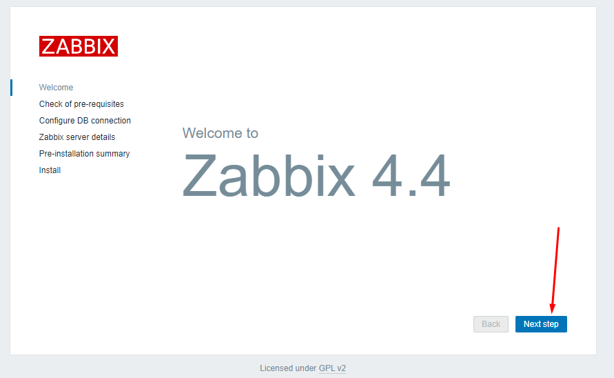


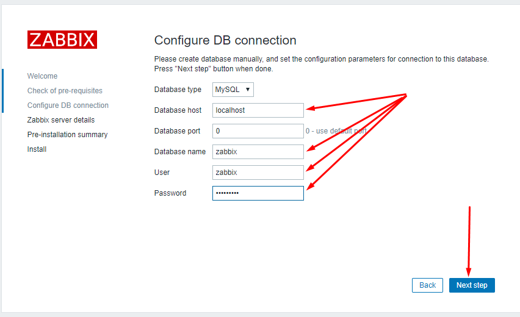

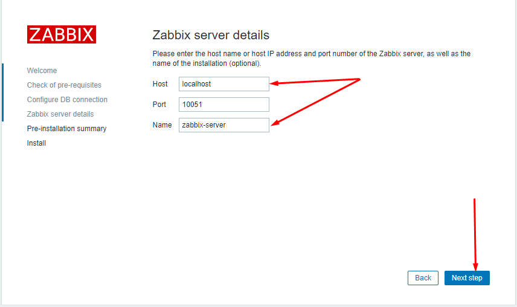

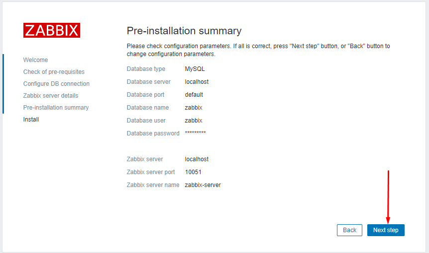

* Hoàn tất quá trình cài đặt


* Login vào hệ thống với username là `admin` và password là `zabbix`

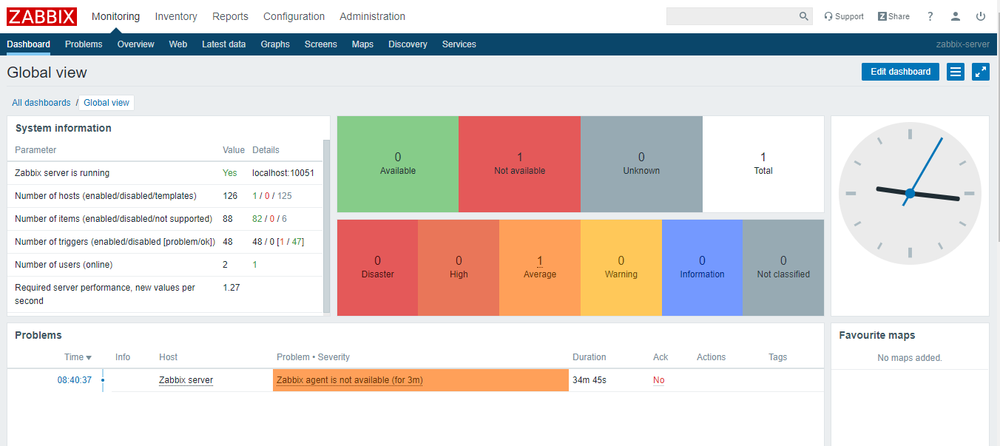


## 3. Cài đặt Agent trên một node CentOS 7

* Có hai kiểu checks giữa Zbbix server và zabbix client:

	* Passive check - Zabbix agent sẽ gửi dữ liệu tới server nếu server request
	* Active check - Zabbix agent sẽ chủ động gửi dữ liệu định kỳ cho server. 

* Thông tin host target

	* CentOS7
	* IP: 192.168.40.73
	* Hostname: compute2


* Cài đặt Zabbix agent trên các host target

```sh
rpm -Uvh https://repo.zabbix.com/zabbix/4.4/rhel/7/x86_64/zabbix-release-4.4-1.el7.noarch.rpm
yum install zabbix-agent -y
```

* Khởi động process

```sh
systemctl start zabbix-agent 
```

* Cấu hình file `/etc/zabbix/zabbix_agentd.conf`

```sh
#Server=[zabbix server ip]
#Hostname=[ Hostname of client system ]

Server=192.168.40.128
Hostname=compute2 
```

**Lưu ý**: Phần Hostname là tên của client và phải được cấu hình trùng với Hostname khi add agent trên zabbix server 

* Khởi động lại service 

```sh
systemctl restart zabbix-agent
systemctl enable zabbix-agent
```

## 4. Add host trên Zabbix server

* Vào giao diện web của Zabbix server thực hiện các bước như sau:

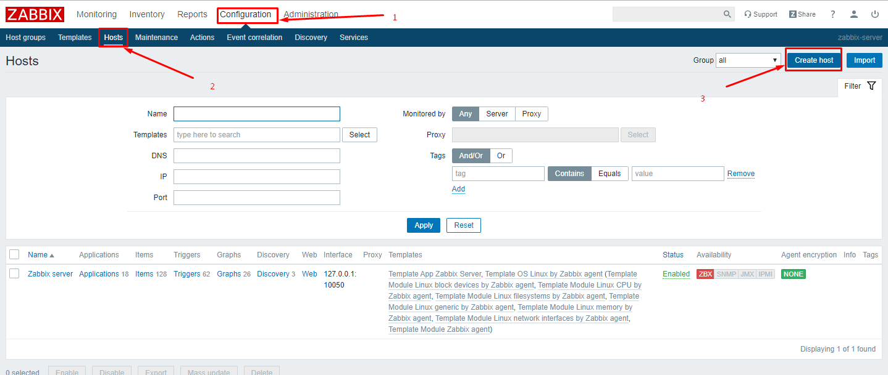

* Đầu tiên cần tạo một host, điền các thông tin cần thiết về host cần giám sát (phần Hostname cần phải giống với Hostname khi cấu hình agent)

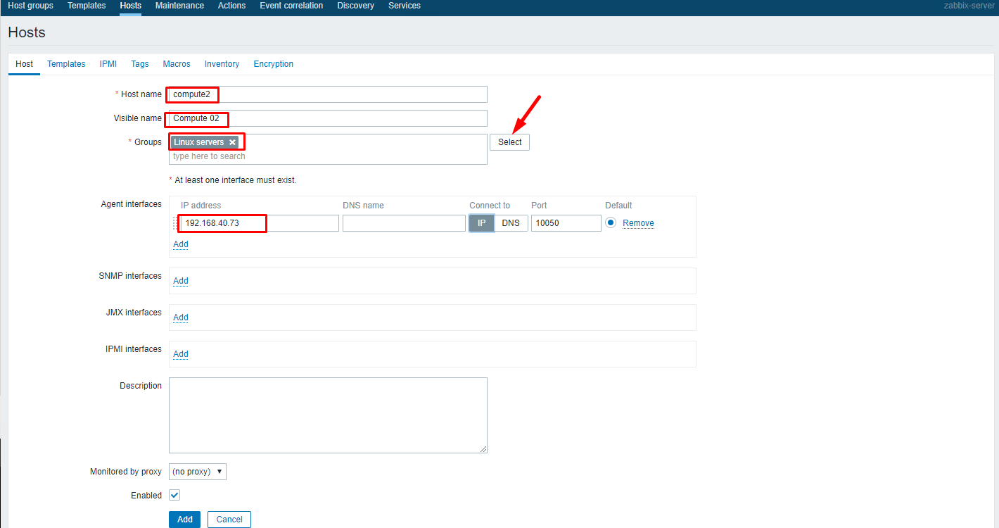

* Chuyển tab Templates để cấu hình

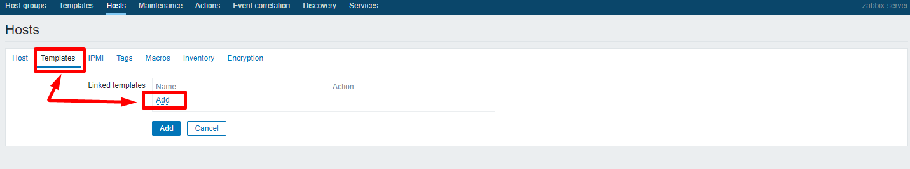


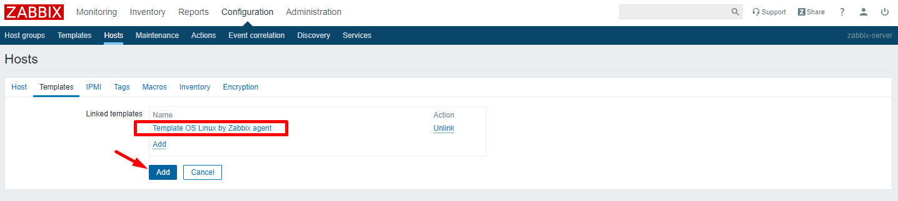

* Sau khi add thành công ta sẽ thấy host mới được add tại đây

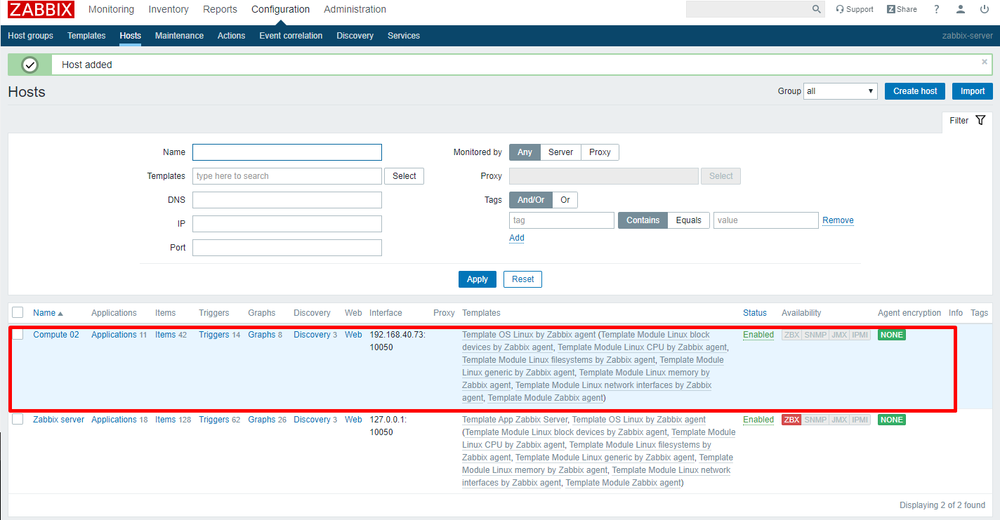

* Xem biểu đồ mới được sinh ra 

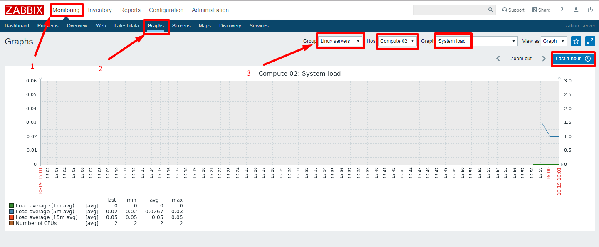


## 5. Add Zabbix Agent on Windows System

* Tải bản Zabbix agent dành cho windows về tại link sau

```sh
https://www.zabbix.com/downloads/4.4.0/zabbix_agent-4.4.0-win-amd64-openssl.msi
```

* Khởi chạy file cài đặt 

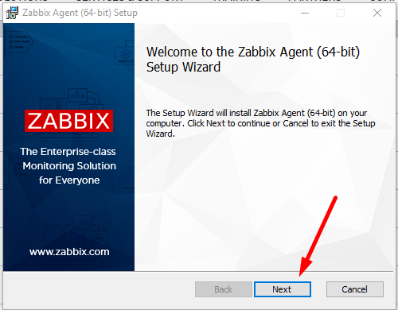

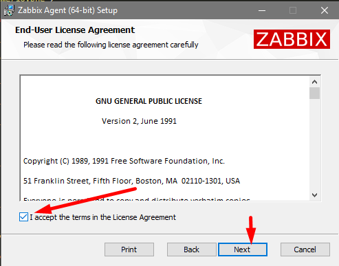

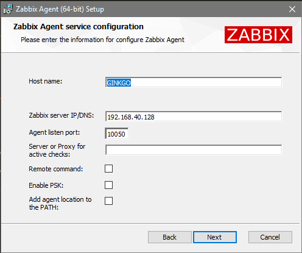

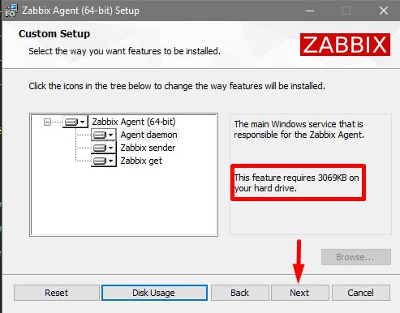

* Các file cấu hình thông thường sẽ được đặt trong thư mục `C:\Program Files\Zabbix Agent`

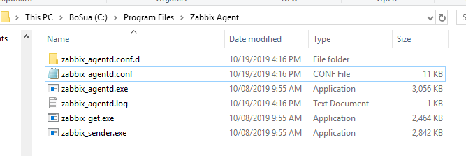

* Kiểm tra các service 

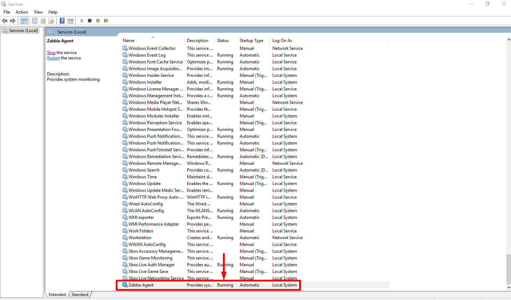

[Tham khảo thêm](https://tecadmin.net/install-zabbix-agent-windows-system/)

* Add host trên giao diện web của Zabbix server 

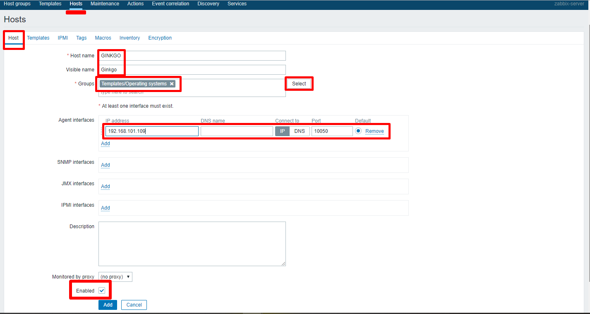

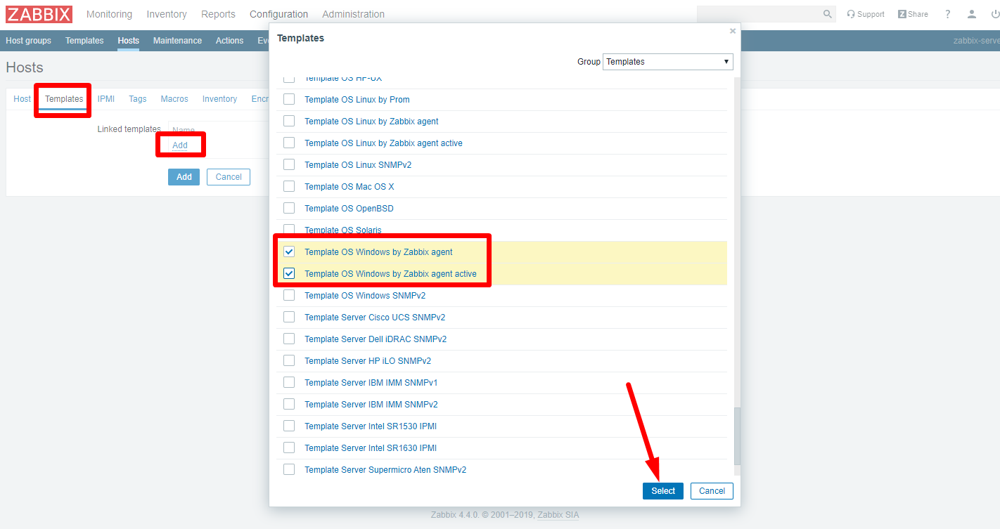

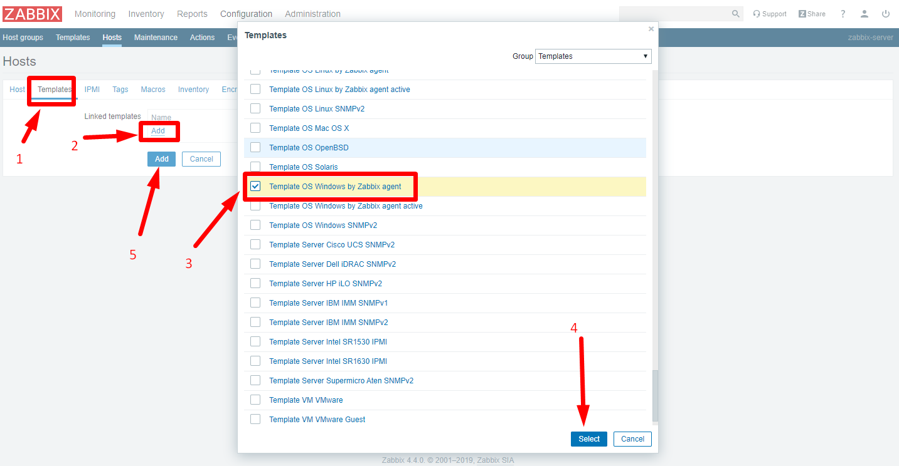

* Host mới được tạo ra

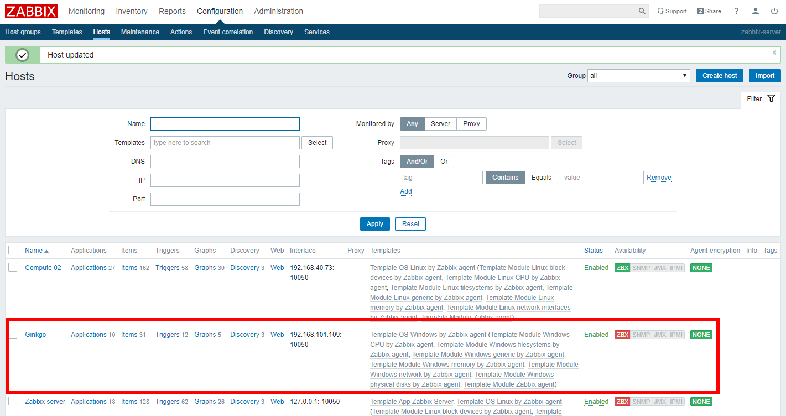

* Xem graph

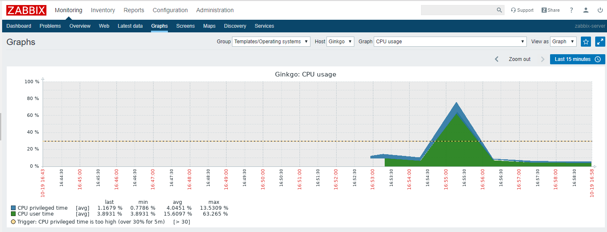


## 6. Zabbix agent on Pfsense

* Đâu tiên cần truy cập vào giao diện web của Pfsense, login và tải gói Zabbix agent trong mục **System** -> **Package Manager** -> **Available Packages**, tìm và cài đặt gói `pfSense-pkg-zabbix-agent44`


* Cấu hình Zabbix agent


* Cấu hình các thông tin để kết nối tới Zabbix server


* Nếu port trên vlan này trên pfsense chưa được mở thì vào phần **Firewall** -> **Rules** để chỉnh sửa.

* Trên Zabbix server, vào phần **Configuration** để add thêm host.


* Cài thêm gói Cron trên Pfsense


* Thêm một Cron job


* Sau khi cấu hình xong, lưu lại cấu hình và lên Zabbix server xem


## Config file `/etc/zabbix/zabbix.conf`

* Chỉnh sửa log type 

```sh
LogType=system
```


## Tham khảo

[1] https://www.zabbix.com/documentation/4.4/manual/installation/install_from_packages/rhel_centos

[2] https://www.fosslinux.com/7705/how-to-install-and-configure-zabbix-on-centos-7.htm

[3] https://tecadmin.net/install-zabbix-network-monitoring-on-centos-rhel-and-fedora/