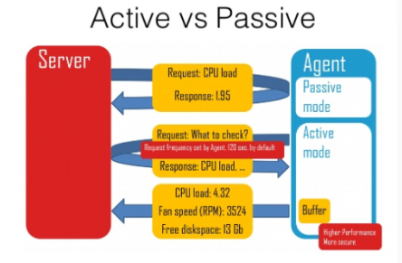
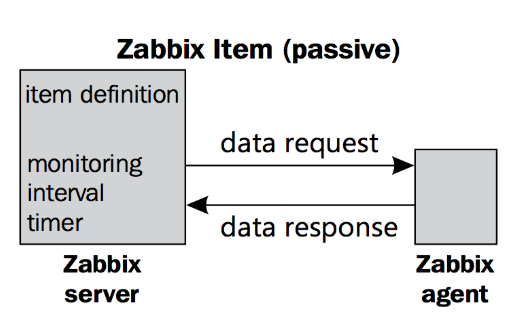

## Sự khác nhau giữa Active check và Passive check

Zabbix có hai kiểu check là Passive checks và Active checks

* **Passive checks (polling)**
	* Zabbix server hoặc proxy sẽ yêu cầu một giá trị nào đó từ Zabbix agent
	* Agent sẽ xử lý request và trả giá trị về cho zabbix server 

* **Active checks (trapping)**
	* Zabbix agent được yêu cầu từ Zabbix server hoặc proxy một danh sách các active checks
	* Agent sẽ tự động gửi kết quả về server theo định kỳ.



### Zabbix Passive checks 



* Một Zabbix item được coi là passvie sẽ được thực hiện check một cách **chủ động từ phía Zabbix server**. Phía Zabbix server sẽ thực hiện gửi yêu cầu đến phía Agent vào các khoảng thời gian (inteval time) đã được cấu hình cho các item tương ứng, hỏi thông số của các item (ví dụ CPU load), Agent sẽ thực hiện lấy các thông tin được yêu cầu và gửi lại cho phía server.

* Chi tiết quá trình như sau

	* Zabbix server mở kết nối đến Zabbix agent 
	* Server gửi thông tin item mong muốn. Ví dụ <HEADER><DATALEN>agent.ping
	* Agent nhận được thông tin của item, xử lý và phản hồi lại kết quả được thu thập cho phía server. Ví dụ: <HEADER><DATALEN>1
	* Server xử lý dữ liệu được response từ phía agent, lấy giá trị thu thập được
	* Đóng kết nối TCP

* Nội dụng gói tin được request từ phía server 

```sh
<item key>
```

* Nội dung gói tin response từ phía agent, giá trị trả về là `1`

```sh
<DATA>[\0<ERROR>]
```

### Zabbix Active checks

* Một Zabbix item được coi là active (chủ động) sẽ được thực hiện check một các **chủ động từ phía Zabbix agent**. Active check sẽ yêu cầu việc xử lý phức tạp hơn. Đầu tiên agent cần phải lấy danh sách các items từ phía server để xử lý độc lập. Các thông tin về server sẽ được liệt kê trong tham số `ServerActive` được cấu hình trong file cấu hình của Zabbix agent, và cấu hình tần số request hỏi server được thiết lập trong tham số `RefreshActiveChecks`. Tuy nhiên nếu refreshing active check fails thì nó sẽ thư lại sau 60s hardcoded. Xem thêm các tham số cấu hình cho agent ở đây [configuration file.](https://www.zabbix.com/documentation/4.4/manual/appendix/config/zabbix_agentd) 

* Sau đó agent sẽ gửi định kỳ các giá trị mới cho tất cả các servers đã được cấu hình.

**Getting the list of items**

* Agent request

```sh
{
    "request":"active checks",
    "host":"<hostname>"
}
```

* Server response

```sh
{
    "response":"success",
    "data":[
        {
            "key":"log[/home/zabbix/logs/zabbix_agentd.log]",
            "delay":30,
            "lastlogsize":0,
            "mtime":0
        },
        {
            "key":"agent.version",
            "delay":600,
            "lastlogsize":0,
            "mtime":0
        },
        {
            "key":"vfs.fs.size[/nono]",
            "delay":600,
            "lastlogsize":0,
            "mtime":0
        }
    ]
}
```

Mỗi một item trả về cần phải có đầy đủ tất cả các thuộc tính sau: key, delay, lastlogsize và mtime, bất kể item đó có phải là log hay không

Quá trình thực hiện cụ thể

* Agent thực hiện mở môt TCP connection
* Agent hỏi server danh sách checks
* Server phản hồi lại cho agent danh sách các item (item key, delay)
* Agent phân tích response
* Dóng kết nối TCP
* Agent bắt đầu thực hiện collection data và gửi định kỳ về server

**Sending in collected data**

* Agent sends

```sh
{
    "request":"agent data",
    "session": "12345678901234567890123456789012",
    "data":[
        {
            "host":"<hostname>",
            "key":"agent.version",
            "value":"2.4.0",
            "id": 1,
            "clock":1400675595,            
            "ns":76808644
        },
        {
            "host":"<hostname>",
            "key":"log[/home/zabbix/logs/zabbix_agentd.log]",
            "lastlogsize":112,
            "value":" 19845:20140621:141708.521 Starting Zabbix Agent [<hostname>]. Zabbix 2.4.0 (revision 50000).",
            "id": 2,
            "clock":1400675595,            
            "ns":77053975
        },
        {
            "host":"<hostname>",
            "key":"vfs.fs.size[/nono]",
            "state":1,
            "value":"Cannot obtain filesystem information: [2] No such file or directory",
            "id": 3,
            "clock":1400675595,            
            "ns":78154128
        }
    ],
    "clock": 1400675595,
    "ns": 78211329
}
```

Một virtual được gán cho mỗi một value. Value ID đơn là số thứ tự được tăng dần đều, là duy nhất trong một data session (được định nghĩa bởi session token). ID này được sử dụng để loại bỏ sự trùng lặp value có thể xảy ra trong một môi trường kết nối kém.

* Server response

```sh
{
    "response":"success",
    "info":"processed: 3; failed: 0; total: 3; seconds spent: 0.003534"
}
```

Các bước thực hiện:

* Agent mở một kết nối TCP tới Server 
* Agent gửi một danh sách các giá trị của các items active
* Server xử lý dữ liệu và gửi lại trạng thái cho phép client
* Đóng kết nối TCP


**Tổng kết**

* PASSIVE - ZABBIX SERVER (poller) -> AGENT (10050/TCP)

Configuration -> Actions -> Steps -> Remote command -> net start <service_name>

```sh
[root@zabbix-server zabbix]# zabbix_get -s 192.168.100.31 -k system.cpu.load
3.850000
[root@zabbix-server zabbix]# time zabbix_get -s 192.168.100.31 -k system.cpu.load
3.940000

real    0m0.005s
user    0m0.002s
sys     0m0.002s

[root@zabbix-server zabbix]# zabbix_get  -s 192.168.100.31 -k system.hostname
mdt-server31
```


* ACTIVE - AGENT -> ZABBIX SERVER (trapper) (10051/TCP)


## Tham khảo

[1] https://cuongquach.com/su-khac-biet-giua-zabbix-active-va-passive.html

[2] https://www.zabbix.com/documentation/4.4/manual/appendix/items/activepassive#passive_checks