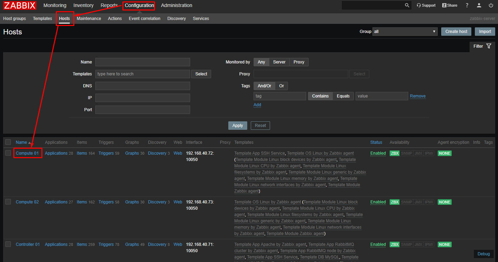
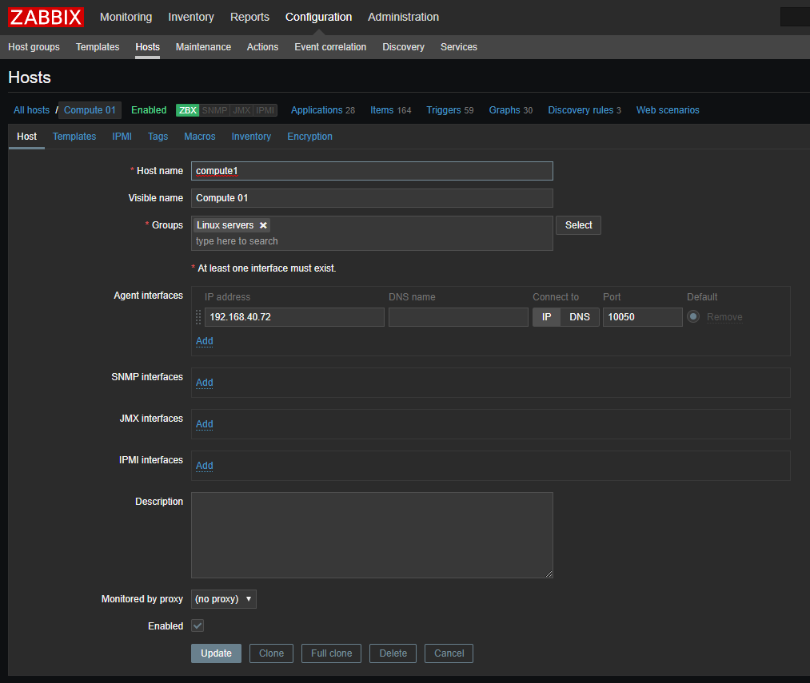

# Hosts and host groups

**Host** là những thiết bị mà bạn muốn theo dõi (servers, workstations, switches,...)

Việc tạo host là việc đầu tiên cần phải làm khi muốn monitoring với Zabbix. Ví dụ nếu bạn muốn theo dõi một vài tham số trên một server `x`, thì đầu tiên bạn cần phải tạo là một `host` với tên là `Server X` và sau đó bạn có thể cấu hình thêm các item giám sát cho nó.

Các host sẽ được tổ chức theo các host groups.

## Configuring a host

Để cấu hình một host trên frontend:

* Đi đến `Configuration → Hosts`
* Chọn `Create host` ở phía trên bên phải, hoặc chọn một host bất kỳ đang tồn tại để chỉnh sửa
* Điền thông tin của host tương ứng vào các form

Ngoài ra, bạn có thể `Clone`, `Full clone` các host hiện đã tồn tại sẵn để tạo một host mới tương tự. Nếu click vào `Clone` thì sẽ giữ lại  all host parameters and template linkage (giữ lại tất cả các entities từ các templates của chúng). Nếu chọn `Full clone` sẽ giữ lại thêm các entities đang được kết nối trực tiếp (applications, items, triggers, graphs, low-level discovery rules and web scenarios).

**Chú ý**: Khi một host được cloned, nó sẽ giữ lại tất các cả template entities như ban đầu của template. Bất cứ một thay đổi các entities nào trên host hiện tại (ví dụ item interval thay đổi regular expression hoặc thêm các prototypes cho the low-level discovery rule) sẽ không được cloned sang host mới, chúng sẽ được giữ nguyên như template gốc.

### Cấu hình host trên frontend

## Inventory

Bạn có thể giữ các inventory của các devices được kết nối trong zabbix.

## Tham khảo

[1] https://www.zabbix.com/documentation/4.4/manual/config/hosts/host

