# 1. Item

Items là cơ sở của việc thu thập dữ liệu trong Zabbix. Nếu không có Items thì không có data, bởi chỉ một item định nghĩa ra một metric đơn hoặc những dữ liệu nào được đi ra khỏi máy.


## 1.1 Item types

Có rất nhiều Item types khác nhau để thực hiện lấy các thông số của hệ thống. Mỗi một loại hỗ trợ item key và các tham số đi kèm riêng.

Các loại item hiện đang được hỗ trợ bởi zabbix là:

* Zabbix agent checks
* SNMP agent checks
* SNMP traps
* IPMI checks
* Simple checks
	* VMware monitoring
* Log file monitoring
* Calculated items
* Zabbix internal checks
* SSH checks
* Telnet checks
* External checks
* Aggregate checks
* Trapper items
* JMX monitoring
* ODBC checks
* Dependent items
* HTTP checks

Có thể nhiều interface được set khi định nghĩa host: Zabbix agent, SMNP agent, JMX và IPMI. Nếu một item có thể sử dụng nhiều hơn một interface thì nó sẽ tìm hiểu tất cả các host interfaces có sẵn (theo thứ tự: Agent -> SNMP -> JMX -> IPMI) cho đến khi tìm thấy một loại phù hợp được liên kết.

Tất cả các items trả về text (character, log, text types of information) có thể trả về một khoảng trống và có thẻ được thiết lập để trả về một chuỗi trống (được hỗ trợ từ bản 2.0).


## 1.2 Adding item

Tất cả các items sẽ được nhóm theo hosts, vì vậy muốn cấu hình cho item thì cần thực hiện chọn vào `Configuration → Hosts`, trên hàng của từng host đã được tạo trước đó sẽ có `Items` link tương ứng. Click vào link sau đó chọn `Create item` 

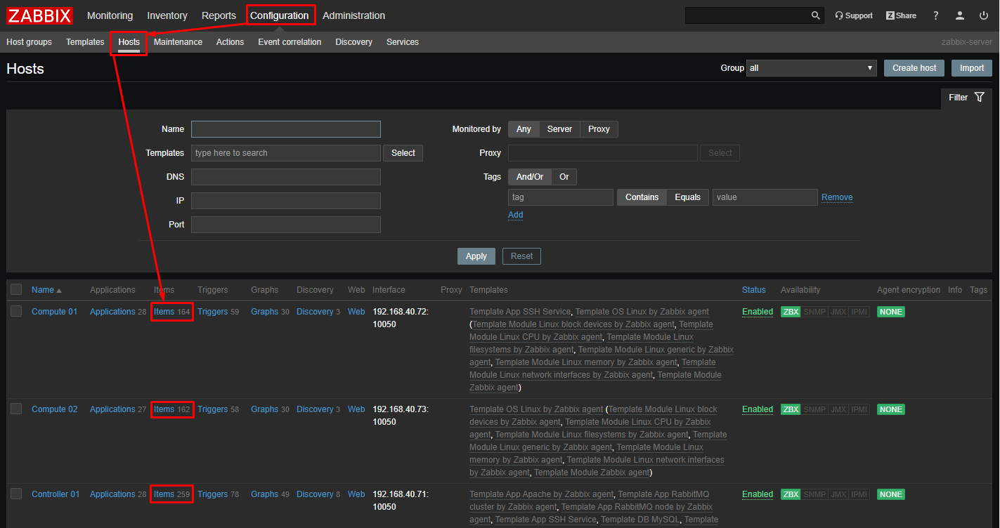

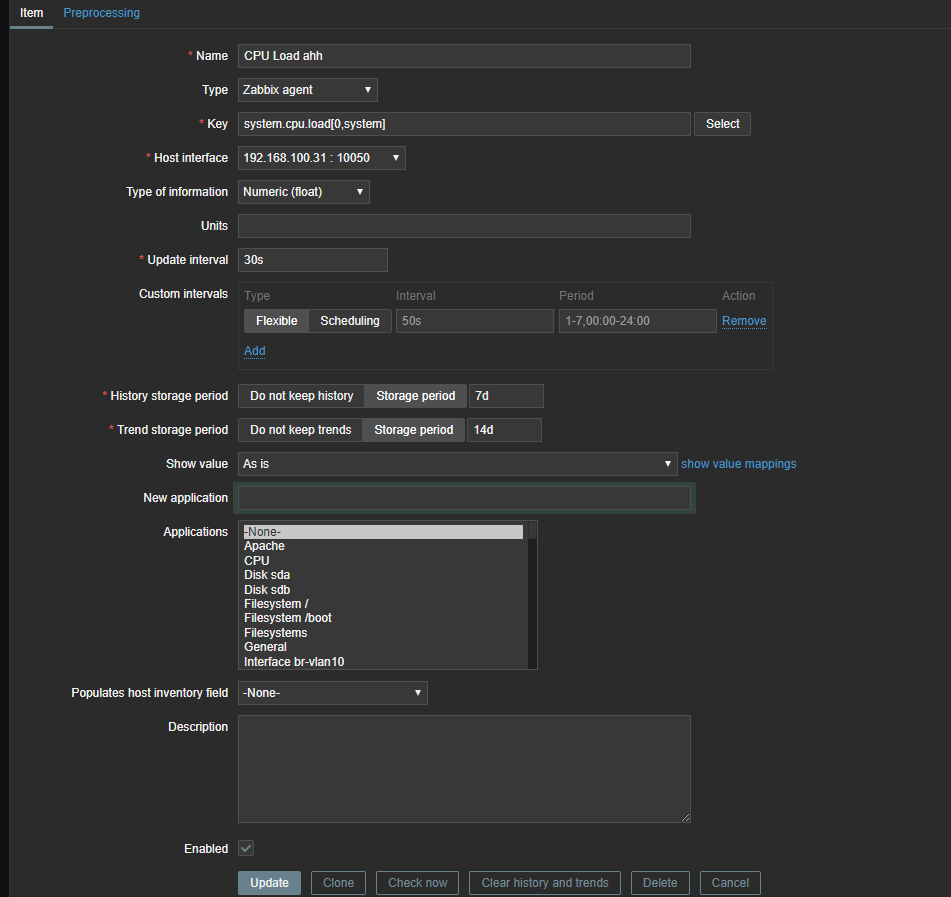

Trong đó:

* **Name**: điền vào giá trị là CPU Load. Đây sẽ alf tên của item sẽ được hiển thị trong các danh sách ở bất cứ đâu.

* **Key**: Nhập thủ công hoặc chọn system.cpu.load. Đây là tên kỹ thuật của một item để định danh loại thông tin được thu thập. Một key cụ thể là duy nhất và sẽ cần được định nghĩa trước  khi cấu hình Zabbix agent ([pre-defined keys](https://www.zabbix.com/documentation/4.4/manual/config/items/itemtypes/zabbix_agent))

* **Type of information**: Chọn `Numeric (float)` để phù hợp với loại dữ liệu này. Đây là thuộc tính để định dạng cho dư liệu được mong đợi.

* Bạn cũng có thể giảm số item history sẽ được giữ 7 hoặc 14 ngày, để giảm khối lượng lưu trữ các giá trị history.

* **Update interval**: là khoảng thời gian lấy một giá trị mới. Giá trị Update interval tối đa được cho phép là 86400s (1 ngày). Hỗ trợ time suffixes, ví dụ: 30s, 1m, 2h, 1d. User macros cũng được hỗ trợ. 

	* Nếu giá trị được set là `0` thì item đó sẽ không được polled. Tuy nhiên, nếu có một custom interval (flexible/scheduling) cũng tồn tại với một giá trị khác 0, item sẽ được polled trong khoảng thời gian custom interval được cấu hình đó. Item poll đầu tiên sẽ được thực hiện sau khi item active hoặc sau khi update interval thay đổi và tới sớm hơn so với giá trị được cấu hình.

	* Một passive item đang tồn tại có thể sẽ được polled ngay lập tức nếu chọn nút `Check now`. 

* **Custom intervals**: Bạn có thể tạo các custom rules để check item:

	* **Flexible** tạo một ngoại lệ (exeption) để ***Update interval*** (interval với các frequency khác nhau)
	* **Scheduling** tạo một lịch tùy chọn để polling cho item. Scheduling đưuọc hỗ trợ từ bản Zabbix 3.0.0
	* Time suffixes và user marcos đều được hỗ trợ nhưng không hả dụng với các zabbix agent active items.

* **History storage period**: Chọn một trong hai:

	* **Do not keep history** - item history sẽ không được lưu trữ lại. Thiết lập này sẽ không bị ghi đè bởi global housekeeper settings.

	* **Storage period** - chỉ ra khoảng thời gian để giữ lại các aggregated history (hourly min, max, avg, count) trong database (từ 1 day đến 25 years). Dữ liệu cũ sẽ bị xóa bởi housekeeper. Được lưu trữ trong vài giây. 

	* `Storage period` có thể sẽ bị ghi đè bởi cấu hình global trong `Administration → General → Housekeeper.`([ví dụ cấu hình](https://www.zabbix.com/documentation/4.4/manual/web_interface/frontend_sections/administration/general#housekeeper)). Nếu một global overriding setting tồn tại thì một  info icon sẽ được hiện thị màu xanh. Nếu bạn đặt con trỏ chuột qua đó sẽ có một dòng tin nhắn cảnh báo hiện ra (ví dụ: Overridden by global housekeeper settings (7d).).

	* Chú ý: Việc giữ lại các trend sẽ không khả dụng với các non-numeric data như character, log and text.


### Item key format

Item key format bao gồm key parameters phải theo đúng các syntax rules. Các hình minh họa dưới đây sẽ mô tả các syntax được hỡ trợ. Các elements và các characters cho mỗi point có thể được xác định bởi các mũi tên.

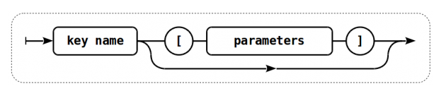


Để có một item key hợp lệ, người ta sẽ bắt đầu với một key name, sau đó có thể lựa chọn sử dụng tham số hoặc không 

**Key name** là tên khóa được giới hạn bởi một số lượng ký tự nhất định được cho phép, các ký tự được cho phép là những ký tự sau:

```sh
0-9a-zA-Z_-.
```

* Điều này cho thấy các ký tự được cho phép là:

	* Tất cả các ký tự số từ 0-9 
	* Tất cả các ký tự in thường từ a-z
	* Tất cả các ký tự in hoa từ A-Z
	* underscore (gạch dưới)
	* dash (gạch ngang)
	* dot (dấu chấm)

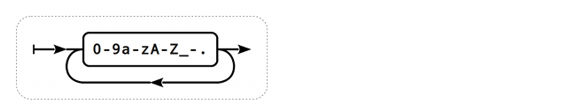

**Key parameters**

Một item key có thể có nhiều parameters cách nhau bởi dấu phẩy `,`

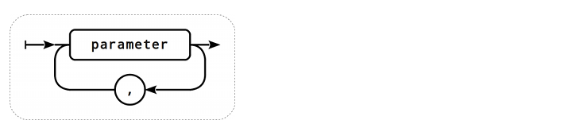

Mỗi key parameters có thể là một chuỗi được trích dẫn (quoted) hoặc unquoted hoặc là một mảng

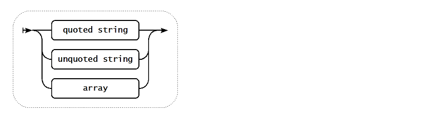

**Parameter - quoted string**

Nếu key parameterslà một quoted string thì bất cứ một ký tự Unicode nào cũng đều được cho phép và bao gồm double quotes (") nhưng phải được đánh dấu trước đó là backslash escaped (\).

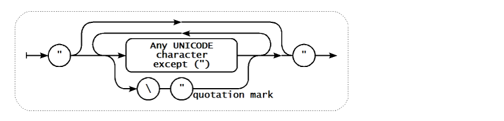

**Parameter - unquoted string**

Nếu key parameters là một unquoted string thì bất cứ Unicode characters nào đều được cho phép ngoại trừ comma (dấu phẩy `,`) và dấu ngoặc vuông bên phải (right square bracket `]`). Unquoted parameter không thể start với left square bracket (`[`).

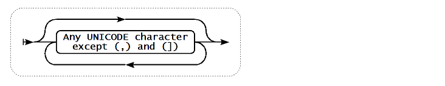

**Parameter - array**

Nếu key parameter là một mảng thì nó sẽ được đặt trong một cặp dâu ngoặc vuông, trong đó các từng tham số riêng lẻ phải đều phải phù hợp với các quy tắc và cú pháp cho các tham số cụ thể.

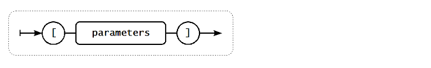


> Multi-level parameter arrays, e.g. [a,[b,[c,d]],e], are not allowed.

### Custom intervals

Khi một mục item được checked có thể tạo các rules tùy chỉnh về các khoảng thời gian. Có hai phương thức đó là ***Flexible intervals***, cho phép định nghĩa lại các update interval mặc định, và ***Scheduling***, nơi mà một item check có thể được thwujc thi tại một thời điểm hoặc một chuỗi thời điểm bất kỳ được chỉ định.

[Xem thêm](https://www.zabbix.com/documentation/4.4/manual/config/items/item/custom_intervals)

Ví dụ cấu hình ***Flexible intervals*** khi cấu hình cho một item

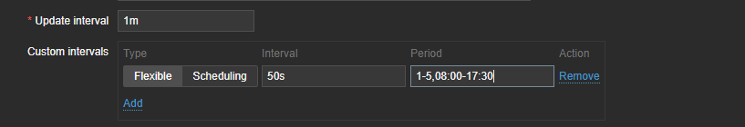

Item check sẽ được thực hiện trong khoảng thời gian là 8h tới 17h30 mỗi ngày từ thứ 2 đến thứ 6 mỗi tuần với khoảng thời gian check interval là 50s. Sau khoảng thời gian này Item check thực hiện theo **Update interval** 1 phút một lần.

Nếu ***flexible interval*** được thiết lập bằng '0', item sẽ không được pollled trong suốt khoảng ***flexible interval period*** và sẽ tiếp tục pollled theo Update interval mặc định được thiết lập trước đó khi hết period này. Dưới đây là một số các ví dụ hợp lệ:

|**Interval**|	**Period**|	**Description**|
|--|---|---|
| 10| 	1-5,09:00-18:00 |	Item will be checked every 10 seconds during working hours.| 
| 0| 	1-7,00:00-7:00 |	Item will not be checked during the night.| 
| 0| 	7-7,00:00-24:00 |	Item will not be checked on Sundays.| 
| 60| 	1-7,12:00-12:01 |	Item will be checked at 12:00 every day. Note that this was used as a workaround for scheduled checks and starting with Zabbix 3.0 it is recommended to use scheduling intervals for such checks.| 

**Scheduling intervals** được sử dụng để check các items với các thời điểm được chỉ định. Trong khi **flexible intervals** được thiết kế để định nghĩa lại item update intervals mặc định thì scheduling interval được sử dụng để chỉ định các lịch check độc lập, nó sẽ được thực hiện song song.

Một scheduling interval được định nghĩa như sau: `md<filter>wd<filter>h<filter>m<filter>s<filter>` trong đó:

* `md` - month days
* `wd` - week days
* `h` - hours
* `m` - minutes
* `s` – seconds

`<filter>` được sử dụng để chỉ định các giá trị cho các tiền tố của nó là (days, hours, minutes, seconds) và được định nghĩa theo định dạng sau: `[<from>[-<to>]][/<step>][,<filter>]`. Trong đó:

* `<from>` và `<to>` xác định phạm vi của matching values (inclued). Nếu `<to>` được bỏ qua thì filter matches với một khoảng `<from> - <from>`. Nếu `<from>` cũng bị bỏ qua thì filter matches với tất các các giá trị có thể.

* `<step>` xác định việc bỏ qua các number value thông qua các range. Mặc định `<step>` sẽ có giá trị là 1, nghĩa là tất cả các giá trị của các range được định nghĩa đều matched.

Các giá trị của `<from>` và `<to>` cho các filter prefix tương ứng là:

|Prefix|	Description	|<from>	|<to>|
|---|----|----|---|
|md|	Month days	|1-31	|1-31|
|wd|	Week days	|1-7	|1-7|
|h|	Hours	|0-23	|0-23|
|m|	Minutes	|0-59	|0-59|
|s|	Seconds	|0-59	|0-59|


# 2. Trigger

Các items chỉ thu thập các dữ liệu, để tự động đánh giá các incoming data, chúng ta sẽ cần định nghĩa các triggers. Một trigger chứa các biểu thức (expression) xác định một threashold, ngưỡng mức độ có thể chấp nhận được của dữ liệu.

Nếu incoming data vượt khỏi ngưỡng thì một trigger sẽ "fire" hoặc thay đổi trang thái thành `Problem` state - để thể hiện có chuyện gì đó đã xảy ra, hãy chú ý. Nếu ngưỡng vẫn được đảm bảo, trigger sẽ trở lại trạng thái `OK`.

## 2.1 Adding trigger

Để cấu hình một trigger cho item, chọn `Configuration → Hosts`, tìm host muốn thêm trigger, click vào link `Triggers` tương ứng với host đó và chọn `Create trigger`. 

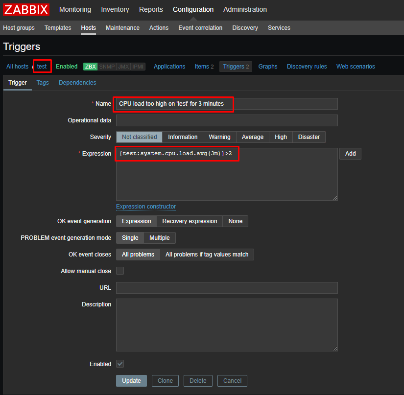

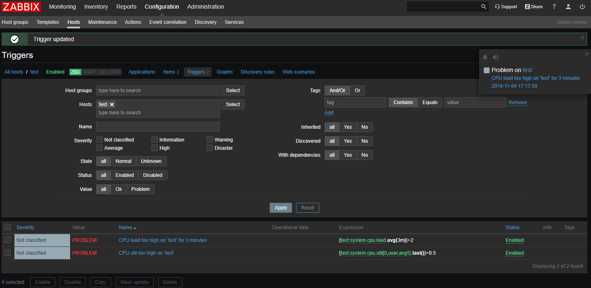

Các items hiện có trên host `test`

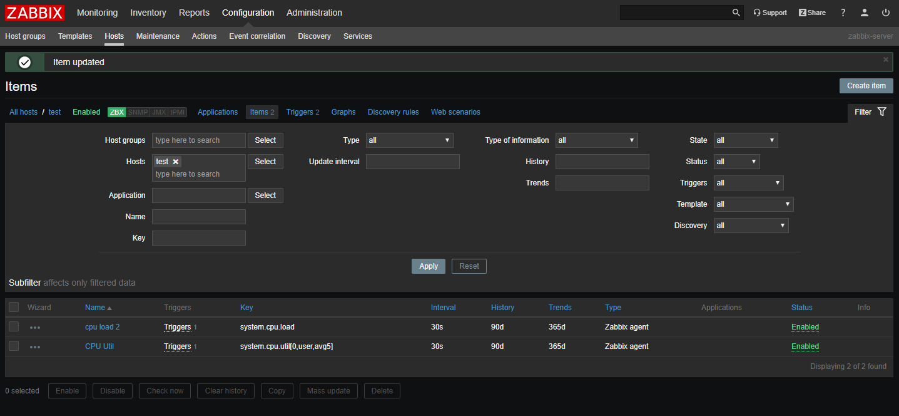

**Receiving problem notification**

Các items thu thập dữ liệu, trigger được thiết kế để `fire` mỗi khi có vấn đề xảy ra, no cũng sẽ hữu ích khi có một số cơ chế cảng báo, để thông báo về các sự kiện quan trọng, thậm chí cả khi không trực tiếp vào trên frontend. Đó là những việc notification làm. Phổ biến nhất là thông báo qua email, ví dụ một các thiết lập e-mail notification.


