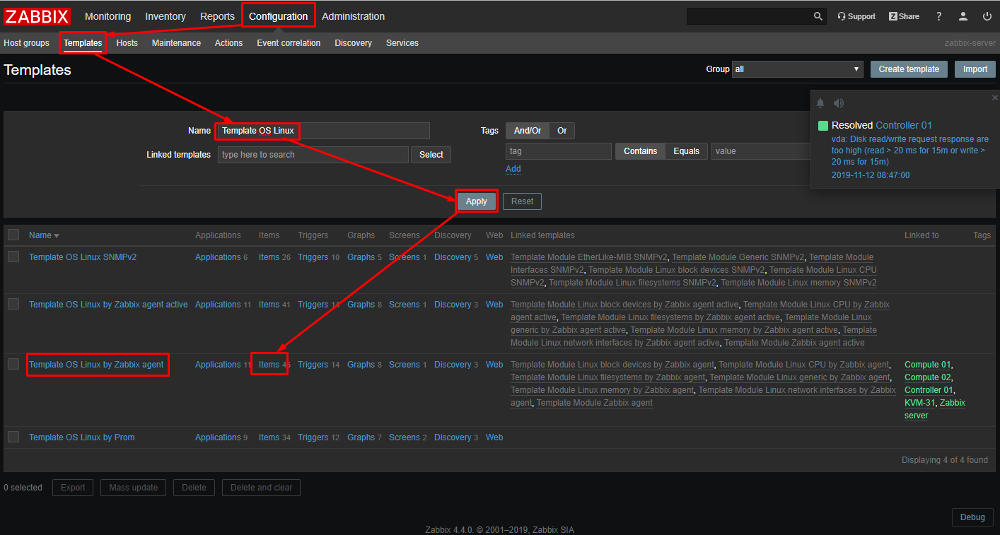
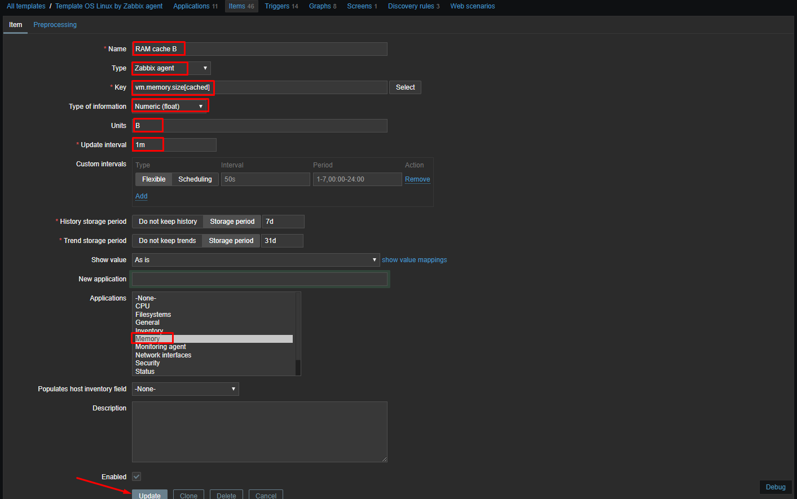
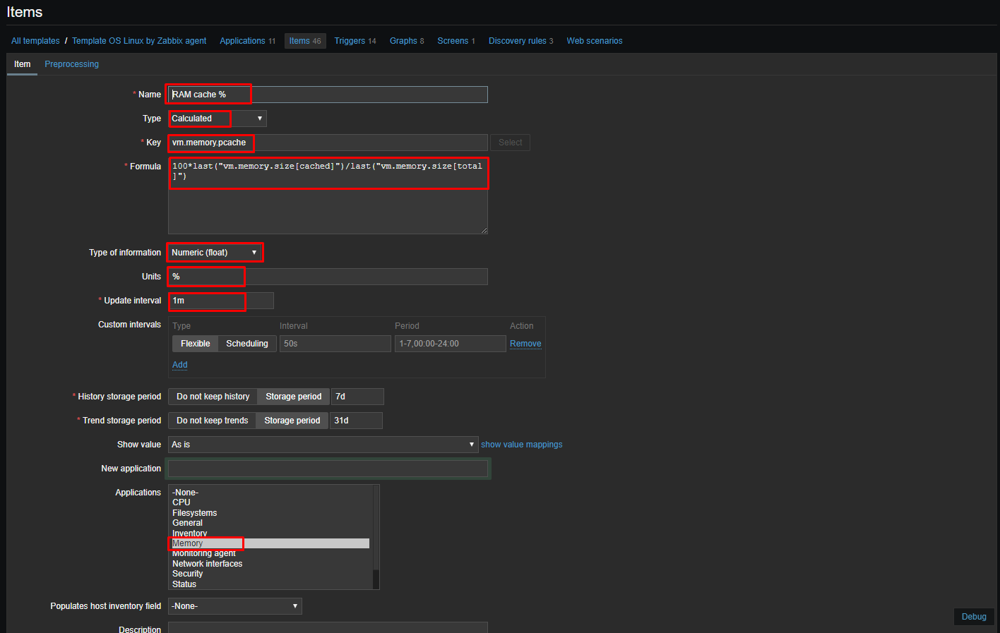
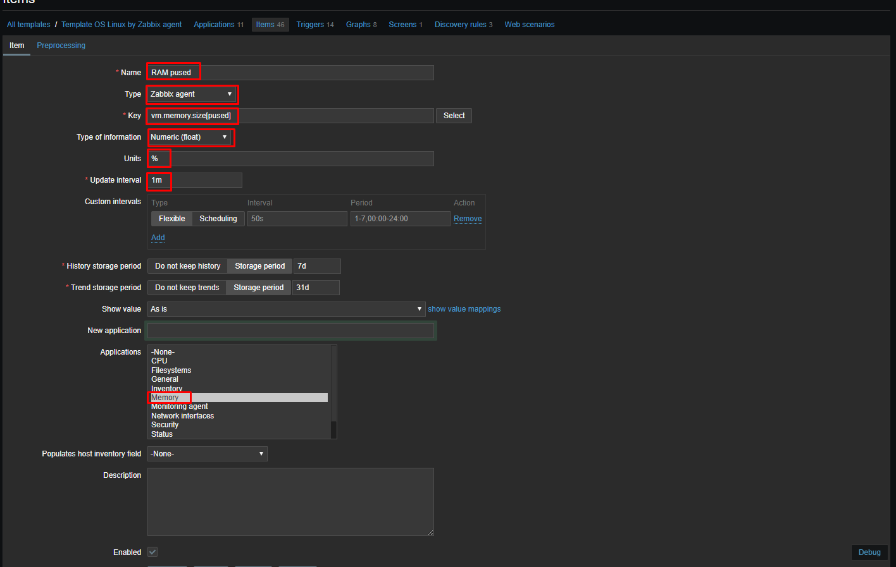
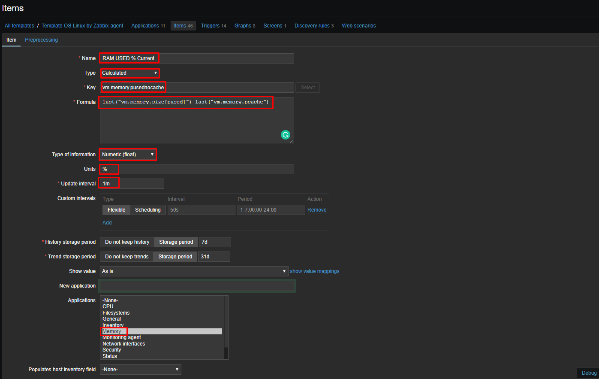
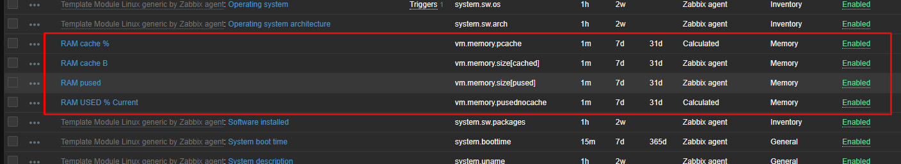
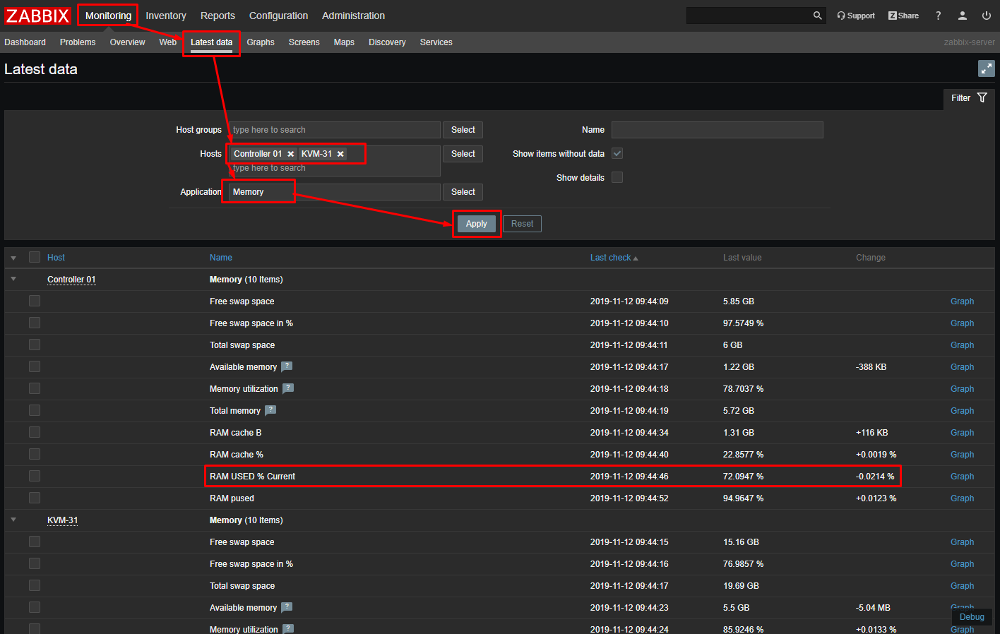

# Template

## Hướng dẫn cấu hình thêm item cho template

* Trên giao diện web làm các bước như sau để chọn vào các items của template bạn muốn thêm.

* Ví dụ ở đây ta muốn thêm items vào Template OS Linux by Zabbix agent để tính phần trăm ram đang sử dụng mà không bao gồm cache. 

* Tạo một item có tên `RAM cache B` để tính giá trị dung lượng RAM cache với đơn vị là Byte với key là `vm.memory.size[cached]`.

* Điền các thông số cho item sau đó lưu lại để áp dụng

* Tạo thêm một item để tính phần trăm cache có tên `RAM cache %` với key là `vm.memory.pcache` và Formula là `100*last("vm.memory.size[cached]")/last("vm.memory.size[total]")`

* Tiếp theo tạo một item để tính phần trăm dung lượng RAM bao gồm cả cache với tên là `RAM pused` và key là `vm.memory.size[pused]`

* Cuối cùng tạo một item `RAM USED % Current` để tính dung lượng RAM thực tế mà không có cache với tên là `RAM USED % Current`, key là ` vm.memory.pusednocache` và Formula là `last("vm.memory.size[pused]")-last("vm.memory.pcache")`

* Kiểm tra các item mới được tạo

* Ta có thể thấy có các host đang sử dụng template này như Compute01, Compute02, Controller01, KVM-31,.. vì vậy khi thêm item vào template này thì tất cả các host đang sử dụng template này đểu được sử dụng item đó.

* Chọn `Monitoring -> Lastest data` để xem các giá trị của item mới tạo poll được 

## Tham khảo 

[1] https://blog.cloud365.vn/monitor/lay-gia-tri-used-ram-phan-tram/