# Hướng dẫn cấu hình Zabbix gửi mail cảnh báo sử dụng SMTP 

**Bước 1:** Kiểm tra cấu hình thư mục lưu trữ script cảnh báo của Zabbix

```sh
[root@zabbix-server ~]# cat /etc/zabbix/zabbix_server.conf | grep alert
#       Number of pre-forked instances of alerters.
#       Full path to location of custom alert scripts.
# AlertScriptsPath=${datadir}/zabbix/alertscripts
AlertScriptsPath=/usr/lib/zabbix/alertscripts
```

**Bước 2:** 

* Tải script về và đặt tại thư mục `/usr/lib/zabbix/alertscripts` như thông tin cấu hình phía trên

```sh
cd /usr/lib/zabbix/alertscripts
wget https://gist.githubusercontent.com/superdaigo/3754055/raw/e28b4b65110b790e4c3e4891ea36b39cd8fcf8e0/zabbix-alert-smtp.sh
```

* Chỉnh sửa các thông tin của gmail dưới đây, Zabbix sẽ sử dụng gmail này để gửi mail tới các user khác.

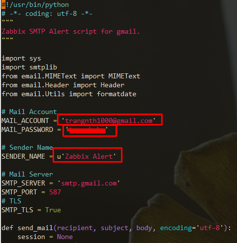

* Phân quyền thực thi cho script và chạy thử

```sh
chmod +x zabbix-alert-smtp.sh
./zabbix-alert-smtp.sh trang.nguyenthihuyen@meditech.vn "Test email" "Hello Zabbix"
```

* Kết quả

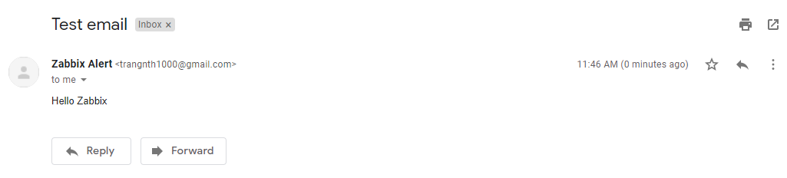

**Bước 3:** Cấu hình Media-type

* Thực hiện lần lượt các bước như sau

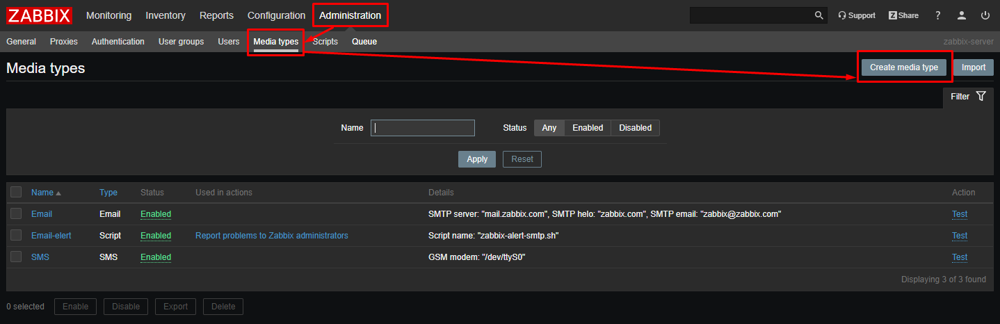

* Điền các thông tin như sau

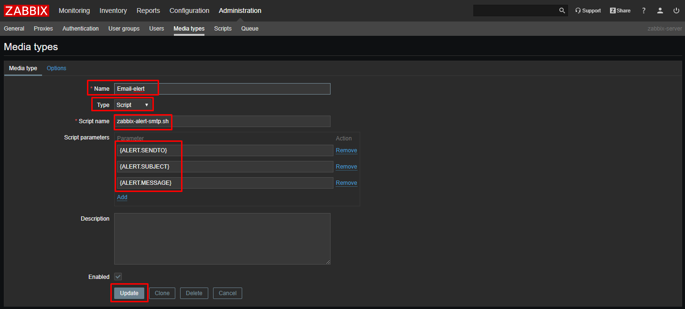

**Bước 4:** Thêm media-type chp user Administrator

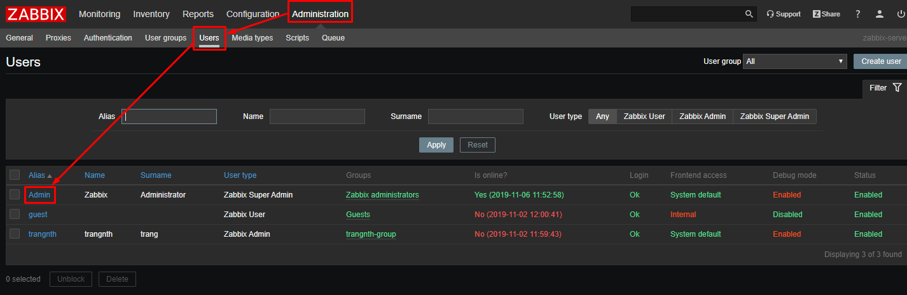

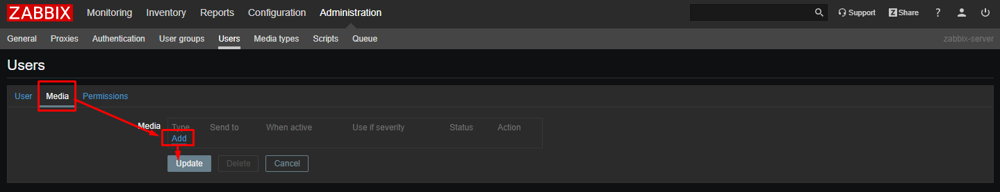

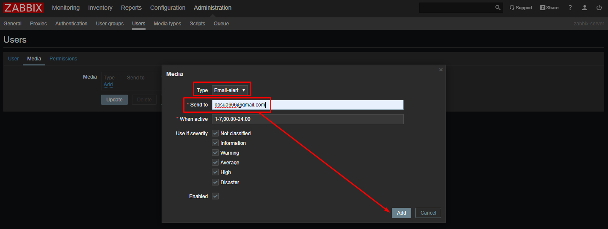

* Sau đó chọn Update để áp dụng các thay đổi

**Bước 5:** Tạo Action, mỗi khi có đủ điều kiện trong Action được thỏa mãn thì sẽ thực hiện gửi cảnh báo đi.

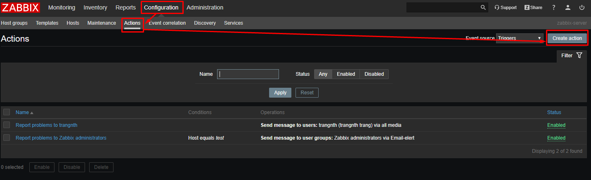

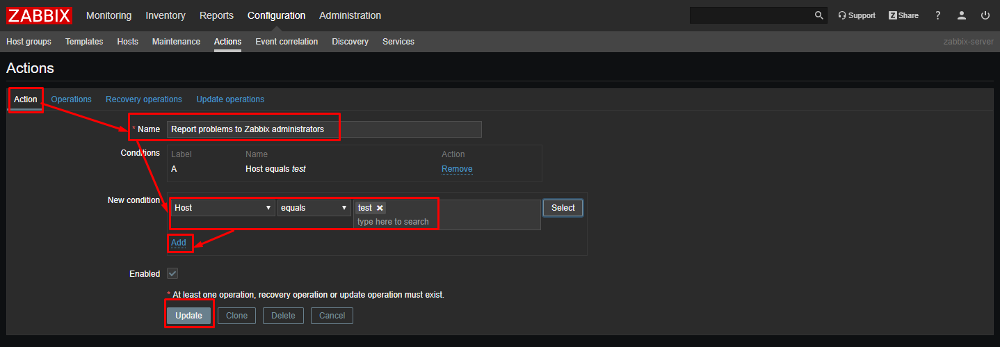

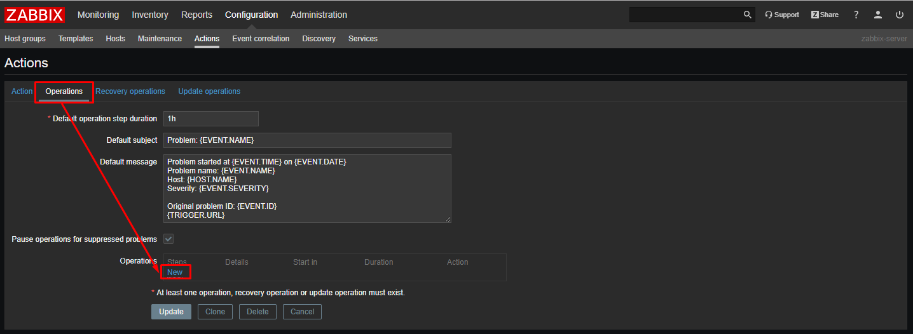

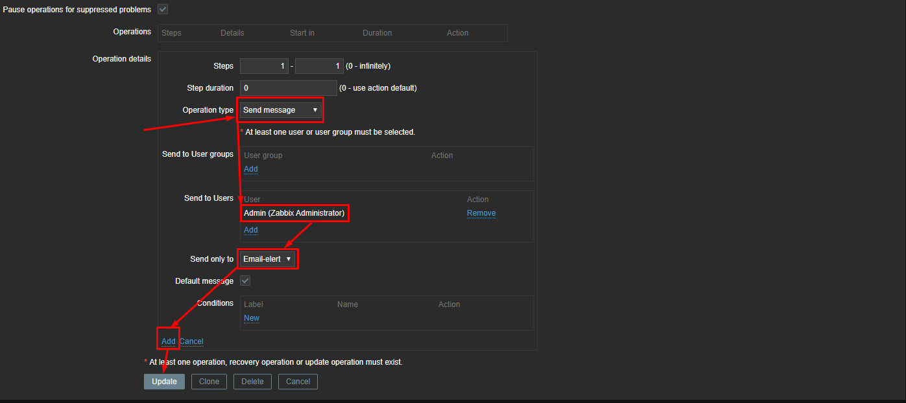

* Trong ví dụ này, action sẽ thực hiện khi và chỉ khi có một trigger ở trạng thái problem xảy ra trong host `test`

* Kết quả

