# SNMP agent 

SNMP agent dùng để giám sát các thiết bị không có các hệ điều hành cài được zabbix agent như máy in, network switches, routers hoặc UPS, các thiết bị này thường được kích hoạt SNMP.

Để có thể lấy được các dữ liệu được cung cấp bởi SNMP agents trên các thiết bị đó, Zabbix server ban đầu cũng phải được cấu hình hỗ trợ SNMP. 

SNMP checks chỉ thực hiện thông qua giao thức UDP.

Từ bản Zabbix 2.2.3 Zabbix server và proxy daemons query SNMP devices nhiều giá trị trong một request. Điều này sẽ ảnh hưởng tới tất cả các loại items (regular SNMP items, SNMP items với các dynamics indexes, và SNMP low-level discovery) và nên làm cho việc xử lý SNMP hiệu quả nhiều hơn. 

### Configuring SNMP monitoring

Để bắt đầu giám sát các thiết bị thông qua SNMP thực hiện theo các bước như dưới đây, sau đây sẽ là một ví dụ giám sát switch cisco qua gia thức snmp.

**Bước 1**: Cài đặt snmp trên Zabbix server 

```sh
yum -y install net-snmp net-snmp-utils
```

* Test thử snmp trên thiết bị muốn theo dõi từ Zabbix server

```sh
snmpwalk -v 2c -c public 192.168.40.3 | head
snmpget -v 2c -c public -On 192.168.40.3 IF-MIB::ifIndex.10127
```

* Trước khi cấu hình cần tìm SNMP (hoặc OID) cho item mà bạn muốn giám sát

* Để lấy được danh sách các SNMP string thì có thể sử dụng `snmpwalk` command.

```sh
snmpwalk -v 2c -c public <host IP> 
```

* Trong đó: `2c` ở đây là snmp version, nếu là version 1 thì thay `2c` là `1`

```sh
[root@zabbix-server ~]# snmpwalk -v 2c -c public 192.168.40.3
IF-MIB::ifHCOutOctets.1 = Counter64: 0
IF-MIB::ifHCOutOctets.10 = Counter64: 14799
IF-MIB::ifHCOutOctets.20 = Counter64: 247913
IF-MIB::ifHCOutOctets.30 = Counter64: 742486380
IF-MIB::ifHCOutOctets.40 = Counter64: 9680357
IF-MIB::ifHCOutOctets.50 = Counter64: 21543
IF-MIB::ifHCOutOctets.69 = Counter64: 5299
IF-MIB::ifHCOutOctets.70 = Counter64: 6067
IF-MIB::ifHCOutOctets.99 = Counter64: 8243
...
```

* Bạn có thể dùng `snmpget` command để tìm OID cho `IF-MIB::ifHCOutOctets.10`

```sh
[root@zabbix-server ~]# snmpget -v 2c -c public -On 192.168.40.3 IF-MIB::ifInOctets.10
.1.3.6.1.2.1.2.2.1.10.10 = Counter32: 23206498
```

OID ở ví dụ trên là `.1.3.6.1.2.1.2.2.1.10.10` Số cuối cùng trong OID chính là port number. Với 3COM thường sử dụng số cổng lơn hơn 100, ví dụ port 101 = 1, port 103 = 3; còn với cissco thì thường là số port luôn, ví dụ port 3 = 3.


**Bước 2**: Cấu hình trên web

* Tạo một host cho device với SNMP interface

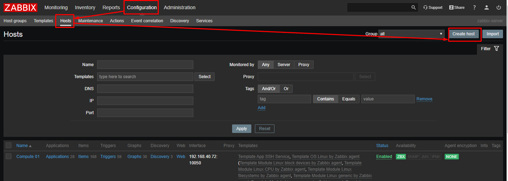

* Điền các thông tin cho host

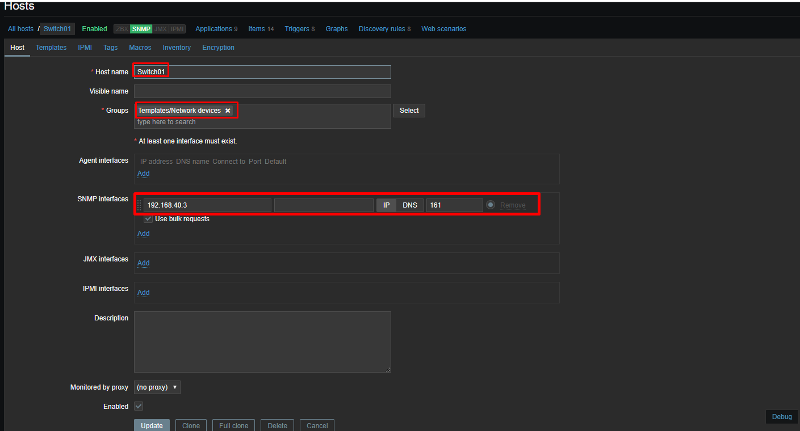

* Chọn template cho host

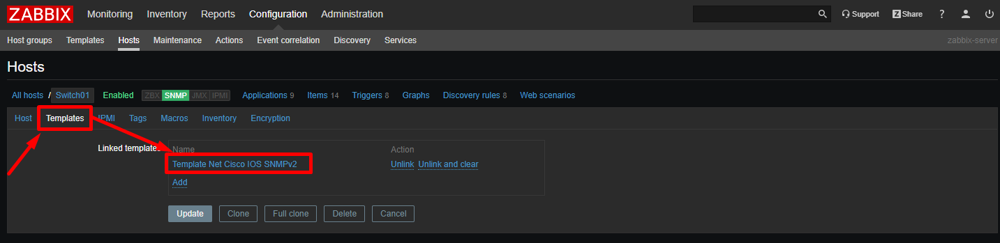

* Tạo một marco cho host, điền string của thiết bị vào (ở ví dụ này string là `public`)

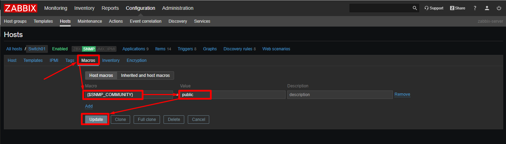

* Sau đó lưu lại để update host

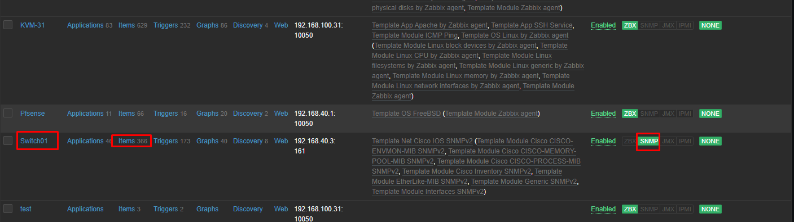

* Xem trong Lastest data

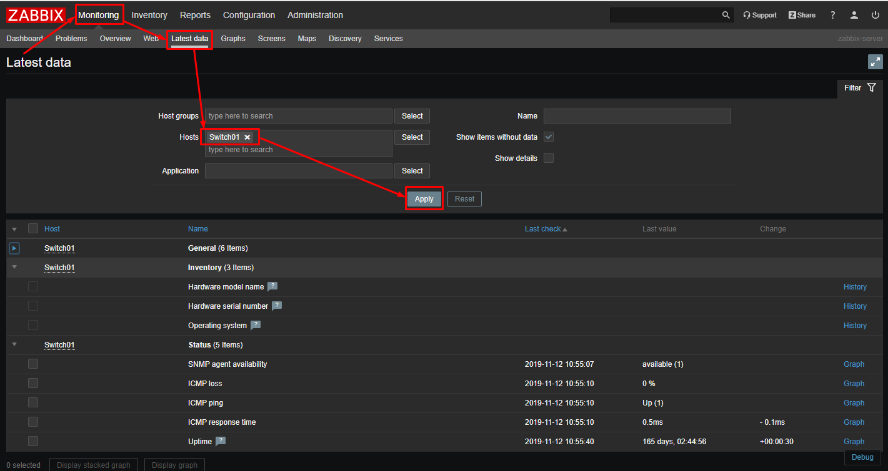

* Đợi một lúc để Zabbix server update


## Cấu hình Zabbix tự động discovery sử dụng snmp

* Trên giao diện web tạo một Discovery

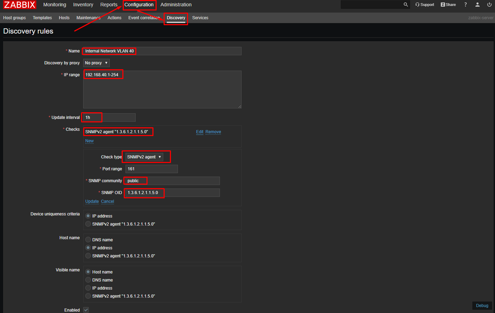

* Chú ý phần như dưới đây

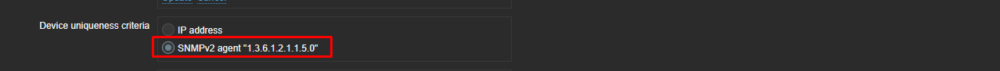

**Zabbix Discovery Action Configuration**

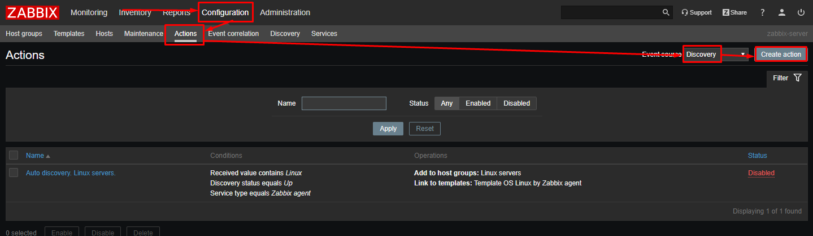

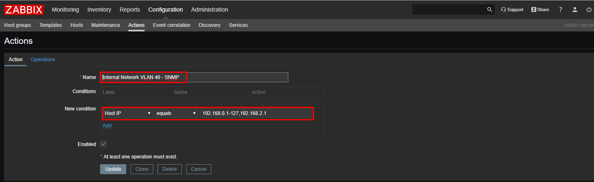

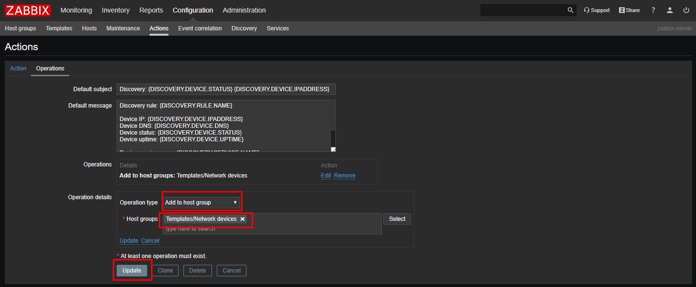


## Tham khảo 

[1] https://mdungblog.wordpress.com/2018/09/05/huong-dan-cau-hinh-snmp-cho-zabbix-theo-doi-cac-thiet-bi-router-switch-printer/

[2] https://techexpert.tips/zabbix/zabbix-monitor-cisco-switch-snmp/

[3] https://techexpert.tips/zabbix/zabbix-auto-discovery-using-snmp/