# Zabbix - Log file monitoring

Zabbix có thể được sử dụng để giám sát tập trung và phân tích các log files có thể hỗ trợ hoặc không hỗ trợ việc log rotation.

Thông báo có thể được sử dụng để cảnh báo cho người dùng khi một log file chứa một đoạn string hoặc string patterns.

Để monitor một log file thì cần có:

* Zabbix agent running on the host
* log monitoring item set up 

### Cấu hình

* Chỉnh sửa cấu hình trên Zabbix agent trong file `/etc/zabbix/zabbix_agentd.conf`

```sh
ServerActive=192.168.40.128
Hostname=kvm31
Timeout=30
```

* Chú ý phần `Timeout` để lớn một chút trong khoảng từ 1-30, như cấu hình bên trên đang để là 30s, ví dụ file cấu hình zabbix-agent như sau:

```sh
[root@mdt-server31 ~]# cat /etc/zabbix/zabbix_agentd.conf | egrep -v "^#|^$"
PidFile=/var/run/zabbix/zabbix_agentd.pid
LogType=file
LogFile=/var/log/zabbix/zabbix_agentd.log
LogFileSize=0
EnableRemoteCommands=1
Server=::/0
ServerActive=192.168.40.128
Hostname=kvm31
Timeout=30
Include=/etc/zabbix/zabbix_agentd.d/*.conf
```

* Khởi động lại zabbix agent

```sh
systemctl restart zabbix-agent
```

* Trong đó `192.168.40.128` là ip của Zabbix active server, ví dụ cấu hình trên zabbix server:

```sh
[root@zabbix-server ~]# cat /etc/zabbix/zabbix_server.conf | egrep -v "^$|^#"
ListenPort=10051
LogType=file
LogFile=/var/log/zabbix/zabbix_server.log
LogFileSize=1
DebugLevel=3
PidFile=/var/run/zabbix/zabbix_server.pid
SocketDir=/var/run/zabbix
DBHost=localhost
DBName=zabbix
DBUser=zabbix
DBPassword=trang1234
StartPollers=5
StartPollersUnreachable=1
StartTrappers=5
StartPingers=1
StartDiscoverers=1
StartHTTPPollers=1
SNMPTrapperFile=/var/log/snmptrap/snmptrap.log
StartSNMPTrapper=1
ListenIP=0.0.0.0
Timeout=4
AlertScriptsPath=/usr/lib/zabbix/alertscripts
ExternalScripts=/usr/lib/zabbix/externalscripts
LogSlowQueries=3000
StatsAllowedIP=0.0.0.0/0
```

* Chú ý phần cấu hình `ListenIP` và `ListenPort` để cấu hình ip và port sẽ được mở cho các active check từ phía các agent.


* Thêm item vào host đã được cấu hình trên zabbix frontend của agent.

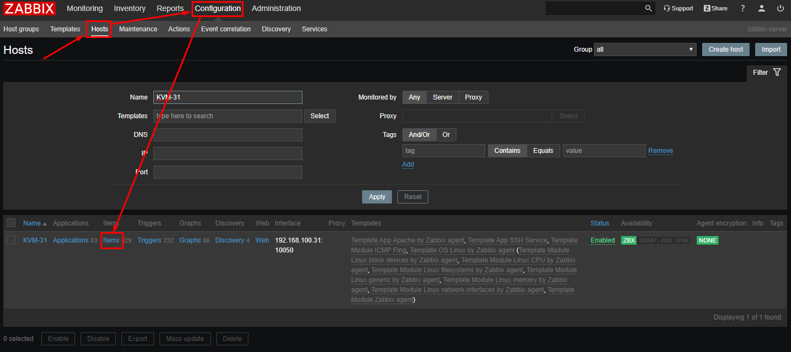

* Chọn Create item vào điền các thông tin cho item đó như sau:

```sh
Name: Log file item
Key: log[/var/log/secure,"Accepted password for \b\w+\b from.*",,,,\0]
Log time format: ppppddphh:mm:ss
New application: Log file
```

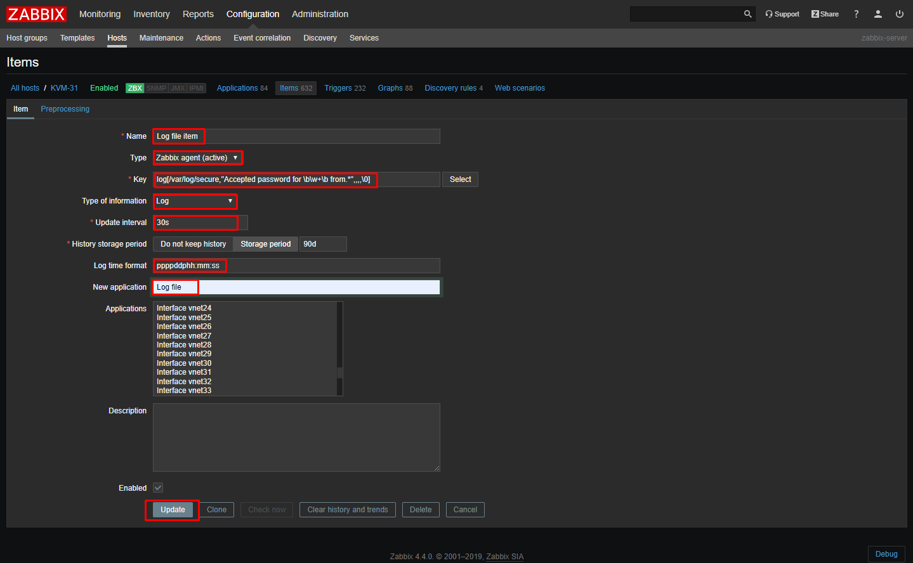


> Đinh dạng của Item key: `log[file,<regexp>,<encoding>,<maxlines>,<mode>,<output>,<maxdelay>]`

* Nếu gặp lỗi thì khởi động lại zabbix agent trên client sau đó kiểm tra và update lại thông tin item trên Zabbix frontend.

* Ta có thể thấy item đã được enabled. 

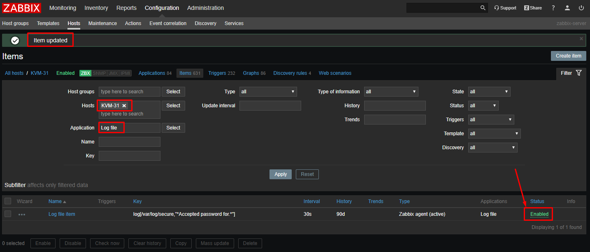

**Cấu hình item key**

* Item được tạo phía trên sẽ thực hiện ví dụ có một dòng log như sau:

```sh
Nov 12 08:30:21 zabbix-server sshd[15268]: Accepted password for root from 192.168.100.203 port 3439 ssh2
```

* Muốn match với các dòng log như trên và tạo output có dạng `Accepted password for root from 192.168.100.203 port 3439 ssh2` ta chỉnh sửa cấu hình của item key là `log[/var/log/secure,"Accepted password for \b\w+\b from.*",,,,\0]`

* Ta có thể tạo một Preprocessing cho item để xử lý log với Parameters là `Accepted password for \b\w+\b from.*`
 
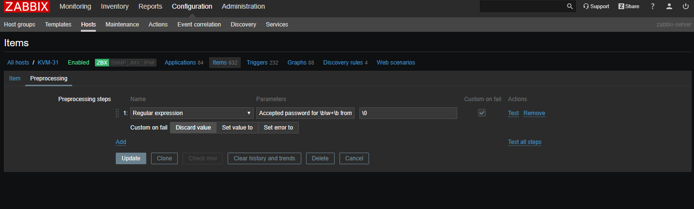

* Sau đó test thử để thấy output

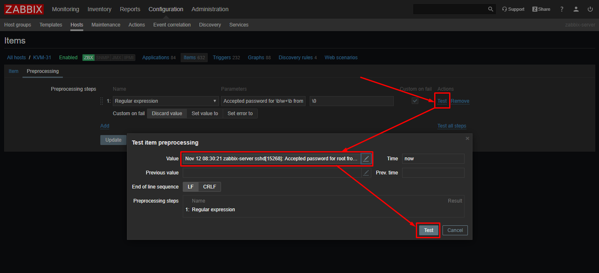

* Trong ô value, paste một dòng log vào để xử lý. Kết quả output được in ra màn hình

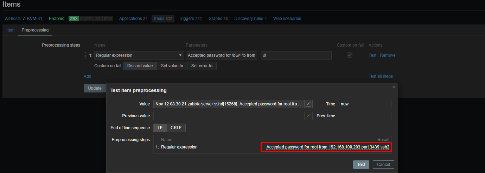

* Xem trong Lastest data

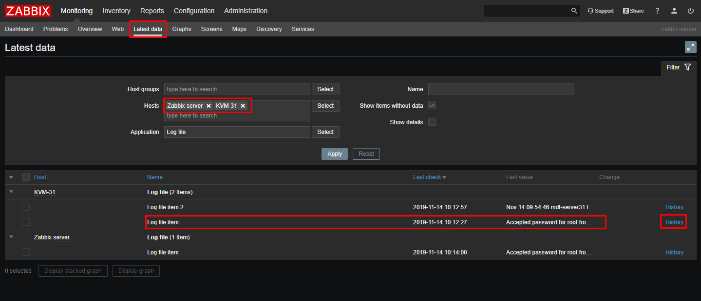

* Bấm vào `History` để xem output

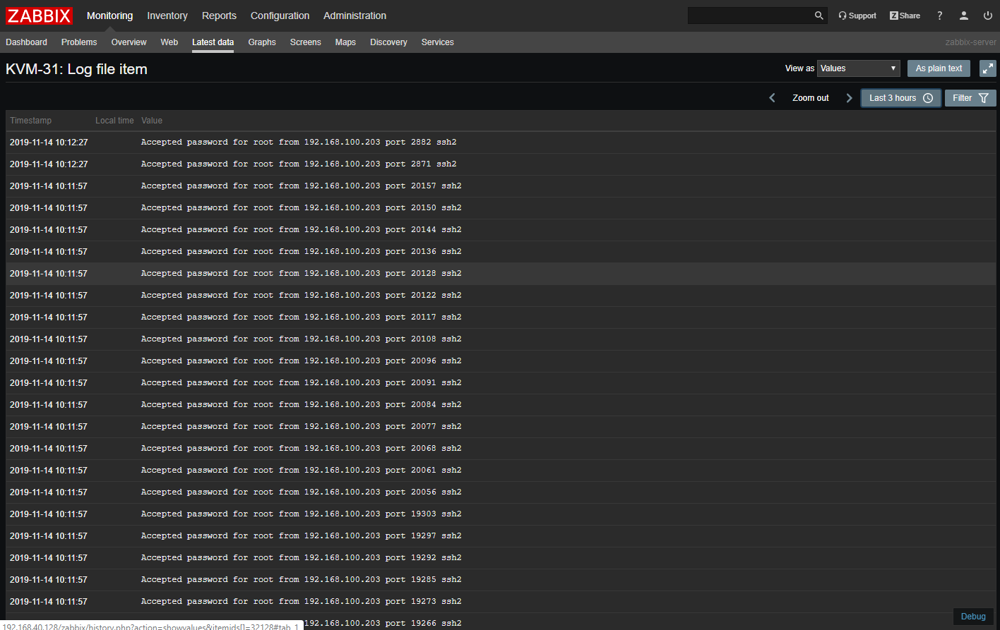

* Chú ý cột Timestamp là cột thời gian xử lý của zabbix, chú không phải thời gian của log được sinh ra. Chỉnh sửa lại item như sau để thêm thời gian của syslog vào output

```sh
Key: log[/var/log/secure,"(\w+ (?:(?:0[1-9])|(?:[12][0-9])|(?:3[01])|[1-9]) (?!<[0-9])(?:2[0123]|[01]?[0-9]):(?:[0-5][0-9])(?::(?:[0-5]?[0-9]|60))).*((Accepted|Failed) password for \b\w+\b from.*)",,,,\1 \2]
Parameters: (\w+ (?:(?:0[1-9])|(?:[12][0-9])|(?:3[01])|[1-9]) (?!<[0-9])(?:2[0123]|[01]?[0-9]):(?:[0-5][0-9])(?::(?:[0-5]?[0-9]|60))).*((Accepted|Failed) password for \b\w+\b from.*)
Output: \1 \2
```

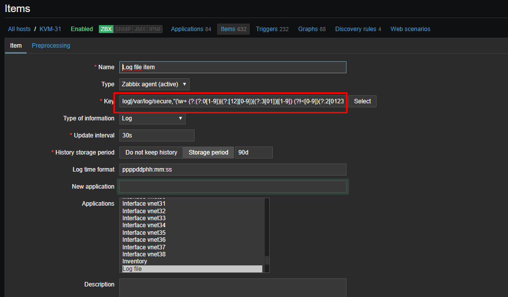

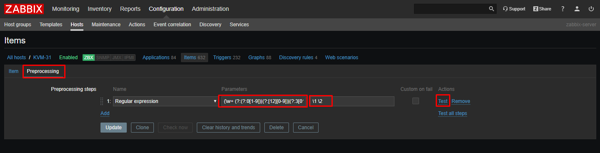

* Update lại Item và xem lại phần Lastest data đã show được thời gian login ssh Failed và được Accepted 

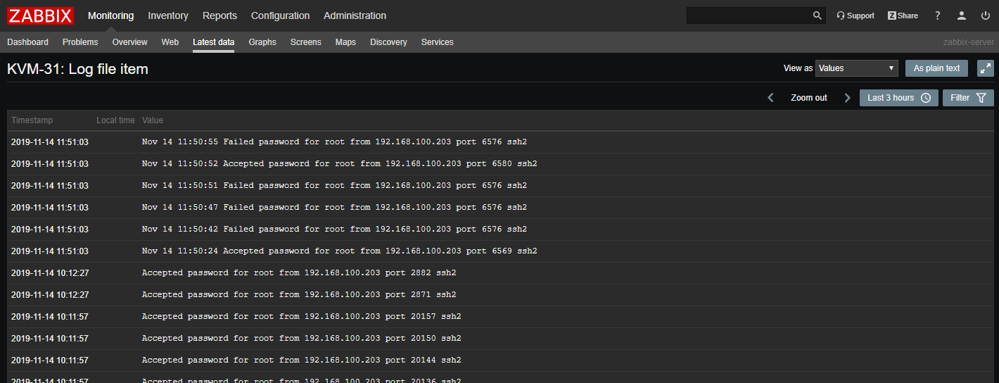


* Regex

```sh
Nov 12 08:30:21
\w+ (?:(?:0[1-9])|(?:[12][0-9])|(?:3[01])|[1-9]) (?!<[0-9])(?:2[0123]|[01]?[0-9]):(?:[0-5][0-9])(?::(?:[0-5]?[0-9]|60))

Accepted password for root from 192.168.100.203 port 3439 ssh2
Accepted password for \b\w+\b from.*
```

## Research

* Với Key là `log[/app1/app.log,"task run [0-9.]+ sec, processed ([0-9]+) records, [0-9]+ errors",,,,\1]` → will match a log record `2015-11-13 10:08:26 task run 6.08 sec, processed 6080 records, 0 errors` and send only `6080` to server. Because a numeric value is being sent, the "Type of information" for this item can be set to "Numeric (unsigned)" and the value can be used in graphs, triggers,... 

* Using output parameter for rewriting log record before sending to server: ⇒ `log[/app1/app.log,"([0-9 :-]+) task run ([0-9.]+) sec, processed ([0-9]+) records, ([0-9]+) errors",,,,"\1 RECORDS: \3, ERRORS: \4, DURATION: \2"]` → will match a log record `2015-11-13 10:08:26 task run 6.08 sec, processed 6080 records, 0 errors` and send a modified record `2015-11-13 10:08:26 RECORDS: 6080, ERRORS: 0, DURATION: 6.08" to server`.

