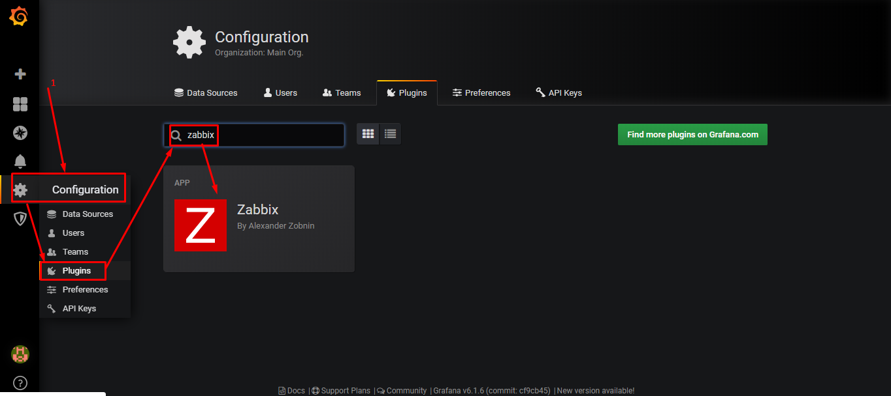
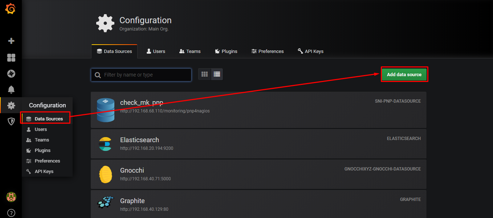
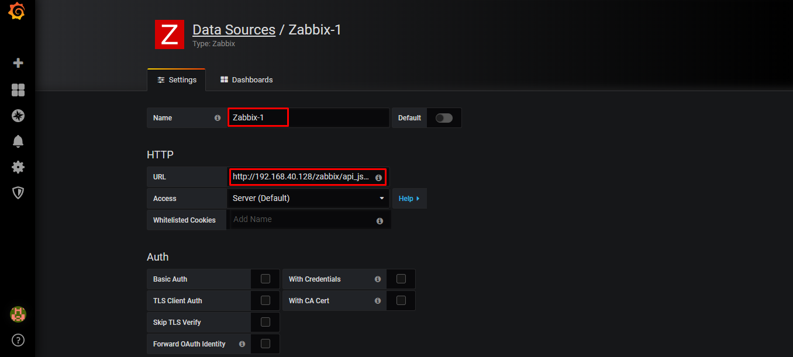
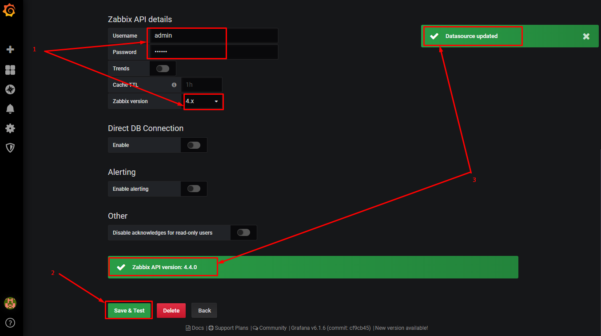
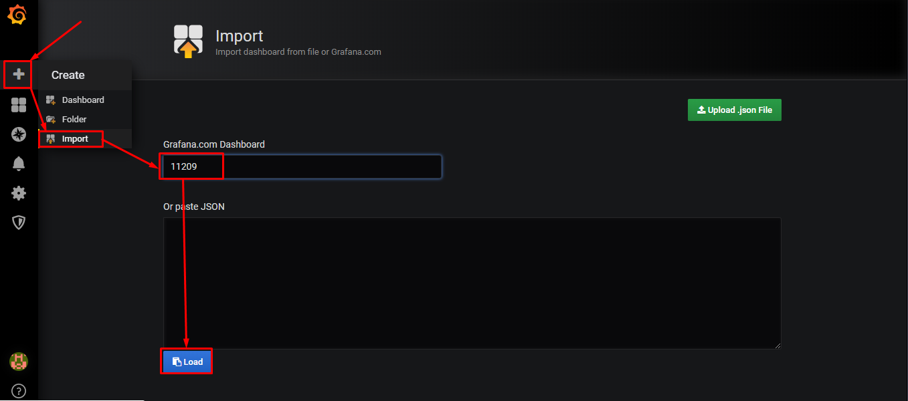
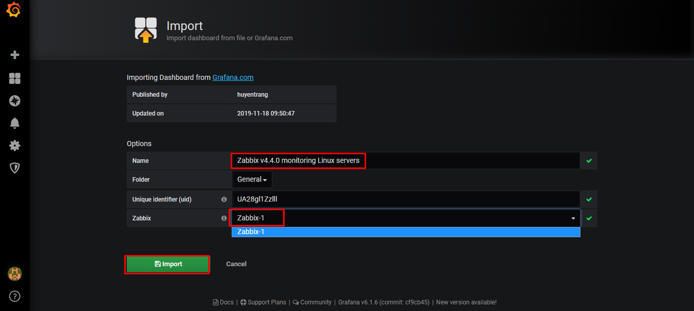
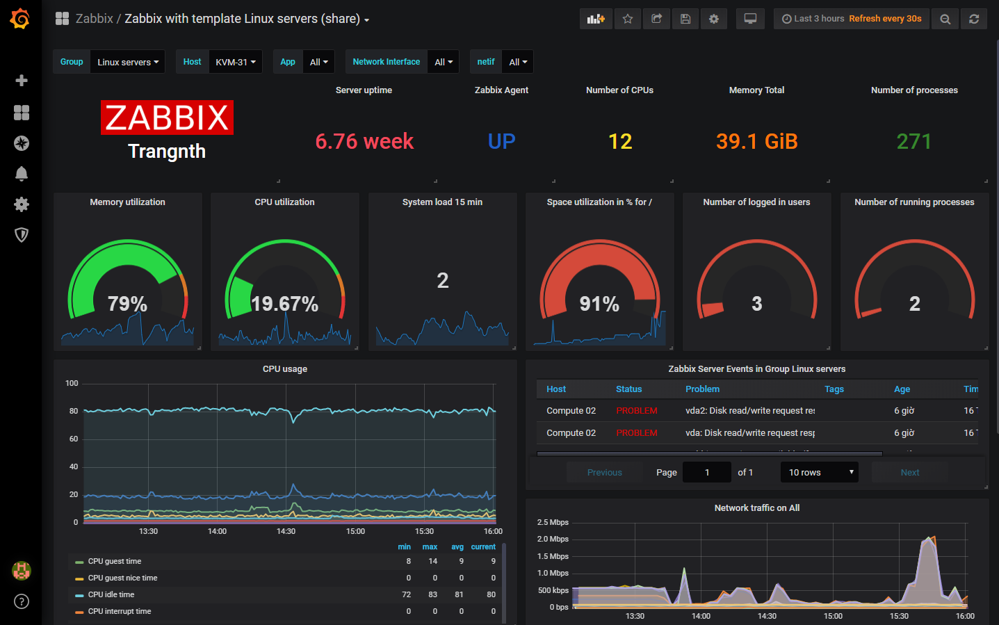
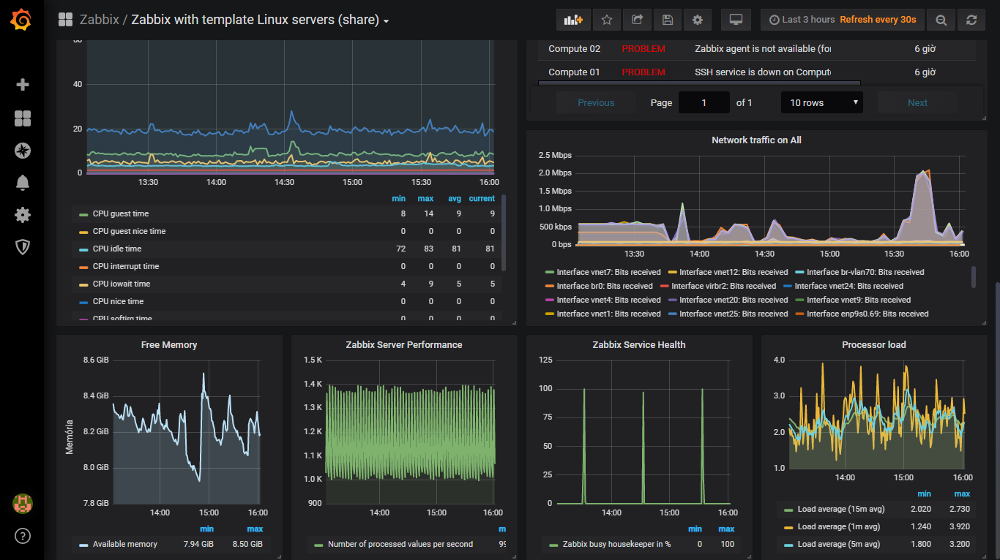

# Configuring Grafana with Zabbix

Hướng dẫn cấu hình Grafana sử dụng datasource Zabbix

**Bước 1**: Cài đặt Zabbix plugin 

* Trên grafana server thực hiện command sau:

```sh
grafana-cli plugins install alexanderzobnin-zabbix-app
```

* Đợi một lúc, kết quả hiển thị như sau là thành công:

```sh
[root@trang-68-110 ~]# grafana-cli plugins install alexanderzobnin-zabbix-app
installing alexanderzobnin-zabbix-app @ 3.10.4
from url: https://grafana.com/api/plugins/alexanderzobnin-zabbix-app/versions/3.10.4/download
into: /var/lib/grafana/plugins

✔ Installed alexanderzobnin-zabbix-app successfully

Restart grafana after installing plugins . <service grafana-server restart>
```

* Khởi động lại service:

```sh
systemctl restart grafana-server
```


**Bước 2**: Truy cập vào đường link của grafana, ví dụ: http://192.168.40.129:3000

* Enable Plugin



**Bước 3**: Thêm data source 




* Điền URL là: `http://192.168.40.128/zabbix/api_jsonrpc.php`, với `192.168.40.128` là ip của Zabbix server 



* Nhập username và password để login zabbix và chọn version của Zabbix, sau đó chọn Save & Test, nếu hiển thị thông báo như hình là OK




**Bước 4**: Tạo một dashboard

* Import dashboard



* Chọn Name, Floder và Datasource cho dashboard



* Sau khi import ta được dashboard như sau






## Tham khảo 

[1] https://blog.zabbix.com/configuring-grafana-with-zabbix/8007/

[2] https://alexanderzobnin.github.io/grafana-zabbix/configuration/