# External check 

Bài viết được tham khảo và sử dụng source code tại https://github.com/cloudowski/zabbix-openstack

Code được chỉnh sử lại để có thể sử dụng python3 thay vì mặc định là python2

## Hướng dẫn cấu hình external check giám sát các service của OpenStack

**Tham khảo**: https://github.com/cloudowski/zabbix-openstack

* **Bước 1**: Cài đặt môi trường trên zabbix server 

```sh
sudo yum install python36 -y 
sudo yum install python36-setuptools -y 
sudo easy_install-3.6 pip 

pip3.6 install keystoneauth
pip3.6 install python-openstackclient
pip3.6 install python-keystoneclient
pip3.6 install python-novaclient
```

* **Bước 2**: Tải tool về Zabbix server 

```sh
cd /usr/lib/zabbix/externalscripts
wget https://raw.githubusercontent.com/trangnth/Monitor/blob/master/Ghichep_zabbix/doc/externalscripts/openstack-discovery 
```

* Chạy thử tool

```sh
python3.6 /usr/lib/zabbix/externalscripts/openstack-discovery endpoints_v3 http://192.168.100.32:5000/v3 admin admin admin_110819 Default Default 
```

* Trong đó các tham số đi kèm là để authen cho project admin. Kết quả và chi tiết các tham số như dưới đây:

```sh
[root@zabbix-server externalscripts]# python3.6 openstack-discovery endpoints_v3 http://192.168.100.32:5000/v3 admin admin admin_110819 Default Default
{
       "data":[
              {
                     "{#OS_SERVICEHOST}":"192.168.100.32",
                     "{#OS_SERVICENAME}":"nova",
                     "{#OS_SERVICEPORT}":8774,
                     "{#OS_SERVICEURL}":"http://192.168.100.32:8774/v2.1"
              },
              {
                     "{#OS_SERVICEHOST}":"192.168.100.32",
                     "{#OS_SERVICENAME}":"placement",
                     "{#OS_SERVICEPORT}":8778,
                     "{#OS_SERVICEURL}":"http://192.168.100.32:8778"
              },
              {
                     "{#OS_SERVICEHOST}":"192.168.100.32",
                     "{#OS_SERVICENAME}":"cinderv3",
                     "{#OS_SERVICEPORT}":8776,
                     "{#OS_SERVICEURL}":"http://192.168.100.32:8776/v3/%(project_id)s"
              },
              {
                     "{#OS_SERVICEHOST}":"192.168.100.32",
                     "{#OS_SERVICENAME}":"gnocchi",
                     "{#OS_SERVICEPORT}":8041,
                     "{#OS_SERVICEURL}":"http://192.168.100.32:8041"
              },
              {
                     "{#OS_SERVICEHOST}":"192.168.100.32",
                     "{#OS_SERVICENAME}":"cinderv2",
                     "{#OS_SERVICEPORT}":8776,
                     "{#OS_SERVICEURL}":"http://192.168.100.32:8776/v2/%(project_id)s"
              },
              {
                     "{#OS_SERVICEHOST}":"192.168.100.32",
                     "{#OS_SERVICENAME}":"neutron",
                     "{#OS_SERVICEPORT}":9696,
                     "{#OS_SERVICEURL}":"http://192.168.100.32:9696"
              },
              {
                     "{#OS_SERVICEHOST}":"192.168.100.32",
                     "{#OS_SERVICENAME}":"keystone",
                     "{#OS_SERVICEPORT}":5000,
                     "{#OS_SERVICEURL}":"http://192.168.100.32:5000/v3/"
              },
              {
                     "{#OS_SERVICEHOST}":"192.168.100.32",
                     "{#OS_SERVICENAME}":"glance",
                     "{#OS_SERVICEPORT}":9292,
                     "{#OS_SERVICEURL}":"http://192.168.100.32:9292"
              }
       ]
}
[root@zabbix-server externalscripts]# python3.6 /usr/lib/zabbix/externalscripts/openstack-discovery
Usage: zabbix-openstack.py TYPE AUTH_URL TENANT USERNAME PASSWORD
          where
          TYPE      - one of the following: endpoints hypervisors endpoints_v3 hypervisors_v3
          AUTH_URL  - URL to keystone
          TENANT    - tenant name
          USERNAME  - user name
          PASSWORD  - password for user
          (v3 only) USER_DOMAIN_NAME - user domain name
          (v3 only) PROJECT_DOMAIN_NAME - project domain name
```

* **Bước 3**: Phần quyền thực thi cho script

```sh
chmod +x /usr/lib/zabbix/externalscripts/openstack-discovery
```

* **Bước 4**: Cài đặt agent trên node Controller (IP: 192.168.100.32)

```sh
rpm -Uvh https://repo.zabbix.com/zabbix/4.4/rhel/7/x86_64/zabbix-release-4.4-1.el7.noarch.rpm
yum install zabbix-agent -y
systemctl start zabbix-agent 
systemctl enable zabbix-agent 
```

* Cấu hình file `/etc/zabbix/zabbix_agentd.conf`

```sh
PidFile=/var/run/zabbix/zabbix_agentd.pid
LogFile=/var/log/zabbix/zabbix_agentd.log
LogFileSize=0
SourceIP=192.168.100.32
EnableRemoteCommands=1
Server=192.168.40.128
ListenPort=10050
ListenIP=192.168.100.32
ServerActive=192.168.40.128
Hostname=mdt32
Timeout=30
Include=/etc/zabbix/zabbix_agentd.d/*.conf
```

Trong đó: `192.168.100.32` là IP của Zabbix agent, `192.168.40.128` là IP của Zabbix server 

* Khởi động lại service 

```sh
systemctl restart zabbix-agent 
```

* **Bước 5**: Add template trên Zabbix Frontend

Import các templates của OPS trong thư mục [templates](templates) vào Zabbix server: Template OpenStack or Template OpenStack Identity V3

***Note***: Template openstack node bị lỗi :'( => tự tạo một template

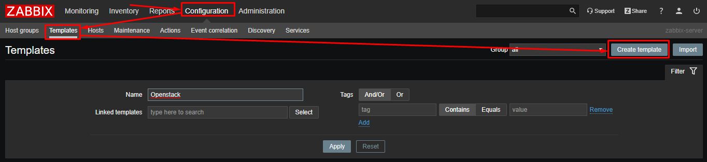

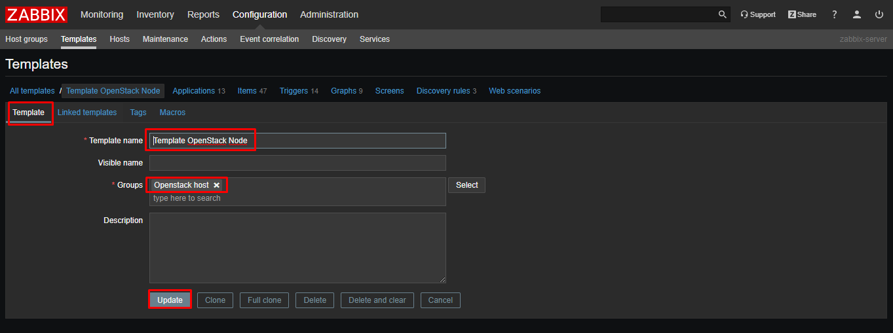

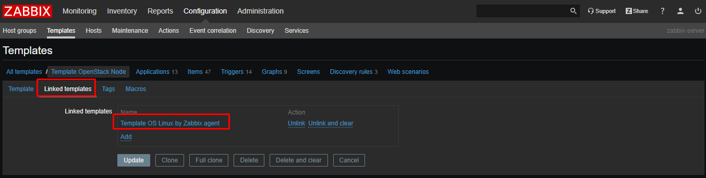

Import file Template_OpenStack_V3 

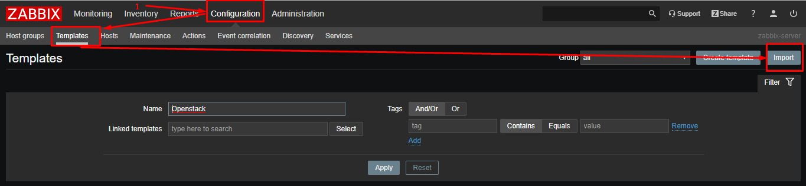

Chọn file xml để import

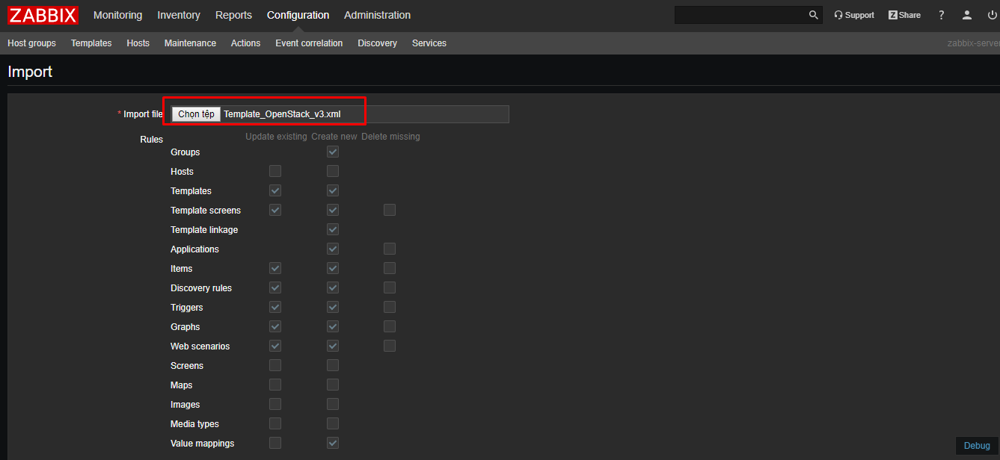

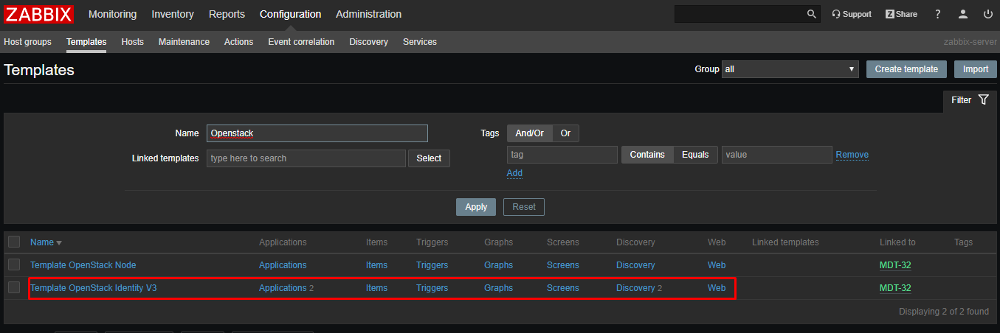


* **Bước 6**: Add host phía Zabbix frontend

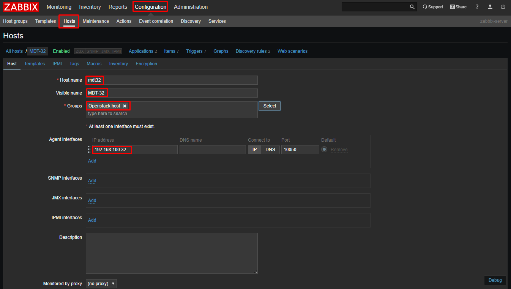

Thêm các template cho host

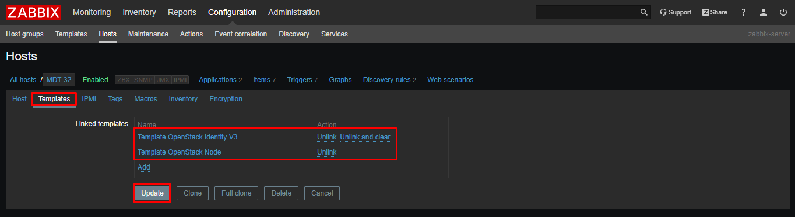

Thêm các macros để xác thực project của Openstack

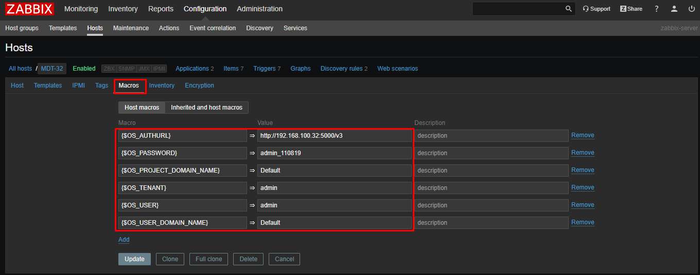


* **Bước 7**: Kết quả

Đợi một lúc để discovery các item

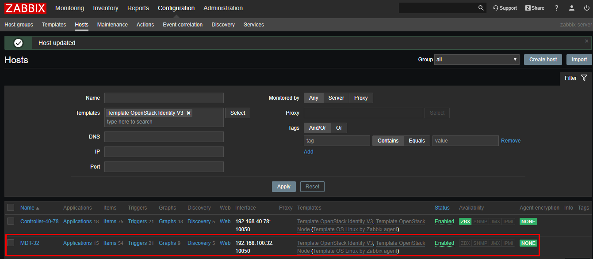

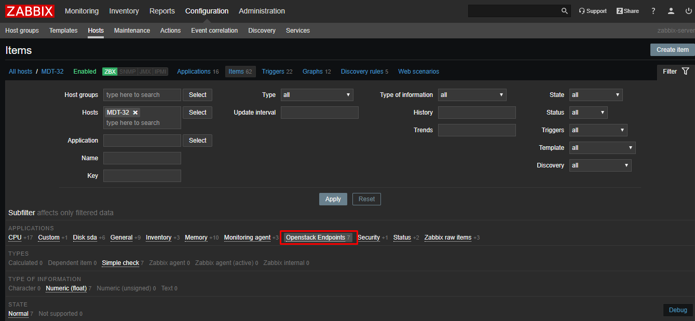

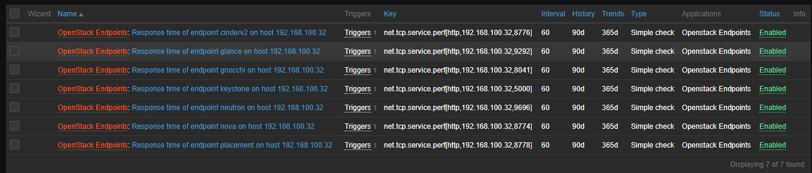

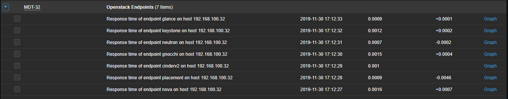

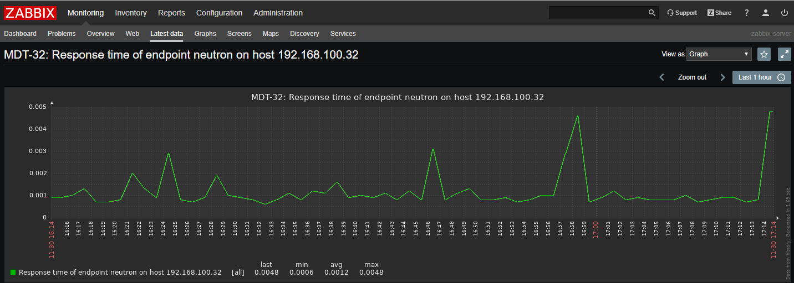

* **Bước 7**: Tạo dashboard trên grafana

Truy cập vào giao diện của Grafana, import template [ở đây](dashboard/Zabbix%20template%20Linux%20servers%20not%20share-ops-service.json)

Chọn host group và host tương ứng ta được một dashboard như sau

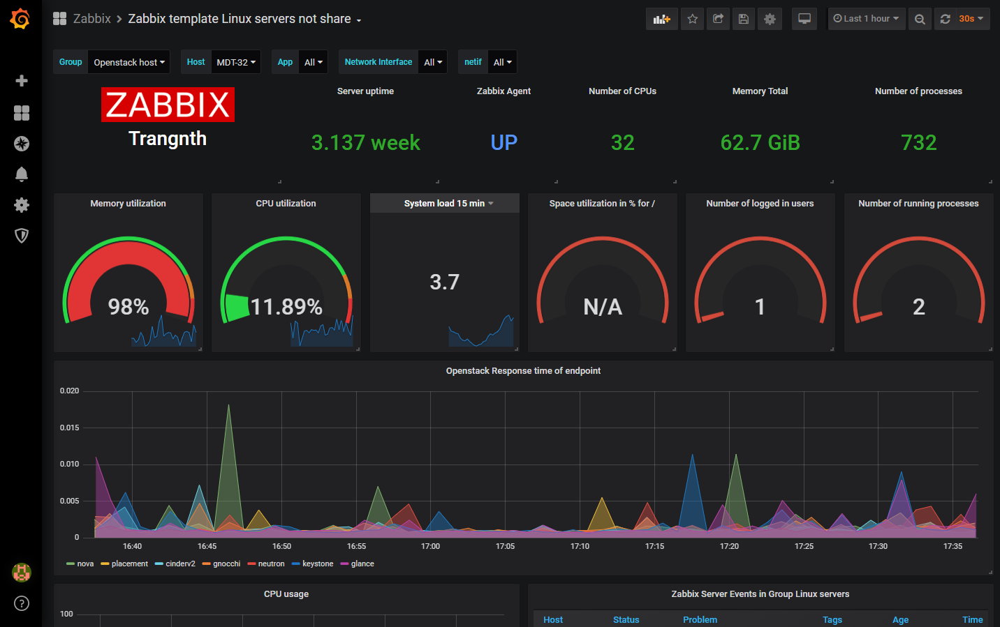


## Tham khảo

[1] https://docs.openstack.org/tacker/latest/contributor/zabbix-plugin.html