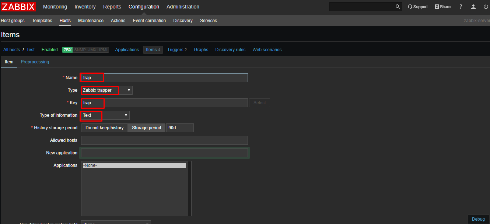
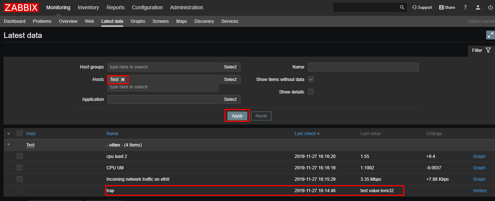

## 1. Zabbix sender

Zabbix hỗ trợ command zabbix_sender để gửi thông tin từ agent về cho zabbix server. Trên Zabbix server, cần tọ item để nhận metric, item này sẽ phải có type là Zabbix trapper với key tương ứng.

Chú ý là các incoming values sẽ chỉ được chấp nhận từ các host được chỉ định trong trường `Allowed hosts` của item đó.

* Cài đặt

```sh
yum install zabbix-sender
```

* Cú pháp chung

```sh
zabbix_sender -z IP-server -s "name" -p port -k key -o values
```

* Trong đó:

	* `IP-server` là IP của Zabbix server 
	* `name` là host name của agent để cấu hình khai báo trên zabbix server.
	* `port` port của server để agent kết nối tới (mặc định là 10051).
	* `key` chỉ định item key để send value tới
	* `values` chỉ ra gia trị của item.

* Một vài tùy chọn khác có thể xem thêm [tại đây](https://linux.die.net/man/1/zabbix_sender)

**Ví dụ:**

* Gửi một giá trị là 342.45 với key là `mysql.queries` trong host đang được định nghĩa trên Zabbix server có tên là `Monitored Host` và cấu hình được sử dụng trong file config 

```sh
zabbix_sender -c /etc/zabbix_agentd.conf -s "Monitored Host" -k mysql.queries -o 342.45
```

* Gửi giá trị từ file `data_values.txt` đến server với IP là `192.168.1.113`. Host name và keys đã được định nghĩa trong file.

```sh
zabbix_sender -z 192.168.1.113 -i data_values.txt
```

* Gửi một timestamped valuetừ commandline tới Zabbix server đã được chỉ định trong agent daemon configuration file.

```sh
echo "- hw.serial.number 1287872261 SQ4321ASDF" | zabbix_sender -c /etc/zabbix_agentd.conf -T -i -
```

Dấu gạch ngang trong input data chỉ ra rằng hostname cũng nên được sử dụng cùng một configuration file.


## 2. Zabbix get

`zabbix_get` là một tiện ích được sử dụng trên Zabbix server để lấy dữ liệu từ một remote Zabbix agent.

* Cài đặt

```sh
yum install zabbix-get -y
```

* Cú pháp đơn giản

```sh
zabbix_get -s IP-host -k key
```

Trong đó:

* `IP-host` là IP của máy host cài zabbix-agent mà ta muốn lấy thông tin
* `key` chỉ ra item key để nhận dữ liệu

Xem thêm các tham số khác [tại đây](https://linux.die.net/man/1/zabbix_get)

**Ví dụ**

```sh
zabbix_get -s 127.0.0.1 -p 10050 -k """system.cpu.load[all,avg1]"""
```

* Để kiểm tra dung lượng RAM của agent có IP là 192.168.100.31

```sh
[root@mdt32 ~]# zabbix_get -s 192.168.100.31 -k vm.memory.size[total]
41986904064
```

## 3. Trapper items

Trapper items chấp nhận các incoming data thay vì tự query. Việc này hữu ích cho bất kỳ dữ liệu nào bạn muốn "push" vào zabbix.

Để sử dụng một trapper item thì cần

* Có một trapper item được set up trong zabbix
* Gửi dữ liệu vào trong Zabbix

Trong trường hợp đơn gian nhất, chúng ra có thể sử dụng tiện ích `zabbix_sender` để gửi một vài giá trị test.

```sh
zabbix_sender -z <server IP address> -p 10051 -s "New host" -k trap -o "test value"
```

Trong đó:

* `-z` chỉ ra IP của zabbix server 
* `-p` Chỉ ra Zabbix server port number (mặc định là 10051)
* `-s` Chỉ ra "technical" host name (không phải "visible" name)
* `-k` Chỉ ra key của item vừa được định nghĩa
* `-o` Là giá trị của item được gửi đi

**Ví dụ** ta có một host trên Zabbix server là `Test` với technical name là `test`

* Đầu tiên cần tạo một item trapper cho host `Test` trên zabbix frontend



* Trên host agent, cài đặt zabbix-sender và thực hiện send test một string bất kỳ

```sh
yum install -y zabbix-sender 
zabbix_sender -z 192.168.40.128 -p 10051 -s "test" -k trap -o "test value from kvm32"
```

* Kết quả

```sh
[root@mdt32 ~]# zabbix_sender -z 192.168.40.128 -p 10051 -s "test" -k trap -o "test value kvm32"
Response from "192.168.40.128:10051": "processed: 1; failed: 0; total: 1; seconds spent: 0.000155"
sent: 1; skipped: 0; total: 1
```

* Kiểm tra value đã được gửi tới Zabbix server 



