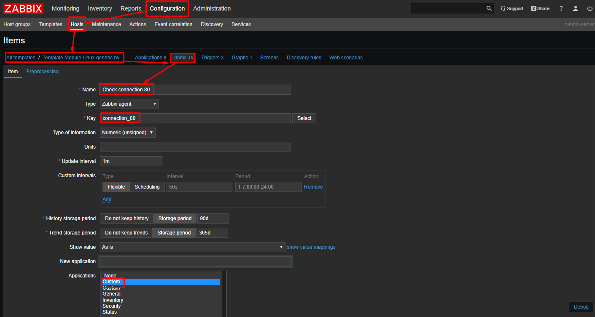
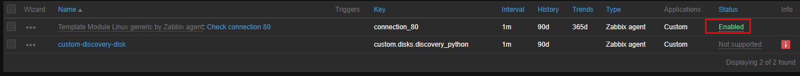
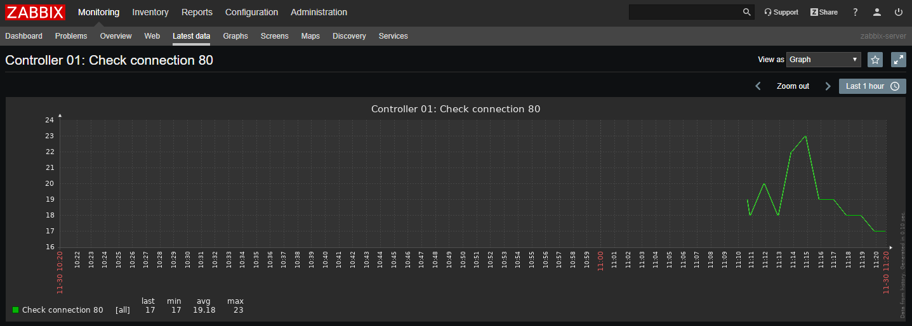

# Zabbix plugin 

## Hướng dẫn tạo một plugin sử dụng zabbix_sender để gửi metric về zabbix server 

**Tham khảo**: https://github.com/nhanhoadocs/thuctapsinh/blob/master/NiemDT/Ghichep-zabbix/labs/plugin.md

* **Bước 1** Tạo một item trên host cấu hình phía server với type là `zabbix trapper`

* **Bước 2** Tạo một script để gửi metric. Ví dụ kiểm tra số lượng user đang login vào server, sau đó gửi tới cho Zabbix server.

```sh
#!/bin/sh

###########################################################
# Server_addr dia chi zabbix server
SERVER_ADDR="10.10.10.160"
# Name_host ten cua host duoc cau hinh tren zabbix server
NAME_HOST="Host-10.162"
# Port la port tren zabbix server de thuc hien ket noi voi host
PORT="10051"
# Key la key cau hinh tren item cua host nhan gia tri 
KEY="test.send.notified"
###########################################################

while [ 1 != 0 ]
do
a=`uptime | awk '{print $4}'`
zabbix_sender -z ${SERVER_ADDR} -s ${NAME_HOST} -p ${PORT} -k ${KEY} -o $a > /dev/null 2>&1
sleep 60
done
```

* **Bước 3**: Sử dụng supervisor để chạy script

```sh
yum install supervisor -y 

cat <<EOF>> /etc/supervisord.d/plugin.ini
[program:plugin-user]
command=/root/plugin-check-user.sh
directory=/root
autostart=true
autorestart=true
logfile=/var/log/supervisor/plugin-user.log
log_stderr=true
user=root
EOF

systemctl restart supervisord
systemctl enable supervisord
supervisorctl status
```

* Cứ mỗi phút script sẽ tự động gửi dữ liệu về cho zabbix server.


## Tạo item key tùy biến trên Zabbix

**Tài liệu**: https://nguyenhuuhoang.com/huong-dan-tao-item-key-tuy-bien-tren-zabbix/

**Bước 1**: Cấu hình trên Zabbix agent

* Bỏ một số command trong file cấu hình `/etc/zabbix/zabbix_agentd.conf`

```sh
EnableRemoteCommands=1
AllowRoot=1
UnsafeUserParameters=1
```

* Khởi động lại zabbix agent

```sh
systemctl restart zabbix-agent
```

**Bước 2**: Tạo một file script cho key

```sh
mkdir /root/itemkey
cat <<EOF > /root/itemkey/connection_80
#!/bin/bash
netstat -an | grep :80 | wc -l
EOF

chmod +x /root/itemkey/connection_80
```

**Bước 3**: KHai báo item key trong Zabbix agent

* Chỉnh sửa file `/etc/zabbix/zabbix_agentd.conf`

```sh
UserParameter=connection_80,/root/itemkey/connection_80
```

**Bước 4**: Tạo item trên Zabbix server 

* Configuration -> Hosts -> Template -> chọn Template -> chọn items -> create item (template đang được host agent sử dụng)



* Kiểm tra item đã được enable trên host và lấy được dữ liệu về







