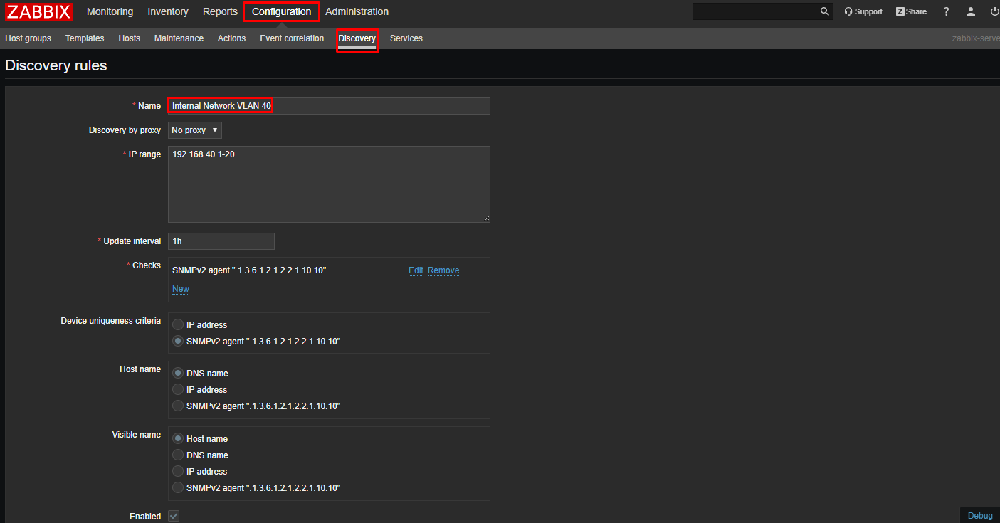
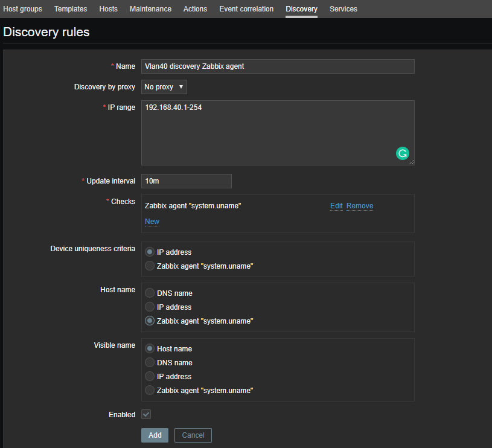
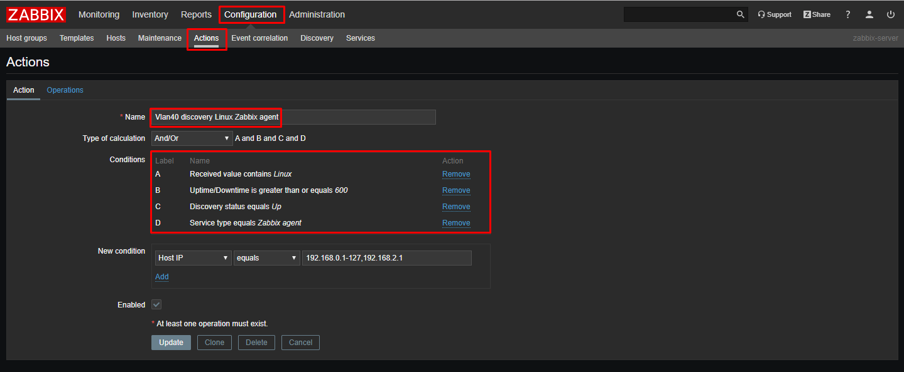
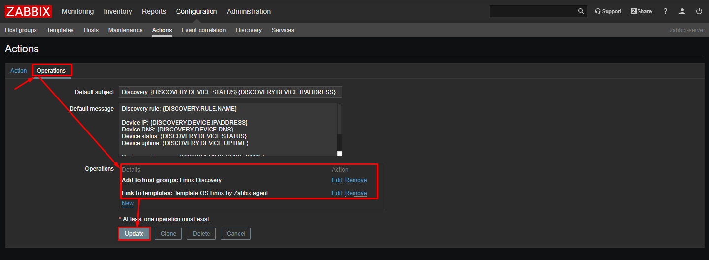
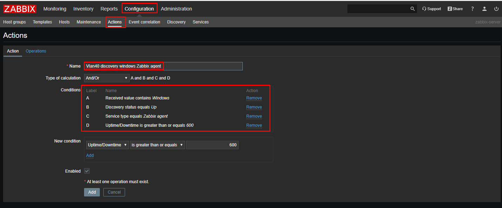
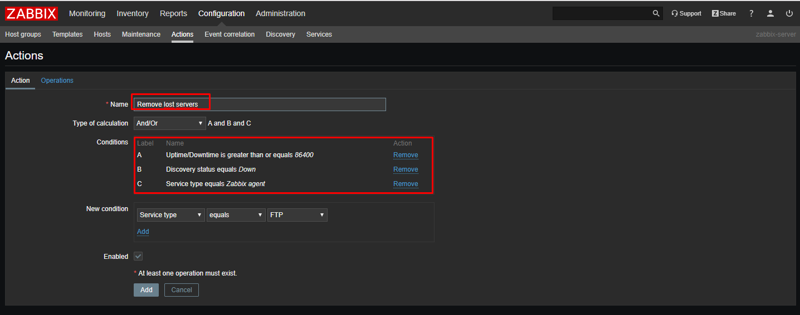
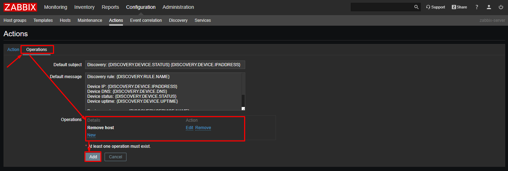
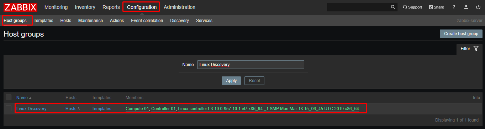

## 1. Network discovery

Zabbix cung cấp khả năng tự động network discovery một cách hiệu quả và linh động.

Với network discovery được set up đúng cách thì bạn có thể

* Tăng tốc độ triển khai Zabbix
* Đơn giản hóa việc quản trị
* Sử dụng Zabbix trong môi trường thay đổi liên tục mà không cần quá nhiều tới người quản trị.

Zabbix network discovery dựa trên các thông tin sau:

* IP ranges
* Availability of external services (FTP, SSH, WEB, POP3, IMAP, TCP, etc)
* Information received from Zabbix agent
* Information received from SNMP agent

Nó không cung cấp việc discovery of network topology.

Network discovery cơ bản gồm hai giai đoạn chính là: discovery và actions.

### Discovery 

Zabbix quét định kỳ dải IP được định nghĩa trong `network discovery rules`. Tần suất thực hiện check được cấu hình cho mỗi một rule có thể khác nhau (cấu hình riêng).

Một discovery rule sẽ luôn luôn được sử lý bởi một discovery process đơn lẻ. IP range sẽ không được phân chia giữa nhiểu discovery processes.

Mỗi rule có một tập các service check được định nghĩa để áp dụng cho IP range.

Mỗi lần check của một host (IP) và một service được thực hiện bởi network discovery module sinh ra một discovery event.

| **Event**  |  **Check of service result**|
|--------|------------|
| Service Discovered |	The service is 'up' after it was 'down' or when discovered for the first time.|
| Service Up |	The service is 'up', consecutively.|
| Service Lost |	The service is 'down' after it was 'up'.|
| Service Down |	The service is 'down', consecutively.|
| Host Discovered |	At least one service of a host is 'up' after all services of that host were 'down' or a service is discovered which belongs to a not registered host.|
| Host Up |	At least one service of a host is 'up', consecutively.|
| Host Lost |	All services of a host are 'down' after at least one was 'up'.|
| Host Down |	All services of a host are 'down', consecutively.|

### Actions 

Discovery events có thể là sở cho các action liên quan như:

* Sending notifications
* Adding/removing hosts
* Enabling/disabling hosts
* Adding hosts to a group
* Removing hosts from a group
* Linking hosts to/unlinking from a template
* Executing remote scripts

### Host creation 

Một host được thêm nếu `Add host` operation được lựa chọn. Một host cũng có thể được thêm vào mặc dù `Add host` operation bị missing nếu bạn lựa chọn operations dẫn đến thực hiện các actions trên một host. Ví dụ operations là:

* enable host
* disable host
* add host to a host group
* link template tới host

Khi thêm hosts, một host name là kết quả của việc reverse DNS lookup hoặc địa chỉ IP nếu reverse lookup fails. Lookup được thực hiện từ phía Zabbix server hoặc zabbix proxy, tùy thuộc vào việc discovery như nào. Nếu lookup fails trên proxy, nó sẽ không thử lại trên server. Nếu host với một tên đã tồn tại, thì tên host tiếp theo sẽ được gắn thêm `-2`, `-3`.

Một host được tạo sẽ mặc định được thêm vào `Discovered hosts` group (cấu hifng trong Administrator -> General -> Other). Nếu bạn muốn add host vào một group khác, thêm một `Remove from host groups` operation (đang được chỉ định là "Discovered hosts") và thêm một `Add to host groups` operation (chỉ định một host group khác).

Nếu một host đã tồn tại với discovered IP address sẽ không tạo host mới. Tuy nhiên, nếu discovery action bao gồm các operations (link template, add to host group,..), thì chúng vẫn được thực hiện trên các host đã tồn tại.

**Host removal**

Từ zabbix 2.4.0, các host được discovered bởi một network discovery rule sẽ tự động bị xóa từ `Monitoring -> Discovery` nếu một discovered entity bị phát hiện không nằm trong dải IP của rule nữa. Khi đó host sẽ bị xóa ngay lập tức.

**Tạo interface khi host đang được add**

Khi hosts được thêm bởi network discovery, chúng sẽ sử dụng interface được tạo theo các quy tắc sau:

* Services được phát hiện - Ví dụ: nếu một SNMP check thành công, một SNMP interface sẽ được tạo.
* Nếu một host phản hổi lại cả Zabbix agent và SNMP requests, cả hai types này sẽ đều được tạo.

* Nếu tiêu chí duy nhất là zabbix agent hoặc SNMP-return data, mặc định interface đầu tiên được tìm thấy cho một host sẽ được tạo. Các IP khác sẽ được thêm như việc additional interfaces.

* Nếu một host chỉ phản hồi agent checks, nó sẽ chỉ tạo với một agent interface. Nếu sau đó nó bắt đầu phản hổi lại SNMP thì một additional SNMP interfaces sẽ được thêm vào.

* Nếu 3 máy ảo được phát hiện lần đầu và được discovered với tiêu chí duy nhất là "IP", and then the discovery rule is modified so that hosts A, B and C have identical uniqueness criteria result, B and C are created as additional interfaces for A, the first host. The individual hosts B and C remain. In Monitoring → Discovery the added interfaces will be displayed in the “Discovered device” column, in black font and indented, but the “Monitored host” column will only display A, the first created host. “Uptime/Downtime” is not measured for IPs that are considered to be additional interfaces.

## 2. Configuring a network discovery rule

Tạo một network discovery rule để tìm kiếm các host và services

* Trên Zabbix frontend Configuration -> Discovery
* Click `Create rule` hoặc chọn rule name đã có sẵn để chỉnh sửa
* Điền các thông tin, thuộc tính của các discovery rule sau đó lưu lại để áp dụng

**Rule attributes**

Trong đó: 

* Name: là tên định danh duy nhất cho rule 
* Discovery by proxy: nếu có sử dụng proxy thì có thể chọn tên proxy. Có hai lựa chọn là:

	* **no proxy**: Zabbix server sẽ thực hiện discovery
	* **<proxy name>**: proxy thực hiện discovery

* IP range: dải IP sẽ thực hiện discovery. Nó có một số định dạng sau:

	* Single IP
	* Range of IP addresses: 192.168.1.1-25, 192.168.1-10.1-255
	* IP mask: 192.168.4.0/24. supported IP masks: /16 - /30 for IPv4 addresses; /112 - /128 for IPv6 addresses.
	* List: 192.168.1.1-255,192.168.2.1-100,192.168.2.200,192.168.4.0/24
	* Từ bản 3.0, trường này đã hỗ trợ thêm các khoảng cách, lập bảng biểu, và multiple lines.

* Update interval: Tham số này định nghĩa tần suất Zabbix sẽ thực hiện rule. Khoảng thời gian này sẽ được đo từ sau khi việc thưc hiện discovery các instance trước đó kết thúc để không bị chồng lấn. Hố trợ 

	* `Time suffixes`: 30s, 1m, 2h, 1d,..
	* `User macros`: Nếu một user macro được sử dụng và giá trị của nó được thay đổi (ví dụ 1w -> 1h), lần check tiếp theo được thực hiện theo giá trị trước đó.

*  Checks: Zabbix sẽ sử dụng danh sach check này cho việc discovery. Các checks được hỗ trợ là: SSH, LDAP, SMTP, FTP, HTTP, HTTPS, POP, NNTP, IMAP, TCP, Telnet, Zabbix agent, SNMPv1 agent, SNMPv2 agent, SNMPv3 agent, ICMP ping.  

* Device uniqueness criteria: Các tiêu chí có thể là:

	* IP address: Không xử lý nhiều single-IP devices. Nếu một thiết bị có IP giống với IP đã tồn tại hì nó sẽ xem xét các discovered đã có, và một host mới sẽ không được thêm vào
	* Type of discovery check: SNMP hoặc Zabbix agent check

* Host name: thiết lập technical host name khi host được tạo: Mặc định sẽ là DNS name, ngoài ra có thể là IP address hoặc `<discovery check>` - giá trị string nhận được khi discovery check (Zabbix agent, SNMP agent check,..)

* Visible name: Tên hiển thị của host, mặc định sẽ là hostname (technical host name)

Các host được discovery bởi các proxies khác nhau sẽ được coi là các host khác nhau.

**Ví dụ**

* Thực hiện discovery một mạng có range IP là 192.168.40.1 - 192.168.40.255, yêu cầu là:

	* Discover tất cả các host có Zabbib agent đang running
	* run discovery mỗi 10 phút
	* Thêm host để monitoring nếu thời gian uptime của host là hơn 1 giờ
	* Xóa host nếu host downtime hơn một giờ
	* Thêm Linux hosts vào "Linux servers" group
	* Thêm Windows host vào "Windows servers" group
	* use Template_Linux for Linux hosts
	* use Template_Windows for Windows hosts

* Bước 1: định nghĩa một network discovery rule cho dải IP

* Bước 2: Định nghĩa một action để add thêm các host linux discovery được vào các group và sử dụng template mong muốn.

* Bước 3: Tương tự tạo thêm một action nữa để add các host windows vào group riêng và link tới template tương ứng

* Bước 4: Định nghĩa một action nữa để tự động xóa các server không còn hoạt động nữa (lost)

* Kết quả

