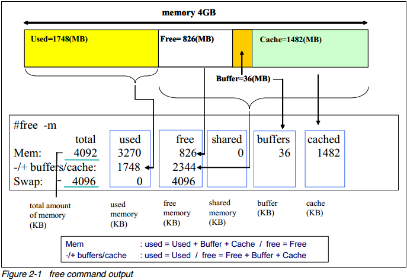
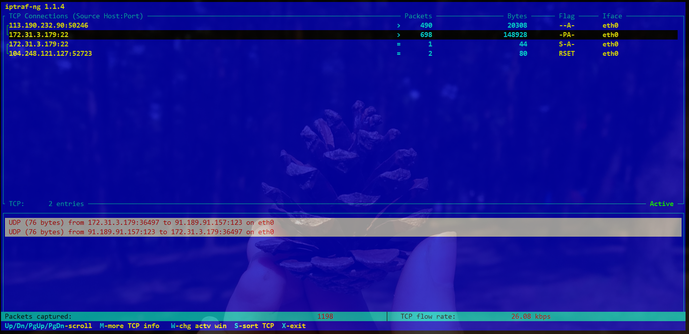
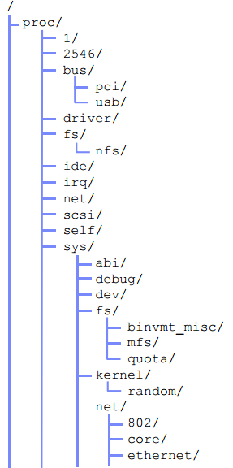

# Monitoring tools

## Command top

Cho thấy hoạt động thực tế của các tiến trình, mặc định nó sẽ hiển thị chủ yếu về CPU-intensive tasks đang chạy trên server và update nó mỗi 5s. Bạn có thể sắp xếp nó theo thứ tự của pid hoặc age, ...

```sh
top - 19:57:34 up 47 min,  2 users,  load average: 0.00, 0.01, 0.05
Tasks: 192 total,   1 running, 191 sleeping,   0 stopped,   0 zombie
%Cpu(s):  0.0 us,  0.7 sy,  0.0 ni, 99.3 id,  0.0 wa,  0.0 hi,  0.0 si,  0.0 st
KiB Mem :   283732 total,    14552 free,    77204 used,   191976 buff/cache
KiB Swap:  1046524 total,  1043444 free,     3080 used.   172428 avail Mem 

   PID USER      PR  NI    VIRT    RES    SHR S %CPU %MEM     TIME+ COMMAND                    
     1 root      20   0   37828   5432   3900 S  0.0  1.9   0:02.20 systemd                    
     2 root      20   0       0      0      0 S  0.0  0.0   0:00.00 kthreadd                   
     3 root      20   0       0      0      0 S  0.0  0.0   0:00.05 ksoftirqd/0                
     5 root       0 -20       0      0      0 S  0.0  0.0   0:00.00 kworker/0:0H               
     7 root      20   0       0      0      0 S  0.0  0.0   0:00.14 rcu_sched                  
     8 root      20   0       0      0      0 S  0.0  0.0   0:00.00 rcu_bh                     
     9 root      rt   0       0      0      0 S  0.0  0.0   0:00.00 migration/0                
    10 root      rt   0       0      0      0 S  0.0  0.0   0:00.01 watchdog/0                 
    11 root      20   0       0      0      0 S  0.0  0.0   0:00.00 kdevtmpfs                  
    12 root       0 -20       0      0      0 S  0.0  0.0   0:00.00 netns                      
    13 root       0 -20       0      0      0 S  0.0  0.0   0:00.00 perf                       
    14 root      20   0       0      0      0 S  0.0  0.0   0:00.00 khungtaskd                 
    15 root       0 -20       0      0      0 S  0.0  0.0   0:00.00 writeback                  
    16 root      25   5       0      0      0 S  0.0  0.0   0:00.00 ksmd                       
    17 root       0 -20       0      0      0 S  0.0  0.0   0:00.00 crypto                     
    18 root       0 -20       0      0      0 S  0.0  0.0   0:00.00 kintegrityd                
    19 root       0 -20       0      0      0 S  0.0  0.0   0:00.00 bioset                     
    20 root       0 -20       0      0      0 S  0.0  0.0   0:00.00 kblockd                    
    21 root       0 -20       0      0      0 S  0.0  0.0   0:00.00 ata_sff 
```

Ấn phím 1 để hiển thị thông số trên từng CPU, nếu gộp lại thì nó sẽ lấy trung bình công của từng thông số

```sh
top - 14:36:51 up  2:58,  1 user,  load average: 0.00, 0.00, 0.00
Tasks: 122 total,   1 running, 121 sleeping,   0 stopped,   0 zombie
%Cpu0  :  0.0 us,  0.0 sy,  0.0 ni,100.0 id,  0.0 wa,  0.0 hi,  0.0 si,  0.0 st
%Cpu1  :  0.7 us,  0.3 sy,  0.0 ni, 99.0 id,  0.0 wa,  0.0 hi,  0.0 si,  0.0 st
KiB Mem :  1949392 total,  1271020 free,   309352 used,   369020 buff/cache
KiB Swap:  1044476 total,  1044476 free,        0 used.  1398388 avail Mem
```


**Dòng đầu tiên**: thể hiện thời gian máy uptime, số user đang đăng nhập, tải trung bình của hệ thống. Ba thông số của load average lần lượt chỉ khối lượng trung bình hệ thống phải xử lý trong khoảng thời gian 1p, 5p và 15p.

**Dòng 2**: thể hiện tổng số tiến trình, số tiến trình đang chạy, số tiến trình đang chờ, số tiến trình đã dừng, số tiến trình đang chờ dừng (zombie)

**Dòng 3**: 

* Phần trăm CPU sử dụng cho người dùng khi khởi tạo tiến trình (%us)
* Phần trăm CPU sử dụng cho hệ thống (tạo bởi kernel) (%sy)
* Phần trăm CPU sử dụng cho tiến trình update (%ni)
* Phần trăm CPU bị chiếm dụng khi cpu không sử dụng, đang trong trạng thái chờ (idle) ở thời điểm không có I/O request (%id)
* Phần trăm chiếm dụng CPU khi cpu đang trong trạng thái idle ở thời điểm phát sinh I/O request (wa%)
* Phần trăm CPU sử dụng xử lý gián đoạn phần cứng (%hi)
* Phần trăm CPU sử dụng xử lý gián đoạn phần mềm (%si)
* Phần trăm do máy ảo sử dụng (%st)

**Dòng 4,5** thể hiện mức độ sử dụng RAM và swap

Bên dưới là bảng các tiến trình với các thông số:

* PID: ID của tiến trình
* USER: User sử dụng tiến trình đó
* PR: Mức đăng quyền của tiến trình
* NI: Giá trị tốt của tiến trình
* VIRT: Bộ nhớ ảo dùng cho tiến trình
* RES: Bộ nhớ vật lý dùng cho tiến trình
* SHARE Amount of memory shared with other processes, in kilobytes
* STAT State of the process: S=sleeping, R=running, T=stopped or traced, D=interruptible sleep, Z=zombie.
* %CPU: Phần trăm CPU sử dụng cho tiến trình (Trong lần cập nhật cuối - không phải thời gian thực)
* %MEM: Phần trăm bộ nhớ sử dụng cho tiến trình (Trong lần cập nhật cuối - không phải thời gian thực)
* TIME: Tổng thời gian hoạt động của tiến trình (kể cả tiến trình con)
* COMMAND: Tên của tiến trình hoặc đường dẫn đến leenhje để khởi động tiến trình đó

#### Load average

Load average gồm 3 con số thể hiện trong 3 khoảng thời gian khác nhau: trong 1, 5, 15 phút. Giá trị của Load average phụ thuộc vào spps core của CPU:

|Số lượng core| Giá trị Load average lớn nhất |
|--|--|
| 1 core | 1.00|
| 2 core | 2.00|
| 8 core | 8.00|


## vmstat

vmstat cung cấp thông tin về processes, memory, paging, block I/O, traps, and CPU activity.

```sh
root@trang-20-51:~# vmstat
procs -----------memory---------- ---swap-- -----io---- -system-- ------cpu-----
 r  b   swpd   free   buff  cache   si   so    bi    bo   in   cs us sy id wa st
 0  0   8520 174324 274476 1093084    0    0     5    15   79  169  0  0 99  1  0
```

Trong đó: 
* `Process` (procs):
	* r: Số lượng các process đang đợi runtime
	* b: Số lượng các tiến trình sleep không bị gián đoạn
* `Memory swpd`: The amount of virtual memory used (KB)
	* free: lượng memory nhàn rỗi (KB)
	* buff: lượng memory được sử dụng như buffers (KB)
	* cache: lượng memory được sử dụng như cache (KB)
* `Swap` 
	* si: Amount of memory swapped from the disk (KBps)
	* so: Amount of memory swapped to the disk (KBps)
* `IO`
	* bi: Blocks sent to a block device (blocks/s)
	* bo: Blocks received from a block device (blocks/s)
* `System`
	* in: The number of interrupts per second, including the clock
	* cs: The number of context switches per second
* `Cpu`
	* us: Time spent running non-kernel code (user time, including nice time).
	* sy: Time spent running kernel code (system time).
	* id: Time spent idle. Trước Linux 2.5.41, bao gồm cả I/O-wait time.
	* wa: Time spent waiting for IO. Trước Linux 2.5.41, this appeared as zero.

## uptime

The uptime command can be used to see how long the server has been running and how many users are logged on, as well as for a quick overview of the average load of the server

## ps and pstree

`ps` và `pstree` là một số command cơ bản để phân tích hệ thống. `ps` có 3 thể loại tùy chọn khác nhau, UNIX style, BSD style and GNU style. 

Một số tùy chọn với `ps`

* ps -ef – Liệt kê process đang chạy bây giờ. (Một command tương tự là ps aux)
* ps -f -u user1,user2 – Sẽ hiển thị tất cả process dựa rên UID (user id hoặc username).
* ps -f –pid ID – Hiển thị tất cả processes dựa trên process ID (pid). Điền PID hoặc PPID thay vào chỗ id. Có thể được dùng với PPID để lọc process dựa trên parent ID.
* ps -C command/name – Lọc Processes dựa trên tên của nó hoặc command
* ps aux –sort=-pcpu,+pmem – Hiển thị process đang dùng nhiều tài nguyên nhất của CPU.
* ps -e -o pid,uname,pcpu,pmem,comm – Được dùng để lọc column được chỉ định.
* ps -e -o pid,comm,etime – Việc này sẽ hiển thị thời gian đã được dùng của process.


|Thông số|Miêu tả|
|--|--|
|F | Process flag|
|S |State of the process: S=sleeping, R=running, T=stopped or traced, D=interruptable sleep, Z=zombie.|
|UID	|ID người sử dụng mà tiến trình này thuộc sở hữu (người chạy nó).|
|PID	|Process ID.|
|PPID	|Process ID gốc (ID của tiến trình mà bắt đầu nó).|
|LWP | LWP(light weight process, or thread) ID of the lwp being reported|
|C	|CPU sử dụng của tiến trình.|
|PRI| Priority of the process.|
|ADDR| Process Address space (not displayed)|
|SZ |Amount of memory (code+data+stack) used by the process in kilobytes.|
|PSR |Processor that process is currently assigned to.|
|STIME	|Thời gian bắt đầu tiến trình.|
|TTY	|Kiểu terminal liên kết với tiến trình.|
|TIME	|Thời gian CPU bị sử dụng bởi tiến trình.|
|CMD	|Lệnh mà bắt đầu tiến trình này.|


## Thread information
```
$ ps -LF
UID        PID  PPID   LWP  C NLWP    SZ   RSS PSR STIME TTY          TIME CMD
root      9688  9674  9688  0    1 13174  3980   1 17:34 pts/1    00:00:00 sudo -i
root      9689  9688  9689  0    1  5646  5188   0 17:34 pts/1    00:00:00 -bash
root      9750  9689  9750  0    1  9340  3236   1 17:39 pts/1    00:00:00 ps -LF
```

## free

Command hiển thị thông tin về tổng dung lượng của bộ nhớ trống và bộ nhớ đã được sử dụng (gồm swap) trên hệ thống. Nó cũng bao gồm  thông tin về buffers, cache được sử dụng bởi kernel.

Khi sử dụng `free`, hãy nhớ kiến ​​trúc bộ nhớ Linux và cách virtual memory manager hoạt động, xem hình minh họa dưới đây



Ví dụ: 

```sh
root@trang-20-51:~# free 
              total        used        free      shared  buff/cache   available
Mem:        1949392      848872      149556       42872      950964      744024
Swap:       1044476       35704     1008772
```

Trong ví dụ trên thì `total = used + free + buff/cache`

Sử dụng các tùy chọn `-b`, `-k`, `-m`, `-g` để hiện thị các giá trị dạng bytes, kilobytes, megabytes, and gigabytes

* used: dung lượng ram đã dùng
* free: dung lượng ram còn trống
* cached và buffers: Cả Cached và Buffers đều có ý nghĩa là vùng lưu trữ tạm, nhưng mục đích sử dụng thì khác nhau, tổng quan thì có một số điểm sau:

    * Mục đích của cached là tạo ra một vùng nhớ tốc độ cao nhằm tăng tốc quá trình đọc/ghi file ra đĩa, trong khi buffers là tạo ra 1 vùng nhớ tạm có tốc độ bình thường, mục đích để gom data hoặc giữ data để dùng cho mục đích nào đó.
    * Cached được tạo từ static RAM (SRAM) nên nhanh hơn dynamic RAM (DRAM) dùng để tạo ra buffers.
    * Buffers thường dùng cho các tiến trình input/output, trong khi cached chủ yếu được dùng cho các tiến trình đọc/ghi file ra đĩa
    * Cached có thể là một phần của đĩa (đĩa có tốc độ cao) hoặc RAM trong khi buffers chỉ là một phần của RAM (không thể dùng đĩa để tạo ra buffers)
* shared: Đây là bộ nhớ chia sẻ giữa các tiến trình, bộ nhớ đang được sử dụng như các bộ đệm (lưu trữ tạm thời) bởi hạt nhân
* Swap Space: được sử dụng khi dung lượng bộ nhớ vật lý (RAM) đầy. Nếu hệ thống cần nhiều tài nguyên bộ nhớ hơn và bộ nhớ RAM đầy

## iostat

Command này hiển thị CPU times trung bình kể từ khi hệ thống bắt đầu hoạt động (giống với uptime). Nó cũng tạo ra một báo cáo về các hoạt động của disk subsystem trên server trong hai phần: CPU utilization and device (disk) utilization. 

```sh 
root@trang-20-51:~# iostat
Linux 4.4.0-87-generic (trang-20-51)    10/02/2018  _x86_64_    (2 CPU)

avg-cpu:  %user   %nice %system %iowait  %steal   %idle
           0.35    0.00    0.14    0.54    0.00   98.97

Device:            tps    kB_read/s    kB_wrtn/s    kB_read    kB_wrtn
loop0             0.00         0.00         0.00          8          0
vda               0.98         3.36        13.62    1289867    5228714
scd0              0.00         0.00         0.00         96          0
dm-0              1.38         3.33        13.22    1276353    5072072
dm-1              0.10         0.01         0.41       4644     156632
```

Vì `iostat` là một phần của `sysstat package` nên muốn sử dụng thì cần cài đặt gói này:

    apt-get install sysstat

* Phần CPU utilization report có 4 phần:

    * %user Shows the percentage of CPU utilization that was taken up while executing at the user level (applications).
    * %nice Shows the percentage of CPU utilization that was taken up while executing at the user level with a nice priority.
    * %sys Shows the percentage of CPU utilization that was taken up while executing at the system level (kernel).
    * %idle Shows the percentage of time the CPU was idle.

* Phần device utilization report có các phần sau:

    * `Device` The name of the block device.
    * `tps` The number of transfers per second (I/O requests per second) to the device. Multiple single I/O requests can be combined in a transfer request, because a transfer request can have different sizes.
    * `Blk_read/s`, `Blk_wrtn/s`: Blocks read and written per second indicate data read from or written to the device in seconds. Blocks can also have different sizes. Typical sizes are 1024, 2048, and 4048 bytes, depending on the partition size.
    * `Blk_read`, `Blk_wrtn` Indicates the total number of blocks read and written since the boot.

`iostat` có thể sử dụng nhiều option khác nhau, nhưng hữu dụng nhất về quan điểm hiệu năng là `-x`. Nó hiển thị thêm phần thống kê mở rộng. Ví dụ:

```sh
root@trang-20-51:~# iostat -d -x vda1
Linux 4.4.0-87-generic (trang-20-51)    10/02/2018  _x86_64_    (2 CPU)

Device:         rrqm/s   wrqm/s     r/s     w/s    rkB/s    wkB/s avgrq-sz avgqu-sz   await r_await w_await  svctm  %util
vda1              0.00     0.00    0.00    0.00     0.01     0.00    33.16     0.00   16.18    2.98  487.11   5.42   0.00
```

* Trong đó: 
    
    * `rrqm/s, wrqm/s`: The number of read/write requests merged per second that were issued to the device. Multiple single I/O requests can be merged in a transfer request, because a transfer request can have different sizes.
    * `r/s, w/s`: The number of read/write requests that were issued to the device per second.
    * `rsec/s, wsec/s`: The number of sectors read/write from the device per second.
    * `rkB/s, wkB/s` The number of kilobytes read/write from the device per second.
    * `avgrq-sz` The average size of the requests that were issued to the device. This value is displayed in sectors.
    * `avgqu-sz` The average queue length of the requests that were issued to the device.
    * `await` Shows the percentage of CPU utilization that was used while executing at the system level (kernel).
    * `svctm` The average service time (in milliseconds) for I/O requests that were issued to the device.
    * `%util` Percentage of CPU time during which I/O requests were issued to the device (bandwidth utilization for the device). Device saturation occurs when this value is close to 100%.

## Sar
Được sử dụng để thu thập, báo cáo và lưu thông tin hoạt động của hệ thống. `sar` command bao gồm 3 ứng dụng:
* `sar` hiển thị dữ liệu
* `sar1` và `sar2` sử dụng để thu thập và sắp xếp dữ liệu.

`sar` tool có rất nhiều các option nên để chắc chắn thì nên xem man page của nó để biết thêm. `sar` cũng là một phần của `sysstat package`.

Với `sar1` và `sar2`, hệ thống có thể được cấu hình để lấy thông tin và log của nó để phân tích sau.

Ví dụ đưa ra thông kê hệ thống 3 lần mỗi giây:

```sh
root@trang-20-51:~# sar 1 3
Linux 4.4.0-87-generic (trang-20-51)    10/02/2018  _x86_64_    (2 CPU)

11:38:54 AM     CPU     %user     %nice   %system   %iowait    %steal     %idle
11:38:55 AM     all      0.50      0.00      0.00      9.55      0.00     89.95
11:38:56 AM     all      0.00      0.00      0.50      9.45      0.00     90.05
11:38:57 AM     all      0.50      0.00      0.50      0.00      0.00     99.00
Average:        all      0.33      0.00      0.33      6.33      0.00     93.00
```

Để có thể thực hiện điều này ta thêm dòng vào file `/etc/crontab`. Nhớ rằng việc cron mặc định chạy `sar` hàng ngày được thiết lập tự động sau khi cài đặt sar trên hệ thống của bạn.

Vì dụ báo cáo log tự động với cron:

```sh
# 8am-7pm activity reports every 10 minutes during weekdays.
*/10 8-18 * * 1-5 /usr/lib/sa/sa1 600 6 &
# 7pm-8am activity reports every an hour during weekdays.
0 19-7 * * 1-5 /usr/lib/sa/sa1 &
# Activity reports every an hour on Saturday and Sunday.
0 * * * 0,6 /usr/lib/sa/sa1 &
# Daily summary prepared at 19:05
5 19 * * * /usr/lib/sa/sa2 -A &
```

Raw data của `sar` tool được lưu trữ ở `/var/log/sa` nơi có các file đại diện cho các ngày của tháng tương ứng.

### CPU Usage of ALL CPUs (sar -u)

This gives the cumulative real-time CPU usage of all CPUs. “3 10” reports for every 3 seconds a total of 10 times. Most likely you’ll focus on the last field “%idle” to see the cpu load.

Displays real time CPU usage every 3 second for 10 times:

```sh
root@trang-20-51:/var/log/sysstat# sar -u 3 10
Linux 4.4.0-87-generic (trang-20-51)    10/02/2018  _x86_64_    (2 CPU)

08:13:07 AM     CPU     %user     %nice   %system   %iowait    %steal     %idle
08:13:10 AM     all      0.17      0.00      0.00      0.51      0.00     99.33
08:13:13 AM     all      0.17      0.00      0.17      0.00      0.00     99.67
08:13:16 AM     all      0.00      0.00      0.17      2.35      0.00     97.48
08:13:19 AM     all      0.33      0.00      0.17      0.00      0.00     99.50
08:13:22 AM     all      0.17      0.00      0.00      0.67      0.00     99.16
...
Average:        all      0.17      0.00      0.10      0.70      0.00     99.03
```

Một vài các command hay dùng với sar:

* `sar -u` Displays CPU usage for the current day that was collected until that point.
* `sar -u 1 3` Displays real time CPU usage every 1 second for 3 times.
* `sar -u ALL` Same as “sar -u” but displays additional fields.
* `sar -u ALL` 1 3 Same as “sar -u 1 3” but displays additional fields.
* `sar -u -f /var/log/sa/sa10` Displays CPU usage for the 10day of the month from the sa10 file.

### CPU Usage of Individual CPU or Core

If you have 4 Cores on the machine and would like to see what the individual cores are doing, do the following.

“-P ALL” indicates that it should displays statistics for ALL the individual Cores.

In the following example under “CPU” column 0, 1, 2, and 3 indicates the corresponding CPU core numbers.

```sh
root@trang-20-51:~# sar -P ALL 1 1
Linux 4.4.0-87-generic (trang-20-51)    10/02/2018  _x86_64_    (2 CPU)

11:50:27 AM     CPU     %user     %nice   %system   %iowait    %steal     %idle
11:50:28 AM     all      0.00      0.00      0.00      0.00      0.00    100.00
11:50:28 AM       0      0.99      0.00      0.00      0.00      0.00     99.01
11:50:28 AM       1      0.00      0.00      0.00      0.00      0.00    100.00

Average:        CPU     %user     %nice   %system   %iowait    %steal     %idle
Average:        all      0.00      0.00      0.00      0.00      0.00    100.00
Average:          0      0.99      0.00      0.00      0.00      0.00     99.01
Average:          1      0.00      0.00      0.00      0.00      0.00    100.00
```


### Memory Free and Used (sar -r)

This reports the memory statistics. “1 3” reports for every 1 seconds a total of 3 times. Most likely you’ll focus on “kbmemfree” and “kbmemused” for free and used memory.

```sh
root@trang-20-51:~# sar -r 1 3
Linux 4.4.0-87-generic (trang-20-51)    10/02/2018  _x86_64_    (2 CPU)

11:46:15 AM kbmemfree kbmemused  %memused kbbuffers  kbcached  kbcommit   %commit  kbactive   kbinact   kbdirty
11:46:16 AM   1418504    530888     27.23     23144    290864    622056     20.78    240504    224832         4
11:46:17 AM   1418504    530888     27.23     23144    290864    622056     20.78    240512    224832         4
11:46:18 AM   1418504    530888     27.23     23144    290864    622056     20.78    240508    224832         4
Average:      1418504    530888     27.23     23144    290864    622056     20.78    240508    224832         4
```

Dưới đây là một vài các command:

    sar -r
    sar -r 1 3
    sar -r -f /var/log/sa/sa10

###  Swap Space Used (sar -S)

Báo cáo về việc thống kê swap, nếu “kbswpused” và “%swpused” bằng 0 thì hệ thống của bạn không swapping

```sh
root@trang-20-51:~# sar -S 1 3
Linux 4.4.0-87-generic (trang-20-51)    10/02/2018  _x86_64_    (2 CPU)

01:36:49 PM kbswpfree kbswpused  %swpused  kbswpcad   %swpcad
01:36:50 PM   1044476         0      0.00         0      0.00
01:36:51 PM   1044476         0      0.00         0      0.00
01:36:52 PM   1044476         0      0.00         0      0.00
Average:      1044476         0      0.00         0      0.00
```

Một vài command:

    sar -S
    sar -S 1 3
    sar -S -f /var/log/sa/sa10

### Report network statistics (sar -n)
Báo cáo thống kê về network như: Số lượng packet nhận được(hay transmitted) qua card mạng, statistics of packet failure,...

    sar -n KEYWORD

`KEYWORD` có thể là một trong những thứ sau:

* DEV – Displays network devices vital statistics for eth0, eth1, etc.,
* EDEV – Display network device failure statistics
* NFS – Displays NFS client activities
* NFSD – Displays NFS server activities
* SOCK – Displays sockets in use for IPv4
* IP – Displays IPv4 network traffic
* EIP – Displays IPv4 network errors
* ICDEV – Displays network devices vital statistics for eth0, eth1, etc.,
* EDEV – Display network device failure statistics
* NFS – Displays NFS client activities
* NFSD – Displays NFS server activities
* SOCK – Displays sockets in use for IPv4
* IP – Displays IPv4 network traffic
* EIP – Displays IPv4 network errors
* ICMP – Displays ICMPv4 network traffic
* EICMP – Displays ICMPv4 network errors
* TCP – Displays TCPv4 network traffic
* ETCP – Displays TCPv4 network errors
* UDP – Displays UDPv4 network traffic
* SOCK6, IP6, EIP6, ICMP6, UDP6 are for IPv6
* ALL – This displays all of the above information. The output will be very long.MP – Displays ICMPv4 network traffic
* EICMP – Displays ICMPv4 network errors
* TCP – Displays TCPv4 network traffic
* ETCP – Displays TCPv4 network errors
* UDP – Displays UDPv4 network traffic
* SOCK6, IP6, EIP6, ICMP6, UDP6 are for IPv6
* ALL – This displays all of the above information. The output will be very long.

```sh
root@trang-20-51:~# sar -n DEV 1 1
Linux 4.4.0-87-generic (trang-20-51)    10/02/2018  _x86_64_    (2 CPU)

01:46:04 PM     IFACE   rxpck/s   txpck/s    rxkB/s    txkB/s   rxcmp/s   txcmp/s  rxmcst/s   %ifutil
01:46:05 PM        lo      0.00      0.00      0.00      0.00      0.00      0.00      0.00      0.00
01:46:05 PM br-d60bbe8e16f5      0.00      0.00      0.00      0.00      0.00      0.00      0.00      0.00
01:46:05 PM   docker0      0.00      0.00      0.00      0.00      0.00      0.00      0.00      0.00
01:46:05 PM      ens3      5.00      1.00      0.39      0.18      0.00      0.00      0.00      0.00

Average:        IFACE   rxpck/s   txpck/s    rxkB/s    txkB/s   rxcmp/s   txcmp/s  rxmcst/s   %ifutil
Average:           lo      0.00      0.00      0.00      0.00      0.00      0.00      0.00      0.00
Average:    br-d60bbe8e16f5      0.00      0.00      0.00      0.00      0.00      0.00      0.00      0.00
Average:      docker0      0.00      0.00      0.00      0.00      0.00      0.00      0.00      0.00
Average:         ens3      5.00      1.00      0.39      0.18      0.00      0.00      0.00      0.00
```


## mpstat

`mpstat` thường được sử dụng để báo cáo hoạt động của từng CPU có sẵn trên server multiprocessor. 

`mpstat` cũng là một phần của gói `systat`. Nó cho phép hiển thị số liệu thống kê CPU tổng thể trên một hệ thống hoặc trên mỗi processor. Nó cũng cho phép tạo thống kê khi sử dụng trong chế độ lấy mẫu tương tự như `vmstat` command với sampling frequency và sampling count.

```sh
root@trang-20-51:/var/log/sysstat# mpstat -P ALL
Linux 4.4.0-87-generic (trang-20-51)    10/02/2018  _x86_64_    (2 CPU)

08:24:42 AM  CPU    %usr   %nice    %sys %iowait    %irq   %soft  %steal  %guest  %gnice   %idle
08:24:42 AM  all    0.37    0.00    0.13    0.54    0.00    0.00    0.00    0.00    0.00   98.96
08:24:42 AM    0    0.37    0.00    0.14    0.52    0.00    0.00    0.00    0.00    0.00   98.97
08:24:42 AM    1    0.36    0.00    0.13    0.55    0.00    0.00    0.00    0.00    0.00   98.95
```

## pmap

Command `pmap` báo cáo lượng bộ nhớ cho một hoặc nhiều processes đang được sử dụng.Bạn có thể sử dụng tool này để xác định xem processes trên server được cấp phát bộ nhớ bao nhiêu và liệu rằng lượng memory này có phải là nguyên nhân gây ra hiện tượng bottlenecks. Để biết thêm thông tin chi tiết sử dụng option `-d`

    pmap -d <pid>

Ví dụ:

```sh
root@trang-20-51:/var/log/sysstat# pmap -d 1
1:   /sbin/init
Address           Kbytes Mode  Offset           Device    Mapping
000055f1df8b9000    1392 r-x-- 0000000000000000 0fc:00000 systemd
000055f1dfa16000     144 r---- 000000000015c000 0fc:00000 systemd
000055f1dfa3a000       4 rw--- 0000000000180000 0fc:00000 systemd
000055f1dfa3b000       4 rw--- 0000000000000000 000:00000   [ anon ]
000055f1e191f000    1300 rw--- 0000000000000000 000:00000   [ anon ]
00007f4dc7356000      16 r-x-- 0000000000000000 0fc:00000 libuuid.so.1.3.0
...
00007f4dc9734000       4 r---- 0000000000025000 0fc:00000 ld-2.23.so
00007f4dc9735000       4 rw--- 0000000000026000 0fc:00000 ld-2.23.so
00007f4dc9736000       4 rw--- 0000000000000000 000:00000   [ anon ]
00007ffe44431000     132 rw--- 0000000000000000 000:00000   [ stack ]
00007ffe445ba000       8 r---- 0000000000000000 000:00000   [ anon ]
00007ffe445bc000       8 r-x-- 0000000000000000 000:00000   [ anon ]
ffffffffff600000       4 r-x-- 0000000000000000 000:00000   [ anon ]
mapped: 37732K    writeable/private: 1640K    shared: 0K
```

Trong đó một số thông tin quan trọng nhất như sau:

* mapped: là tổng lượng memory được map vào file sử dụng trong process
* writable/private: là lượng không gian địa chỉ private mà tiến trình này đang sử dụng
* shared: là lượng không gian địa chỉ mà tiến trình này đang chia sẻ với các tiến trình khác

Bạn cũng có thể xem các không gian địa chỉ nơi mà thông tin được lưu trữ. Bạn có thể sẽ tìm thấy một sự khác biệt thú vị khi chạy lệnh này trên HĐH 32-bit và 64-bit

## Netstat

`netstat` là một trong những tool phổ biến nhất. Nếu bạn làm việc với network, bạn nên làm quen với tool này. Nó hiển thị nhiều thông tin liên quan về network như: socket usage, routing, interface, protocol, network statistics,... 

Một vài các tùy chọn cơ bản:

* `-a` Show all socket information
* `-r` Show routing information
* `-i` Show network interface statistics
* `-s` Show network protocol statistics

Thông tin về socket:

```sh
root@trang-20-51:/var/log/sysstat# netstat -natuw
Active Internet connections (servers and established)
Proto Recv-Q Send-Q Local Address           Foreign Address         State      
tcp        0      0 127.0.0.1:3306          0.0.0.0:*               LISTEN     
tcp        0      0 127.0.0.1:6379          0.0.0.0:*               LISTEN     
tcp        0      0 0.0.0.0:80              0.0.0.0:*               LISTEN     
tcp        0      0 0.0.0.0:22              0.0.0.0:*               LISTEN     
tcp        0      0 127.0.0.1:8088          0.0.0.0:*               LISTEN     
tcp        0      0 127.0.0.1:6010          0.0.0.0:*               LISTEN     
tcp        0     52 192.168.20.51:22        192.168.20.167:50136    ESTABLISHED
tcp6       0      0 :::8086                 :::*                    LISTEN     
tcp6       0      0 :::22                   :::*                    LISTEN     
tcp6       0      0 ::1:6010                :::*                    LISTEN  
```

* Proto The protocol (tcp, udp, raw) used by the socket.
* `Recv-Q` The count of bytes not copied by the user program connected to this socket.
* `Send-Q` The count of bytes not acknowledged by the remote host. (không có ack phản hồi từ máy bên kia)
* `Local Address` Address and port number of the local end of the socket. Unless the --numeric (-n) option is specified, the socket address is resolved to its canonical host name (FQDN), and the port number is translated into the corresponding service name.
* `Foreign` Address Address and port number of the remote end of the socket.
* `State` The state of the socket. Since there are no states in raw mode and usually no states used in UDP, this column may be left blank.


## iptraf

`iptraf` monitors TCP/IP traffic và tạo ra báo cáo theo thời gian thực. Nó hiển thị ra thông kê về TCP/IP traffic cho mỗi session, mỗi interface, mỗi protocol.

`iptraf` báo cáo một số vấn đề như sau:

* IP traffic monitor: Network traffic statistics by TCP connection
* General interface statistics: IP traffic statistics by network interface
* Detailed interface statistics: Network traffic statistics by protocol
* Statistical breakdowns: Network traffic statistics by TCP/UDP port and by packet size
* LAN station monitor: Network traffic statistics by Layer2 address

```sh
apt install iptraf iptraf-ng
iptraf-ng -i <interface_name_here>
```



### tcpdump / ethereal

`tcpdump` và `ethereal` được sử dụng để bắt và phân tích network traffic. Cả hai tool đều sử dụng thư viện `libpcap` để bắt gói tin. Chúng giám sát tất cả các traffic trên network adapter với promiscuous mode và bắt tất cả các frames mà adapter nhận được. Để bắt tất cả các gói tin với các command này nên sử dụng với quyền root.

Bạn có thể sử dụng tool này để tìm hiểu các vấn đề liên quan đến mạng. Bạn có thể tìm thấy TCP/IP retransmission, windows size scaling, name resolution problem, network misconfiguration,... 

Chú ý rằng các tool này chỉ giám sát các frames mà network adapter nhận được chứ không phải toàn bộ lưu lượng trong mạng.


## nmon

`nmon` là viết tắt của Nigel's Monitor, là một tool khá phổ biến để giám sát hiệu năng của hệ thống linux được phát triển bởi Nigel Griffiths. 

Nó có thể giám sát một số thứ như sau: processor utilization, memory utilization, run queue information, disks I/O statistics, network I/O statistics, paging activity, and process metrics. 

Một tính năng hữu ích của `nmon` là cho phép lưu lại thống kê hiệu năng sau khi phân tích và xuất file dạng CSV file. Output dạng CSV có thể được import vào các bảng tính để tính toán và tạo báo cáo dạng biểu đồ.

Ví dụ chạy `nmon` cho một giờ và cứ mỗi 30s thì snapshot một lần:

    nmon -f -s 30 -c 120

## strace

`starce` command chặn và ghi lại các system calls được gọi bởi các tiến trình, và các tín hiệu được nhận bởi process. Đây là một công cụ chuẩn đoán, hướng dẫn, gỡ lỗi. System administrators tìm thấy các giá trị có thể giải quyết các vấn đề với các chương trình.

Để lần theo và giám sát một process cụ thể:

    strace -p <pid>

Chú ý: trong khi command này đang chạy chống lại một tiến trình thì hiêu xuất của PID đó bị giảm đáng kể và chỉ nên chạy trong thời gian thu thập dữ liệu.

Ở đây có một điều thú vị nữa là lệnh này báo cáo về lượng thời gian đã tiêu thụ trong hạt nhân của mỗi cuộc gọi hệ thống để thực hiện một lệnh

    strace -c <command>

```sh
root@ip-172-31-3-179:~# strace -c ls -R /
% time     seconds  usecs/call     calls    errors syscall
------ ----------- ----------- --------- --------- ----------------
 80.71    0.028457           1     42687           getdents
 15.44    0.005443           0     83315           write
  1.67    0.000589           0      6464           lstat
  1.19    0.000418           0     21349           close
  0.73    0.000256           0     21372        25 open
  0.28    0.000097           0     42685           fstat
  0.00    0.000000           0         9           read
  0.00    0.000000           0         1           stat
  0.00    0.000000           0        22           mmap
  0.00    0.000000           0        12           mprotect
  0.00    0.000000           0         2           munmap
  0.00    0.000000           0         8           brk
  0.00    0.000000           0         2           rt_sigaction
  0.00    0.000000           0         1           rt_sigprocmask
  0.00    0.000000           0         2           ioctl
  0.00    0.000000           0         7         7 access
  0.00    0.000000           0         1           execve
  0.00    0.000000           0         1           getrlimit
  0.00    0.000000           0         2         2 statfs
  0.00    0.000000           0         1           arch_prctl
  0.00    0.000000           0         1           futex
  0.00    0.000000           0         1           set_tid_address
  0.00    0.000000           0         1           set_robust_list
------ ----------- ----------- --------- --------- ----------------
100.00    0.035260                217946        34 total
```

## Proc file system

`Proc file system` không phải là một file thực tuy thế nó lại cực kỳ hữu dụng. Nó cũng không có ý định lưu trữ dữ liệu, hơn thế nữa nó cung cấp một giao diện để chạy kernel. File này cho phép người quản trị giám sát và thay đổi kernel. Hầu hết các công cụ đo lường hiệu suất đều dựa trên thông tin đưuọc cung cấp bởi `/proc`.



Cấu trúc này có thể khác nhay trên các hệ thông khác nhau

* Files in the /proc directory: Nhiều file trong thư mục gốc của proc tham khảo một số các thống kê hệ thống thích hợp
* Numbers 1 to X: Các thư mục con trong này là các tiến trình đang chạy của hệ thống, tên thư mục là PID của tiến trình đó, và chứa các thông tin liên quan tới nó. Cấu trúc là luôn luôn bắt đầu từ PID 1.
* acpi: Cho biết advanced configuration và power interface được support bởi các máy tính hiện đại nhất và các hệ thông notebook. Vì nó là công nghệ PC chính nên nó thường bị tắt trên các hệ thống server.
* bus: là một thư mục con bao gồm thông tin về hệ thống con bus như PCI bus hoặc USB interface của các hệ thống tương tự
* irq:
* net: chứa một số lượng đáng kể số liệu thống kê thô về giao diện mạng của bạn, như là nhận được các gói tin multicast hoặc routes trên interface.
* scsi: Bao gôm thông tin về hệ thống SCSI, 
* sys: 
* tty


