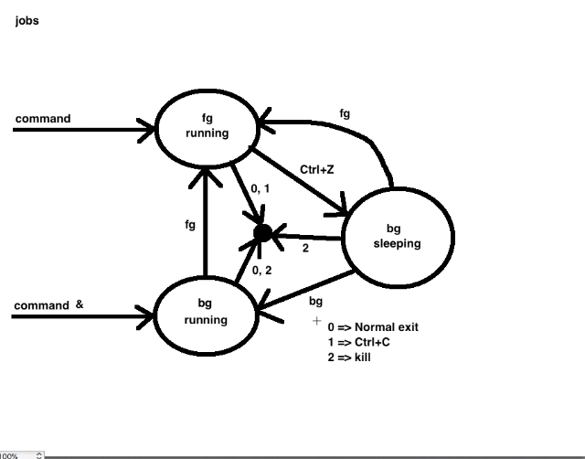
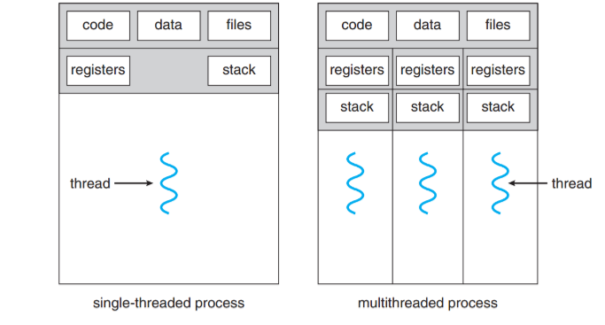
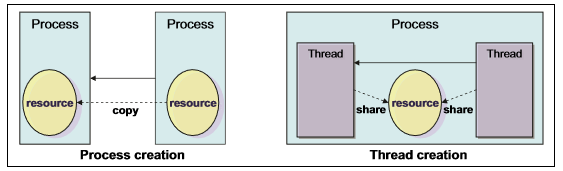

# Processes in Linux/Unix

Một chương trình (command) khi được thực thi là một ví dụ đặc biệt được hệ thống cung cấp cho các tiến trình (process). 

Bất cứ một lệnh nào chạy, nó sẽ bắt đầu tạo một tiến trình mới. Ví dụ, `pwd`  được sử dụng để liệt kê ra thư mục hiện hành, nơi mà người dùng đang đứng đó, lúc đó một process sẽ bắt đầu.

Được quản lý thông qua một số gọi là process id hoặc gọi tắt là pid, một tiến trình sẽ có một pid duy nhất tại một thời điểm nhất định. pid có thể được sử dụng lại cho một tiến trình khác tại một thời điểm khác.

## Initializing a process

### Một process có thể được chạy bằng 2 cách:

#### 1. Foreground Process

Mỗi một tiến trình khi bắt đầu chạy, mặc định sẽ được chạy trong Foreground, nhận input từ keyboard và gửi đầu ra tới screen.

Khi đó sẽ không có một process nào khác được chạy cho tới khi tiến trình trước đó kết thúc. Dấu nhắc sẽ được trả về khi tiến trình chạy xong và sẽ không thể nhập bất cứ điều gì từ bàn phím

#### 2. Backround Process

Nó sẽ chạy trong background không nhận input từ bàn phím, khi đó một tiến trình khác có thể được bắt đầu chạy ngay cả khi tiến trình background này vẫn còn đang chạy.

Để đưa command vào background ta thêm `&` vào sau câu lệnh đó, nó sẽ không dừng lại cho đến khi được đưa vào Foreground.

## Tracking ongoing processes

Sử dụng `ps` (Process status) để xem danh sách các tiến trình đang chạy, hoặc `ps -f` để xem thêm một vài thông tin nữa

Trong đó:

* `UID`: User ID that this process belongs to (the person running it)
* `PID`: Process ID
* `PPID`: Parent process ID (the ID of the process that started it)
* `C`: CPU utilization of process
* `STIME`: Process start time
* `TTY`: Terminal type associated with the process
* `TIME`: CPU time taken by the process
* `CMD`: The command that started this process

Một số các option hay sử dụng khác:
* `-a`: Shows information about all users
* `-x` Shows information about processes without terminals
* `-u`: Shows additional information like -f option
* `-e`: Displays extended information

### Stopping a process

Khi chạy ở chế độ tiền cảnh, sử dụng `ctrl + c` để thoát command, còn đối với tiến trình ở hậu cảnh có thể được kill với pid đã biết của tiến trình đó

## Tổng quan về sự chuyển đổi giữa các tiến trình

`bg` là một command điều khiển các job, lệnh này cho phép tiếp tục một tiến trình trong Background: 

Syntax:

	bg [job id]

Ví dụ:

	bg %19

`fg` cho phép tiếp tục tiến trình trong chế độ Foreground, Ví dụ:

	fg 19

## Types of Processes

* **Parent and Child process** : The 2nd and 3rd column of the ps –f command shows process id and parent’s process id number. For each user process there’s a parent process in the system, with most of the commands having shell as their parent.
* **Zombie and Orphan process** : After completing its execution a child process is terminated or killed and SIGCHLD updates the parent process about the termination and thus can continue the task assigned to it. But at times when the parent process is killed before the termination of the child process, the child processes becomes orphan processes, with the parent of all processes “init” process, becomes their new ppid.
A process which is killed but still shows its entry in the process status or the process table is called a zombie process, they are dead and are not used.
* **Daemon process** : They are system-related background processes that often run with the permissions of root and services requests from other processes, they most of the time run in the background and wait for processes it can work along with for ex print daemon.
When ps –ef is executed, the process with ? in the tty field are daemon processes

## Thread

Thread được tạo ra từ một tiến trình, có thể chạy song song với các thread khác trong cùng một tiến trình, 

### So sánh:

| Processes | Threads|
|----|---|
| Tốn nhiều bộ nhớ khi chạy nhiều tiến trình cùng lúc| Tốn ít tài nguyên hơn vì dùng chung không gian bộ nhớ |
| Khó chia sẻ tài nguyên | Dễ dàng chia sẻ tài nguyên giữa các thread
| Nếu process cha ngưng trước thì process con vẫn còn nhưng không hoạt động| Tất cả các thread ngưng hoạt động khi process chứa nó ngưng|
| Khi một process tạo mới sẽ được cung cấp một không gian bộ nhớ ảo (process isolation) nên rất tốn kém | Ít tốn kém hơn|
| Tạo xóa chậm | Tạo, xóa nhanh hơn |
| Dễ code và debug| Việc code và debug vô cùng phức tập |

## Process priority and nice level

Process priority quyết định thứ tự các process sẽ được sử lý ở cpu, và xác định bằng dynamic priority và static priority. Process nào có priority cao hơn thì sẽ được xử lý trước

Kernel sẽ tự điều chỉnh các dynamic priority dựa vào một thuật toán có sẵn. Các user process có thể thay đổi static priority bằng cách thay đổi nice level. Process có static priority cao hơn sẽ phải đợi lâu hơn. 

Linux có nice level từ 19 (thấp nhất) tới -20 (cao nhất). Giá trị mặc định là 0. Để thay đổi nice level của một chương trình cao hơn (negative number) thì cần log on hoặc sử dụng `su` cho root

## Context switching

Trong quá trình thực hiện process, thông tin về process đang chạy được lưu trong registers trên bộ xử lý và cache của nó. Tập dữ liệu được nạp vào register cho quá trình thực hiện được gọi context. Để chuyển đổi các tiến trình, context của tiến trình đang chạy được lưu trữ và context của tiến trình chạy tiếp theo được khôi phục vào register. process descriptor và kernel mode stack được sử dụng để lưu trữ context. Quá trình chuyển đổi này được gọi là Context switching

## Interrupt handling

Interrupt handling là một trong những task có độ ưu tiên cao nhất. Khi nó được gọi nó sẽ báo kernel để ngắt quá trình thực thi của tiến trình càng nhanh càng tốt. Khi mà kernel nhận được tín hiệu Interrupt, nó sẽ phải chuyển process đang chạy sang cái mới, đây là context switching và nếu nhiều thì có thể gay ảnh hưởng tới hiệu năng.

## Tham khảo:
https://kipalog.com/posts/Lai-ve-process-trong-unix

https://www.geeksforgeeks.org/processes-in-linuxunix/
